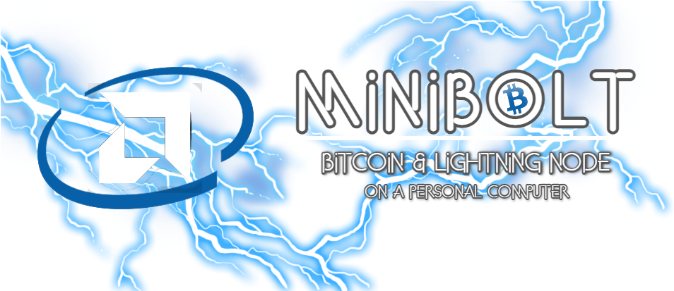

# MiniBolt

<figure><figcaption></figcaption></figure>

Build your own "do-everything-yourself" Bitcoin full node on a personal computer, that will make you a sovereign peer in the Bitcoin and Lightning network.

No need to trust anyone else. Don't trust, verify!

### What is the MiniBolt?

With this guide, you can set up a Bitcoin and Lightning node on a personal computer from scratch, doing everything yourself. You will learn about Linux, Bitcoin, and Lightning. As a result, you'll have your very own Bitcoin node, built by you and no one else.

<figure><figcaption></figcaption></figure>

There are many reasons why you should run your own Bitcoin node:

👥 **Keep Bitcoin decentralized.** Use your node to help enforce your Bitcoin consensus rules.

🗽 **Take back your sovereignty.** Let your node validate your own Bitcoin transactions. No need to ask someone else to tell you what's happening in the Bitcoin network.

🥷🏽 **Improve your privacy.** Connect your wallets to your node so that you no longer need to reveal their whole financial history to external servers.

⚡️ **Be part of Lightning.** Run your Lightning node for everyday payments and help build a robust, decentralized Bitcoin Lightning network.

### MiniBolt overview

This guide explains how to set up your own Bitcoin node on a Personal Computer. But it works on most hardware platforms because it only uses standard Debian Linux commands.

#### Features

Your Bitcoin node will offer the following functionality:

🟠 **Bitcoin**: direct and trustless participation in the Bitcoin peer-to-peer network, full validation of blocks and transactions

⚛️ **Electrum server**: connect your compatible wallets (including hardware wallets) to your node

⛓️ **Blockchain Explorer**: web-based Explorer to privately look up transactions, blocks, and more

⚡ **Lightning**: full client with stable long-term channels and web-based and mobile-based management interfaces

🔋 **Always on**: services are constantly synced and available 24/7

🌐 **Reachable from anywhere**: connect to all your services through the Tor network and Wireguard VPN

#### Target audience

We strive to give foolproof instructions. But the goal is also to do everything ourselves.

Shortcuts that involve trusting someone else are not allowed. This makes this guide quite technical, but we try to make it as straightforward as possible.

You'll gain a basic understanding of the how and why.

If you like to learn about Linux, Bitcoin, and Lightning, then this guide is for you.

#### Structure

We aim to keep the core of this guide well-maintained and up-to-date:

1. [System](system/): prepare the hardware and set up the operating system
2. [Bitcoin](bitcoin/): sync your own Bitcoin full node, Electrum server, Blockchain Explorer, and connect a desktop wallet to the Electrum server
3. [Lightning](lightning/): run your Lightning client with web-based node management, connect a mobile app, and save safely your SCB backup

➕ Bonus guides: the bonus section contains more specific guides that build on top of the main section. More fun, lots of knowledge, but with lesser maintenance guarantees. Everything is optional.

### How to build

* **YouTube list** building MiniBolt in live with [Alberto](https://twitter.com/Albercoin) of Laboratorio Virtual Bitcoin (Spanish)



### Community

* [GitHub Pull Requests](https://github.com/minibolt-guide/minibolt/pulls)
* [GitHub Issues / Knowledge Base](https://github.com/minibolt-guide/minibolt/issues)
* [GitHub discussions](https://github.com/orgs/minibolt-guide/discussions)
* Reddit sub: [r/minibolt](https://www.reddit.com/r/minibolt/)
* Telegram Groups:
  * [English](https://t.me/minibolt)
  * [Spanish](https://t.me/minibolt\_es)
* Nostr channels:
  * [English](https://www.nostrchat.io/channel/aa64f2ead929ce8417f85bde7d22ebde13cc01ceb4e00145572437eb1ad46249)
  * [Spanish](https://www.nostrchat.io/channel/3bd633eaad12242572bfc5ba10d3e52b2c0e152f4207383858993c373d314015)

Feel free to join the many other contributors if you see something that can be improved!

### Rating

All guides are rated with labels to help you assess the difficulty of each guide, and if it is tested against the most recent version of the main guide.

* Difficulty: indicates how difficult the bonus guide is in terms of installation procedure or usage.


Difficulty: Easy



Difficulty: Medium



Difficulty: Hard


* Paid service: indicates if the service used in the guide is free or paid.


Cost: Paid service

