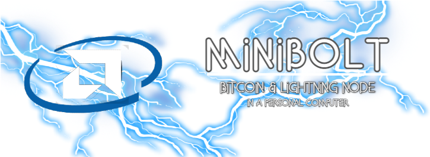

# MiniBolt

## A complete guide to build a Bitcoin & Lightning full node on a Personal Computer

---

### The MiniBolt Guide is available on GitHub Pages

https://twofaktor.github.io/minibolt

Inspired by [RaspiBolt guide v3](https://github.com/raspibolt/raspibolt)

By [⚡2 FakTor⚡](https://twitter.com/twofaktor)

This repository contains all sources and is used for Issue tracking.
