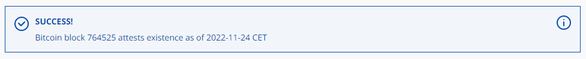

---
layout:
  width: default
  title:
    visible: true
  description:
    visible: false
  tableOfContents:
    visible: true
  outline:
    visible: true
  pagination:
    visible: true
  metadata:
    visible: true
  tags:
    visible: true
---

# 2.1 Bitcoin client: Bitcoin Core

We install [Bitcoin Core](https://bitcoin.org/en/bitcoin-core/), the reference client implementation of the Bitcoin network.


## This may take some time

Bitcoin Core will download the full Bitcoin blockchain, and validate all transactions since 2009. We're talking more than 800'000 blocks with a size of over 465 GB, so this is not an easy task.

## Installation

We download the latest Bitcoin Core binary (the application) and compare this file with the signed and timestamped checksum. This is a precaution to make sure that this is an official release and not a malicious version trying to steal our money.

💡 If you want to install the Ordisrespector patch to reject the Ordinals of your mempool, follow the [Ordisrespector bonus guide](../../bonus/bitcoin/ordisrespector.md) and come back to continue with the [Create the bitcoin user](bitcoin-client.md#create-the-bitcoin-user-and-group) section.

💡 If you want to install Bitcoin Core from the source code but without the Ordisrespector patch, follow the [Ordisrespector bonus guide](../../bonus/bitcoin/ordisrespector.md), skipping [Apply the patch “Ordisrespector”](../../bonus/bitcoin/ordisrespector.md#apply-the-ordisrespector-patch) and come back to continue with the [Create the bitcoin user](bitcoin-client.md#create-the-bitcoin-user-and-group) section.

### Download binaries

* Login as `admin` and change to a temporary directory, which is cleared on reboot:

```sh
cd /tmp
```

* Set a temporary version environment variable for the installation:

```sh
VERSION=31.0
```

* Get the latest binaries and signatures:


```sh
wget https://bitcoincore.org/bin/bitcoin-core-$VERSION/bitcoin-$VERSION-x86_64-linux-gnu.tar.gz
```


```sh
wget https://bitcoincore.org/bin/bitcoin-core-$VERSION/SHA256SUMS
```

```sh
wget https://bitcoincore.org/bin/bitcoin-core-$VERSION/SHA256SUMS.asc
```

### Signature check

Bitcoin releases are signed by several individuals, each using their own key. To verify the validity of these signatures, you must first import the corresponding public keys into your GPG key database.

* The next command downloads and imports automatically all signatures from the [Bitcoin Core release attestations (Guix)](https://github.com/bitcoin-core/guix.sigs) repository:


```sh
curl -s "https://api.github.com/repositories/355107265/contents/builder-keys" | grep download_url | grep -oE "https://[a-zA-Z0-9./-]+" | while read url; do curl -s "$url" | gpg --import; done
```


Expected output:

```
gpg: key 17565732E08E5E41: 29 signatures not checked due to missing keys
gpg: /home/admin/.gnupg/trustdb.gpg: trustdb created
gpg: key 17565732E08E5E41: public key "Andrew Chow <andrew@achow101.com>" imported
gpg: Total number processed: 1
gpg:               imported: 1
gpg: no ultimately trusted keys found
[...]
```

* Verify that the checksums file is cryptographically signed by the release signing keys. The following command prints signature checks for each of the public keys that signed the checksums:

```sh
gpg --verify SHA256SUMS.asc SHA256SUMS
```

* Check that at least a few signatures show the following text:

<pre><code>gpg: <a data-footnote-ref href="#user-content-fn-1">Good signature from</a>...
Primary key fingerprint:...
</code></pre>

### Checksum check

* Check that the reference checksum in the file `SHA256SUMS` matches the checksum calculated by you:

```sh
sha256sum --ignore-missing --check SHA256SUMS
```

**Example** of expected output:

```
bitcoin-25.1-x86_64-linux-gnu.tar.gz: OK
```

### Timestamp check

* The binary checksum file is also timestamped with the Bitcoin blockchain using the [OpenTimestamps protocol](https://en.wikipedia.org/wiki/Time_stamp_protocol), proving that the file existed before some point in time. Let's verify this timestamp. On your local computer, download the checksums file and its timestamp proof:
  * [Click to download](https://bitcoincore.org/bin/bitcoin-core-31.0/SHA256SUMS.ots) the checksum file.
  * [Click to download](https://bitcoincore.org/bin/bitcoin-core-31.0/SHA256SUMS) its timestamp proof.
* In your browser, open the [OpenTimestamps website](https://opentimestamps.org/).
* In the "Stamp and verify" section, drop or upload the downloaded `SHA256SUMS.ots` proof file in the dotted box.
* In the next box, drop or upload the `SHA256SUMS` file.
* If the timestamps are verified, you should see the following message. The timestamp proves that the checksums file existed on the [release date](https://github.com/bitcoin/bitcoin/releases) of the latest Bitcoin Core version.

The following screenshot is just an **example** of one of the versions:



* If you're satisfied with the checksum, signature, and timestamp checks, extract the Bitcoin Core binaries:

```sh
tar -xzvf bitcoin-$VERSION-x86_64-linux-gnu.tar.gz
```

<details>

<summary><strong>Example</strong> of expected output ⬇️</summary>

```
bitcoin-27.1/
bitcoin-27.1/README.md
bitcoin-27.1/bin/
bitcoin-27.1/bin/bitcoin-cli
bitcoin-27.1/bin/bitcoin-qt
bitcoin-27.1/bin/bitcoin-tx
bitcoin-27.1/bin/bitcoin-util
bitcoin-27.1/bin/bitcoin-wallet
bitcoin-27.1/bin/bitcoind
bitcoin-27.1/bin/test_bitcoin
bitcoin-27.1/bitcoin.conf
bitcoin-27.1/include/
bitcoin-27.1/include/bitcoinconsensus.h
bitcoin-27.1/lib/
bitcoin-27.1/lib/libbitcoinconsensus.so
bitcoin-27.1/lib/libbitcoinconsensus.so.0
bitcoin-27.1/lib/libbitcoinconsensus.so.0.0.0
bitcoin-27.1/share/
bitcoin-27.1/share/man/
bitcoin-27.1/share/man/man1/
bitcoin-27.1/share/man/man1/bitcoin-cli.1
bitcoin-27.1/share/man/man1/bitcoin-qt.1
bitcoin-27.1/share/man/man1/bitcoin-tx.1
bitcoin-27.1/share/man/man1/bitcoin-util.1
bitcoin-27.1/share/man/man1/bitcoin-wallet.1
bitcoin-27.1/share/man/man1/bitcoind.1
bitcoin-27.1/share/rpcauth/
bitcoin-27.1/share/rpcauth/README.md
bitcoin-27.1/share/rpcauth/rpcauth.py
```

</details>


If you want to [generate a full bitcoin.conf file](bitcoin-client.md#generate-a-full-bitcoin.conf-example-file), follow the proper [extra section](bitcoin-client.md#generate-a-full-bitcoin.conf-example-file), and then come back to continue with the [next section](bitcoin-client.md#binaries-installation)

If you want to install the manual page for `bitcoin-cli`, follow [the manual page for the bitcoin-cli extra section](bitcoin-client.md#the-manual-page-for-bitcoin-cli), and then come back to continue with the [next section](bitcoin-client.md#create-the-bitcoin-user-and-group)


### Binaries installation

* Install it:

<pre class="language-sh" data-overflow="wrap"><code class="lang-sh"><strong>sudo install -m 0755 -o root -g root -t /usr/local/bin bitcoin-$VERSION/bin/bitcoin-cli bitcoin-$VERSION/bin/bitcoind
</strong></code></pre>

* Check the correct installation by requesting the output of the version:

```sh
bitcoind --version
```

The following output is just an **example** of one of the versions:

```
Bitcoin Core version v24.1.0
Copyright (C) 2009-2022 The Bitcoin Core developers
[...]
```

* **(Optional)** Delete installation files of the `tmp` folder to be ready for the next installation:


```bash
sudo rm -r bitcoin-$VERSION bitcoin-$VERSION-x86_64-linux-gnu.tar.gz SHA256SUMS SHA256SUMS.asc
```


### Create the bitcoin user & group

The Bitcoin Core application will run in the background as a daemon and use the separate user “bitcoin” for security reasons. This user does not have admin rights and cannot change the system configuration.

* Create the `bitcoin` user and group:

```bash
sudo adduser --gecos "" --disabled-password bitcoin
```

* Add the user `admin` to the group "bitcoin":

```bash
sudo adduser admin bitcoin
```

* Allow the user `bitcoin` to use the control port and configure Tor directly by adding it to the `debian-tor` group:

```bash
sudo adduser bitcoin debian-tor
```

### Create data folder

Bitcoin Core uses, by default, the folder `.bitcoin` in the user's home. Instead of creating this directory, we create a data directory in the general data location `/data` and link to it.

* Create the Bitcoin data folder:

```sh
mkdir /data/bitcoin
```

* Assign the owner to the `bitcoin` user:

```sh
sudo chown bitcoin:bitcoin /data/bitcoin
```

* Switch to the user `bitcoin:`

```sh
sudo su - bitcoin
```

* Create the symbolic link `.bitcoin` that points to that directory:

```sh
ln -s /data/bitcoin /home/bitcoin/.bitcoin
```

* Check that the symbolic link has been created correctly:

```bash
ls -la .bitcoin
```

Expected output:

<pre><code>lrwxrwxrwx 1 bitcoin bitcoin   13 Nov  7 19:32 <a data-footnote-ref href="#user-content-fn-1">.bitcoin -> /data/bitcoin</a>
</code></pre>

### Generate access credentials

For other programs to query Bitcoin Core, they need the proper access credentials. To avoid storing the username and password in a configuration file in plaintext, the password is hashed. This allows Bitcoin Core to accept a password, hash it, and compare it to the stored hash, while it is not possible to retrieve the original password.

Another option to get access credentials is through the `.cookie` file in the Bitcoin data directory. This is created automatically and can be read by all users who are members of the "bitcoin" group.

Bitcoin Core provides a simple Python program to generate the configuration line for the config file.

* Enter the bitcoin folder:

```sh
cd .bitcoin
```

* Download the RPCAuth program:


```sh
wget https://raw.githubusercontent.com/bitcoin/bitcoin/master/share/rpcauth/rpcauth.py
```


* Run the script with the Python3 interpreter, providing the username (`minibolt`) and your `"password [B]"` arguments:


All commands entered are stored in the bash history. But we don't want the password to be stored where anyone can find it. For this, put a space `( )` in front of the command shown below.


<pre class="language-sh"><code class="lang-sh"> python3 rpcauth.py minibolt <a data-footnote-ref href="#user-content-fn-2">YourPasswordB</a>
</code></pre>

**Example** of expected output:

<pre><code>String to be appended to bitcoin.conf:
<a data-footnote-ref href="#user-content-fn-3">rpcauth=minibolt:00d8682ce66c9ef3dd9d0c0a6516b10e$c31da4929b3d0e092ba1b2755834889f888445923ac8fd69d8eb73efe0699afa</a>
</code></pre>

* Copy the `rpcauth` line, we'll need to paste it into the Bitcoin Core config file in the next step.

## Configuration

Now, the configuration file `bitcoind` needs to be created. We'll also set the proper access permissions.

* Still as the user `"bitcoin"` creates the `bitcoin.conf` file:

```bash
nano /home/bitcoin/.bitcoin/bitcoin.conf
```

* Enter the complete next configuration. Save and exit.


**Important!!** Remember to replace the whole line starting with `"rpcauth"` the connection string you just generated



Remember to accommodate the "`dbcache`" parameter depending on your hardware. Recommended: dbcache=1/2 x total RAM available, e.g: 4GB RAM -> dbcache=2048.



**(Optional):**

-> Modify the `"uacomment"` value to your preference if you want.

-> If you have another **full-synced MiniBolt node on the same local network**, you can **accelerate the IBD** by following [the dedicated extra section](bitcoin-client.md#accelerate-the-ibd).


<pre><code># MiniBolt: bitcoind configuration
# /data/bitcoin/bitcoin.conf

# Bitcoin daemon
server=1
txindex=1

# Set OP_RETURN limit to value before v30.0
datacarrier=83

# Disable cjdns network
onlynet=onion
onlynet=i2p
onlynet=ipv4
onlynet=ipv6

# Append comment to the user agent string
uacomment=<a data-footnote-ref href="#user-content-fn-4">MiniBolt node</a>

# Disable integrated wallet
disablewallet=1

# Additional logs
debug=tor
debug=i2p
## Include peers IP addresses in log output (optional)
<a data-footnote-ref href="#user-content-fn-5">logips=1</a>

# Assign read permission to the Bitcoin group users to the cookie file
rpccookieperms=group

# Disable debug.log
nodebuglogfile=1

# Avoid assuming that a block and its ancestors are valid,
# and potentially skipping their script verification.
# We will set it to 0 to verify all.
assumevalid=0

# Enable all compact filters
blockfilterindex=1

# Serve compact block filters to peers per BIP 157
peerblockfilters=1

# Maintain the coinstats index used by the gettxoutsetinfo RPC
coinstatsindex=1

# Network
listen=1

## P2P bind
bind=127.0.0.1
bind=127.0.0.1=onion

## Proxify clearnet outbound connections using Tor SOCKS5 proxy
proxy=127.0.0.1:9050

## I2P SAM proxy to reach I2P peers and accept I2P connections
i2psam=127.0.0.1:7656

# Connections
<a data-footnote-ref href="#user-content-fn-6">rpcauth=&#x3C;replace with your own auth line generated in the previous step></a>

# Initial block download optimizations
dbcache=<a data-footnote-ref href="#user-content-fn-7">2048</a>
blocksonly=1
</code></pre>


This is a standard configuration. Check this [Bitcoin Core sample bitcoind.conf](https://gist.github.com/twofaktor/af6e2226e2861fa86874340f5315aa01) file with all possible options, or generate one yourself, following the proper [extra section](bitcoin-client.md#generate-a-full-bitcoin.conf-example-file)


* Set permissions for only the user `bitcoin` and members of the `bitcoin` group can read it (needed for LND to read the "`rpcauth`" line):

```sh
chmod 640 /home/bitcoin/.bitcoin/bitcoin.conf
```

* Exit the `bitcoin` user session and back to the user `admin`:


```sh
exit
```


### Create systemd service

The system needs to run the bitcoin daemon automatically in the background. We use `systemd`, a daemon that controls the startup process using configuration files.

* Create the systemd configuration:

```bash
sudo nano /etc/systemd/system/bitcoind.service
```

* Enter the complete next configuration. Save and exit.

```
# MiniBolt: systemd unit for bitcoind
# /etc/systemd/system/bitcoind.service

[Unit]
Description=Bitcoin Core Daemon
Requires=network-online.target
After=network-online.target

[Service]
ExecStart=/usr/local/bin/bitcoind -pid=/run/bitcoind/bitcoind.pid \
                                  -conf=/home/bitcoin/.bitcoin/bitcoin.conf \
                                  -datadir=/home/bitcoin/.bitcoin \
                                  -startupnotify='systemd-notify --ready' \
                                  -shutdownnotify='systemd-notify --status="Stopping"'
# Process management
####################
Type=notify
NotifyAccess=all
PIDFile=/run/bitcoind/bitcoind.pid

Restart=on-failure
TimeoutStartSec=infinity
TimeoutStopSec=600

# Directory creation and permissions
####################################
User=bitcoin
Group=bitcoin
RuntimeDirectory=bitcoind
RuntimeDirectoryMode=0710
UMask=0027

# Hardening measures
####################
PrivateTmp=true
ProtectSystem=full
NoNewPrivileges=true
PrivateDevices=true
MemoryDenyWriteExecute=true
SystemCallArchitectures=native

[Install]
WantedBy=multi-user.target
```

* Enable autoboot **(optional):**

```sh
sudo systemctl enable bitcoind
```

* Prepare “bitcoind” monitoring by the systemd journal and check the logging output. You can exit monitoring at any time with Ctrl-C.

```sh
journalctl -fu bitcoind
```


Keep **this terminal open,** you'll need to come back here on the next step to monitor the logs


## Run

To keep an eye on the software movements, [start your SSH program](../../index-1/remote-access.md#access-with-secure-shell) (eg. PuTTY) a second time, connect to the MiniBolt node, and log in as `admin`

* Start the service:

```sh
sudo systemctl start bitcoind
```

<details>

<summary><strong>Example</strong> of expected output on the first terminal with <code>journalctl -fu bitcoind</code> ⬇️</summary>

<pre><code>2022-11-24T18:08:04Z Bitcoin Core version v24.0.1.0 (release build)
2022-11-24T18:08:04Z InitParameterInteraction: parameter interaction: -proxy set -> setting -upnp=0
2022-11-24T18:08:04Z InitParameterInteraction: parameter interaction: -proxy set -> setting -natpmp=0
2022-11-24T18:08:04Z InitParameterInteraction: parameter interaction: -proxy set -> setting -discover=0
2022-11-24T18:08:04Z Using the 'sse4(1way),sse41(4way),avx2(8way)' SHA256 implementation
2022-11-24T18:08:04Z Using RdRand as an additional entropy source
2022-11-24T18:08:04Z Default data directory /home/bitcoin/.bitcoin
2022-11-24T18:08:04Z Using data directory /home/bitcoin/.bitcoin
2022-11-24T18:08:04Z Config file: /home/bitcoin/.bitcoin/bitcoin.conf
<strong>2022-11-24T18:08:04Z Config file arg: blockfilterindex="1"
</strong>2022-11-24T18:08:04Z Config file arg: coinstatsindex="1"
2022-11-24T18:08:04Z Config file arg: i2pacceptincoming="1"
2022-11-24T18:08:04Z Config file arg: i2psam="127.0.0.1:7656"
2022-11-24T18:08:04Z Config file arg: listen="1"
2022-11-24T18:08:04Z Config file arg: listenonion="1"
2022-11-24T18:08:04Z Config file arg: peerblockfilters="1"
2022-11-24T18:08:04Z Config file arg: peerbloomfilters="1"
2022-11-24T18:08:04Z Config file arg: proxy="127.0.0.1:9050"
2022-11-24T18:08:04Z Config file arg: rpcauth=****
2022-11-24T18:08:04Z Config file arg: server="1"
2022-11-24T18:08:04Z Config file arg: txindex="1"
[...]
2022-11-24T18:09:04Z Synchronizing blockheaders, height: 4000 (~0.56%)
[...]
</code></pre>

</details>


Monitor the log file for a few minutes to see if it works. Logs like the next indicate that the initial start-up process has been successful:

```
New block-relay-only v1 peer connected: version: 70016, blocks=2948133, peer=68
[..]
Synchronizing blockheaders, height: 4000 (~0.56%)
[..]
UpdateTip: new best=000000000f8d29fcf9ac45e443706c6f21a6e9cfa615f94794b726d3ba8bdc88 height=2948135 version=0x20000000 log2_work=75.951200 tx=215155316 date='2024-09-18T16:25:12Z' progress=1.000000 cache=20.9MiB(142005txo)
[..]
```


* Link the Bitcoin data directory from the `admin` user's home directory as well. This allows `admin` user to work with bitcoind directly, for example, by using the command `bitcoin-cli`:

```sh
ln -s /data/bitcoin /home/admin/.bitcoin
```

* This symbolic link becomes active **only in a new user session**. Log out of SSH by entering the next command:

```sh
exit
```

* Log in again as a user `admin` [opening a new SSH session](../../index-1/remote-access.md#access-with-secure-shell).
* Check symbolic link has been created correctly:

```bash
ls -la .bitcoin
```

Expected output:

<pre><code>lrwxrwxrwx 1 admin admin    13 Nov  7 10:41 <a data-footnote-ref href="#user-content-fn-8">.bitcoin -> /data/bitcoin</a>
</code></pre>


**Troubleshooting note:**\
\
If you don't obtain the expected output ([`.bitcoin -> /data/bitcoin`](#user-content-fn-8)[^8]) and you only have (`.bitcoin`), you must follow the next steps to fix that:

1. With user `admin`, delete the failed created symbolic link:

```bash
sudo rm -r .bitcoin
```

2. Create the symbolic link again:

```bash
ln -s /data/bitcoin /home/admin/.bitcoin
```

3. Check the symbolic link has been created correctly this time, and you now have the expected output: [.bitcoin -> /data/bitcoin](#user-content-fn-8)[^8]. If yes, continue with the guide; if not, try again:

```bash
ls -la .bitcoin
```

Expected output:

<pre><code>lrwxrwxrwx 1 admin admin    13 Nov  7 10:41 <a data-footnote-ref href="#user-content-fn-1">.bitcoin -> /data/bitcoin</a>
</code></pre>


* Wait a few minutes until Bitcoin Core starts, and enter the next command to obtain your Tor and I2P addresses. **Take note of them**, later you might need them:


```sh
bitcoin-cli getnetworkinfo | grep address.*onion && bitcoin-cli getnetworkinfo | grep address.*i2p
```


**Example** of expected output:

```
"address": "vctk9tie5srguvz262xpyukkd7g4z2xxxy5xx5ccyg4f12fzop8hoiad.onion",
"address": "sesehks6xyh31nyjldpyeckk3ttpanivqhrzhsoracwqjxtk3apgq.b32.i2p",
```

### Validation

* Check the correct enablement of the I2P and Tor networks:

```sh
bitcoin-cli -netinfo
```

**Example** of expected output:

```
Bitcoin Core client v24.0.1 - server 70016/Satoshi:24.0.1/
          ipv4    ipv6   onion   i2p   total   block
in          0       0      25     2      27
out         7       0       2     1      10       2
total       7       0      27     3      37

Local addresses
xdtk6tie4srguvz566xpyukkd7m3z3vbby5xx5ccyg5f64fzop7hoiab.onion     port   8333    score      4
etehks3xyh55nyjldjdeckk3nwpanivqhrzhsoracwqjxtk8apgk.b32.i2p       port      0    score      4
```

* Ensure bitcoind is listening on the default RPC & P2P ports:

```bash
sudo ss -tulpn | grep bitcoind
```

Expected output:

<pre><code>tcp   LISTEN 0      128        127.0.0.1:<a data-footnote-ref href="#user-content-fn-9">8332</a>       0.0.0.0:*    users:(("bitcoind",pid=773834,fd=11))
tcp   LISTEN 0      4096       127.0.0.1:<a data-footnote-ref href="#user-content-fn-10">8333</a>       0.0.0.0:*    users:(("bitcoind",pid=773834,fd=46))
tcp   LISTEN 0      4096       127.0.0.1:<a data-footnote-ref href="#user-content-fn-11">8334</a>       0.0.0.0:*    users:(("bitcoind",pid=773834,fd=44))
tcp   LISTEN 0      128            [::1]:8332          [::]:*    users:(("bitcoind",pid=773834,fd=10))
</code></pre>

* Please note:
  * When “bitcoind” is still starting, you may get an error message like “verifying blocks”. That’s normal, just give it a few minutes.
  * Among other info, the “verificationprogress” is shown. Once this value reaches almost 1 or near (0.999…), the blockchain is up-to-date and fully validated.

## Bitcoin Core is syncing


This process is called IBD (Initial Block Download). This can take between one day and a week, depending mostly on your PC performance. It's best to wait until the synchronization is complete before going ahead.


### Explore bitcoin-cli

If everything is running smoothly, this is the perfect time to familiarize yourself with Bitcoin, the technical aspects of Bitcoin Core, and play around with `bitcoin-cli` it until the blockchain is up-to-date.

* [The Little Bitcoin Book](https://littlebitcoinbook.com) is a fantastic introduction to Bitcoin, focusing on the "why" and less on the "how."
*   [Mastering Bitcoin](https://bitcoinbook.info) by Andreas Antonopoulos is a great point to start, especially chapter 3 (ignore the first part, how to compile from source code):

    * You definitely need to have a [real copy](https://bitcoinbook.info/) of this book!
    * Read it online on [GitHub](https://github.com/bitcoinbook/bitcoinbook).

    <figure><figcaption></figcaption></figure>
* [Learning Bitcoin from the Command Line](https://github.com/ChristopherA/Learning-Bitcoin-from-the-Command-Line/blob/master/README.md) by Christopher Allen gives a thorough deep dive into understanding the technical aspects of Bitcoin.
* Also, check out the [bitcoin-cli reference](https://en.bitcoin.it/wiki/Original_Bitcoin_client/API_calls_list).

## Activate mempool & reduce 'dbcache' after a full sync

Once Bitcoin Core **is fully synced**, we can reduce the size of the database cache. A bigger cache speeds up the initial block download now. We want to reduce memory consumption to allow the Lightning client and Electrum server to run in parallel. We also now want to enable the node to listen to and relay transactions.


Bitcoin Core will then just use the default cache size of 450 MiB instead of your RAM setup. If `blocksonly=1` is left uncommented, it will prevent Electrum Server from receiving RPC fee data and will not work.


* As user `admin`, edit the `bitcoin.conf` file:

```sh
sudo nano /home/bitcoin/.bitcoin/bitcoin.conf
```

* Comment or delete the following lines by adding a `#` at the beginning. Save and exit.

```
#assumevalid=0
#dbcache=2048
#blocksonly=1
```

* Restart Bitcoin Core for the settings to take effect:

```sh
sudo systemctl restart bitcoind
```

## OpenTimestamps client

When we installed Bitcoin Core, we verified the timestamp of the checksum file using the OpenTimestamp website. In the future, you will likely need to verify more timestamps when installing additional programs (e.g, LND) and when updating existing programs to a newer version. Rather than relying on a third party, it would be preferable (and more fun) to verify the timestamps using your blockchain data. Now that Bitcoin Core is running and synced, we can install the [OpenTimestamp client](https://github.com/opentimestamps/opentimestamps-client) to locally verify the timestamp of the binaries checksums file.

* As user `admin`, install dependencies:

```sh
sudo apt install python3-dev python3-pip python3-wheel
```

* Install the OpenTimestamp client:

```sh
sudo pip3 install opentimestamps-client
```

* Display the OpenTimestamps client version to check that it is properly installed:

```sh
ots --version
```

**Example** of expected output:

<pre><code><strong>v0.7.1
</strong></code></pre>


To update the OpenTimestamps client, simply execute:

```bash
sudo pip3 install --upgrade opentimestamps-client
```


## Extras (optional)

### Slow device mode

* As user `admin` edit `bitcoin.conf` file:

```sh
sudo nano /home/bitcoin/.bitcoin/bitcoin.conf
```

* Add these lines at the end of the file:

<pre><code># Slow devices optimizations
## Limit the number of max peer connections
<a data-footnote-ref href="#user-content-fn-12">maxconnections</a>=40
## Tries to keep outbound traffic under the given target per 24h
<a data-footnote-ref href="#user-content-fn-13">maxuploadtarget</a>=5000
## Increase the number of threads to service RPC calls (default: 4)
rpcthreads=128
## Increase the depth of the work queue to service RPC calls (default: 16)
rpcworkqueue=256
</code></pre>

* Comment on these lines:

```
#coinstatsindex=1
#assumevalid=0
```


Realize that with `maxuploadtarget` parameter enabled, you will need to whitelist the connection to [Electrs](../../bonus/bitcoin/electrs.md) and [Bisq](../../bonus/bitcoin/bisq.md) by adding these parameters to `bitcoin.conf`:

For Electrs:

```
whitelist=download@127.0.0.1
```

For Bisq:

```
whitelist=bloomfilter@192.168.0.0/16
```


### Renovate your Bitcoin Core, Tor, and I2P addresses

* With user `admin`, stop bitcoind and dependencies:

```bash
sudo systemctl stop bitcoind
```

* Delete:

```bash
sudo rm /data/bitcoin/onion_v3_private_key && /data/bitcoin/i2p_private_key
```

* Start bitcoind again:

```bash
sudo systemctl start bitcoind
```

* If you want to monitor the bitcoind logs and the startup progress, type `journalctl -fu bitcoind` in a separate SSH session.
* Wait a minute to identify your newly generated addresses with:


```bash
bitcoin-cli getnetworkinfo | grep address.*onion && bitcoin-cli getnetworkinfo | grep address.*i2p
```


**Example** of expected output:

```
"address": "vctk9tie5srguvz262xpyukkd7g4z2xxxy5xx5ccyg4f12fzop8hoiad.onion",
"address": "sesehks6xyh31nyjldpyeckk3ttpanivqhrzhsoracwqjxtk3apgq.b32.i2p",
```

### The manual page for bitcoin-cli

* For convenience, it might be useful to have the manual page for `bitcoin-cli` in the same machine, so that they can be consulted offline, and they can be installed from the directory.


If you followed the [Ordisrespector bonus guide](../../bonus/bitcoin/ordisrespector.md), this section is not needed because man pages are installed by default, type directly `man bitcoin-cli` command to see the man pages.


```sh
cd bitcoin-$VERSION/share/man/man1
```

```sh
gzip *
```

```sh
sudo cp * /usr/share/man/man1/
```

* Now you can read the docs while doing:

```sh
man bitcoin-cli
```


Now come back to the section [Binaries installation](bitcoin-client.md#binaries-installation) to continue with the Bitcoin Core installation process, not if you followed the [Ordisrespector bonus guide](../../bonus/bitcoin/ordisrespector.md).


### Generate a full bitcoin.conf example file


This extra section is valid if you compiled it from the source code using the [Ordisrespector bonus guide](../../bonus/bitcoin/ordisrespector.md).


* Follow the complete [Installation progress before](bitcoin-client.md#installation), or the [Ordisrespector installation progress](../../bonus/bitcoin/ordisrespector.md#installation), to install the `bitcoind` binary on the OS.
* With user `admin`, update and upgrade your OS. Press "y" and enter, or directly enter when the prompt asks you:

```bash
sudo apt update && sudo apt full-upgrade
```

* Install the next dependency packages:

```bash
sudo apt install build-essential cmake pkg-config --no-install-recommends
```

* Go to the temporary folder:

```bash
cd /tmp
```

* Set a temporary version environment variable for the installation:

```bash
VERSION=31.0
```

* Clone the source code from GitHub and enter the bitcoin folder:

```bash
git clone --branch v$VERSION https://github.com/bitcoin/bitcoin.git && cd bitcoin
```

* Build all Bitcoin Core dependencies:

```bash
make -C depends -j$(nproc) NO_QR=1 NO_QT=1 NO_NATPMP=1 NO_UPNP=1 NO_USDT=1
```

* Pre-configuring the installation, we will discard some features and include others. Enter the complete next command in the terminal and press `ENTER`:

```bash
cmake -B build \
  -DBUILD_TESTS=OFF \
  -DBUILD_TX=OFF \
  -DBUILD_UTIL=OFF \
  -DBUILD_WALLET_TOOL=OFF \
  -DINSTALL_MAN=OFF \
  -DWITH_BDB=ON \
  -DWITH_ZMQ=ON \
  --toolchain depends/x86_64-pc-linux-gnu/toolchain.cmake
```

* Copy-paste the bitcoind binary file existing on your OS to the source code folder:

```bash
cp /usr/local/bin/bitcoind /tmp/bitcoin/build/bin/
```

* Exec the `gen-bitcoin-conf` script to generate the file:

```bash
sudo ./contrib/devtools/gen-bitcoin-conf.sh
```

Expected output:

```
Generating example bitcoin.conf file in share/examples/
```

* Use `cat` to print it on the terminal to enable a copy-paste:

```bash
cat /tmp/bitcoin/share/examples/bitcoin.conf
```

* Or `nano` to examine the content:

```bash
nano /tmp/bitcoin/share/examples/bitcoin.conf
```

**(Optional)** Delete the `bitcoin` folder from the temporary folder:

```bash
sudo rm -r /tmp/bitcoin
```

### Accelerate the IBD

If you already have another fully-synced MiniBolt node on your local network, connecting directly to it can greatly accelerate synchronization by bypassing Tor’s added latency and bandwidth constraints. Local connections offer lower latency and higher throughput, delivering data—such as blockchain history—more reliably while reducing potential connectivity issues.


To get this, you will need a **full-sync** **MiniBolt** node on the same local network.


**On the full-sync local MiniBolt node:**

#### Configure Firewall

* Configure the firewall to allow incoming requests to Bitcoin Core from anywhere:


```sh
sudo ufw allow 8333/tcp comment 'allow incoming connections to Bitcoin Core from anywhere'
```


#### Configure Bitcoin Core

To allow incoming connections from another node in the same local network, follow the next steps:

* With the user `admin`, edit the `bitcoin.conf` file:

```bash
sudo nano /data/bitcoin/bitcoin.conf
```

* **Replace** the `bind=127.0.0.1` line with the next to allow connections from anywhere:

<pre><code><strong>bind=0.0.0.0
</strong></code></pre>

Or **add** under `bind=127.0.0.1`, the next line allows **connections only from devices in the same local network** (**recommended option** to improve security):

<pre><code>bind=<a data-footnote-ref href="#user-content-fn-14">192.168.x.x</a>
</code></pre>


Remember to replace `192.168.x.x` with your MiniBolt local IP, e.g `192.168.1.43`.


* Restart Bitcoin Core to apply changes:

```bash
sudo systemctl restart bitcoind
```

**On the new MiniBolt node:**

* With the user `admin`, edit the `bitcoin.conf` file:

```bash
sudo nano /data/bitcoin/bitcoin.conf
```

* Attaches and persists the connection **only** to the full-sync local MiniBolt node. Add the next line at the end of the file. Save and exit.

<pre><code> connect=<a data-footnote-ref href="#user-content-fn-15">&#x3C;localip></a>:8333
</code></pre>


Remember to replace `<localip>` with the real node IP, e.g: `192.168.1.43`.


* Restart Bitcoin Core to apply changes:

```bash
sudo systemctl restart bitcoind
```

#### Validation


Pay attention to the Bitcoin Core logs (`journalctl -fu bitcoind`), a similar log to this should appear at some point:

```
New outbound-full-relay v2 peer connected: version: 70016, blocks=76637, peer=260
```

-> You can also check this by typing this command:

```bash
bitcoin-cli -netinfo 4 | grep manual
```

**Example** of expected output:

```
out manual onion  2    209    240    5   12   49   99      1016        384 281 mdiwdyjucocysdvx5dk2iyo5wsav3ehyiggegzfk3ezfcce6nstp4nid.onion:8333  70016/Satoshi:28.1.0
out manual   i2p  1    401    939    1   49  418           1019        455 271 axxwcwzsqw42hjbpzupvffvdsjvniyt5apyt53sdxijqy6y6pdha.b32.i2p:0       70016/Satoshi:28.1.0
```


### Improve the reliability

Ensuring your node connects to high-uptime, reliable peers is essential for smooth synchronization, faster transaction propagation, and overall stability. By configuring the Bitcoin client with both onion and I2P addnode entries—especially using the trusted official MiniBolt project addresses—you create diverse and robust connection paths that help bypass latency and network issues, reducing the risk of disruptions while enhancing security and efficiency.


To get this, you will need a **full-sync** node peer like the official MiniBolt project node (later, it is suggested).


#### Configure Bitcoin Core

* With the user `admin`, edit the `bitcoin.conf` file:

```bash
sudo nano /data/bitcoin/bitcoin.conf
```

* Add at the end of the file the `onion` + `i2p` addresses of the desired peers that you want to add to improve the reliability of your Bitcoin Core on MiniBolt. Save and exit.

<pre><code>addnode=&#x3C;<a data-footnote-ref href="#user-content-fn-16">abcdefg..............xyz.onion</a>>:8333
addnode=&#x3C;<a data-footnote-ref href="#user-content-fn-16">abcdefg..............xyz.b32</a>>.i2p:0
</code></pre>


Remember to replace the `<abcdefg..............xyz.onion>` and `<abcdefg..............xyz.b32>` with the desired addresses of your node peer/s.

**-> Suggestion**: If you want, you can use the next official MiniBolt addresses:

```
addnode=xdtk6tie5srguvz262xpyukkd7m3z3vvvy5xx5ccyg5f64fzop6hoiad.onion:8333
addnode=etehks5xyh32nyjldpyeckk3nwpanivqhrzhsoracwqjxtk5apgq.b32.i2p:0
```


* Restart Bitcoin Core to apply changes:

```bash
sudo systemctl restart bitcoind
```

#### Validation


Pay attention to the Bitcoin Core logs (`journalctl -fu bitcoind`), a similar log to this should appear at some point:

```
New manual v2 peer connected: version: 70016, blocks=79633, peer=4
```

-> You can also check this by typing this command:

```bash
bitcoin-cli -netinfo 4 | grep manual
```

**Example** of expected output:

```
out manual onion  2    209    240    5   12   49   99      1016        384 281 mdiwdyjucocysdvx5dk2iyo5wsav3ehyiggegzfk3ezfcce6nstp4nid.onion:8333 70016/Satoshi:28.1.0
out manual   i2p  1    401    939    1   49  418           1019        455 271 axxwcwzsqw42hjbpzupvffvdsjvniyt5apyt53sdxijqy6y6pdha.b32.i2p:0       70016/Satoshi:28.1.0
```


### Activate private transaction broadcasting

Enables private transaction broadcasting by routing `sendrawtransaction` through ephemeral Tor/I2P connections, preventing IP leakage and minimizing correlation between broadcasts.

* With the user `admin`, edit the `bitcoin.conf` file:

```bash
sudo nano /data/bitcoin/bitcoin.conf
```

* Add at the end of the file the next

```
# Broadcast transactions via short-lived Tor/I2P connections
privatebroadcast=1
```

* If you want additional logs about the processes related to this feature and validate it, add also the following:

```
debug=privatebroadcast
```

* Restart Bitcoin Core to apply changes:

```bash
sudo systemctl restart bitcoind
```


When you use [LND](../../lightning/lightning-client.md), [Fulcrum](electrum-server.md), or [Electrs](../../bonus/bitcoin/electrs.md), which use the RPC command `sendrawtransaction` to broadcast transactions, logs like these will show you:


Example of expected output:

```
Apr 20 21:18:54 minibolt bitcoind[2960268]: 2026-04-20T19:18:54Z [privatebroadcast] Requesting 3 new connections due to txid=b844f7bdd0c9edf2f182fdbf187c357f6efab32e7660daa174b0bf6c0c138a1b, wtxid=5e603d1252fada4a2c7ad720f2a936d271e41b0bf6fa2c2e9504f36df99ff12e
Apr 20 21:18:54 minibolt bitcoind[2960268]: 2026-04-20T19:18:54Z [privatebroadcast] Ignoring unnecessary request to schedule an already scheduled transaction: txid=b844f7bdd0c9edf2f182fdbf187c357f6efab32e7660daa174b0bf6c0c138a1b, wtxid=5e603d1252fada4a2c7ad720f2a936d271e41b0bf6fa2c2e9504f36df99ff12e
Apr 20 21:18:57 minibolt bitcoind[2960268]: 2026-04-20T19:18:57Z [privatebroadcast] Socket connected to [2401:b140:5::92:201]:48333 through the proxy at 127.0.0.1:9050; remaining connections to open: 2
Apr 20 21:18:58 minibolt bitcoind[2960268]: 2026-04-20T19:18:58Z New private-broadcast peer connected: transport: v2, version: 70016, blocks=131500 peer=22
Apr 20 21:18:58 minibolt bitcoind[2960268]: 2026-04-20T19:18:58Z [privatebroadcast] P2P handshake completed, sending INV for txid=b844f7bdd0c9edf2f182fdbf187c357f6efab32e7660daa174b0bf6c0c138a1b, wtxid=5e603d1252fada4a2c7ad720f2a936d271e41b0bf6fa2c2e9504f36df99ff12e, peer=22
Apr 20 21:18:58 minibolt bitcoind[2960268]: 2026-04-20T19:18:58Z [privatebroadcast] Ignoring incoming message 'ping', peer=22
Apr 20 21:18:58 minibolt bitcoind[2960268]: 2026-04-20T19:18:58Z [privatebroadcast] Ignoring incoming message 'feefilter', peer=22
Apr 20 21:19:03 minibolt bitcoind[2960268]: 2026-04-20T19:19:03Z [privatebroadcast] Got a PONG (the transaction will probably reach the network), marking for disconnect, peer=22
```

#### Validation

* If you want to monitor the status of transactions being broadcast privately, use this command:

```bash
bitcoin-cli getprivatebroadcastinfo
```

Example of expected output:

```
{
  "transactions": [
    {
      "txid": "aab4a3b96ca35fc5dc4d4920f21f2de081cb4c2d625f1bbef2e1e31daca948b6",
      "wtxid": "4689d1701a2a51c887e997492c9ce7e3fc3362a7139223b3a59122110667b1b4",
      "hex": "0200000000010bcd96efb3a96d92945ab367cca1f3c828f9b656e6d353f37d7a9a6c2e36c58e9c0000000000fdffffffc5f7abc896687f9a7cf370ed7de2942093a4234b9ae7b5a8d52c114a2d269c990000000000fdffffff3e799405951cd46dc8d731cb378a016ca3cbc5f5
a6887a455c00dfed1c19b7690100000000fdffffffb73c6858ab296b0e2bee3410580e86d2cf4ba6ebbecf362d80509f1b46e4c86a0100000000fdffffff2a0ec05571b10b904414488fd9844f4a0c82c04e3899779de04bfa930d86547e0100000000fdffffff79171052814ceb849bc6ba7972
c7222c5af9ee55c470346e460bd66e0f64ffe90100000000fdffffffb1bc7983660429bf258d6bcb45da197330d01f9376143fb16b82d1866275dc9f0000000000fdfffffff67c64b4b1ba8453ab8a9e13da8e18efba449ede6296d62acb0fd38d8ce91b970000000000fdfffffff25f3aa7486e
7a5a249d0f31992d1801401948ae30e5861b6d3258ce0e4342490100000000fdffffffd38145336c4be6ea9c6c2590d3886f455bd18bab440305a5287d4af51fffc9700000000000fdffffffa77321e0b86eb9bea38de4c2acc853e2b334968323dfe2451d280ce3320120850000000000fdffff
ff0101a389f60100000016001470fadf8b0e753baaa72379f68813fdbfa682924c02473044022041be8482dea20f12c697754ebd8b627bf2e8acf82bd1d4fdeb26fd47d9634c1f022012d7ec6bad927576eb31957e1858953ab0346a5cb74f59ac7ea5f04cc08352400121026f3d0a3241f30a1e
0bffeb9a0678856917264021604ddbb185338409a445548602473044022014471c3d104082e1a8f5bed597c7f011e532e38ad0cfaddba137286b0262c5ba02203a522e838b4f46f6e8d4b062d8f7c25e33e6d2e24095c82b7fbaefb1c817fac5012103b0787bf7fd79ae3e5d2e30879882d849e9
e35ad562c125d2f35c0846e3b674b90247304402204d381441ee02bfdc33207ae93b6bd370d6a5975f84e935757de15bf853181ee302201de81c824d5f0b9e2f00ce4857fcf6a776070366a02bbc95b505956dffaf80280121027a42340870f0bda9a3f8c02a2878a0946a82abf55b9a5f9bbe1c
311d382c6bb7024730440220269445c3ad7e5d67206ee6fc1c1525a0c60a14538663fd3f8384d56cdc6bd48e022040f2f8b249245694f29b8f5eab52147c4c200060e950281a5c3b8707d4bb3915012103a46b0f32ec166229f3391769af8b7de46f55d506acde33e642fb5ecc93ed67d8024730
4402206e14273e0f68ae386562be58bd4447b561de509fdbed106af37e00a888ac48b002201418097e03984c5f25cf20bbc16248eeee1c96448c55139ec35b812cda841e3b0121028cfa16806071615f5a205a2bd3ff1094d16f6c61a7e29ed3b2a7bcc8b78169180247304402202bac194b7681
40944077131c3604a550cd91e24ad643139405fac272c7b00642022076331a57d4be945c5205bf08d1dd3d044ce9c5918f457719f5c732bb16bd112e012103b0787bf7fd79ae3e5d2e30879882d849e9e35ad562c125d2f35c0846e3b674b90247304402203ca9bc03d3f8bdaa7802e4566bf0b6
ca3b95109d9e0459aecc83bca944667ebe02206ebd3515d8f7672ae828c37085d3118324e46663cdd8cbc820248fe899a8dc3d0121029960082fb77b2938b87ad9279d0e305e21708889758ffdb24c7646398ce00ef10247304402201af546b42f6f24b95f5c57c3ed37a4f54f2f36c4381d65b6
26687baa4d6f923b02202f885246a649fa7fcb82384c0edbfce9cfd580bb4f1f07d76262c649fa04c6b8012103b0787bf7fd79ae3e5d2e30879882d849e9e35ad562c125d2f35c0846e3b674b9024730440220568078f789ad53c42aa3371c55ed8b4477194d51e7984315cd1233fb48f4884302
2008005e27669ea6a6570a0f6a400617d53a759b02388065927b7819eea044e5e201210291db1f7a583e0a51fe3753fdea16f1c672b1d4e065f363346d35e8221a674938024730440220152a2bbe6ea6957bf083ceb8c84530780cb06e4543f6b9b3d49f4918f917b62b022075ebc6241835d484
217d96d87d4a87c121e48c0e3266063ea2189351571d1990012103318a33b4168d66a818504ef4d3bd220eaafb62754057495e19f57371244b35e2024730440220774af82d5a143b69dbad1d498cd05b0e06bf9b437c01b18a6d8e59ddb651412d02203ae424275e9d416407a3b3949ad4eb76ae
0b1ba4a45c3948a69aeaec0cd10d3101210351ddbffdd80fd39eee271af6812d774c5cf6660cc6f684d5441675f58e0ddea364020200",
      "peers": [
        {
          "address": "103.99.169.200:48333",
          "sent": 1776799790,
          "received": 1776799795
        }
      ]
    }
  ]
}
```

* If you want to stop the private broadcast process for a specific transaction, use this command:

<pre class="language-bash"><code class="lang-bash">bitcoin-cli abortprivatebroadcast <a data-footnote-ref href="#user-content-fn-17">&#x3C;txid></a>
</code></pre>


Remember to replace \<txid> with your previously obtained


Example of expected output:

```
{
  "removed_transactions": [
    {
      "txid": "bbb99f53e48a52194871b5c1ee283555ce1ac38ebdc0f16008e0757bb7559df5",
      "wtxid": "c08fff08fc3c1d141e3ade472969b07a04d4f24634155e2583eb0984324bfd58",
      "hex": "02000000000101b73c6858ab296b0e2bee3410580e86d2cf4ba6ebbecf362d80509f1b46e4c86a0000000000fdffffff01dd410f0000000000160014017ca593408640d7de708dbb4a8079c4d7473e64014050d609026644693856d3af7787eccca7476f0dccac700a49c9df159937391ce94dd08f5c780882b210394211acbe735a89ec7a341f76f6f685267ac76537411c64020200"
    }
  ]
}
```

## Upgrade

The latest release can be found on the [GitHub page](https://github.com/bitcoin/bitcoin/releases) of the Bitcoin Core project. Always read the [RELEASE NOTES](https://github.com/bitcoin/bitcoin/tree/master/doc/release-notes) first! When upgrading, there might be breaking changes or changes in the data structure that need special attention. Replace the environment variable `"VERSION=x.xx"` value for the latest version if it has not already been changed in this guide.

* Login as `admin` user and change to the temporary directory:

```sh
cd /tmp
```

* Set a temporary version environment variable for the installation:

```sh
VERSION=31.0
```

* Download binary, checksum, signature files, and timestamp file:


```sh
wget https://bitcoincore.org/bin/bitcoin-core-$VERSION/bitcoin-$VERSION-x86_64-linux-gnu.tar.gz
```



```sh
wget https://bitcoincore.org/bin/bitcoin-core-$VERSION/SHA256SUMS
```



```sh
wget https://bitcoincore.org/bin/bitcoin-core-$VERSION/SHA256SUMS.asc
```



```sh
wget https://bitcoincore.org/bin/bitcoin-core-$VERSION/SHA256SUMS.ots
```


* Verify the new version against its checksums:

```sh
sha256sum --ignore-missing --check SHA256SUMS
```

**Example** of expected output:

```
bitcoin-25.1-x86_64-linux-gnu.tar.gz: OK
```

* The next command downloads and automatically imports all signatures from the [Bitcoin Core release attestations (Guix)](https://github.com/bitcoin-core/guix.sigs) repository:


```sh
curl -s "https://api.github.com/repositories/355107265/contents/builder-keys" | grep download_url | grep -oE "https://[a-zA-Z0-9./-]+" | while read url; do curl -s "$url" | gpg --import; done
```


Expected output:

```
gpg: key 17565732E08E5E41: 29 signatures not checked due to missing keys
gpg: /home/admin/.gnupg/trustdb.gpg: trustdb created
gpg: key 17565732E08E5E41: public key "Andrew Chow <andrew@achow101.com>" imported
gpg: Total number processed: 1
gpg:               imported: 1
gpg: no ultimately trusted keys found
[...]
```

* Verify that the checksums file is cryptographically signed using the release signing keys. The following command prints signature checks for each of the public keys that signed the checksums:

```sh
gpg --verify SHA256SUMS.asc SHA256SUMS
```

* Check that at least a few signatures show the following text:

```
gpg: Good signature from ...
Primary key fingerprint: ...
```

* If you completed the IBD (Initial Block Download), you can now verify the timestamp with your node. If the prompt shows you `-bash: ots: command not found`, ensure that you are installing the OTS client correctly in the [proper section](bitcoin-client.md#opentimestamps-client):

```sh
ots --no-cache verify SHA256SUMS.ots -f SHA256SUMS
```


The following output is just an **example** of one of the versions:

```
Got 1 attestation(s) from https://btc.calendar.catallaxy.com
Got 1 attestation(s) from https://finney.calendar.eternitywall.com
Got 1 attestation(s) from https://bob.btc.calendar.opentimestamps.org
Got 1 attestation(s) from https://alice.btc.calendar.opentimestamps.org
Success! Bitcoin block 766964 attests existence as of 2022-12-11 UTC
```


* Now, just check that the timestamp date is close to the [release](https://github.com/bitcoin/bitcoin/releases) date of the version you're installing:


If you obtain this output:

```
Calendar https://btc.calendar.catallaxy.com: Pending confirmation in Bitcoin blockchain
Calendar https://finney.calendar.eternitywall.com: Pending confirmation in Bitcoin blockchain
Calendar https://bob.btc.calendar.opentimestamps.org: Pending confirmation in Bitcoin blockchain
Calendar https://alice.btc.calendar.opentimestamps.org: Pending confirmation in Bitcoin blockchain
```

-> This means that the timestamp is pending confirmation on the Bitcoin blockchain. You can skip this step or wait a few hours/days to perform this verification. It is safe to skip this verification step if you followed the previous ones and continue to the next step.


* If you're satisfied with the checksum, signature, and timestamp checks, extract the Bitcoin Core binaries:

```sh
tar -xzvf bitcoin-$VERSION-x86_64-linux-gnu.tar.gz
```

* Install them:


```sh
sudo install -m 0755 -o root -g root -t /usr/local/bin bitcoin-$VERSION/bin/bitcoin-cli bitcoin-$VERSION/bin/bitcoind
```


* Check the new version:

```sh
bitcoin-cli --version
```

The following output is just an **example** of one of the versions:

```
Bitcoin Core RPC client version v26.0.0
Copyright (C) 2009-2022 The Bitcoin Core developers
[...]
```

* **(Optional)** Delete the installation files of the `/tmp` folder to be ready for the next upgrade:


```bash
sudo rm -r bitcoin-$VERSION && sudo rm bitcoin-$VERSION-x86_64-linux-gnu.tar.gz && sudo rm SHA256SUMS && sudo rm SHA256SUMS.asc && sudo rm SHA256SUMS.ots
```


* Restart the Bitcoin Core to apply the new version:

```sh
sudo systemctl restart bitcoind
```

## Uninstall


Warning: This section removes the installation. Only run these commands if you intend to uninstall


### Uninstall service

* Ensure you are logged in as the user `admin`, stop bitcoind:

```bash
sudo systemctl stop bitcoind
```

* Disable autoboot (if enabled):

```bash
sudo systemctl disable bitcoind
```

* Delete the service:

```bash
sudo rm /etc/systemd/system/bitcoind.service
```

### Delete user & group

* Delete bitcoin user's group:


```bash
sudo gpasswd -d admin bitcoin; sudo gpasswd -d fulcrum bitcoin; sudo gpasswd -d lnd bitcoin; sudo gpasswd -d btcrpcexplorer bitcoin; sudo gpasswd -d btcpay bitcoin
```


* Delete the `bitcoin` user. Don't worry about `userdel: bitcoin mail spool (/var/mail/bitcoin) not found` output; the uninstall has been successful:

```bash
sudo userdel -rf bitcoin
```

* Delete the bitcoin group:

```bash
sudo groupdel bitcoin
```

### Delete data directory

* Delete the complete `bitcoin` directory:

```bash
sudo rm -rf /data/bitcoin/
```

### Uninstall binaries

* Delete the binaries installed:

```bash
sudo rm /usr/local/bin/bitcoin-cli && sudo rm /usr/local/bin/bitcoind
```

### Uninstall FW configuration

If you followed the [Bisq bonus guide](../../bonus/bitcoin/bisq.md), you needed to add an allow rule on UFW to allow the incoming connection to the `8333` port (P2P).

* Ensure you are logged in as the user `admin`, display the UFW firewall rules, and note the numbers of the rules for Bitcoin Core (e.g. "Y" below):

```bash
sudo ufw status numbered
```

Expected output:

```
[Y] 8333       ALLOW IN    Anywhere            # allow Bitcoin Core P2P from anywhere
```


If you don't have any rule matched with this, you don't have to do anything; you are OK.


* Delete the rule with the correct number and confirm by typing "`yes`" and enter:

```bash
sudo ufw delete X
```

## Port reference

<table><thead><tr><th align="center">Port</th><th width="100">Protocol<select><option value="ukHb12cRZxp1" label="TCP" color="blue"></option><option value="Xd1yhX3dgwCx" label="SSL" color="blue"></option><option value="DxH2k0YKIhG7" label="UDP" color="blue"></option></select></th><th align="center">Use</th></tr></thead><tbody><tr><td align="center">8332</td><td><span data-option="ukHb12cRZxp1">TCP</span></td><td align="center">Default Bitcoin Core RPC port</td></tr><tr><td align="center">8333</td><td><span data-option="ukHb12cRZxp1">TCP</span></td><td align="center">Default Bitcoin Core P2P port</td></tr><tr><td align="center">8334</td><td><span data-option="ukHb12cRZxp1">TCP</span></td><td align="center">Default Bitcoin Core P2P Tor port</td></tr></tbody></table>

[^1]: Check this

[^2]: Replace

[^3]: Copy this

[^4]: Change for your selection if you want

[^5]: (Optional)

[^6]: Replace with the content copied in the previous step

[^7]: -> Set `dbcache` size in MiB (min 4, default: 450) according to the available RAM of your device.

    -> Recommended: dbcache=1/2 x RAM available e.g: 4GB RAM -> dbcache=2048

    -> Remember to comment or delete this parameter after IBD (Initial Block Download)

[^8]: Symbolic link

[^9]: RPC port

[^10]: P2P main port

[^11]: Default P2P Tor port

[^12]: Default 125 connections to different peers, 11 of which are outbound. You can therefore, have at most 114 inbound connections. Of the 11 outbound peers, there can be 8 full-relay connections, 2 block-relay-only ones and occasionally 1 short-lived feeler or an extra block-relay-only connection.

[^13]: This option can be specified in MiB per day and is turned off by default. \<MiB per day>

[^14]: Replace with your IP

[^15]: Replace with the local IP of the remote node e.g, `192.168.1.43`

[^16]: Replace with the desire address of the peer

[^17]: Replace this
