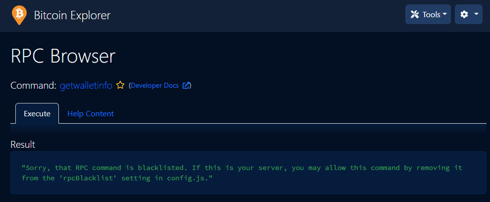
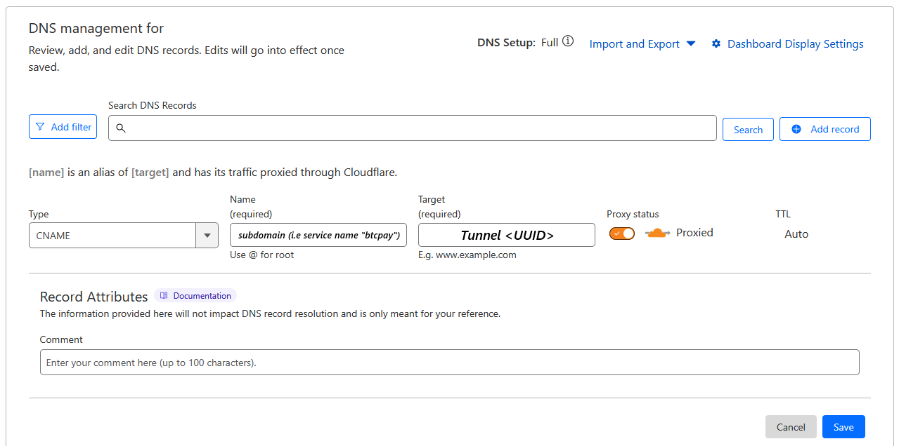

# 2.3 Blockchain explorer: BTC RPC Explorer

Run your private blockchain explorer with [BTC RPC Explorer](https://github.com/janoside/btc-rpc-explorer). Trust your node, not some external services.

<figure><figcaption></figcaption></figure>

## Requirements

* [Bitcoin Core](bitcoin-client.md)
* Others
  * [Node + NPM](../../bonus/system/nodejs-npm.md)

## Introduction

After the MiniBolt runs your own fully validated node, and even acts as a backend for your hardware wallet with [Fulcrum](electrum-server.md), the last important puzzle piece to improve privacy and financial sovereignty is your own Blockchain Explorer. It lets you query transactions, addresses, and blocks of your choice. You no longer need to leak information by querying a third-party blockchain explorer that can be used to get your location and cluster addresses.

[BTC RPC Explorer](https://github.com/janoside/btc-rpc-explorer) provides a lightweight and easy-to-use web interface to accomplish just that. It's a database-free, self-hosted Bitcoin blockchain explorer, querying [Bitcoin Core](bitcoin-client.md) and [Fulcrum](electrum-server.md) via RPC.

## Preparations

### Install Node + NPM

* With user `admin`, check if you have already installed Node

```bash
node -v
```

**Example** of expected output:

```
v18.16.0
```

* Check if you have already installed NPM

```bash
npm -v
```

**Example** of expected output:

```
9.5.1
```


2 options:

-> If the "`node -v"` output is **`>=18`**, you can move to the next section.

-> If Nodejs is not installed (`-bash: /usr/bin/node: No such file or directory`), follow this [Node + NPM bonus guide](../../bonus/system/nodejs-npm.md) to install it


* Update and upgrade your OS

```bash
sudo apt update && sudo apt full-upgrade
```

* Install the next dependency package. Press "**y**" and `enter` or directly `enter` when the prompt asks you

```bash
sudo apt install build-essential
```

### Reverse proxy & Firewall

In the security [section](../../index-1/security.md#prepare-nginx-reverse-proxy), we set up Nginx as a reverse proxy. Now we can add the BTC RPC Explorer configuration.

Enable the Nginx reverse proxy to route external encrypted HTTPS traffic internally to the BTC RPC Explorer. The `error_page 497` directive instructs browsers that send HTTP requests to resend them over HTTPS.

* With user `admin`, create the reverse proxy configuration

```sh
sudo nano /etc/nginx/sites-available/btcrpcexplorer-reverse-proxy.conf
```

* Paste the following configuration. Save and exit

```nginx
server {
  listen 4000 ssl;
  error_page 497 =301 https://$host:$server_port$request_uri;
  location / {
    proxy_pass http://127.0.0.1:3002;
  }
}
```

* Create the symbolic link that points to the directory `sites-enabled`


```bash
sudo ln -s /etc/nginx/sites-available/btcrpcexplorer-reverse-proxy.conf /etc/nginx/sites-enabled/
```


* Test Nginx configuration

```sh
sudo nginx -t
```

Expected output:

```
nginx: the configuration file /etc/nginx/nginx.conf syntax is ok
nginx: configuration file /etc/nginx/nginx.conf test is successful
```

* Reload the Nginx configuration to apply changes

```sh
sudo systemctl reload nginx
```

* Configure the firewall to allow incoming HTTPS requests

```sh
sudo ufw allow 4000/tcp comment 'allow BTC RPC Explorer SSL from anywhere'
```

## Installation

### Create the btcrpcexplorer user & group

For improved security, we will create a new user `btcrpcexplorer` that will run the block explorer. Using a dedicated user limits potential damage in case there's a security vulnerability in the code. An attacker could not do much within this user's permission settings. We will install BTC RPC Explorer in the home directory since it doesn't need too much space.

* Create the `btcrpcexplorer` user and group

```bash
sudo adduser --disabled-password --gecos "" btcrpcexplorer
```

* Add `btcrpcexplorer` user to the "bitcoin" group, allowing the `btcrpcexplorer` user reads the bitcoind `.cookie` file

```bash
sudo adduser btcrpcexplorer bitcoin
```

* Change to the new `btcrpcexplorer` user

<pre class="language-sh"><code class="lang-sh"><strong>sudo su - btcrpcexplorer
</strong></code></pre>

* Import the GPG key of the developer

```bash
curl https://github.com/janoside.gpg | gpg --import
```

**Example** of expected output:

```
gpg: directory '/home/btcrpcexplorer/.gnupg' created
gpg: keybox '/home/btcrpcexplorer/.gnupg/pubring.kbx' created
  % Total    % Received % Xferd  Average Speed   Time    Time     Time  Current
                                 Dload  Upload   Total   Spent    Left  Speed
100  9837  100  9837    0     0  21640      0 --:--:-- --:--:-- --:--:-- 21619
gpg: /home/btcrpcexplorer/.gnupg/trustdb.gpg: trustdb created
gpg: key B326ACF51F317B69: public key "Dan Janosik <dan@47.io>" imported
gpg: key 846311D3D259BFF1: public key "Dan Janosik <dan@47.io>" imported
gpg: key 70C0B166321C0AF8: public key "Dan Janosik <dan@47.io>" imported
gpg: Total number processed: 3
gpg:               imported: 3
```

* Download the source code directly from GitHub and go to the `btc-rpc-explorer` folder


```sh
git clone https://github.com/janoside/btc-rpc-explorer.git && cd btc-rpc-explorer
```


* Verify the release

```bash
git verify-commit $(git rev-parse HEAD)
```

**Example** of expected output:

<pre><code>gpg: Signature made Mon 28 Jul 2025 05:01:59 PM UTC
gpg:                using RSA key F579929B39B119CC7B0BB71FB326ACF51F317B69
gpg: <a data-footnote-ref href="#user-content-fn-1">Good signature</a> from "Dan Janosik &#x3C;dan@47.io>" [unknown]
gpg:                 aka "keybase.io/danjanosik &#x3C;danjanosik@keybase.io>" [unknown]
gpg: WARNING: This key is not certified with a trusted signature!
gpg:          There is no indication that the signature belongs to the owner.
Primary key fingerprint: F579 929B 39B1 19CC 7B0B  B71F B326 ACF5 1F31 7B69
</code></pre>

* Install all dependencies using NPM

```sh
npm install
```


**Not to run** the `npm audit fix` command, which could break the original code!!



Installation can take some time; be patient. There might be a lot of confusing output, but if you see something similar to the following, the installation was successful


**Example** of expected output:

```
Installed to /home/btcrpcexplorer/btc-rpc-explorer/node_modules/node-sass/vendor/linux-amd64-83/binding.node
added 480 packages from 307 contributors and audited 482 packages in 570.14s

43 packages are looking for funding
  run `npm fund` for details

found 12 vulnerabilities (8 moderate, 4 high)
  run `npm audit fix` to fix them, or `npm audit` for details
```

* Check the correct installation by requesting the version

<pre class="language-bash" data-overflow="wrap"><code class="lang-bash"><strong>head -n 3 /home/btcrpcexplorer/btc-rpc-explorer/package.json | grep version
</strong></code></pre>

**Example** of expected output:

```
"version": "3.4.0",
```

## Configuration

* Copy the configuration template

```sh
cp .env-sample .env
```

* Edit the `.env` file.

```sh
nano .env
```


Activate any setting by removing the `#` at the beginning of the line or by editing directly


* Instruct the BTC RPC Explorer to connect to the local Bitcoin Core

```
# Uncomment & replace the value of this line
BTCEXP_BITCOIND_COOKIE=/data/bitcoin/.cookie
```

* An Electrum server or an external service is necessary to get address balances. Your local Electrum server can provide address transaction lists, balances, and more


If you want to use [Electrs](../../bonus/bitcoin/electrs.md) instead of Fulcrum, you need to use:

`BTCEXP_ELECTRUM_SERVERS=tcp://127.0.0.1:`[`50021`](#user-content-fn-2)[^2]


<pre><code># Uncomment &#x26; replace the value of these lines
BTCEXP_ADDRESS_API=electrum
BTCEXP_ELECTRUM_SERVERS=tcp://127.0.0.1:<a data-footnote-ref href="#user-content-fn-3">50001</a>
</code></pre>

* Uncomment this line

```
BTCEXP_SLOW_DEVICE_MODE=false
```


You can set additional features of [Privacy](blockchain-explorer.md#privacy) / [Security](blockchain-explorer.md#security) and customize the [Theme](blockchain-explorer.md#theme) at this moment by going to the [Extra](blockchain-explorer.md#extras-optional) section


* Save and exit
* Exit the `btcrpcexplorer` user session to return to the `admin` user session

```sh
exit
```

### Create systemd service

Now we'll ensure our blockchain explorer starts as a service on the PC so that it's always running.

* As user `admin`, create the service file

```sh
sudo nano /etc/systemd/system/btcrpcexplorer.service
```

* Paste the following configuration. Save and exit

```
# MiniBolt: systemd unit for BTC RPC Explorer
# /etc/systemd/system/btcrpcexplorer.service

[Unit]
Description=BTC RPC Explorer
Requires=bitcoind.service fulcrum.service
After=bitcoind.service fulcrum.service

[Service]
WorkingDirectory=/home/btcrpcexplorer/btc-rpc-explorer
ExecStart=/usr/bin/npm start

User=btcrpcexplorer
Group=btcrpcexplorer

# Hardening Measures
####################
PrivateTmp=true
ProtectSystem=full
NoNewPrivileges=true
PrivateDevices=true

[Install]
WantedBy=multi-user.target
```

* Enable autoboot **(optional)**

```sh
sudo systemctl enable btcrpcexplorer
```

* Prepare "btcrpcexplorer" monitoring by the systemd journal and check the logging output. You can exit monitoring at any time with `Ctrl-C`

```sh
journalctl -fu btcrpcexplorer
```

## Run

To keep an eye on the software movements, [start your SSH program](../../index-1/remote-access.md#access-with-secure-shell) (eg, PuTTY) a second time, connect to the MiniBolt node, and log in as "admin"

* Start the service

```sh
sudo systemctl start btcrpcexplorer
```

<details>

<summary><strong>Example</strong> of expected output on the first terminal with <code>journalctl -fu btcrpcexplorer</code> ⬇️</summary>

```
Feb 27 12:19:28 minibolt systemd[1]: Started BTC RPC Explorer.
Feb 27 12:19:30 minibolt npm[137285]: > btc-rpc-explorer@3.5.1 start
Feb 27 12:19:30 minibolt npm[137285]: > node ./bin/www
Feb 27 12:19:30 minibolt npm[137373]: 2026-02-27T12:19:30.882Z btcexp:app Searching for config files...
Feb 27 12:19:30 minibolt npm[137373]: 2026-02-27T12:19:30.888Z btcexp:app Config file not found at /home/btcrpcexplorer/.config/btc-rpc-explorer.env, continuing...
Feb 27 12:19:30 minibolt npm[137373]: 2026-02-27T12:19:30.894Z btcexp:app Config file not found at /etc/btc-rpc-explorer/.env, continuing...
Feb 27 12:19:30 minibolt npm[137373]: 2026-02-27T12:19:30.894Z btcexp:app Config file found at /home/btcrpcexplorer/btc-rpc-explorer/.env, loading...
Feb 27 12:19:37 minibolt npm[137373]: 2026-02-27T12:19:37.093Z btcexp:app Default cacheId '3.5.1'
Feb 27 12:19:37 minibolt npm[137373]: 2026-02-27T12:19:37.196Z btcexp:app Enabling view caching (performance will be improved but template edits will not be reflected)
Feb 27 12:19:37 minibolt npm[137373]: 2026-02-27T12:19:37.256Z btcexp:app Session config: {"secret":"*****","resave":false,"saveUninitialized":true,"cookie":{"secure":false}}
Feb 27 12:19:37 minibolt npm[137373]: 2026-02-27T12:19:37.260Z btcexp:app Enabling rate limiting: 200 requests per 15min
Feb 27 12:19:37 minibolt npm[137373]: (node:137373) [DEP0169] DeprecationWarning: `url.parse()` behavior is not standardized and prone to errors that have security implications. Use the WHATWG URL API instead. CVEs are not issued for `url.parse()` vulnerabilities.
Feb 27 12:19:37 minibolt npm[137373]: (Use `node --trace-deprecation ...` to show where the warning was created)
Feb 27 12:19:37 minibolt npm[137373]: 2026-02-27T12:19:37.288Z btcexp:app Environment(development) - Node: v24.14.0, Platform: linux, Versions: {"node":"24.14.0","acorn":"8.15.0","ada":"3.4.2","amaro":"1.1.7","ares":"1.34.6","brotli":"1.2.0","cldr":"48.0","icu":"78.2","llhttp":"9.3.0","merve":"1.0.0","modules":"137","napi":"10","nbytes":"0.1.1","ncrypto":"0.0.1","nghttp2":"1.68.0","openssl":"3.5.5","simdjson":"4.2.4","simdutf":"6.4.0","sqlite":"3.51.2","tz":"2025c","undici":"7.21.0","unicode":"17.0","uv":"1.51.0","uvwasi":"0.0.23","v8":"13.6.233.17-node.41","zlib":"1.3.1-e00f703","zstd":"1.5.7"}
Feb 27 12:19:37 minibolt npm[137373]: 2026-02-27T12:19:37.425Z btcexp:app Using sourcecode metadata as cacheId: '2025-08-24-26e282a06e'
Feb 27 12:19:37 minibolt npm[137373]: 2026-02-27T12:19:37.426Z btcexp:app Starting BTC RPC Explorer, v3.5.1 (commit: '26e282a06e', date: 2025-08-24) at http://127.0.0.1:3002/
Feb 27 12:19:37 minibolt npm[137373]: 2026-02-27T12:19:37.427Z btcexp:app RPC Credentials: {
Feb 27 12:19:37 minibolt npm[137373]:     "host": "127.0.0.1",
Feb 27 12:19:37 minibolt npm[137373]:     "port": 8332,
Feb 27 12:19:37 minibolt npm[137373]:     "authType": "cookie",
Feb 27 12:19:37 minibolt npm[137373]:     "username": "__cookie__",
Feb 27 12:19:37 minibolt npm[137373]:     "password": "*****",
Feb 27 12:19:37 minibolt npm[137373]:     "authCookieFilepath": "/data/bitcoin/.cookie",
Feb 27 12:19:37 minibolt npm[137373]:     "timeout": 5000
Feb 27 12:19:37 minibolt npm[137373]: }
Feb 27 12:19:37 minibolt npm[137373]: 2026-02-27T12:19:37.427Z btcexp:app Connecting to RPC node at [127.0.0.1]:8332
Feb 27 12:19:37 minibolt npm[137373]: 2026-02-27T12:19:37.427Z btcexp:app RPC Connection properties: {
Feb 27 12:19:37 minibolt npm[137373]:     "host": "127.0.0.1",
Feb 27 12:19:37 minibolt npm[137373]:     "port": 8332,
Feb 27 12:19:37 minibolt npm[137373]:     "username": "__cookie__",
Feb 27 12:19:37 minibolt npm[137373]:     "password": "*****",
Feb 27 12:19:37 minibolt npm[137373]:     "timeout": 5000
Feb 27 12:19:37 minibolt npm[137373]: }
Feb 27 12:19:37 minibolt npm[137373]: 2026-02-27T12:19:37.428Z btcexp:app RPC authentication is cookie based; watching for changes to the auth cookie file...
Feb 27 12:19:37 minibolt npm[137373]: 2026-02-27T12:19:37.428Z btcexp:app Verifying RPC connection...
Feb 27 12:19:37 minibolt npm[137373]: 2026-02-27T12:19:37.432Z btcexp:app Loading mining pools config
Feb 27 12:19:37 minibolt npm[137373]: 2026-02-27T12:19:37.629Z btcexp:app RPC Connected: version=300200 subversion=/Satoshi:30.2.0(Official MiniBolt node)/, parsedVersion(used for RPC versioning)=1000.1000.0, protocolversion=70016, chain=main, services=[NETWORK, WITNESS, COMPACT_FILTERS, NETWORK_LIMITED, P2P_V2]
Feb 27 12:19:37 minibolt npm[137373]: 2026-02-27T12:19:37.635Z btcexp:app Loading historical data for chain=main
Feb 27 12:19:37 minibolt npm[137373]: 2026-02-27T12:19:37.636Z btcexp:app Loading holiday data
Feb 27 12:19:37 minibolt npm[137373]: 2026-02-27T12:19:37.641Z btcexp:app txindex check: trying getindexinfo
Feb 27 12:19:37 minibolt npm[137373]: 2026-02-27T12:19:37.643Z btcexp:app ATH difficulty: 155973032196071.9
Feb 27 12:19:37 minibolt npm[137373]: 2026-02-27T12:19:37.668Z btcexp:app txindex check: getindexinfo={"txindex":{"synced":true,"best_block_height":938574},"coinstatsindex":{"synced":true,"best_block_height":938574},"basic block filter index":{"synced":true,"best_block_height":938574}}
Feb 27 12:19:37 minibolt npm[137373]: 2026-02-27T12:19:37.669Z btcexp:app txindex check: available!
Feb 27 12:19:42 minibolt npm[137373]: 2026-02-27T12:19:42.559Z btcexp:app Refreshed utxo summary: {"height":938574,"bestblock":"000000000000000000004a690f9c20928ce55873c444258dccb1e5e4cedf9a9d","txouts":164715823,"bogosize":12906274214,"muhash":"6eea775ddfb5bc56e9fa9eefec8444961d687a20e3d351e466d85d32f9f5c1d0","total_amount":19995316.78149993,"total_unspendable_amount":230.09350007,"block_info":{"prevout_spent":1020.97624925,"coinbase":3.14282099,"new_outputs_ex_coinbase":1020.95842825,"unspendable":1e-8,"unspendables":{"genesis_block":0,"bip30":0,"scripts":1e-8,"unclaimed_rewards":0}},"usingCoinStatsIndex":true,"lastUpdated":1772194782558}
Feb 27 12:19:42 minibolt npm[137373]: 2026-02-27T12:19:42.570Z btcexp:app Network volume: {"d1":{"amt":"979919.19082434","blocks":149,"startBlock":938574,"endBlock":938426,"startTime":1772194515,"endTime":1772109202}}
```

</details>

### Validation

* Ensure the service is working and listening on the default `3002` port and the HTTPS `4000` port

```bash
sudo ss -tulpn | grep -E '(:4000|:3002)'
```

Expected output:

```
tcp   LISTEN 0      511          0.0.0.0:4000       0.0.0.0:*    users:(("nginx",pid=992796,fd=6),("nginx",pid=992795,fd=6),("nginx",pid=992794,fd=6),("nginx",pid=992793,fd=6),("nginx",pid=992792,fd=6))
tcp   LISTEN 0      511        127.0.0.1:3002       0.0.0.0:*    users:(("node",pid=1241652,fd=26))
```


> Now point your browser to the secure access point provided by the NGINX web proxy, for example, `"https://minibolt.local:4000"` (or your node IP address) like `"https://192.168.x.xxx:4000"`. You should see the home page of BTC RPC Explorer

> Your browser will display a warning because we use a self-signed SSL certificate. We can do nothing about that because we would need a proper domain name (e.g. https://yournode.com) to get an official certificate that browsers recognize. Click on "Advanced" and proceed to the Block Explorer web interface

> If you see a lot of errors on the MiniBolt command line, then Bitcoin Core might still be indexing the blockchain. You need to wait until reindexing is done before using the BTC RPC Explorer



Congrats! Now you have a Blockchain Explorer: BTC RPC Explorer running to check the Bitcoin network information directly from your node


## Extras (optional)

### Privacy

You can decide whether you want to optimize for more information or more privacy.

* With user `admin` user, edit the `.env` configuration file

```bash
sudo nano /home/btcrpcexplorer/btc-rpc-explorer/.env
```

* **More privacy mode**, no external queries

```
# Uncomment these lines
BTCEXP_PRIVACY_MODE=true
BTCEXP_NO_RATES=true
```

* More information mode, including Bitcoin exchange rates

```
# Replace these lines
BTCEXP_PRIVACY_MODE=false
BTCEXP_NO_RATES=false
```

* Save and exit

### Security

You can add password protection to the web interface. Simply add your `password [D]` for the following option, for which the browser will then prompt you. You can enter any user name; only the password is checked

* With user `admin` user, edit the `.env` configuration file

```bash
sudo nano /home/btcrpcexplorer/btc-rpc-explorer/.env
```

* Replace the next line. Save and exit

```
# Replace with YourPassword [D] in this line
BTCEXP_BASIC_AUTH_PASSWORD=YourPassword [D]
```

### Theme

Decide whether you prefer a `light` or `dark` theme by default

* With user `admin` user, edit the `.env` configuration file

```bash
sudo nano /home/btcrpcexplorer/btc-rpc-explorer/.env
```

* Uncomment and replace this line with your selection. Leave uncommented to dark **(default is dark).** Save and exit

```
BTCEXP_UI_THEME=dark
```

### Slow device mode (resource-intensive features are disabled)

Extend the timeout period and enable slow device mode due to the limited resources

* With user `admin` user, edit the `.env` configuration file

```bash
sudo nano /home/btcrpcexplorer/btc-rpc-explorer/.env
```

* Uncomment and change the value of this line

```
BTCEXP_BITCOIND_RPC_TIMEOUT=10000
```

* Comment this line if it is uncommented **(the default value is true)**. Save and exit

```
#BTCEXP_SLOW_DEVICE_MODE=false
```

### Sharing your explorer

You may want to share your BTC RPC Explorer **onion** address with confident people and limited Bitcoin Core RPC access requests (sensitive data requests will be kept disabled, don't trust, [verify](https://github.com/janoside/btc-rpc-explorer/blob/fc0c175e006dd7ff415f17a7b0e200f8a4cd5cf0/app/config.js#L131-L204). Enabling `DEMO` mode, you will not have to provide a password, and RPC requests will be allowed (discarding rpcBlacklist commands)

* With user `admin` user, edit the `.env` configuration file

```bash
sudo nano /home/btcrpcexplorer/btc-rpc-explorer/.env
```

* Uncomment this line

```
BTCEXP_DEMO=true
```


You will need to set password authentication following the [Security](blockchain-explorer.md#security) section; if not, a banner shows you this:


```
RPC Terminal / Browser require authentication. Set an authentication password via the 'BTCEXP_BASIC_AUTH_PASSWORD' environment variable (see .env-sample file for more info).
```


-> Remember to give them the **`password [D]`** if you added password protection in the reference step



With DEMO mode enabled, the user will see the next message:

`"Sorry, that RPC command is blacklisted. If this is your server, you may allow this command by removing it from the 'rpcBlacklist' setting in config.js."`


<figure><figcaption></figcaption></figure>

### Remote access over Tor

Do you want to access your personal blockchain explorer remotely? You can easily do so by adding a Tor hidden service on the MiniBolt and accessing the BTC RPC Explorer with the Tor browser from any device.

* With the user `admin` , edit the `torrc` file

```sh
sudo nano +63 /etc/tor/torrc --linenumbers
```

* Add the following lines in the "location hidden services" section, below "`## This section is just for location-hidden services ##`" in the torrc file. Save and exit

```
# Hidden Service BTC RPC Explorer
HiddenServiceDir /var/lib/tor/hidden_service_btcrpcexplorer/
HiddenServiceEnableIntroDoSDefense 1
HiddenServicePoWDefensesEnabled 1
HiddenServicePort 80 127.0.0.1:3002
```

* Reload the Tor configuration

```sh
sudo systemctl reload tor
```

* Get your Onion address

```sh
sudo cat /var/lib/tor/hidden_service_btcrpcexplorer/hostname
```

**Example** of expected output:

```
abcdefg..............xyz.onion
```

* With the [Tor browser](https://www.torproject.org), you can access this onion address from any device

### Use Cloudflare tunnel to expose publicly

You may want to expose your BTC RPC Explorer publicly using a clearnet address. To do this, follow the next steps:

* Follow the [Cloudflare tunnel](../../bonus-guides/networking/cloudflare-tunnel.md) guide to install and create the Cloudflare tunnel from your MiniBolt to Cloudflare
* When you finish the "[Create a tunnel and give it a name](../../bonus-guides/networking/cloudflare-tunnel.md#id-3-create-a-tunnel-and-give-it-a-name)" section, you can skip the "[Start routing traffic](../../bonus-guides/networking/cloudflare-tunnel.md#id-5-start-routing-traffic)" section and go to your [Cloudflare account](https://dash.cloudflare.com/login) -> From the left sidebar, select **Websites,** click on your site, and again from the new left sidebar, click on **DNS -> Records**
* Click on the **\[+ Add record]** button

<figure><figcaption></figcaption></figure>


> Select the **CNAME** type

> Type the selected subdomain (i.e service name "explorer") as the **Name** field

> Type the tunnel `<UUID>` of your previously obtained in the [Create a tunnel and give it a name](../../bonus-guides/networking/cloudflare-tunnel.md#id-3-create-a-tunnel-and-give-it-a-name) section as the **Target** field

> Ensure you enable the switch on the `Proxy status` field to be "Proxied"

Click on the \[Save] button to save the new DNS registry


* If you didn't follow before, continue with the "[Configuration](../../bonus-guides/networking/cloudflare-tunnel.md#configuration)" section of the [Cloudflare tunnel guide](../../bonus-guides/networking/cloudflare-tunnel.md) to [Increase the maximum UDP Buffer Sizes](../../bonus-guides/networking/cloudflare-tunnel.md#increase-the-maximum-udp-buffer-sizes) and [Create systemd service](../../bonus-guides/networking/cloudflare-tunnel.md#create-systemd-service)
* Edit the`config.yml`

<pre class="language-bash"><code class="lang-bash"><strong>sudo nano /home/admin/.cloudflared/config.yml
</strong></code></pre>

* Add the next lines to the `config.yml`

<pre><code># BTC RPC Explorer
  - hostname: <a data-footnote-ref href="#user-content-fn-4">&#x3C;subdomain></a>.<a data-footnote-ref href="#user-content-fn-5">&#x3C;domain.com></a>
    service: http://localhost:3002
</code></pre>


> You can choose the subdomain you want; the above information is an example, but keep in mind to use the port `3002` and always maintaining the "`- service: http_status:404`" line at the end of the file


* Restart Cloudflared to apply changes

```bash
sudo systemctl restart cloudflared
```


Try to access the newly created public access to the service by going to the `https://<subdomain>.<domain.com>`, i.e, `https://explorer.domain.com`


### Use Electrs like Electrum server connection

If you followed the [Electrs](../../bonus/bitcoin/electrs.md) instead of the [Fulcrum](electrum-server.md) guide, you need to do the next steps

* As user `admin`, stop the `btcrpcexplorer` service

```bash
sudo systemctl stop btcrpcexplorer
```

* Edit the `btcrpcexplorer` service

```sh
sudo nano /etc/systemd/system/btcrpcexplorer.service
```

* Replace the `fulcrum.service` with the `electrs.service`. Save and exit

```sh
Requires=bitcoind.service electrs.service
After=bitcoind.service electrs.service
```

* Reload the systemctl daemon to apply changes

```bash
sudo systemctl daemon-reload
```

* Start the BTC RPC Explorer service again

```sh
sudo systemctl start btcrpcexplorer
```

* (Optional) Check if all is running fine with


```bash
journalctl -fu btcrpcexplorer
```


## Upgrade

* With `admin` user, stop the service

```sh
sudo systemctl stop btcrpcexplorer
```

* Change to the `btcrpcexplorer` user

```sh
sudo su - btcrpcexplorer
```

* Go to the `btc-rpc-explorer` folder

```sh
cd btc-rpc-explorer
```

* Fetches changes from the remote repository.


```sh
git fetch origin
```


* Moves your local branch to the remote commit and discards all uncommitted changes and any local commits that are not present on the remote

```bash
git reset --hard origin/$(git rev-parse --abbrev-ref HEAD)
```

* Removes untracked files and directories

```bash
git clean -fd
```

* Install dependencies

```sh
npm install
```

* Check the correct installation by requesting the version

<pre class="language-bash" data-overflow="wrap"><code class="lang-bash"><strong>head -n 3 /home/btcrpcexplorer/btc-rpc-explorer/package.json | grep version
</strong></code></pre>

**Example** of expected output:

```
"version": "3.4.0",
```

* Come back to the `admin` user

```sh
exit
```

* Start the service again

```sh
sudo systemctl start btcrpcexplorer
```

## Uninstall


Warning: This section removes the installation. Only run these commands if you intend to uninstall


### Uninstall service

* With the user `admin` , stop btcrpcexplorer

```bash
sudo systemctl stop btcrpcexplorer
```

* Disable autoboot (if enabled)

```bash
sudo systemctl disable btcrpcexplorer
```

* Delete the service

```bash
sudo rm /etc/systemd/system/btcrpcexplorer.service
```

### Delete user & group

* Delete the `btcrpcexplorer` user. Do not worry about the `userdel: btcrpcexplorer mail spool (/var/mail/btcrpcexplorer) not found`

```bash
sudo userdel -rf btcrpcexplorer
```

### Uninstall Tor hidden service

* Ensure that you are logged in as the user `admin` and delete or comment on the following lines in the "location hidden services" section, below "`## This section is just for location-hidden services ##`" in the torrc file. Save and exit

```bash
sudo nano +63 /etc/tor/torrc --linenumbers
```

```
# Hidden Service BTC RPC Explorer
#HiddenServiceDir /var/lib/tor/hidden_service_btcrpcexplorer/
#HiddenServiceEnableIntroDoSDefense 1
#HiddenServicePoWDefensesEnabled 1
#HiddenServicePort 80 127.0.0.1:3002
```

* Reload the tor to apply changes

```bash
sudo systemctl reload tor
```

### **Uninstall reverse proxy & FW configuration**

* Ensure you are logged in as the user `admin`, delete the reverse proxy config file

```bash
sudo rm /etc/nginx/sites-available/btcrpcexplorer-reverse-proxy.conf
```

* Delete the symbolic link

```bash
sudo rm /etc/nginx/sites-enabled/btcrpcexplorer-reverse-proxy.conf
```

* Test Nginx configuration

```bash
sudo nginx -t
```

Expected output:

```
nginx: the configuration file /etc/nginx/nginx.conf syntax is ok
nginx: configuration file /etc/nginx/nginx.conf test is successful
```

* Reload the Nginx configuration to apply changes

```bash
sudo systemctl reload nginx
```

* Display the UFW firewall rules, and note the numbers of the rules for BTC RPC Explorer (e.g., "Y" below)

```bash
sudo ufw status numbered
```

Expected output:

```
[Y] 4000       ALLOW IN    Anywhere      # allow BTC RPC Explorer SSL from anywhere
```

* Delete the rule with the correct number and confirm with "`yes`"

```bash
sudo ufw delete X
```

## Port reference

<table><thead><tr><th align="center">Port</th><th width="100">Protocol<select><option value="Y6T21FHnnCsO" label="TCP" color="blue"></option><option value="mjMppURefbOV" label="SSL" color="blue"></option><option value="sthlT2JmYCAj" label="UDP" color="blue"></option></select></th><th align="center">Use</th></tr></thead><tbody><tr><td align="center">3002</td><td><span data-option="Y6T21FHnnCsO">TCP</span></td><td align="center">Default HTTP port</td></tr><tr><td align="center">4000</td><td><span data-option="mjMppURefbOV">SSL</span></td><td align="center">HTTPS port (encrypted)</td></tr></tbody></table>

[^1]: Check this

[^2]: Change to 50021 in case you want to use Electrs

[^3]: Change to 50021 in case of want to use Electrs

[^4]: Replace with the selected name of your service\
    i.e: `explorer`

[^5]: Replace with your domain\
    i.e: `domain.com`
