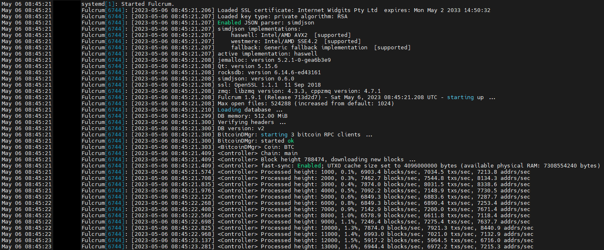

# 2.2 Electrum Server: Fulcrum

[Fulcrum](https://github.com/cculianu/Fulcrum) is a fast & nimble SPV server for Bitcoin created by [Calin Culianu](https://github.com/cculianu). It can be used as an alternative to Electrs because of its performance, as we can see in Craig Raw's [comparison](https://www.sparrowwallet.com/docs/server-performance.html) of servers.

<div data-full-width="false"><figure><figcaption></figcaption></figure></div>

## Requirements

* [Bitcoin Core](bitcoin-client.md)
* \~ 130GB of free storage for the database

## Introduction

#### Bitcoin with hardware wallets

The best way to safely keep your bitcoin (meaning the best combination of security and usability) is to use a hardware wallet (like [BitBox](https://bitbox.swiss/bitbox02/), [Coldcard](https://coldcard.com/), [Ledger](https://www.ledger.com), or [Trezor](https://trezor.io)) in combination with your own Bitcoin node. This gives you security, privacy, and eliminates the need to trust a third party to verify transactions.

Bitcoin Core on the MiniBolt itself is not meant to hold funds.

One possibility to use Bitcoin Core with your Bitcoin wallets is to use an Electrum server as middleware. It imports data from Bitcoin Core and provides it to software wallets supporting the Electrum protocol. Desktop wallets like [Sparrow](https://sparrowwallet.com/), the [BitBoxApp](https://shiftcrypto.ch/app/), [Electrum](https://electrum.org/), or [Specter Desktop](https://specter.solutions/desktop/) that support hardware wallets can then be used with your own sovereign Bitcoin node.

## Preparations


Make sure that you have followed the [Activate mempool & reduce 'dbcache' after a full sync](bitcoin-client.md#activate-mempool-and-reduce-dbcache-after-a-full-sync) section


### Install dependencies

* With user `admin`, update and upgrade your OS

```bash
sudo apt update && sudo apt full-upgrade
```

* Make sure that all necessary software packages are installed. Press "**y**" and `enter` or directly `enter` when the prompt asks you

```sh
sudo apt install libssl-dev
```

### Configure Firewall

* Configure the firewall to allow incoming requests

```sh
sudo ufw allow 50001/tcp comment 'allow Fulcrum TCP from anywhere'
```

```sh
sudo ufw allow 50002/tcp comment 'allow Fulcrum SSL from anywhere'
```

### Configure Bitcoin Core

We need to set up settings in the Bitcoin Core configuration file - add new lines if they are not present

* Edit `bitcoin.conf` file

```sh
sudo nano /data/bitcoin/bitcoin.conf
```

* Add the following lines to the `"# Connections"` section. Save and exit

```
# Enable ZMQ blockhash & txhash notification (for Fulcrum)
zmqpubhashblock=tcp://127.0.0.1:8433
zmqpubhashtx=tcp://127.0.0.1:9332
```

* Restart Bitcoin Core to apply changes

```sh
sudo systemctl restart bitcoind
```

* Check if Bitcoin Core is enabled `zmqpubhashblock` on the `8433` port and `zmqpubhashtx` on the `9332` port

```bash
sudo ss -tulpn | grep -E '(:8433|:9332)'
```

Expected output:

<pre><code>tcp   LISTEN 0      100            127.0.0.1:<a data-footnote-ref href="#user-content-fn-1">9332</a>       0.0.0.0:*    users:(("bitcoind",pid=2915785,fd=21))
tcp   LISTEN 0      100            127.0.0.1:<a data-footnote-ref href="#user-content-fn-1">8433</a>       0.0.0.0:*    users:(("bitcoind",pid=2915785,fd=19))
</code></pre>

## Installation

### Download binaries

We have our Bitcoin Core configuration file set up and can move on to the next part of the Fulcrum installation.

* Login as `admin` user and change to a temporary directory, which is cleared on reboot

```sh
cd /tmp
```

* Set a temporary version environment variable for the installation

```sh
VERSION=1.12.0
```

* Download the application, checksums, and signature


```sh
wget https://github.com/cculianu/Fulcrum/releases/download/v$VERSION/Fulcrum-$VERSION-x86_64-linux.tar.gz
```



```bash
wget https://github.com/cculianu/Fulcrum/releases/download/v$VERSION/Fulcrum-$VERSION-shasums.txt.asc
```



```bash
wget https://github.com/cculianu/Fulcrum/releases/download/v$VERSION/Fulcrum-$VERSION-shasums.txt
```


### Signature check

* Get the public key from the Fulcrum developer


```bash
curl https://raw.githubusercontent.com/Electron-Cash/keys-n-hashes/master/pubkeys/calinkey.txt | gpg --import
```


Expected output:

<pre><code><strong>[...]
</strong><strong>  % Total    % Received % Xferd  Average Speed   Time    Time     Time  Current
</strong>  % Total    % Received % Xferd  Average Speed   Time    Time     Time  Current
                                 Dload  Upload   Total   Spent    Left  Speed
100  2328  100  2328    0     0   8449      0 --:--:-- --:--:-- --:--:--  8434
gpg: key 21810A542031C02C: "Calin Culianu (NilacTheGrim) &#x3C;calin.culianu@gmail.com>" imported
gpg: Total number processed: 1
gpg:              unchanged: 1
[...]
</code></pre>

* Verify the signature of the text file containing the checksums for the application

```sh
gpg --verify Fulcrum-$VERSION-shasums.txt.asc Fulcrum-$VERSION-shasums.txt
```

Expected output:

<pre data-overflow="wrap"><code>[...]
gpg: <a data-footnote-ref href="#user-content-fn-1">Good signature</a> from "Calin Culianu (NilacTheGrim) &#x3C;calin.culianu@gmail.com>" [unknown]
gpg: WARNING: This key is not certified with a trusted signature!
gpg: There is no indication that the signature belongs to the owner.
Primary key fingerprint: D465 135F 97D0 047E 18E9  9DC3 2181 0A54 2031 C02C
[...]
</code></pre>

### Checksum check

* Verify the signed checksum against the actual checksum of your download

```sh
grep 'x86_64-linux.tar.gz' Fulcrum-$VERSION-shasums.txt | sha256sum --check
```

**Example** of expected output:

<pre><code><strong><a data-footnote-ref href="#user-content-fn-2">Fulcrum-1.9.4-x86_64-linux.tar.gz: OK</a>
</strong></code></pre>

* Extract

```sh
tar -xzvf Fulcrum-$VERSION-x86_64-linux.tar.gz
```

**Example** of expected output:

```
Fulcrum-1.11.1-amd64-linux/
Fulcrum-1.11.1-amd64-linux/man/
Fulcrum-1.11.1-amd64-linux/man/Fulcrum.1
Fulcrum-1.11.1-amd64-linux/FulcrumAdmin
Fulcrum-1.11.1-amd64-linux/fulcrum-example-config.conf
Fulcrum-1.11.1-amd64-linux/LICENSE.txt
Fulcrum-1.11.1-amd64-linux/Fulcrum
Fulcrum-1.11.1-amd64-linux/unix-man-page.md
Fulcrum-1.11.1-amd64-linux/fulcrum-quick-config.conf
```

### Binaries installation

* Install it


```bash
sudo install -m 0755 -o root -g root -t /usr/local/bin Fulcrum-$VERSION-x86_64-linux/Fulcrum
```


* Check the correct installation, requesting the version

```sh
Fulcrum --version
```

**Example** of expected output:

```
Fulcrum 1.9.1 (Release 713d2d7)
compiled: gcc 8.4.0
[...]
```

* **(Optional)** Delete the installation files of the `tmp` folder


```bash
sudo rm -r Fulcrum-$VERSION-x86_64-linux Fulcrum-$VERSION-x86_64-linux.tar.gz Fulcrum-$VERSION-shasums.txt Fulcrum-$VERSION-shasums.txt.asc
```



If you come to update, this is the final step, go back to the [Upgrade section](electrum-server.md#upgrade) to continue


### Create the fulcrum user & group

* Create the `fulcrum` user and group

```bash
sudo adduser --disabled-password --gecos "" fulcrum
```

* Add `fulcrum` user to the "bitcoin" group, allowing him to read the bitcoind `.cookie` file

```bash
sudo adduser fulcrum bitcoin
```

### Create data folder

* Create the fulcrum data folder

```sh
sudo mkdir -p /data/fulcrum/fulcrum_db
```

* Assign as the owner to the `fulcrum` user

```sh
sudo chown -R fulcrum:fulcrum /data/fulcrum/
```

* Change to the `fulcrum` user

```bash
sudo su - fulcrum
```

* Create a symlink from `/home/fulcrum/.fulcrum` folder to the `/data/fulcrum` folder

```sh
ln -s /data/fulcrum /home/fulcrum/.fulcrum
```

* Check symbolic link has been created correctly

```bash
ls -la .fulcrum
```

Expected output:

<pre><code><strong>lrwxrwxrwx 1 fulcrum fulcrum 13 Jul 27 17:06 <a data-footnote-ref href="#user-content-fn-1">.fulcrum -> /data/fulcrum</a>
</strong></code></pre>

* Change to the fulcrum data folder

```sh
cd /data/fulcrum
```

* Generate cert and key files for SSL


```bash
openssl req -newkey rsa:2048 -sha256 -nodes -x509 -days 3650 -subj "/O=Fulcrum" -keyout key.pem -out cert.pem
```


Expected output:

```
Generating a RSA private key
....................+++++
..................................+++++
writing new private key to 'key.pem'
-----
```

* Download the custom Fulcrum banner based on MiniBolt. Create your own if you want [here](https://patorjk.com/software/taag/#p=display\&f=Slant\&t=fulcrum)


```bash
wget https://raw.githubusercontent.com/minibolt-guide/minibolt/main/resources/fulcrum-banner.txt
```


## Configuration

MiniBolt uses SSL as default for Fulcrum, but some wallets like BlueWallet do not support SSL over Tor. That's why we use TCP in configurations as well to let the user choose what he needs. You may as well need to use TCP for other reasons.

* Create a Fulcrum configuration file

```sh
nano /data/fulcrum/fulcrum.conf
```

* Enter the following content. Save and exit


Remember to accommodate the `"utxo-cache"` parameter depending on your hardware. Recommended: utxo-cache=1/2 x RAM available, e.g. 4GB RAM -> utxo-cache=2000


<pre><code># MiniBolt: fulcrum configuration
# /data/fulcrum/fulcrum.conf

## Bitcoin Core settings
bitcoind = 127.0.0.1:8332
rpccookie = /data/bitcoin/.cookie

## Fulcrum server general settings
datadir = /data/fulcrum/fulcrum_db
cert = /data/fulcrum/cert.pem
key = /data/fulcrum/key.pem
ssl = 0.0.0.0:50002
tcp = 0.0.0.0:50001
peering = false
zmq_allow_hashtx = true

# Set utxo-cache according to your device performance (only apply on initial indexing)
# recommended: utxo-cache=1/2 x RAM available e.g: 4GB RAM -> utxo-cache=2000
utxo-cache = <a data-footnote-ref href="#user-content-fn-3">2000</a>

# Banner
banner = /data/fulcrum/fulcrum-banner.txt
</code></pre>


Remember, if you have a slow-performance device, follow the [slow device section](electrum-server.md#slow-devices-mode) to improve the experience of the first indexation


* Exit the `fulcrum` user session to return to the "admin" user session

```sh
exit
```

### Create systemd service

Fulcrum needs to start automatically when booting the system.

* As user `admin`, create the Fulcrum systemd unit

```sh
sudo nano /etc/systemd/system/fulcrum.service
```

* Enter the complete following configuration. Save and exit

```
# MiniBolt: systemd unit for Fulcrum
# /etc/systemd/system/fulcrum.service

[Unit]
Description=Fulcrum
Requires=bitcoind.service
After=bitcoind.service

StartLimitBurst=2
StartLimitIntervalSec=20

[Service]
ExecStart=/usr/local/bin/Fulcrum /data/fulcrum/fulcrum.conf

User=fulcrum
Group=fulcrum

# Process management
####################
Type=simple
KillSignal=SIGINT
TimeoutStopSec=300

[Install]
WantedBy=multi-user.target
```

* Enable autoboot **(optional)**

```sh
sudo systemctl enable fulcrum
```

* Prepare "fulcrum" monitoring by the systemd journal and check log logging output. You can exit monitoring at any time with `Ctrl-C`

```sh
journalctl -fu fulcrum
```

## Run

To keep an eye on the software movements, [start your SSH program](../../index-1/remote-access.md#access-with-secure-shell) (eg. PuTTY) a second time, connect to the MiniBolt node, and log in as "admin"

* Start the service

```sh
sudo systemctl start fulcrum
```

**Example** of expected output on the first terminal with `journalctl -fu fulcrum` ⬇️

<div data-full-width="false"><figure><figcaption></figcaption></figure></div>


> Fulcrum must first fully index the blockchain and compact its database before you can connect to it with your wallets. This can take up to \~1.5 - 4 days or more, depending on the hardware. Only proceed with the [Blockchain explorer: BTC RPC Explorer](blockchain-explorer.md) and [Desktop Wallet Section](desktop-signing-app-sparrow.md) once Fulcrum is ready.

> Fulcrum will now index the whole Bitcoin blockchain so that it can provide all necessary information to wallets. With this, the wallets you use no longer need to connect to any third-party server to communicate with the Bitcoin peer-to-peer network.



DO NOT REBOOT OR STOP THE SERVICE DURING THE DB CREATION PROCESS. YOU MAY CORRUPT THE FILES - in case that happens, start the sync from scratch by deleting the content of `fulcrum_db` folder, follow the next steps:

* With user `admin`, stop `fulcrum`

```bash
sudo systemctl stop fulcrum
```

* Delete the `fulcrum_db` folder content

```bash
sudo rm -r /data/fulcrum/fulcrum_db/*
```

* Start fulcrum again

```bash
sudo systemctl start fulcrum
```

-> You should see the logs of the [Run process](electrum-server.md#run) before again

-> The troubleshooting note could be helpful after experiencing **data corruption due to a power outage** during normal operation


* When you see logs like this `SrvMgr: starting 2 services ...`, which means that Fulcrum is fully indexed

```
[...]
Jun 09 10:28:56 minibolt Fulcrum[3345722]: [2024-06-09 10:28:56.705] SrvMgr: starting 2 services ...
Jun 09 10:28:56 minibolt Fulcrum[3345722]: [2024-06-09 10:28:56.706] Starting listener service for TcpSrv 0.0.0.0:50001 ...
Jun 09 10:28:56 minibolt Fulcrum[3345722]: [2024-06-09 10:28:56.706] Service started, listening for connections on 0.0.0.0:50001
Jun 09 10:28:56 minibolt Fulcrum[3345722]: [2024-06-09 10:28:56.706] Starting listener service for SslSrv 0.0.0.0:50002 ...
Jun 09 10:28:56 minibolt Fulcrum[3345722]: [2024-06-09 10:28:56.706] Service started, listening for connections on 0.0.0.0:50002
Jun 09 10:28:56 minibolt Fulcrum[3345722]: [2024-06-09 10:28:56.707] <Controller> Starting ZMQ Notifier (hashtx) ...
Jun 09 10:28:56 minibolt Fulcrum[3345722]: [2024-06-09 10:28:56.707] <Controller> Starting ZMQ Notifier (hashblock) ...
[...]
```

### Validation

* Ensure the service is working and listening at the default `50002` & `50001` ports

```sh
sudo ss -tulpn | grep Fulcrum
```

Expected output:

```
tcp   LISTEN 0      50        0.0.0.0:50001      0.0.0.0:*    users:(("Fulcrum",pid=1821,fd=185))
tcp   LISTEN 0      50        0.0.0.0:50002      0.0.0.0:*    users:(("Fulcrum",pid=1821,fd=204))
```


Congrats! Now you have a high-performance and self-hosted Electrum Server on your node. Now you can process installing the [Blockchain Explorer: BTC RPC Explorer](blockchain-explorer.md) or connect your [Desktop signing app: Sparrow Wallet](desktop-signing-app-sparrow.md) or [Electrum Wallet ](../../bonus/bitcoin/electrum-wallet-desktop.md)[Desktop](../../bonus/bitcoin/electrum-wallet-desktop.md)


## Extras (optional)

### Remote access over Tor

* With the user `admin`, edit the `torrc` file

```sh
sudo nano +63 /etc/tor/torrc --linenumbers
```

* Add the following lines in the "location hidden services" section, below `## This section is just for location-hidden services ##` in the torrc file. Save and exit

```
# Hidden Service Fulcrum TCP & SSL
HiddenServiceDir /var/lib/tor/hidden_service_fulcrum_tcp_ssl/
HiddenServiceVersion 3
HiddenServicePoWDefensesEnabled 1
HiddenServicePort 50001 127.0.0.1:50001
HiddenServicePort 50002 127.0.0.1:50002
```

* Reload the Tor configuration to apply changes

```sh
sudo systemctl reload tor
```

* Get your Onion address

```sh
sudo cat /var/lib/tor/hidden_service_fulcrum_tcp_ssl/hostname
```

**Example** of expected output:

```
abcdefg..............xyz.onion
```

* You should now be able to connect to your Fulcrum server remotely via Tor using your hostname and port `50001` (TCP) or `50002` (SSL)

### Slow devices mode

#### Fulcrum configuration

* As the `admin` user, edit the existing `fulcrum.conf` file

```sh
 sudo nano /data/fulcrum/fulcrum.conf
```

* Uncomment the `db_max_open_files` parameter choosing the appropriate one for 4 GB or 8 GB of RAM depending on your hardware

```
## Slow device optimizations
bitcoind_timeout = 600
bitcoind_clients = 1
worker_threads = 1
db_mem = 1024.0

# 4GB RAM
#db_max_open_files = 200
# 8GB RAM
#db_max_open_files = 400
```

#### Install zram-swap

[zram-swap](https://github.com/foundObjects/zram-swap) is a compressed swap in memory and on disk and is necessary for the proper functioning of Fulcrum during the sync process using compressed swap in memory (increase performance when memory usage is high)

* With user `admin`, access to the "admin" home folder

```sh
cd /home/admin/
```

* Clone the repository of GitHub and go to the `zram-swap` folder

```sh
git clone https://github.com/foundObjects/zram-swap.git && cd zram-swap
```

* Install it

```bash
sudo ./install.sh
```

* Add kernel parameters to make better use of zram

```sh
sudo nano /etc/sysctl.conf
```

* Add next lines at the end of the file. Save and exit

```
vm.vfs_cache_pressure=500
vm.swappiness=100
vm.dirty_background_ratio=1
vm.dirty_ratio=50
```

* Then apply the changes with

```sh
sudo sysctl --system
```

* Restart the service

```sh
sudo systemctl restart zram-swap
```

* Make sure zram was correctly installed and prioritized (+ Priority than swap)

```sh
sudo cat /proc/swaps
```

**Example** of expected output:

```
Filename               Type            Size            Used            Priority
/swap.img              file            4194300         0               -2
/dev/zram0             partition       10055452        368896          15
```

## Upgrade

Follow the complete [Installation section](electrum-server.md#installation) until the [Binaries installation section](electrum-server.md#binaries-installation) (included), replacing the environment variable `"VERSION=x.xx"` value for the latest if it has not already been changed in this guide.

* Restart the service to apply the changes

```sh
sudo systemctl restart fulcrum
```

* Check logs and pay attention to the next log if that attends to the new version installed

```sh
journalctl -fu fulcrum
```

**Example** of expected output:

```
[...]
Jul 28 12:20:13 minibolt Fulcrum[181811]: [2022-07-28 12:20:13.064] Fulcrum 1.9.1 (Release a5a53cf) - Wed Dec 21, 2022 15:35:25.963 UTC - starting up ...
[...]
```

## Uninstall

### Uninstall service

* Ensure you are logged in with the user `admin`, stop fulcrum

```sh
sudo systemctl stop fulcrum
```

* Disable autoboot (if enabled)

```sh
sudo systemctl disable fulcrum
```

* Delete the service

```sh
sudo rm /etc/systemd/system/fulcrum.service
```

### Delete user & group

* Delete the fulcrum user. Don't worry about `userdel: fulcrum mail spool (/var/mail/fulcrum) not found` output, the uninstall has been successful

```sh
sudo userdel -rf fulcrum
```

### Delete data directory

* Delete fulcrum directory

```sh
sudo rm -rf /data/fulcrum/
```

### Uninstall binaries

* Delete the binaries installed

```bash
sudo rm /usr/local/bin/Fulcrum
```

### Uninstall Tor hidden service

* Ensure that you are logged in with the user `admin` and delete or comment the following lines in the "location hidden services" section, below "`## This section is just for location-hidden services ##`" in the torrc file. Save and exit

```sh
sudo nano +63 /etc/tor/torrc --linenumbers
```

```
# Hidden Service Fulcrum TCP & SSL
#HiddenServiceDir /var/lib/tor/hidden_service_fulcrum_ssl/
#HiddenServiceVersion 3
#HiddenServicePoWDefensesEnabled 1
#HiddenServicePort 50001 127.0.0.1:50001
#HiddenServicePort 50002 127.0.0.1:50002
```

* Reload the torrc config

```sh
sudo systemctl reload tor
```

### Uninstall FW configuration

* Ensure you are logged in with the user `admin`, display the UFW firewall rules, and note the numbers of the rules for Fulcrum (e.g., X and Y below)

```sh
sudo ufw status numbered
```

Expected output:

```
[Y] 50001       ALLOW IN    Anywhere          # allow Fulcrum TCP from anywhere
[X] 50002       ALLOW IN    Anywhere          # allow Fulcrum SSL from anywhere
```

* Delete the rule with the correct number and confirm with "`yes`"

```sh
sudo ufw delete X
```

### Uninstall the Zram

* Ensure you are logged in with the user `admin`, navigate to the zram-swap folder, and uninstall

```sh
cd /home/admin/zram-swap
```

```sh
sudo ./install.sh --uninstall
```

```sh
sudo rm /etc/default/zram-swap
```

```sh
sudo rm -rf /home/admin/zram-swap
```

* Make sure that the change was done

```sh
sudo cat /proc/swaps
```

Expected output:

```
Filename            Type                Size           Used    Priority
/var/swap           file               102396            0        -2
```

## Port reference

<table><thead><tr><th align="center">Port</th><th width="100">Protocol<select><option value="c7bSQ5JNyEzd" label="TCP" color="blue"></option><option value="sTSvdCtBoTFb" label="SSL" color="blue"></option><option value="hMCHv9SJMWRX" label="UDP" color="blue"></option></select></th><th align="center">Use</th></tr></thead><tbody><tr><td align="center">50001</td><td><span data-option="c7bSQ5JNyEzd">TCP</span></td><td align="center">TCP port</td></tr><tr><td align="center">50002</td><td><span data-option="sTSvdCtBoTFb">SSL</span></td><td align="center">SSL port</td></tr><tr><td align="center">8000</td><td><span data-option="c7bSQ5JNyEzd">TCP</span></td><td align="center">Admin port</td></tr></tbody></table>

[^1]: Check this

[^2]: That's it!

[^3]: Accommodate this
