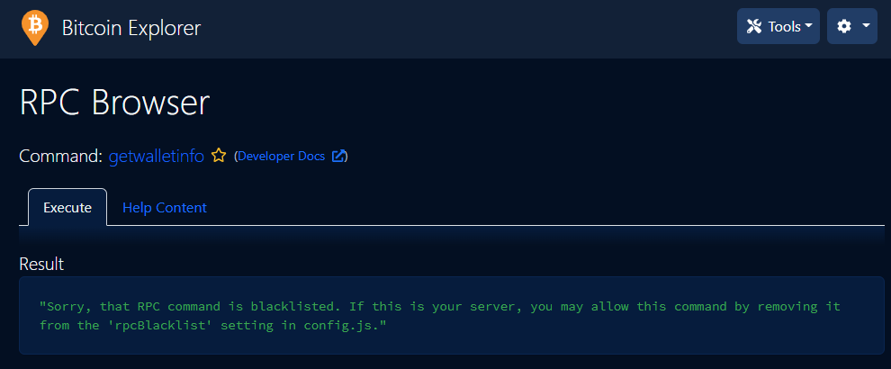

# 2.3 Blockchain explorer: BTC RPC Explorer

Run your own private blockchain explorer with [BTC RPC Explorer](https://github.com/janoside/btc-rpc-explorer). Trust your node, not some external services.


## Requirements

* [Bitcoin Core](../index-2/bitcoin-client.md)
* Others
  * [Node + NPM](../bonus/system/nodejs-npm.md)

## Introduction

After the MiniBolt runs your own fully validated node, and even acts as a backend for your hardware wallet with [Fulcrum](electrum-server.md), the last important puzzle piece to improve privacy and financial sovereignty is your own Blockchain Explorer. It lets you query transactions, addresses, and blocks of your choice. You no longer need to leak information by querying a third-party blockchain explorer that can be used to get your location and cluster addresses.

[BTC RPC Explorer](https://github.com/janoside/btc-rpc-explorer) provides a lightweight and easy to use web interface to accomplish just that. It's a database-free, self-hosted Bitcoin blockchain explorer, querying [Bitcoin Core](../index-2/bitcoin-client.md) and [Fulcrum](electrum-server.md) via RPC.

## Preparations

### Install Node + NPM

* With user admin, check if you have already installed Node

```bash
$ node -v
```

**Example** of expected output:

```
> v18.16.0
```

* Check if you have already installed NPM

```bash
$ npm -v
```

**Example** of expected output:

```
> 9.5.1
```


If the version is `>=18`, you can move to the next section. If Nodejs is not installed, follow this [Node + NPM bonus guide](../bonus/system/nodejs-npm.md) to install it


* Install the next dependency package. Press "**y**" and `enter` when the prompt asks you

```bash
$ sudo apt install build-essential
```

### Reverse proxy & Firewall

In the security [section](../index-1/security.md#prepare-nginx-reverse-proxy), we set up Nginx as a reverse proxy. Now we can add the BTC RPC Explorer configuration.

Enable the Nginx reverse proxy to route external encrypted HTTPS traffic internally to the BTC RPC Explorer. The `error_page 497` directive instructs browsers that send HTTP requests to resend them over HTTPS.

* With user `admin`, create the reverse proxy configuration

```sh
$ sudo nano /etc/nginx/sites-available/btcrpcexplorer-reverse-proxy.conf
```

* Paste the complete following configuration. Save and exit

```nginx
server {
  listen 4000 ssl;
  error_page 497 =301 https://$host:$server_port$request_uri;
  location / {
    proxy_pass http://127.0.0.1:3002;
  }
}
```

* Create the symbolic link that points to the directory `sites-enabled`


```bash
$ sudo ln -s /etc/nginx/sites-available/btcrpcexplorer-reverse-proxy.conf /etc/nginx/sites-enabled/
```


* Test Nginx configuration

```sh
$ sudo nginx -t
```

Expected output:

```
> nginx: the configuration file /etc/nginx/nginx.conf syntax is ok
> nginx: configuration file /etc/nginx/nginx.conf test is successful
```

* Reload the Nginx configuration to apply changes

```sh
$ sudo systemctl reload nginx
```

* Configure the firewall to allow incoming HTTPS requests

```sh
$ sudo ufw allow 4000/tcp comment 'allow BTC RPC Explorer SSL from anywhere'
```

## Installation

For improved security, we will create a new user `btcrpcexplorer` that will run the block explorer. Using a dedicated user limits potential damage in case there's a security vulnerability in the code. An attacker would not be able to do much within this user's permission settings.

* Create a new one called `btcrpcexplorer` user

```sh
$ sudo adduser --disabled-password --gecos "" btcrpcexplorer
```

* Assign it to the "bitcoin" group

```sh
$ sudo adduser btcrpcexplorer bitcoin
```

* Change to the new `btcrpcexplorer` user

```sh
$ sudo su - btcrpcexplorer
```

* Set a temporary version environment variable to the installation

<pre class="language-bash"><code class="lang-bash"><strong>$ VERSION=3.4.0
</strong></code></pre>

* Import the GPG key of the developer

```bash
$ curl https://github.com/janoside.gpg | gpg --import
```

* Download the source code directly from GitHub

```sh
$ git clone --branch v$VERSION https://github.com/janoside/btc-rpc-explorer.git
```

* Go to the `btc-rpc-explorer` folder&#x20;

<pre class="language-bash"><code class="lang-bash"><strong>$ cd btc-rpc-explorer
</strong></code></pre>

* Verify the release

```bash
$ git verify-commit v$VERSION
```

**Example** of expected output:

```
gpg: Signature made Wed Jun 14 15:18:11 2023 CEST
gpg:                using EDDSA key 4D841E6E6B1B68EBFAB4A9E670C0B166321C0AF8
gpg: Good signature from "Dan Janosik <dan@47.io>" [unknown]
gpg: WARNING: This key is not certified with a trusted signature!
gpg:          There is no indication that the signature belongs to the owner.
Primary key fingerprint: 4D84 1E6E 6B1B 68EB FAB4  A9E6 70C0 B166 321C 0AF8
```

* Install all dependencies using NPM

```sh
$ npm install
```


Installation can take some time, be patient. There might be a lot of confusing output, but if you see something similar to the following, the installation was successful


**Example** of expected output:

```
> Installed to /home/btcrpcexplorer/btc-rpc-explorer/node_modules/node-sass/vendor/linux-amd64-83/binding.node
> added 480 packages from 307 contributors and audited 482 packages in 570.14s
>
> 43 packages are looking for funding
>   run `npm fund` for details
>
> found 12 vulnerabilities (8 moderate, 4 high)
>   run `npm audit fix` to fix them, or `npm audit` for details
```

* Check the correct installation by requesting the version

<pre class="language-bash" data-overflow="wrap"><code class="lang-bash"><strong>$ head -n 3 /home/btcrpcexplorer/btc-rpc-explorer/package.json | grep version
</strong></code></pre>

**Example** of expected output:

```
> "version": "3.4.0",
```

## Configuration

* Copy the configuration template

```sh
$ cp .env-sample .env
```

* Edit the `.env` file. Activate any setting by removing the `#` at the beginning of the line or editing directly

```sh
$ nano .env
```

* Instruct the BTC RPC Explorer to connect to the local Bitcoin Core

```
# replace this line
BTCEXP_BITCOIND_COOKIE=/data/bitcoin/.cookie
```

* To get address balances, either an Electrum server or an external service is necessary. Your local Electrum server can provide address transaction lists, balances, and more

```
# replace these lines
BTCEXP_ADDRESS_API=electrum
BTCEXP_ELECTRUM_SERVERS=tcp://127.0.0.1:50001
```

* Uncomment this line

```
BTCEXP_SLOW_DEVICE_MODE=false
```


You can set additional features of [Privacy](blockchain-explorer.md#privacy) / [Security](blockchain-explorer.md#security) and customize the [Theme](blockchain-explorer.md#theme) at this moment by going to the [Extra](blockchain-explorer.md#extras-optional) section


* Save and exit
* Exit the `btcrpcexplorer` user session to return to the "admin" user session

```sh
$ exit
```

### Create systemd service

Now we'll make sure our blockchain explorer starts as a service on the PC so that it's always running.

* As user `admin`, create the service file

```sh
$ sudo nano /etc/systemd/system/btcrpcexplorer.service
```

* Paste the following configuration. Save and exit

```
# MiniBolt: systemd unit for BTC RPC Explorer
# /etc/systemd/system/btcrpcexplorer.service

[Unit]
Description=BTC RPC Explorer
After=bitcoind.service fulcrum.service

[Service]
WorkingDirectory=/home/btcrpcexplorer/btc-rpc-explorer
ExecStart=/usr/bin/npm start

User=btcrpcexplorer
Group=btcrpcexplorer

# Hardening Measures
####################
PrivateTmp=true
ProtectSystem=full
NoNewPrivileges=true
PrivateDevices=true

[Install]
WantedBy=multi-user.target
```

* Enable autoboot **(optional)**

```sh
$ sudo systemctl enable btcrpcexplorer
```

* Prepare "btcrpcexplorer" monitoring by the systemd journal and check log logging output. You can exit monitoring at any time with `Ctrl-C`

```sh
$ journalctl -f -u btcrpcexplorer
```

## Run

To keep an eye on the software movements, [start your SSH program](../index-1/remote-access.md#access-with-secure-shell) (eg. PuTTY) a second time, connect to the MiniBolt node, and log in as "admin". Commands for the **second session** start with the prompt **`$2` (which must not be entered).**

* Start the service

```sh
$2 sudo systemctl start btcrpcexplorer
```

<details>

<summary><strong>Example</strong> of expected output on the first terminal with <code>$ journalctl -f -u btcrpcexplorer</code> ⬇️</summary>

```
Jul 18 11:08:29 minibolt systemd[1]: Started BTC RPC Explorer.
Jul 18 11:08:30 minibolt npm[140449]: > btc-rpc-explorer@3.4.0 start
Jul 18 11:08:30 minibolt npm[140449]: > node ./bin/www
Jul 18 11:08:30 minibolt npm[140461]: 2023-07-18T11:08:30.765Z btcexp:app Searching for config files...
Jul 18 11:08:30 minibolt npm[140461]: 2023-07-18T11:08:30.767Z btcexp:app Config file not found at /home/btcrpcexplorer/.config/btc-rpc-explorer.env, continuing...
Jul 18 11:08:30 minibolt npm[140461]: 2023-07-18T11:08:30.767Z btcexp:app Config file not found at /etc/btc-rpc-explorer/.env, continuing...
Jul 18 11:08:30 minibolt npm[140461]: 2023-07-18T11:08:30.767Z btcexp:app Config file found at /home/btcrpcexplorer/btc-rpc-explorer/.env, loading...
Jul 18 11:08:33 minibolt npm[140461]: 2023-07-18T11:08:33.086Z btcexp:app Default cacheId '3.4.0'
Jul 18 11:08:33 minibolt npm[140461]: 2023-07-18T11:08:33.122Z btcexp:app Enabling view caching (performance will be improved but template edits will not be reflected)
Jul 18 11:08:33 minibolt npm[140461]: 2023-07-18T11:08:33.133Z btcexp:app Session config: {"secret":"*****","resave":false,"saveUninitialized":true,"cookie":{"secure":false}}
Jul 18 11:08:33 minibolt npm[140461]: 2023-07-18T11:08:33.142Z btcexp:app Environment(development) - Node: v18.16.1, Platform: linux, Versions: {"node":"18.16.1","acorn":"8.8.2","ada":"1.0.4","ares":"1.19.1","brotli":"1.0.9","cldr":"42.0","icu":"72.1","llhttp":"6.0.11","modules":"108","napi":"8","nghttp2":"1.52.0","nghttp3":"0.7.0","ngtcp2":"0.8.1","openssl":"3.0.9+quic","simdutf":"3.2.2","tz":"2022g","undici":"5.21.0","unicode":"15.0","uv":"1.44.2","uvwasi":"0.0.15","v8":"10.2.154.26-node.26","zlib":"1.2.13"}
Jul 18 11:08:33 minibolt npm[140461]: 2023-07-18T11:08:33.193Z btcexp:app Using sourcecode metadata as cacheId: '2023-06-14-bfc9f97715'
Jul 18 11:08:33 minibolt npm[140461]: 2023-07-18T11:08:33.193Z btcexp:app Starting BTC RPC Explorer, v3.4.0 (commit: 'bfc9f97715', date: 2023-06-14) at http://127.0.0.1:3002/
Jul 18 11:08:33 minibolt npm[140461]: 2023-07-18T11:08:33.194Z btcexp:app RPC Credentials: {
Jul 18 11:08:33 minibolt npm[140461]:     "host": "127.0.0.1",
Jul 18 11:08:33 minibolt npm[140461]:     "port": "8332",
Jul 18 11:08:33 minibolt npm[140461]:     "authType": "cookie",
Jul 18 11:08:33 minibolt npm[140461]:     "username": "__cookie__",
Jul 18 11:08:33 minibolt npm[140461]:     "password": "*****",
Jul 18 11:08:33 minibolt npm[140461]:     "authCookieFilepath": "/data/bitcoin/.cookie",
Jul 18 11:08:33 minibolt npm[140461]:     "timeout": 5000
Jul 18 11:08:33 minibolt npm[140461]: }
Jul 18 11:08:33 minibolt npm[140461]: 2023-07-18T11:08:33.194Z btcexp:app Connecting to RPC node at [127.0.0.1]:8332
Jul 18 11:08:33 minibolt npm[140461]: 2023-07-18T11:08:33.195Z btcexp:app RPC Connection properties: {
Jul 18 11:08:33 minibolt npm[140461]:     "host": "127.0.0.1",
Jul 18 11:08:33 minibolt npm[140461]:     "port": "8332",
Jul 18 11:08:33 minibolt npm[140461]:     "username": "__cookie__",
Jul 18 11:08:33 minibolt npm[140461]:     "password": "*****",
Jul 18 11:08:33 minibolt npm[140461]:     "timeout": 5000
Jul 18 11:08:33 minibolt npm[140461]: }
Jul 18 11:08:33 minibolt npm[140461]: 2023-07-18T11:08:33.196Z btcexp:app RPC authentication is cookie based; watching for changes to the auth cookie file...
Jul 18 11:08:33 minibolt npm[140461]: 2023-07-18T11:08:33.198Z btcexp:app Verifying RPC connection...
Jul 18 11:08:33 minibolt npm[140461]: 2023-07-18T11:08:33.201Z btcexp:app Loading mining pools config
Jul 18 11:08:33 minibolt npm[140461]: 2023-07-18T11:08:33.365Z btcexp:app RPC Connected: version=250000 subversion=/Satoshi:25.0.0/, parsedVersion(used for RPC versioning)=25.0.0, protocolversion=70016, chain=main, services=[NETWORK, BLOOM, WITNESS, COMPACT_FILTERS, NETWORK_LIMITED]
Jul 18 11:08:33 minibolt npm[140461]: 2023-07-18T11:08:33.365Z btcexp:app Loading historical data for chain=main
Jul 18 11:08:33 minibolt npm[140461]: 2023-07-18T11:08:33.365Z btcexp:app Loading holiday data
Jul 18 11:08:33 minibolt npm[140461]: 2023-07-18T11:08:33.370Z btcexp:app txindex check: trying getindexinfo
Jul 18 11:08:33 minibolt npm[140461]: 2023-07-18T11:08:33.371Z btcexp:app ATH difficulty: 53911173001054.59
Jul 18 11:08:33 minibolt npm[140461]: 2023-07-18T11:08:33.376Z btcexp:app txindex check: getindexinfo={"txindex":{"synced":true,"best_block_height":799232},"coinstatsindex":{"synced":true,"best_block_height":799232},"basic block filter index":{"synced":true,"best_block_height":799232}}
Jul 18 11:08:33 minibolt npm[140461]: 2023-07-18T11:08:33.377Z btcexp:app txindex check: available!
Jul 18 11:08:33 minibolt npm[140461]: 2023-07-18T11:08:33.426Z btcexp:app Refreshed utxo summary: {"height":799232,"bestblock":"00000000000000000000882023825176273fb8ae3ba10ab5e7bccb3f1d7e7a49","txouts":110323290,"bogosize":8350852748,"muhash":"a4a8e5dd85de604fe5c05ef0018b4eec06f5cf475ed565fd7334828759f365b5","total_amount":19432486.84621219,"total_unspendable_amount":219.40378781,"block_info":{"prevout_spent":4444.44336697,"coinbase":6.32505263,"new_outputs_ex_coinbase":4444.36831434,"unspendable":0,"unspendables":{"genesis_block":0,"bip30":0,"scripts":0,"unclaimed_rewards":0}},"usingCoinStatsIndex":true,"lastUpdated":1689678513425}
Jul 18 11:08:35 minibolt npm[140461]: 2023-07-18T11:08:35.135Z btcexp:app Network volume: {"d1":{"amt":"947555.33623057","blocks":159,"startBlock":799232,"endBlock":799074,"startTime":1689678236,"endTime":1689592319}}
```

</details>


> Now point your browser to the secure access point provided by the NGINX web proxy, for example, `"https://minibolt.local:4000"` (or your node IP address) like `"https://192.168.x.xxx:4000"`. You should see the home page of BTC RPC Explorer

> Your browser will display a warning because we use a self-signed SSL certificate. We can do nothing about that because we would need a proper domain name (e.g. https://yournode.com) to get an official certificate that browsers recognize. Click on "Advanced" and proceed to the Block Explorer web interface

> If you see a lot of errors on the MiniBolt command line, then Bitcoin Core might still be indexing the blockchain. You need to wait until reindexing is done before using the BTC RPC Explorer


* Ensure the service is working and listening at the default `3002` port and the HTTPS `4000` port

```bash
$ sudo ss -tulpn | grep 'LISTEN.*\(4000\|3002\)'
```

Expected output:

```
> tcp   LISTEN 0      511          0.0.0.0:4000       0.0.0.0:*    users:(("nginx",pid=992796,fd=6),("nginx",pid=992795,fd=6),("nginx",pid=992794,fd=6),("nginx",pid=992793,fd=6),("nginx",pid=992792,fd=6))
> tcp   LISTEN 0      511        127.0.0.1:3002       0.0.0.0:*    users:(("node",pid=1241652,fd=26))
```


**Congratulations!** You now have the BTC RPC Explorer running to check the Bitcoin network information directly from your node


## Extras (optional)

### Privacy

You can decide whether you want to optimize for more information or more privacy.

* With user `admin` user, edit the `.env` configuration file

```bash
$ sudo nano /home/btcrpcexplorer/btc-rpc-explorer/.env
```

* More information mode, including Bitcoin exchange rates

```
# replace these lines
BTCEXP_PRIVACY_MODE=false
BTCEXP_NO_RATES=false
```

* More privacy mode, no external queries

```
# uncomment these lines
BTCEXP_PRIVACY_MODE=true
BTCEXP_NO_RATES=true
```

* Save and exit

### Security

You can add password protection to the web interface. Simply add your `password [D]` for the following option, for which the browser will then prompt you. You can enter any user name; only the password is checked.

* With user `admin` user, edit the `.env` configuration file

```bash
$ sudo nano /home/btcrpcexplorer/btc-rpc-explorer/.env
```

* Replace the next line. Save and exit

```
# replace `mypassword` with 'YourPassword [D] in this line
BTCEXP_BASIC_AUTH_PASSWORD=YourPassword [D]
```

### Theme

Decide whether you prefer a `light` or `dark` theme by default. Left uncommented to dark **(default dark)**

* With user `admin` user, edit the `.env` configuration file

```bash
$ sudo nano /home/btcrpcexplorer/btc-rpc-explorer/.env
```

* Uncomment and replace this line with your selection. Save and exit

```
BTCEXP_UI_THEME=dark
```

### Slow device mode (resource-intensive features are disabled)

Extend the timeout period due to the limited resources

* With user `admin` user, edit the `.env` configuration file

```bash
$ sudo nano /home/btcrpcexplorer/btc-rpc-explorer/.env
```

* Uncomment and change the value of this line

```
BTCEXP_BITCOIND_RPC_TIMEOUT=10000
```

* Comment this line if it is uncommented (default value is **true**). Save and exit

```
#BTCEXP_SLOW_DEVICE_MODE=false
```

### Sharing your explorer

You may want to share your BTC RPC Explorer **onion** address with confident people and limited Bitcoin Core RPC access requests (sensitive data requests will be kept disabled, don't trust, [verify](https://github.com/janoside/btc-rpc-explorer/blob/fc0c175e006dd7ff415f17a7b0e200f8a4cd5cf0/app/config.js#L131-L204). Enabling `DEMO` mode, you will not have to provide a password, and RPC requests will be allowed (discarding rpcBlacklist commands)

* With user `admin` user, edit the `.env` configuration file

```bash
$ sudo nano /home/btcrpcexplorer/btc-rpc-explorer/.env
```

* Uncomment this line

```
BTCEXP_DEMO=true
```


You will need to set password authentication following the [Security](blockchain-explorer.md#security) section, if not, a banner shows you this:


```
RPC Terminal / Browser require authentication. Set an authentication password via the 'BTCEXP_BASIC_AUTH_PASSWORD' environment variable (see .env-sample file for more info).
```


\--> Remember to give them the **`password [D]`** if you added password protection in the reference step



With DEMO mode enabled, the user will see the next message:&#x20;

`"Sorry, that RPC command is blacklisted. If this is your server, you may allow this command by removing it from the 'rpcBlacklist' setting in config.js."`


<figure><figcaption></figcaption></figure>

### Remote access over Tor

Do you want to access your personal blockchain explorer remotely? You can easily do so by adding a Tor hidden service on the MiniBolt and accessing the BTC RPC Explorer with the Tor browser from any device.

* With the user `admin` , edit the `torrc` file

```sh
$ sudo nano /etc/tor/torrc
```

* Add the following lines in the "location hidden services" section, below "`## This section is just for location-hidden services ##`" in the torrc file. Save and exit

```
# Hidden Service BTC RPC Explorer
HiddenServiceDir /var/lib/tor/hidden_service_btcrpcexplorer/
HiddenServiceVersion 3
HiddenServicePoWDefensesEnabled 1
HiddenServicePort 80 127.0.0.1:3002
```

* Reload the Tor configuration

```sh
$ sudo systemctl reload tor
```

* Get your Onion address

```sh
$ sudo cat /var/lib/tor/hidden_service_btcrpcexplorer/hostname
```

**Example** of expected output:

```
> abcdefg..............xyz.onion
```

* With the [Tor browser](https://www.torproject.org), you can access this onion address from any device

## Upgrade

Updating to a [new release](https://github.com/janoside/btc-rpc-explorer/releases) is straightforward, but make sure to check out the [change log](https://github.com/janoside/btc-rpc-explorer/blob/master/CHANGELOG.md) first.

* With `admin` user, stop the service

```sh
$ sudo systemctl stop btcrpcexplorer
```

* Change to the `btcrpcexplorer` user

```sh
$ sudo su - btcrpcexplorer
```

* Set a temporary version environment variable to the installation

```bash
$ VERSION=3.4.0
```

* Go to the `btc-rpc-explorer` folder

```sh
$ cd btc-rpc-explorer
```

* Fetch the latest GitHub repository information

```sh
$ git fetch
```

```sh
$ git reset --hard HEAD
```

* Display the release tags (use the latest in this example)

```sh
$ git tag
```

```sh
$ git checkout v$VERSION
```

* Install dependencies

```sh
$ npm install
```

* Come back to the `admin` user

```sh
$ exit
```

* Start the service again

```sh
$ sudo systemctl start btcrpcexplorer
```

## Uninstall

### Uninstall service & user

* Ensure you are logged in with the user `admin`, stop, disable, and delete the service

```bash
$ sudo systemctl stop btcrpcexplorer
```

```bash
$ sudo systemctl disable btcrpcexplorer
```

```bash
$ sudo rm /etc/systemd/system/btcrpcexplorer.service
```

* Ensure you are logged in with the user `admin`. Delete the btcrpcexplorer user.\
  Don't worry about `userdel: btcrpcexplorer mail spool (/var/mail/btcrpcexplorer) not found` output, the uninstall has been successful

```bash
$ sudo userdel -rf btcrpcexplorer
```

### Uninstall Tor hidden service

* Ensure that you are logged in with the user `admin` and delete or comment on the following lines in the "location hidden services" section, below "`## This section is just for location-hidden services ##`" in the torrc file. Save and exit

```bash
$ sudo nano /etc/tor/torrc
```

```
# Hidden Service BTC RPC Explorer
#HiddenServiceDir /var/lib/tor/hidden_service_btcrpcexplorer/
#HiddenServiceVersion 3
#HiddenServicePoWDefensesEnabled 1
#HiddenServicePort 80 127.0.0.1:3002
```

* Reload the tor to apply changes

```bash
$ sudo systemctl reload tor
```

### **Uninstall reverse proxy & FW configuration**

* Ensure you are logged in with the user `admin`, delete the reverse proxy config file

```bash
$ sudo rm /etc/nginx/sites-available/btcrpcexplorer-reverse-proxy.conf
```

* Delete the simbolic link

```bash
$ sudo rm /etc/nginx/sites-enabled/btcrpcexplorer-reverse-proxy.conf
```

* Test Nginx configuration

```bash
$ sudo nginx -t
```

Expected output:

```
> nginx: the configuration file /etc/nginx/nginx.conf syntax is ok
> nginx: configuration file /etc/nginx/nginx.conf test is successful
```

* Reload the Nginx configuration to apply changes

```bash
$ sudo systemctl reload nginx
```

* Display the UFW firewall rules, and note the numbers of the rules for BTC RPC Explorer (e.g. "Y" below)

```bash
$ sudo ufw status numbered
```

Expected output:

```
> [Y] 4000       ALLOW IN    Anywhere      # allow BTC RPC Explorer SSL from anywhere
```

* Delete the rule with the correct number and confirm with "`yes`"

```bash
$ sudo ufw delete X
```

## Port reference

| Port |  Protocol |       Use      |
| :--: | :-------: | :------------: |
| 3002 |    TCP    |  Default port  |
| 4000 | TCP (SSL) | Encrypted port |
