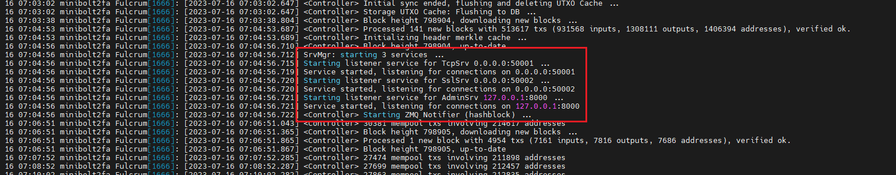

# 2.2 Electrum Server: Fulcrum

[Fulcrum](https://github.com/cculianu/Fulcrum) is a fast & nimble SPV server for Bitcoin Cash, Bitcoin BTC, and Litecoin created by Calin Culianu. It can be used as an alternative to Electrs because of its performance, as we can see in Craig Raw's [comparison](https://www.sparrowwallet.com/docs/server-performance.html) of servers.


## Requirements

* Bitcoin Core
* Little over 130GB of free storage for the database

Fulcrum is a replacement for [Electrs](../bonus/bitcoin/electrs.md), these two services cannot be run at the same time (due to the same standard ports used), remember to stop Electrs doing `sudo systemctl stop electrs`.

## Introduction

#### Bitcoin with hardware wallets

The best way to safely keep your bitcoin (meaning the best combination of security and usability) is to use a hardware wallet (like [BitBox](https://shiftcrypto.ch/bitbox02), [Coldcard](https://coldcard.com/), [Ledger](https://www.ledger.com), or [Trezor](https://trezor.io)) in combination with your own Bitcoin node. This gives you security, privacy and eliminates the need to trust a third party to verify transactions.

Bitcoin Core on the MiniBolt itself is not meant to hold funds.

One possibility to use Bitcoin Core with your Bitcoin wallets is to use an Electrum server as middleware. It imports data from Bitcoin Core and provides it to software wallets supporting the Electrum protocol. Desktop wallets like [Sparrow](https://sparrowwallet.com/), the [BitBoxApp](https://shiftcrypto.ch/app/), [Electrum](https://electrum.org/), or [Specter Desktop](https://specter.solutions/desktop/) that support hardware wallets can then be used with your own sovereign Bitcoin node.

## Preparations

Make sure that you have [reduced the database cache of Bitcoin Core](../index-2/bitcoin-client.md#activate-mempool-and-reduce-dbcache-after-a-full-sync)

### Install dependencies

* With user `admin`, make sure that all necessary software packages are installed

```sh
$ sudo apt install libssl-dev
```

### Configure Firewall

* Configure the firewall to allow incoming requests

```sh
$ sudo ufw allow 50001/tcp comment 'allow Fulcrum TCP from anywhere'
```

```sh
$ sudo ufw allow 50002/tcp comment 'allow Fulcrum SSL from anywhere'
```

### Configure Bitcoin Core

We need to set up settings in the Bitcoin Core configuration file - add new lines if they are not present

* In `bitcoin.conf`, add the following line in the `"# Connections"` section. Save and exit

```sh
$ sudo nano /data/bitcoin/bitcoin.conf
```

```sh
zmqpubhashblock=tcp://127.0.0.1:8433
```

* Restart Bitcoin Core

```sh
$ sudo systemctl restart bitcoind
```

## Installation

### Download and set up Fulcrum

We have our Bitcoin Core configuration file set up and can now move on to the next part of the Fulcrum installation.

* Login as `admin` user and change to a temporary directory which is cleared on reboot

```sh
$ cd /tmp
```

* Set a temporary version environment variable to the installation

```sh
$ VERSION=1.9.6
```

* Download the application, checksums, and signature


```sh
$ wget https://github.com/cculianu/Fulcrum/releases/download/v$VERSION/Fulcrum-$VERSION-x86_64-linux.tar.gz
```



```bash
$ wget https://github.com/cculianu/Fulcrum/releases/download/v$VERSION/Fulcrum-$VERSION-sha256sums.txt.asc
```



```bash
$ wget https://github.com/cculianu/Fulcrum/releases/download/v$VERSION/Fulcrum-$VERSION-sha256sums.txt
```


* Get the public key from the Fulcrum developer


```bash
$ curl https://raw.githubusercontent.com/Electron-Cash/keys-n-hashes/master/pubkeys/calinkey.txt | gpg --import
```


Expected output:

<pre data-overflow="wrap"><code><strong>[...]
</strong><strong>>     % Total    % Received % Xferd  Average Speed   Time    Time     Time  Current
</strong>>                                 Dload  Upload   Total   Spent    Left  Speed
> 100  2328  100  2328    0     0  16043      0 --:--:-- --:--:-- --:--:-- 15945
> gpg: key 21810A542031C02C: "Calin Culianu (NilacTheGrim) &#x3C;calin.culianu@gmail.com>" not changed
> gpg: Total number processed: 1
> gpg:              unchanged: 1
[...]
</code></pre>

* Verify the signature of the text file containing the checksums for the application

```sh
$ gpg --verify Fulcrum-$VERSION-sha256sums.txt.asc
```

Expected output:


```
[...]
> gpg: Good signature from "Calin Culianu (NilacTheGrim) <calin.culianu@gmail.com>" [unknown]
> gpg: WARNING: This key is not certified with a trusted signature!
> gpg: There is no indication that the signature belongs to the owner.
> Primary key fingerprint: D465 135F 97D0 047E 18E9  9DC3 2181 0A54 2031 C02C
[...]
```


* Verify the signed checksum against the actual checksum of your download

```sh
$ sha256sum --check Fulcrum-$VERSION-sha256sums.txt
```

**Example** of expected output:

<pre><code>sha256sum: Fulcrum-1.9.4-arm64-linux.tar.gz: No such file or directory
Fulcrum-1.9.4-arm64-linux.tar.gz: FAILED open or read
sha256sum: Fulcrum-1.9.4-x86_64-linux-ub16.tar.gz: No such file or directory
Fulcrum-1.9.4-x86_64-linux-ub16.tar.gz: FAILED open or read
<strong><a data-footnote-ref href="#user-content-fn-1">Fulcrum-1.9.4-x86_64-linux.tar.gz: OK</a>
</strong>sha256sum: Fulcrum-1.9.4-win64.zip: No such file or directory
Fulcrum-1.9.4-win64.zip: FAILED open or read
sha256sum: WARNING: 3 listed files could not be read
</code></pre>


Search for the "`Fulcrum-$VERSION-x86_64-linux.tar.gz:`` `**`OK`**" phrase


* Extract and install Fulcrum

```sh
$ tar -xvf Fulcrum-$VERSION-x86_64-linux.tar.gz
```


**Ignore the next line output if it appears to you**, this happens because the dev uses macOS with an xattr-capable filesystem:

```
tar: Ignoring unknown extended header keyword 'LIBARCHIVE.xattr.system.posix_acl_access'
tar: Ignoring unknown extended header keyword 'LIBARCHIVE.xattr.com.docker.grpcfuse.ownership'
```



```bash
$ sudo install -m 0755 -o root -g root -t /usr/local/bin Fulcrum-$VERSION-x86_64-linux/Fulcrum Fulcrum-$VERSION-x86_64-linux/FulcrumAdmin
```


* Check the correct installation requesting the version

```sh
$ Fulcrum --version
```

**Example** of expected output:

```
> Fulcrum 1.9.1 (Release 713d2d7)
> compiled: gcc 8.4.0
[...]
```

* **(Optional)** Delete installation files of the `/tmp` folder


```bash
$ sudo rm -r Fulcrum-$VERSION-x86_64-linux && sudo rm Fulcrum-$VERSION-x86_64-linux.tar.gz && sudo rm Fulcrum-$VERSION-sha256sums.txt && sudo rm Fulcrum-$VERSION-sha256sums.txt.asc
```



If you come to update, this is the final step, go back to the [Upgrade section](electrum-server.md#for-the-future-fulcrum-upgrade) to continue


### Data directory

Now that Fulcrum is installed, we need to configure it to run automatically on startup.

* Create the `fulcrum` user, and add it to the "bitcoin" group

```sh
$ sudo adduser --disabled-password --gecos "" fulcrum
```

```sh
$ sudo adduser fulcrum bitcoin
```

* Create the fulcrum data directory and assign the owner to the "fulcrum" user

```sh
$ sudo mkdir -p /data/fulcrum/fulcrum_db
```

```sh
$ sudo chown -R fulcrum:fulcrum /data/fulcrum/
```

* Open a `fulcrum` user session

```bash
$ sudo su - fulcrum
```

* Create a symlink from `/home/fulcrum/.fulcrum` folder to the `/data/fulcrum` folder

```sh
$ ln -s /data/fulcrum /home/fulcrum/.fulcrum
```

* Check symbolic link has been created correctly

```bash
$ ls -la /home/fulcrum
```

Expected output:

<pre><code>total 24
drwxr-x--- 2 fulcrum fulcrum 4096 Jul 15 07:59 .
drwxr-xr-x 6 root    root    4096 Jul 15 07:56 ..
-rw------- 1 fulcrum fulcrum   24 Jul 15 07:59 .bash_history
-rw-r--r-- 1 fulcrum fulcrum  220 Jul 15 07:56 .bash_logout
-rw-r--r-- 1 fulcrum fulcrum 3771 Jul 15 07:56 .bashrc
lrwxrwxrwx 1 fulcrum fulcrum   13 Jul 15 07:59 <a data-footnote-ref href="#user-content-fn-2">.fulcrum -> /data/fulcrum</a>
-rw-r--r-- 1 fulcrum fulcrum  807 Jul 15 07:56 .profile
</code></pre>

* Change to the fulcrum data folder and generate cert and key files for SSL

```sh
$ cd /data/fulcrum
```


```bash
$ openssl req -newkey rsa:2048 -new -nodes -x509 -days 3650 -keyout key.pem -out cert.pem
```



When it asks you to put some info, press `Enter`until the prompt is shown again is not necessary to put any info


* Download the custom Fulcrum banner based on MiniBolt. Create your own if you want [here](https://patorjk.com/software/taag/#p=display\&f=Slant\&t=fulcrum)


```bash
$ wget https://raw.githubusercontent.com/minibolt-guide/minibolt/main/resources/fulcrum-banner.txt
```


## Configuration

MiniBolt uses SSL as default for Fulcrum, but some wallets like BlueWallet do not support SSL over Tor. That's why we use TCP in configurations as well to let the user choose what he needs. You may as well need to use TCP for other reasons.

* Next, we have to set up our Fulcrum configurations. Troubles could be found without optimizations for slow devices. Choose either one for 4GB or 8GB of RAM depending on your hardware

```sh
$ nano /data/fulcrum/fulcrum.conf
```

* Create the config file with the following content. Save and exit

```
# MiniBolt: fulcrum configuration
# /data/fulcrum/fulcrum.conf

## Bitcoin Core settings
bitcoind = 127.0.0.1:8332
rpccookie = /data/bitcoin/.cookie

## Admin Script settings
admin = 8000

## Fulcrum server general settings
datadir = /data/fulcrum/fulcrum_db
cert = /data/fulcrum/cert.pem
key = /data/fulcrum/key.pem
ssl = 0.0.0.0:50002
tcp = 0.0.0.0:50001
peering = false

# Set fast-sync according to your device,
# recommended: fast-sync=1/2 x RAM available e.g: 4GB RAM -> dbcache=2048
fast-sync = 2048

# Banner
banner = /data/fulcrum/fulcrum-banner.txt
```


Remember, if you have a slow-performance device, follow the [slow device section](electrum-server.md#slow-devices-mode) to improve the experience of the first indexation


* Exit the `fulcrum` user session to return to the "admin" user session

```sh
$ exit
```

### Create systemd service

Fulcrum needs to start automatically on system boot.

* As user `admin`, create the Fulcrum systemd unit, and copy/paste the following configuration. Save and exit

```sh
$ sudo nano /etc/systemd/system/fulcrum.service
```

```
# MiniBolt: systemd unit for Fulcrum
# /etc/systemd/system/fulcrum.service

[Unit]
Description=Fulcrum
Wants=bitcoind.service
After=bitcoind.service

StartLimitBurst=2
StartLimitIntervalSec=20

[Service]
ExecStart=/usr/local/bin/Fulcrum /data/fulcrum/fulcrum.conf
ExecStop=/usr/local/bin/FulcrumAdmin -p 8000 stop
KillSignal=SIGINT
User=fulcrum
Type=exec
TimeoutStopSec=300

[Install]
WantedBy=multi-user.target
```

* Enable autoboot **(optional)**

```sh
$ sudo systemctl enable fulcrum
```

* Prepare "fulcrum" monitoring by the systemd journal and check log logging output. You can exit monitoring at any time with `Ctrl-C`

```sh
$ journalctl -f -u fulcrum
```

## Run

To keep an eye on the software movements, [start your SSH program](../index-1/remote-access.md#access-with-secure-shell) (eg. PuTTY) a second time, connect to the MiniBolt node, and log in as "admin". Commands for the **second session** start with the prompt `$2` (which must not be entered)

```sh
$2 sudo systemctl start fulcrum
```

<details>

<summary><strong>Example</strong> of expected output on the first terminal with <code>$ journalctl -f -u fulcrum</code> ⬇️</summary>

```
Jul 28 12:20:13 minibolt Fulcrum[181811]: [2022-07-28 12:20:13.063] simdjson: version 0.6.0
Jul 28 12:20:13 minibolt Fulcrum[181811]: [2022-07-28 12:20:13.063] ssl: OpenSSL 1.1.1n  15 Mar 2022
Jul 28 12:20:13 minibolt Fulcrum[181811]: [2022-07-28 12:20:13.063] zmq: libzmq version: 4.3.3, cppzmq version: 4.7.1
Jul 28 12:20:13 minibolt Fulcrum[181811]: [2022-07-28 12:20:13.064] Fulcrum $VERSION (Release a5a53cf) - Wed Dec 21, 2022 15:35:25.963 UTC - starting up ...
Jul 28 12:20:13 minibolt Fulcrum[181811]: [2022-07-28 12:20:13.064] Max open files: 524288 (increased from default: 1024)
Jul 28 12:20:13 minibolt Fulcrum[181811]: [2022-07-28 12:20:13.065] Loading database ...
Jul 28 12:20:14 minibolt Fulcrum[181811]: [2022-07-28 12:20:14.489] DB memory: 512.00 MiB
Jul 28 12:20:14 minibolt Fulcrum[181811]: [2022-07-28 12:20:14.491] Coin: BTC
Jul 28 12:20:14 minibolt Fulcrum[181811]: [2022-07-28 12:20:14.492] Chain: main
Jul 28 12:20:14 minibolt Fulcrum[181811]: [2022-07-28 12:20:14.494] Verifying headers ...
Jul 28 12:20:19 minibolt Fulcrum[181811]: [2022-07-28 12:20:19.780] Initializing header merkle cache ...
Jul 28 12:20:21 minibolt Fulcrum[181811]: [2022-07-28 12:20:21.643] Checking tx counts ...
[...]
```

</details>


> Fulcrum must first fully index the blockchain and compact its database before you can connect to it with your wallets. This can take up to \~3.5 - 4 days depending on the hardware. Only proceed with the [Desktop Wallet Section](desktop-wallet.md) once Fulcrum is ready

> Fulcrum will now index the whole Bitcoin blockchain so that it can provide all necessary information to wallets. With this, the wallets you use no longer need to connect to any third-party server to communicate with the Bitcoin peer-to-peer network

> DO NOT REBOOT OR STOP THE SERVICE DURING THE DB CREATION PROCESS. YOU MAY CORRUPT THE FILES - in case that happens, start the sync from scratch by deleting and recreating `fulcrum_db` folder.


* When you see logs like this `<Controller> XXXX mempool txs involving XXXX addresses`, which means that Fulcrum is fully indexed

<figure><figcaption></figcaption></figure>

* Ensure the service is working and listening at the default `50002` & `50001` ports

```sh
$2 sudo ss -tulpn | grep LISTEN | grep Fulcrum
```

Expected output:

```
tcp   LISTEN 0      50        0.0.0.0:50001      0.0.0.0:*    users:(("Fulcrum",pid=1821,fd=185))
tcp   LISTEN 0      50        0.0.0.0:50002      0.0.0.0:*    users:(("Fulcrum",pid=1821,fd=204))
tcp   LISTEN 0      50      127.0.0.1:8000       0.0.0.0:*    users:(("Fulcrum",pid=1821,fd=206))
```

## Disable fast-sync parameter after full index

Once Fulcrum is fully indexed, we will disable the fast-sync parameter to avoid the error "`fast-sync: Specified value (4096000000 bytes) is too large to fit in available system memory (limit is: 3903692800 bytes)"` the next time we will start Fulcrum after the full index

* With user admin, edit the `fulcrum.conf` file and comment the fast-sync line parameter

```bash
$ sudo nano /data/fulcrum/fulcrum.conf
```

```
# Set fast-sync according to your device,
# recommended: fast-sync=1/2 x RAM available e.g: 4GB RAM -> dbcache=2048
#fast-sync = 2048
```

* Restart Fulcrum to apply changes

```bash
$ sudo systemctl restart fulcrum
```

## Extras

### Remote access over Tor

To use your Fulcrum server when you're on the go, you can easily create a Tor hidden service. This way, you can connect the BitBoxApp or Electrum wallet also remotely, or even share the connection details with friends and family. Note that the remote device needs to have Tor installed as well.

* Ensure that you are logged in with the user `admin` and add the following lines in the "location hidden services" section, below "`## This section is just for location-hidden services ##`" in the torrc file. Save and exit

```sh
$ sudo nano /etc/tor/torrc
```

* Edit torrc

```
# Hidden Service Fulcrum TCP & SSL
HiddenServiceDir /var/lib/tor/hidden_service_fulcrum_tcp_ssl/
HiddenServiceVersion 3
HiddenServicePoWDefensesEnabled 1
HiddenServicePort 50001 127.0.0.1:50001
HiddenServicePort 50002 127.0.0.1:50002
```

* Reload the Tor configuration and get your connection addresses

```sh
$ sudo systemctl reload tor
```

```sh
$ sudo cat /var/lib/tor/hidden_service_fulcrum_tcp_ssl/hostname
```

**Example** expected output:

```
> abcdefg..............xyz.onion
```

* You should now be able to connect to your Fulcrum server remotely via Tor using your hostname and port `50001` (TCP) or `50002` (SSL)

### Admin Script: FulcrumAdmin

Fulcrum comes with an admin script. The admin service is used for sending special control commands to the server, such as stopping the server. You may send commands to Fulcrum using this script.

* Type the next command to see a list of possible subcommands that you can send to Fulcrum

```sh
$ FulcrumAdmin -h
```

Expected output:

```
usage: FulcrumAdmin [-h] -p port [-j] [-H [host]]
                  {addpeer,ban,banpeer,bitcoind_throttle...
[...]
```

*   Type the next command to get a complete server information

    ```sh
    $ FulcrumAdmin -p 8000 getinfo
    ```


Get more information about this command in the official documentation [section](https://github.com/cculianu/Fulcrum#admin-script-fulcrumadmin)


### Slow devices mode

#### Fulcrum configuration

* As the `admin` user, add these lines at the end of the existing `fulcrum.conf` file. Uncomment the `db_max_open_files` parameter choosing the appropriate one for 4 GB or 8 GB of RAM depending on your hardware

```sh
 $ sudo nano /data/fulcrum/fulcrum.conf
```

```
## Slow device first-time start optimizations
bitcoind_timeout = 600
bitcoind_clients = 1
worker_threads = 1
db_mem = 1024.0

# 4GB RAM
#db_max_open_files = 200
# 8GB RAM
#db_max_open_files = 400
```

#### Install zram-swap

zram-swap is a compressed swap in memory and on disk and is necessary for the proper functioning of Fulcrum during the sync process using compressed swap in memory (increase performance when memory usage is high)

* Access to "admin" home folder, clone the repository of GitHub and install zram-swap

```sh
$ cd /home/admin/
```

```sh
$ git clone https://github.com/foundObjects/zram-swap.git
```

```
$ cd zram-swap && sudo ./install.sh
```

* Add kernel parameters to make better use of zram

```sh
$ sudo nano /etc/sysctl.conf
```

* Here are the lines you’ll want to add **at the end** of your `/etc/sysctl.conf` file to make better use of zram. Save and exit

```
vm.vfs_cache_pressure=500
vm.swappiness=100
vm.dirty_background_ratio=1
vm.dirty_ratio=50
```

* Then apply the changes with

```sh
$ sudo sysctl --system
```

* Restart the service

```sh
$ sudo systemctl restart zram-swap
```

* Make sure zram was correctly installed and zram prioritized (+ Priority)

```sh
$ sudo cat /proc/swaps
```

**Example** of expected output:

```
Filename               Type            Size            Used            Priority
/swap.img              file            4194300         0               -2
/dev/zram0             partition       10055452        368896          15
```

### Backup the database

If the database gets corrupted and you don't have a backup, you will have to resync it from scratch, which takes several days. This is why we recommend making backups of the database once in a while, on an external drive. Like this, if something happens, you'll only have to resync since the date of your latest backup. Before doing the backup, remember to stop Fulcrum by doing `"sudo systemctl stop fulcrum"`.

## Upgrade

Follow the complete [Download and set up Fulcrum](electrum-server.md#download-and-set-up-fulcrum) section replacing the environment variable `"VERSION=x.xx"` value for the latest if it has not been already changed in this guide.

* Restart the service to apply the changes

```sh
$ sudo systemctl restart fulcrum
```

* Check logs and pay attention to the next log if that attends to the new version installed

```sh
$ journalctl -f -u fulcrum
```

**Example** of expected output:


```
Jul 28 12:20:13 minibolt Fulcrum[181811]: [2022-07-28 12:20:13.064] Fulcrum 1.9.1 (Release a5a53cf) - Wed Dec 21, 2022 15:35:25.963 UTC - starting up ...
[...]
```


## Uninstall

### Uninstall service & user

* Ensure you are logged in with the user `admin`, stop, disable, and delete the service

```sh
$ sudo systemctl stop fulcrum
```

```sh
$ sudo systemctl disable fulcrum
```

```sh
$ sudo rm /etc/systemd/system/fulcrum.service
```

* Ensure you are logged in with the user `admin`. Delete the fulcrum user.\
  Don't worry about `userdel: fulcrum mail spool (/var/mail/nym) not found` output, the uninstall has been successful

```sh
$ sudo userdel -rf fulcrum
```

* Delete fulcrum directory

```sh
$ sudo rm -rf /data/fulcrum/
```

### Uninstall Tor hidden service

* Ensure that you are logged in with the user `admin` and delete or comment the following lines in the "location hidden services" section, below "`## This section is just for location-hidden services ##`" in the torrc file. Save and exit

```sh
$ sudo nano /etc/tor/torrc
```

```
# Hidden Service Fulcrum TCP & SSL
#HiddenServiceDir /var/lib/tor/hidden_service_fulcrum_ssl/
#HiddenServiceVersion 3
#HiddenServicePoWDefensesEnabled 1
#HiddenServicePort 50001 127.0.0.1:50001
#HiddenServicePort 50002 127.0.0.1:50002
```

* Reload the torrc config

```sh
$ sudo systemctl reload tor
```

### Uninstall FW configuration

* Ensure you are logged in with the user `admin`, display the UFW firewall rules, and note the numbers of the rules for Fulcrum (e.g., X and Y below)

```sh
$ sudo ufw status numbered
```

Expected output:

```
> [Y] 50001       ALLOW IN    Anywhere          # allow Fulcrum TCP from anywhere
> [X] 50002       ALLOW IN    Anywhere          # allow Fulcrum SSL from anywhere
```

* Delete the rule with the correct number and confirm with "`yes`"

```sh
$ sudo ufw delete X
```

### Uninstall the Zram

* Ensure you are logged in with the user `admin`, navigate to the zram-swap folder, and uninstall

```sh
$ cd /home/admin/zram-swap
```

```sh
$ sudo ./install.sh --uninstall
```

```sh
$ sudo rm /etc/default/zram-swap
```

```sh
$ sudo rm -rf /home/admin/zram-swap
```

* Make sure that the change was done

```sh
$ sudo cat /proc/swaps
```

Expected output:

```
Filename            Type                Size           Used    Priority
/var/swap           file                 102396         0       -2
```

[^1]: That's it!

[^2]: Symbolic link
