---
layout:
  title:
    visible: true
  description:
    visible: false
  tableOfContents:
    visible: true
  outline:
    visible: true
  pagination:
    visible: true
---

# Nostr relay

A [nostr relay written in Rust](https://github.com/scsibug/nostr-rs-relay) with support for the entire relay protocol and data persistence using SQLite.

<figure><figcaption></figcaption></figure>

## What is Nostr?

Nostr is a straightforward and open protocol for global, decentralized, and censorship-resistant social media. It offers numerous advantages for users and is completely free, requiring no ID or third-party verification to begin connecting with like-minded individuals and expanding your community. While nostr is sometimes confused as just another social media platform, it goes beyond that. Explore the resources provided here to discover its significant potential.

This protocol is based on relays. Relays are servers that can be operated by anyone. By opening a persistent connection with the server, clients (or apps) can push and pull events in real-time.

[Relays](https://usenostr.org/#relays) are the central element of the nostr protocol, responsible for storing events received from clients.

Crucially, relays do not communicate with each other. Only the relays you're connected to will receive and store your events. This is a key feature of nostr, emphasizing the lack of communication between relays. Therefore, you should connect to as many relays as you wish to share your data with.

Clients should always provide users the flexibility to connect to multiple relays. Users can also decide whether they want to read, write, or do both with the relays they're connected to. This means I can choose to connect to a specific relay to access content without necessarily sharing my own events there, or vice versa.

<figure>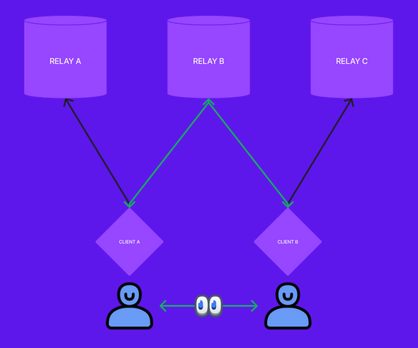<figcaption></figcaption></figure>

You can obtain more info about nostr on these additional resources:

* [austritch.net](https://www.austrich.net/nostr/)
* [awesome-nostr](https://www.nostr.net/)
* [use-nostr](https://usenostr.org/)
* [Nostr.how](https://nostr.how/en/what-is-nostr)
* [gzuuus slideshow](https://www.canva.com/design/DAFcs32eM7k/1twoK\_IqInXQm5txlZBLCg/view)
* [nostr.com](https://nostr.com/)

## Requirements

* [Cloudflare tunnel](../system/cloudflare-tunnel.md)
* Others
  * [Rustup + Cargo](../system/rustup-+-cargo.md)

## Preparations

### Install dependencies

* With user `admin`, make sure that all necessary software packages are installed (pending to concrete)


```bash
$ sudo apt install build-essential cmake protobuf-compiler pkg-config libssl-dev build-essential sqlite3 libsqlite3-dev
```


* Check if you already have Rustup installed

```bash
$ rustc --version
```

**Example** of expected output:

```
> rustc 1.71.0 (8ede3aae2 2023-07-12)
```

* Also Cargo

```bash
$ cargo -V
```

**Example** of expected output:

```
> cargo 1.71.0 (cfd3bbd8f 2023-06-08)
```


If you obtain "**command not found**" outputs, you need to follow the [Rustup + Cargo bonus section](../system/rustup-+-cargo.md) to install it and then come back to continue with the guide


## Installation

* With user `admin`, go to the temporary folder

```bash
$ cd /tmp
```

* Clone the source code directly from the GitHub repository, and then build a release version of the relay

```bash
$ git clone https://github.com/scsibug/nostr-rs-relay.git
```

* Go to the `nostr-rs-relay` recently created

```bash
$ cd nostr-rs-relay
```

* Build a release version of the relay

```bash
$ cargo build --release
```

<details>

<summary>Example of expected output ⬇️</summary>

```
    Updating crates.io index
  Downloaded pathdiff v0.2.1
  Downloaded num_cpus v1.16.0
  Downloaded indexmap v2.0.0
  Downloaded parking_lot_core v0.9.8
  Downloaded want v0.3.1
  Downloaded pest v2.7.2
  Downloaded percent-encoding v2.3.0
  Downloaded parse_duration v2.1.1
  Downloaded prost-build v0.11.9
  Downloaded clap_lex v0.5.0
  Downloaded autocfg v0.1.8
  Downloaded fastrand v2.0.0
  Downloaded is-terminal v0.4.9
  Downloaded json5 v0.4.1
  Downloaded num v0.2.1
  Downloaded paste v1.0.14
  Downloaded pin-project-internal v1.1.3
  Downloaded num-iter v0.1.43
  Downloaded fallible-streaming-iterator v0.1.9
  Downloaded md-5 v0.10.5
  Downloaded linked-hash-map v0.5.6
  Downloaded number_prefix v0.4.0
  Downloaded itoa v1.0.9
  Downloaded openssl-sys v0.9.91
  Downloaded async-lock v2.7.0
  Downloaded pest_derive v2.7.2
  Downloaded async-channel v1.9.0
  Downloaded tokio-io-timeout v1.2.0
  Downloaded async-global-executor v2.3.1
  Downloaded sync_wrapper v0.1.2
  Downloaded matchers v0.1.0
  Downloaded no-std-compat v0.4.1
  Downloaded block-padding v0.3.3
  Downloaded pest_generator v2.7.2
  Downloaded atomic-waker v1.1.1
  Downloaded pin-project-lite v0.2.12
  [...]
```

</details>


If the prompt shows you this error:

`error: rustup could not choose a version of cargo to run, because one wasn't specified explicitly, and no default is configured. help: run 'rustup default stable' to download the latest stable release of Rust and set it as your default toolchain.`

You need to type `"`**`$ rustup default stable`**`"` and wait for the process to finish, then try again the command before


* Install it

<pre class="language-bash" data-overflow="wrap"><code class="lang-bash"><strong>$ sudo install -m 0755 -o root -g root -t /usr/local/bin /tmp/nostr-rs-relay/target/release/nostr-rs-relay
</strong></code></pre>

* Check the correct installation

```bash
$ nostr-rs-relay -V
```

**Example** of expected output:

```
> nostr-rs-relay 0.8.9
```


If you come to update this is the final step, continue with the indications of the [Update section](nostr-relay.md#for-the-future-nostr-relay-upgrade)


### Create the nostr user

* Create the user `nostr` with this command

```bash
$ sudo adduser --gecos "" --disabled-password nostr
```

Expected output:

```
Adding user `nostr' ...
Adding new group `nostr' (1007) ...
Adding new user `nostr' (1007) with group `nostr' ...
Creating home directory `/home/nostr' ...
Copying files from `/etc/skel' ...
```

* Create the `rs-relay` and `db` folder

```bash
$ mkdir -p /data/nostr/rs-relay/db
```

* Change to the home `nostr` user folder

```bash
$ sudo su - nostr
```

* **(Optional)** If you want to use the MiniBolt [`favicon.ico`](https://raw.githubusercontent.com/minibolt-guide/minibolt/main/resources/favicon.ico) file, download it by entering this command, if not, download your own or skip this step to not provide any


```bash
$ wget https://raw.githubusercontent.com/minibolt-guide/minibolt/main/resources/favicon.ico
```


* Exit to the `admin` user

```bash
$ exit
```

## Configuration

* With user `admin`, copy-paste the configuration file

```bash
$ sudo cp /tmp/nostr-rs-relay/config.toml /data/nostr/rs-relay/
```

* Assign as the owner to the `nostr` user

```bash
$ sudo chown -R nostr:nostr /data/nostr
```

* Return to the home folder

```bash
$ cd
```

* Delete the `nostr-rs-relay` folder to be ready for the next update

```bash
$ sudo rm -r /tmp/nostr-rs-relay
```

* Edit the config file, uncomment, and replace the needed information on the next parameters. Save and exit

```bash
$ sudo nano /data/nostr/rs-relay/config.toml
```

> > **Customize this with your own info (\*):**
> >
> > **(\*)** click on parameter to get an example/explanation)
> >
> > > relay\_url = "[`<yourelayurl>`](#user-content-fn-1)[^1]"
> >
> > > name = "`<nametotherelay>`"
> >
> > > description = "[`<descriptionrelay>`](#user-content-fn-2)[^2]"
> >
> > > pubkey = "`<yournostrhexpubkey>`"
> >
> > > contact = "[`<yourcontact>`](#user-content-fn-3)[^3]"
> >
> > > relay\_icon = "`<yourelayiconURL>`"


If you don't have pubkey generated yet, you can follow the [Create your nostr key pair](nostr-relay.md#create-your-nostr-key-pair) section and then continue with this.

You can use [this tool](https://nostrdebug.com/converter/) to convert your "npub" pubkey to hexadecimal format


> > **Required same as next (\*):**
> >
> > **(\*)** click on the parameter to get action to do (\<Edit> or \<Uncomment>)
> >
> > [favicon = "favicon.ico"](#user-content-fn-4)[^4]
>
> > data\_directory = "/data/nostr/rs-relay/db"
>
> > [address = "127.0.0.1"](#user-content-fn-5)[^5]
>
> > port = 8880
>
> > [remote\_ip\_header = "cf-connecting-ip"](#user-content-fn-6)[^6]


If you want, use the same [`favicon.ico`](https://raw.githubusercontent.com/minibolt-guide/minibolt/nostr-relay-PR/resources/favicon.ico) file downloaded before (the relay's icon of MiniBolt) and the value `relay_icon` parameter (URL), or replace it with your own, downloading it instead


### **Create systemd service**

The system needs to run the nostr relay daemon automatically in the background, even when nobody is logged in. We use `systemd`, a daemon that controls the startup process using configuration files.

* As user `admin`, create the service file

<pre class="language-bash"><code class="lang-bash"><strong>$ sudo nano /etc/systemd/system/nostr-relay.service
</strong></code></pre>

* Paste the following configuration. Save and exit

```
# MiniBolt: systemd unit for nostr relay
# /etc/systemd/system/nostr-relay.service

[Unit]
Description=Nostr relay
Wants=network-online.target
After=network-online.target

[Service]
WorkingDirectory=/home/nostr
ExecStart=/usr/local/bin/nostr-rs-relay -c /data/nostr/rs-relay/config.toml
Environment=RUST_LOG=info,nostr_rs_relay=info

User=nostr
Group=nostr

# Process management
####################
Type=simple
TimeoutStopSec=10
Restart=on-failure
RestartSec=5

[Install]
WantedBy=multi-user.target
```

* Enable autoboot **(optional)**

```bash
$ sudo systemctl enable nostr-relay
```

* Prepare “nostr-relay” monitoring by the systemd journal and check the logging output. You can exit monitoring at any time with Ctrl-C

```bash
$ journalctl -fu nostr-relay
```

## Run

To keep an eye on the software movements, [start your SSH program](../../index-1/remote-access.md#access-with-secure-shell) (eg. PuTTY) a second time, connect to the MiniBolt node, and log in as `admin`. Commands for the **second session** start with the prompt `$2` (which must not be entered).

* Start the nostr relay

```bash
$2 sudo systemctl start nostr-relay
```

<details>

<summary><strong>Example</strong> of expected output on the first terminal with <code>$ journalctl -f -u nostr-relay</code> ⬇️</summary>

```
Jul 31 19:05:59 minibolt nostr-rs-relay[35593]: 2023-07-31T19:05:59.232103Z  INFO nostr_rs_relay: Starting up from main
Jul 31 19:05:59 minibolt nostr-rs-relay[35593]: 2023-07-31T19:05:59.233677Z  INFO nostr_rs_relay::server: listening on: 127.0.0.1:8008
Jul 31 19:05:59 minibolt nostr-rs-relay[35593]: 2023-07-31T19:05:59.241608Z  INFO nostr_rs_relay::repo::sqlite: Built a connection pool "writer" (min=0, max=2)
Jul 31 19:05:59 minibolt nostr-rs-relay[35593]: 2023-07-31T19:05:59.242695Z  INFO nostr_rs_relay::repo::sqlite: Built a connection pool "maintenance" (min=0, max=2)
Jul 31 19:05:59 minibolt nostr-rs-relay[35593]: 2023-07-31T19:05:59.244825Z  INFO nostr_rs_relay::repo::sqlite: Built a connection pool "reader" (min=4, max=8)
Jul 31 19:05:59 minibolt nostr-rs-relay[35593]: 2023-07-31T19:05:59.245895Z  INFO nostr_rs_relay::repo::sqlite_migration: DB version = 18
Jul 31 19:05:59 minibolt nostr-rs-relay[35593]: 2023-07-31T19:05:59.246417Z  INFO nostr_rs_relay::server: db writer created
Jul 31 19:05:59 minibolt nostr-rs-relay[35593]: 2023-07-31T19:05:59.246880Z  INFO nostr_rs_relay::server: control message listener started
Jul 31 19:06:59 minibolt nostr-rs-relay[35593]: 2023-07-31T19:06:59.250853Z  INFO nostr_rs_relay::repo::sqlite: checkpoint ran in 137.674µs (result: Ok, WAL size: 0)
Jul 31 19:07:59 minibolt nostr-rs-relay[35593]: 2023-07-31T19:07:59.255370Z  INFO nostr_rs_relay::repo::sqlite: checkpoint ran in 217.764µs (result: Ok, WAL size: 0)
Jul 31 19:08:59 minibolt nostr-rs-relay[35593]: 2023-07-31T19:08:59.261774Z  INFO nostr_rs_relay::repo::sqlite: checkpoint ran in 131.048µs (result: Ok, WAL size: 0)
Jul 31 19:09:59 minibolt nostr-rs-relay[35593]: 2023-07-31T19:09:59.265335Z  INFO nostr_rs_relay::repo::sqlite: checkpoint ran in 176.033µs (result: Ok, WAL size: 0)
Jul 31 19:10:59 minibolt nostr-rs-relay[35593]: 2023-07-31T19:10:59.270412Z  INFO nostr_rs_relay::repo::sqlite: checkpoint ran in 172.006µs (result: Ok, WAL size: 0)
Jul 31 19:11:59 minibolt nostr-rs-relay[35593]: 2023-07-31T19:11:59.275842Z  INFO nostr_rs_relay::repo::sqlite: checkpoint ran in 131.853µs (result: Ok, WAL size: 0)
```

</details>

* Ensure the service is working and listening at the default `8880` port

```bash
$ sudo ss -tulpn | grep LISTEN | grep nostr-rs-relay
```

Expected output:

```
> tcp   LISTEN 0   128   127.0.0.1:8880   0.0.0.0:*  users:(("nostr-rs-relay",pid=138820,fd=24))
```

### Cloudflare tunnel

Follow the [Cloudflare Tunnel bonus guide](nostr-relay.md#cloudflare-tunnel), when you arrive at the [Configuration file section](../system/cloudflare-tunnel.md#create-a-configuration-file), add the next `# Nostr relay` lines to ingress the related ingress rule

```bash
$ nano /home/admin/.cloudflared/config.yml
```

<pre><code># MiniBolt: cloudflared configuration
# /home/admin/.cloudflared/config.yml

tunnel: &#x3C;UUID>
credentials-file: /home/admin/.cloudflared/&#x3C;UUID>.json

ingress:

# Nostr relay
  - hostname: relay.<a data-footnote-ref href="#user-content-fn-7">&#x3C;domain.com></a>
    service: ws://localhost:8880

  - service: http_status:404
</code></pre>

* Restart the Cloudflared service

```bash
$ sudo systemctl restart cloudflared
```

* Check the Cloudflared logs to ensure all is still OK

```bash
$ journalctl -fu cloudflared
```

### Check relay connection

3 different methods:

1. Go to the [nostr.watch](https://nostr.watch) website to check and test the relay connection

Access to the URL, replacing `<relay.domain.com>` with your Nostr relay URL: `https://nostr.watch/relay/relay.domain.com,` example: [https://nostr.watch/relay/relay.damus.io](https://nostr.watch/relay/relay.damus.io)

Expected output:

<figure>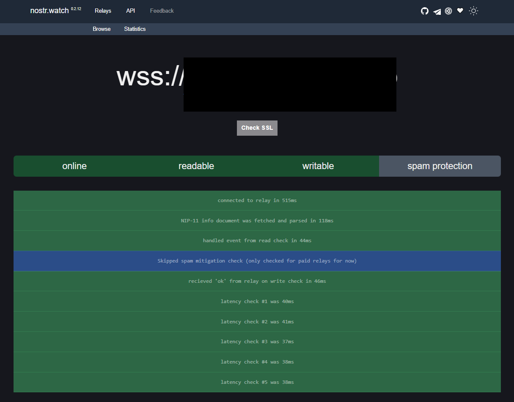<figcaption></figcaption></figure>

2. Go to the [websocketking.com](https://websocketking.com/) website, type in the WebSocket URL box your Nostr relay URL e.g. `wss://relay.domain.com`, and click on the **\[Connect]** button

**Example** of expected output:

<figure>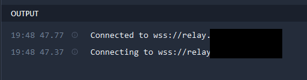<figcaption></figcaption></figure>

3. Go to the [https://nostrdebug.com/relay](https://nostrdebug.com/relay) website, type in the box your Nostr relay URL e.g. `wss://relay.domain.com`, and click on the **\[Connect]** button. You should see the status "✅ Connected" on the history

<figure>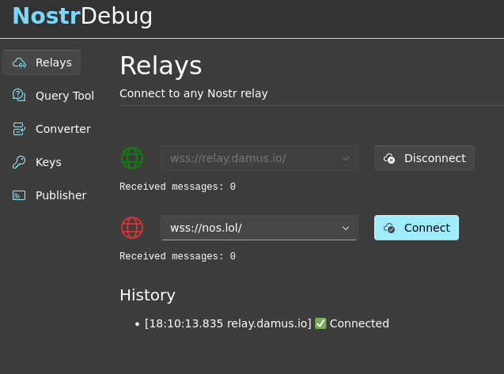<figcaption></figcaption></figure>

## Extras (optional)

### Create your nostr key pair

* Download and install the Alby Browser extension:
  * For Firefox-based browser:
    * [Mozilla Firefox](https://addons.mozilla.org/en-US/firefox/addon/alby/)
    * [Librewolf](https://addons.mozilla.org/en-US/firefox/addon/alby/)
    * [Tor browser](https://addons.mozilla.org/en-US/firefox/addon/alby/) <-- Follow [this guide](https://guides.getalby.com/alby-guides/alby-browser-extension/faqs/can-i-use-alby-with-the-tor-browser) to enable the Alby extension using the Tor browser
  * For Chromium based-browser:
    * [Chrome](https://chrome.google.com/webstore/detail/alby-bitcoin-lightning-wa/iokeahhehimjnekafflcihljlcjccdbe)
    * [Brave](https://chrome.google.com/webstore/detail/alby-bitcoin-lightning-wa/iokeahhehimjnekafflcihljlcjccdbe)
* After installation, the browser will redirect automatically you to choose the password to unlock Alby. Click on the \[**Next]** button

<figure>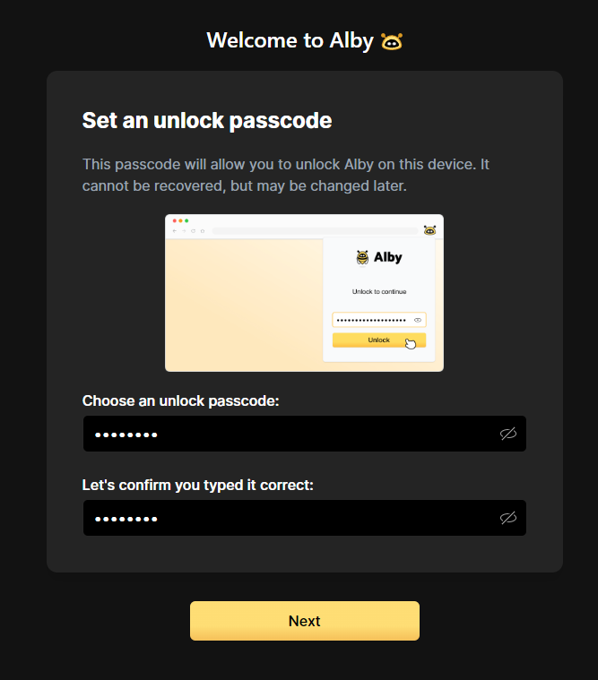<figcaption></figcaption></figure>


Select a strong password for the Alby extension (this password is for encrypting your future Nostr private key and possible funds of the integrated LN wallet)


* Select **\[Connect with Alby]**

<figure>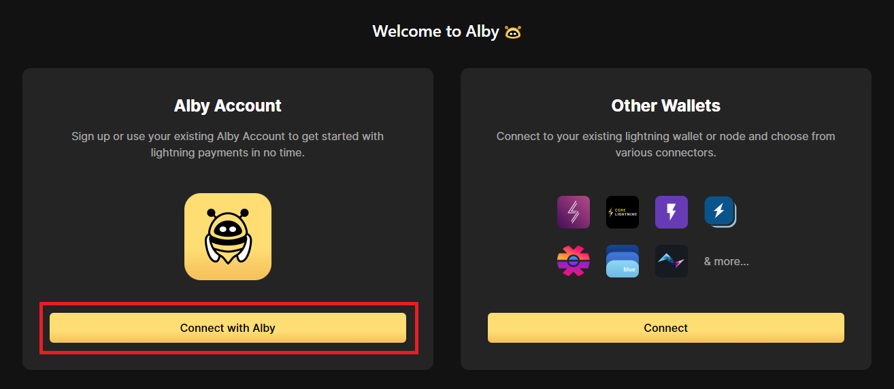<figcaption></figcaption></figure>

* **Login** with your **existing account** or **create a new one**

<figure>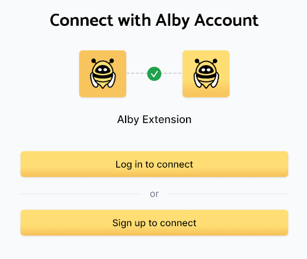<figcaption></figcaption></figure>

* If you selected to **create a new one**, you need to provide a valid email

<figure><figcaption></figcaption></figure>

* If you selected to **log in**, you need to provide the **email and password** or select a **one-time login code method** that you chose

<figure>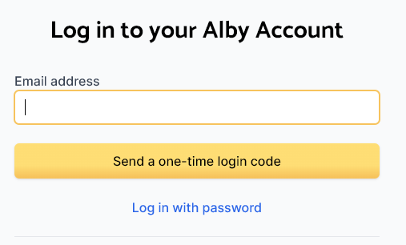<figcaption></figcaption></figure>

* Click on **\[Start buzzin' with Alby]**. Pin the Alby extension to the browser toolbar, if you want

<figure>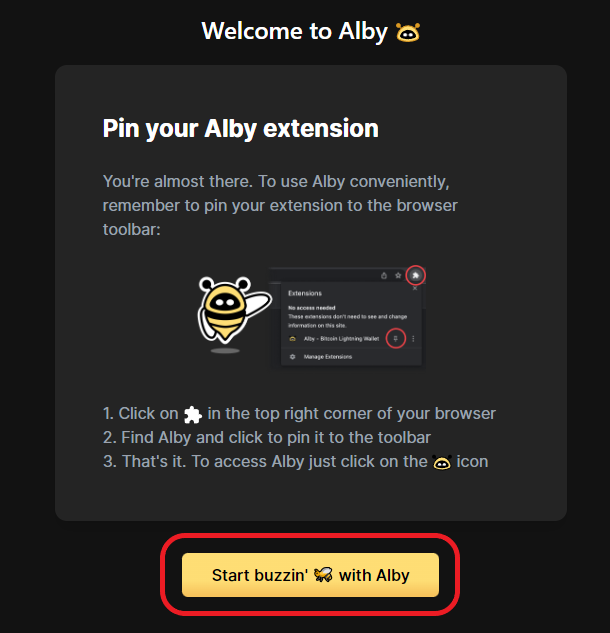<figcaption></figcaption></figure>

* On the **Alby dashboard**, select the **\[Nostr section]**

<figure>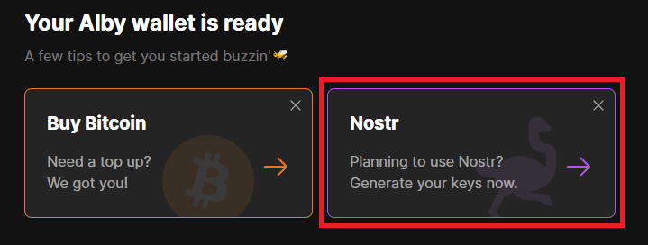<figcaption></figcaption></figure>

* Select to create a **new one nostr key pairs** or **import an existing one** if you have

<figure><figcaption></figcaption></figure>

* If you selected to **create a new one**, remember backup the seed shown on the screen, check the verification box, and click on the **\[Save Master Key]** box

<figure>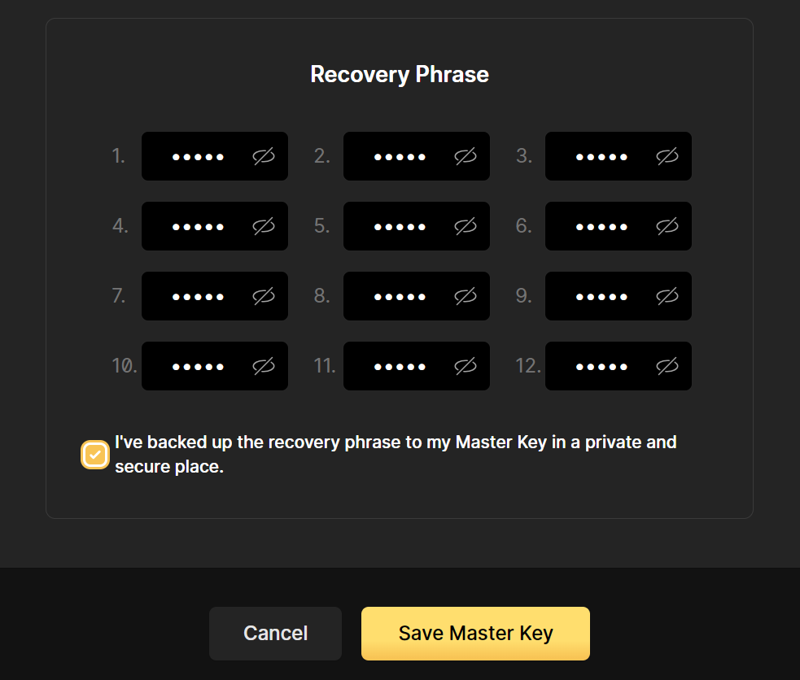<figcaption></figcaption></figure>

<figure>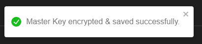<figcaption></figcaption></figure>


You will see the nostr public & private keys in the property section:


<figure>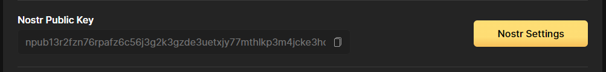<figcaption></figcaption></figure>


Click on the **\[Nostr Settings]** box to **obtain your private key and backup on your password manager app**, you will need it for mobile clients (e.g. Amethyst) where you will need to enter manually. Example:


<figure><figcaption></figcaption></figure>

* If you selected **Import a Nostr account,** you can import using the **Nostr private key** or **Recovery phrase**

<figure><figcaption></figcaption></figure>

* If you selected the Nostr private key, fill in the "**Nostr Private key**" box with your private key, it will derivate you the "**Nostr Public Key"**, check if correct


If you see this banner when you enter on "**Nostr Settings**" section, this means that you should backup carefully the private key, because the existing seeds that you have are not compatible with Alby only the private key


<figure>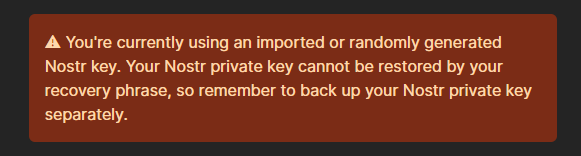<figcaption></figcaption></figure>

* If you selected the **Recovery phrase**, fill in the 12-24 words and click on the \[**Import Master Key]** box

<figure><figcaption></figcaption></figure>


You will see the **Nostr Public key** in the property section, check if correct:


<figure><figcaption></figcaption></figure>


Click on the **\[Nostr Settings]** box to obtain your private key if you don't have yet:


<figure><figcaption></figcaption></figure>


Now, you can use Alby to log in to compatible web clients using NIP-07 \[**Login from extension]**



If you prefer to generate your key pair, you can mine them using the [Rana tool](https://github.com/grunch/rana) and the Minibolt node.

**Be careful when doing this**, as it will use all the available resources of the machine and could render other important applications you are running unusable. Gracefully shutdown them before starting this process


### Broadcast the past events to your new relay (optional)

If you want all your past events to be accessible through your new relay, you can back them up by following these instructions:

* Go to [metadata.nostr.com](https://metadata.nostr.com) website, log in **\[Load My Profile]**, and click on **\[Relays]**
*   Add your new Nostr relay **`[wss://relay.domain.com]`** address to the list of preferred relays in your profile (in the empty box below), select the **read+write** option, and click the **\[Update]** button.

    You can take the opportunity to add more preferred relays to your profile to also push events to them, selected from this [list](https://nostr.watch/relays/find), or use [Nosy](https://nosy.tigerville.no/) to find the top relays of those who follow you or you follow and try to connect to them and don't forget any events of your contact network
* Go to [nostryfied.amethyst.social](https://nostryfied.amethyst.social) webpage and log in **\[Get from extension] (Alby)**, or manually enter the \[npub...] of your Nostr profile
* Click the **\[Backup & Broadcast]** button...

<figure>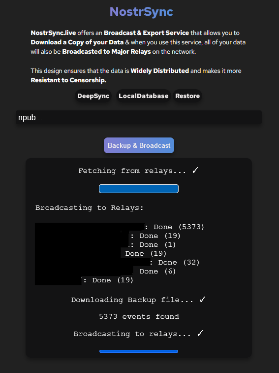<figcaption></figcaption></figure>


Please **wait patiently** until all processes are finished. This might take some time, depending on the number of events you've published on Nostr with that pubkey meaning the interactions you've had on Nostr.

Optionally, you can also save a copy of all your events locally as you'll have the download option.


### Nostr clients



Coracle is a web client for the Nostr protocol focused on pushing the boundaries of what's unique about Nostr, including relay selection and management, web-of-trust based moderation and content recommendations, and privacy protection.

[Web](https://coracle.social/) | [GitHub](https://github.com/coracle-social/coracle)



A nostr UI built with React aiming for speed and efficiency.

[Web](https://snort.social) | [Git](https://git.v0l.io/Kieran/snort)



Nostr live streaming

[Web](https://zap.stream/) | [GitHub](https://github.com/v0l/zap.stream)



Nostr public key mining tool

[GitHub](https://github.com/grunch/rana)



A free URL shortener service enabled by the NOSTR protocol, that is fast and fuss-free, stripped of all bells and whistles, no gimmicks—it just works!

[Web](https://w3.do/) | [GitHub](https://github.com/jinglescode/nostr-url-shortener)





A Nostr-based application to create, manage and discover link lists, show notes and other stuff.

[Web](https://nostree.me/) | [GitHub](https://github.com/gzuuus/linktr-nostr)



Discover and share curated insights by people you trust.

Highlight, share, discover, comment and earn on any text via the nostr network. Books, articles, tweets, anything!

[Web](https://highlighter.com)



InMyTown uses the NOSTR protocol to allow users to create meetup communities and events.

[Web](https://www.inmytown.social) | [GitHub](https://github.com/BrightonBTC/inmytown.social)



Pinstr is a decentralized, free, and open-source social network built on top of the Nostr Protocol for curating and sharing interests with the world.

[Web](https://pinstr.app) | [GitHub](https://github.com/sepehr-safari/pinstr)



Nostr Nests is an audio space for chatting, brainstorming, debating, jamming, micro-conferences and more.

[Web](https://nostrnests.com) | [Git](https://gitlab.com/jam-systems/jam)





Pleb.to does NOSTR things... documents, links, graphs, maps, and more... Pleb.to is a portal to your decentralized data.

[Web](https://pleb.to)



"My half-baked personal nostr client"

[Web](https://nostrudel.ninja) | [GitHub](https://github.com/hzrd149/nostrudel)



Habla allows you to read, write, curate and monetize long form content over Nostr, a censorship-resistant protocol for social media that uses long form nostr content.

[Web](https://habla.news) | [GitHub](https://github.com/verbiricha/habla.news)



Yet Another Nostr Application

[Web](https://yana.do/) | [GitHub](https://github.com/frnandu/yana)



Nostr client for Android

Amethyst brings the best social network to your Android phone.

[GitHub](https://github.com/vitorpamplona/amethyst)





A free, open source, and decentralized password manager, powered by NOSTR

[Chrome-based extension](https://chrome.google.com/webstore/detail/vault/namadahddjnkmjgdnncdlhioopmjiflm) | [GitHub](nostr-relay.md#first-https-github.com-jinglescode-nostr-password-manager)



njump is a HTTP Nostr gateway that allows you to browse profiles, notes and relays; it is an easy way to preview a resource and then open it with your preferred client.

[Web](https://njump.me/) | [GitHub](https://github.com/fiatjaf/njump)



Tool for migrating your entire past Twitter activity to Nostr.

[Web](https://exit.pub/)



Find the top relays of those who follow you or you follow

[Web](https://nosy.tigerville.no/)



## Upgrade

* With user `admin`, stop `nostr-rs-relay` service

```bash
$ sudo systemctl stop nostr-relay
```

* Follow the complete [Installation](nostr-relay.md#installation) section
* Replace the `config.toml` file with the new one of the new version **(if needed)**


**This step is only necessary if you see changes on the config file template from your current version until the current release (not common)**, you can display this on this [history link](https://github.com/scsibug/nostr-rs-relay/commits/master/config.toml). If no changes, jump directly to the next **"Start `nostr-rs-relay` service again" ->**`$ sudo systemctl start nostr-relay`


* Backup the `config.toml` file to keep a copy of your old configuration

```bash
$ sudo cp /data/nostr/rs-relay/config.toml /data/nostr/rs-relay/config.toml.backup
```

* Assign the owner of the backup file to the `nostr` user

```bash
$ sudo chown nostr:nostr /data/nostr/rs-relay/config.toml.backup
```

* Replace the new `config.toml` file of the new release

```bash
$ sudo cp /tmp/nostr-rs-relay/config.toml /data/nostr/rs-relay/
```

* Edit the config file and replace it with the same old information as the file you had. Save and exit

```bash
$ sudo nano /data/nostr/rs-relay/config.toml
```

* Start `nostr-rs-relay` service again

```bash
$ sudo systemctl start nostr-relay
```

* Delete the `nostr-rs-relay` folder to be ready for the next update

```bash
$ sudo rm -r /tmp/nostr-rs-relay
```

## Uninstall

### Uninstall service & user

* Ensure you are logged in with the user `admin`, stop `nostr-relay` service

```bash
$ sudo systemctl stop nostr-relay
```

* Delete `nostr-relay` service

```bash
$ sudo rm /etc/systemd/system/nostr-relay.service
```

* Delete the nostr user. Don't worry about `userdel: nostr mail spool (/var/mail/nym) not found` output, the uninstall has been successful

```bash
$ sudo userdel -rf nostr
```

Expected output:

```
> userdel: nostr mail spool (/var/mail/nostr) not found
```

* Delete the nostr relay data folder

```bash
$ sudo rm -r /data/nostr/relay
```

### Uninstall the nostr relay of the Cloudflare tunnel

* Staying with user `admin`, edit `config.yml`

```bash
$ nano /home/admin/.cloudflared/config.yml
```

* Comment or delete the nostr relay associated ingress rule. Save and exit

```
# MiniBolt: cloudflared configuration
# /home/admin/.cloudflared/config.yml

tunnel: <UUID>
credentials-file: /home/admin/.cloudflared/<UUID>.json

ingress:

# Nostr relay
#  - hostname: relay.<domain.com>
#    service: ws://localhost:8880

  - service: http_status:404
```

* Restart the Cloudflare tunnel to apply the changes

```bash
$ sudo systemctl restart cloudflared
```

### Uninstall binaries

* Staying with user `admin,` delete the nostr-rs-relay binary of the system

```bash
$ sudo rm /usr/local/bin/nostr-rs-relay
```

## Port reference

| Port | Protocol |      Use     |
| :--: | :------: | :----------: |
| 8880 |    TCP   | Default port |

[^1]: **Example:** `"wss://relay.bitcoin.org/"`

[^2]: **Example:** `"The official nostr relay of the Bitcoin community"`

[^3]: **Example:** `"hello@bitcoin.org"`

[^4]: \<Uncomment>

[^5]: \<Edit> to `127.0.0.1`

[^6]: \<Uncomment>

[^7]: Here your personal domain
