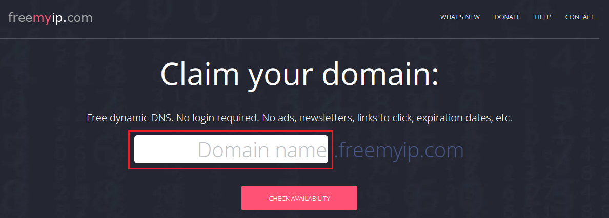
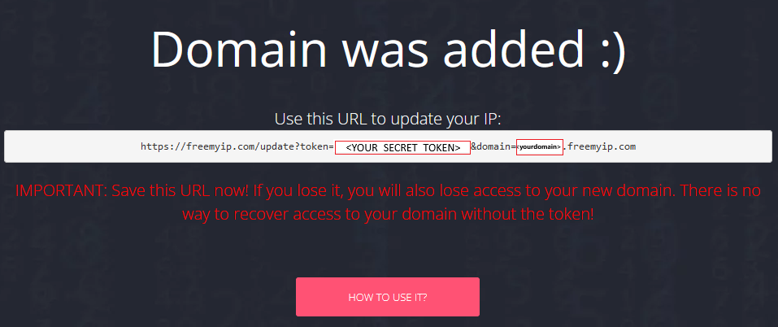
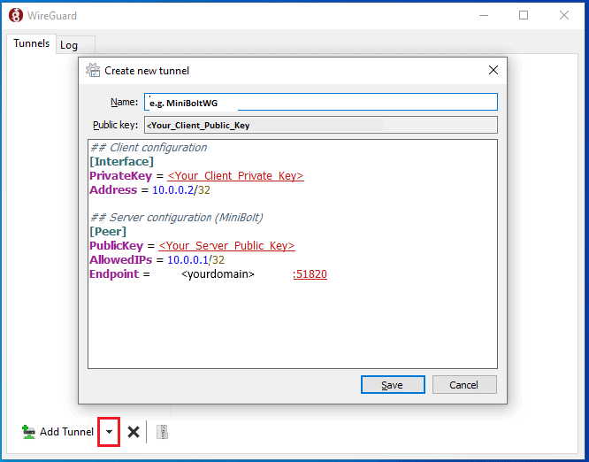

# WireGuard VPN

The following guide was derived from contributions by [Pantamis](https://github.com/Pantamis)

[WireGuard](https://www.wireguard.com) is a VPN you can set up to access your MiniBolt from the outside. It makes it easier to run services on your node without exposing its ports to the public Internet. It has support on all major computer OS; and apps for Android and iOS. The only requirement is to forward a UDP port from your home router to the MiniBolt node.


Difficulty: Hard



## Acknowledgments

## Why use WireGuard and trade-off

A VPN is an encrypted tunnel between two computers over the internet. In our case, MiniBolt will play the role of the server, and you will be able to access your home network remotely with configured client devices. There are several trade-offs to consider when using a VPN versus Tor.

**Advantages:**

* The connection with the VPN is a lot faster than using Tor (Bitcoin Core and LND will still use Tor)
* WireGuard has an incredibly low resource usage.
* The attack surface on your home network and MiniBolt is reduced as fewer ports are open on your router.

**Disadvantages:**

* However, a VPN is not anonymous, a spy can see that you send encrypted traffic to your home router, but he cannot know what you are doing.
* WireGuard is not censorship-resistant. The encrypted byte headers contain identifiable data which reveals you are using WireGuard VPN.
* You need to open one port on your router.


## Prerequisites

Before starting with the installation proper, you need to:

1. Figure out if your Internet Service Provider (ISP) uses [Carrier-Grade NAT](https://superuser.com/questions/713422/how-would-i-test-to-see-if-im-behind-carrier-grade-or-regular-nat). If that's the case **you have no way of doing port forwarding**, and you'll need to contact them asking to **put you out of CG-NAT** (this means giving your router a dedicated public IP). Most ISPs do this on request or charge a small fee to allocate a public IP just for you.
2. Figure out the public IP of your home network. If you have a **static public IP** it'll simplify the setup, but it's not mandatory. There are plenty of websites that show you your public IP. One such site is [https://freemyip.com/checkip](https://freemyip.com/checkip).
3. Forward the `"51820"` port and `"UDP"` protocol of your router to the local IP of your MiniBolt. This procedure changes from router to router so we can't be very specific, but involves logging into your router's administrative web interface (usually at [http://192.168.1.1](http://192.168.1.1) or [http://192.168.0.1](http://192.168.0.1)) and finding the relevant settings page. See [portforward.com](https://portforward.com) for directions on how to port forward with your NAT/router device. The configuration procedure will depend on the specific type of router which is why we can't provide a tutorial for all of them. However, instructions for common scenarios can be found in the extra [Port forwarding section](wireguard-vpn.md#port-forwarding).


In the next steps, we will create different keys, IDs, passwords, and others; remember to take note of all of those in your preferred password manager (Bitwarden, Keypass) or an offline document paper:

**Server keys:**

> **`<Your_Server_Private_Key>`**

> **`<Your_Server_Public_Key>`**

**Client keys:**

> **`<Your_Client_Private_Key>`**

> **`<Your_Client_Public_Key>`**

**Freemyip provider data:**

> TOKEN: **`<YOUR_SECRET_TOKEN>`**

> Domain: **`<yourdomain>`**


## Set up Dynamic DNS

Unless you have a static IP (unlikely if it is a residential IP) your ISP can change it at any minute, thus breaking the setup we will make.

To fix this, we can maintain a DNS record that always points to your latest IP, and the WireGuard clients can use that instead of the IP.

Now we are going to execute a universal way of configuring our IP by updating it to the dynamic DNS provider using the MiniBolt node via a script, but this job can be done by your router, especially if we are not sure that we are going to have MiniBolt running 24/7. Go to the [Use your router’s DDNS preconfigured provider](wireguard-vpn.md#use-your-routers-ddns-preconfigured-provider) extra section to get directions.


If you have a contracted static IP with your ISP, log in to the MiniBolt directly, go to the [Configure Firewall section](wireguard-vpn.md#configure-firewall), and continue with the guide


## freemyip.com setup

* Go to freemyip.com (Free dynamic DNS provider) by clicking here -> [https://freemyip.com](https://freemyip.com/)
* This provider does not require registration - enter your desired domain name in this box and click on the "**`CHECK AVAILABILITY`**" button, i.e. `myfreedns`.freemyip.com

<figure><figcaption></figcaption></figure>

* If the domain is available, a screen like below will appear. Click on the "**`CLAIM IT!`**" button. If not, a message "**This domain name is not available :(**" will appear - try again with another one, going again to -> [https://freemyip.com](https://freemyip.com/main)

<figure><figcaption></figcaption></figure>

* If all is good a new screen with "**Domain was added :)**" will appear

<figure><figcaption></figcaption></figure>

* Take note of the URL that appears under "**Use this URL to update your IP:**" - you will need this for the next steps

Example of URL:

<pre class="language-uri" data-overflow="wrap"><code class="lang-uri">https://freemyip.com/update?token=<a data-footnote-ref href="#user-content-fn-1">c6f3c463d065aca81ebde774</a>&#x26;domain=<a data-footnote-ref href="#user-content-fn-2">myfreedns.freemyip.com</a>
</code></pre>


In this case:

> `<YOUR_SECRET_TOKEN> = c6f3c463d065aca81ebde774`

> `<yourdomain> = myfreedns.freemyip.com`


## Server configuration (part 1)

### Dynamic IP script

Now we'll write a Bash script for RaMiX that will periodically poll its IP and send it to the DDNS service. We'll need the **`"<YOUR_SECRET_TOKEN>"`** and **`"<yourdomain>"`** from the previous [freemyip.com setup](wireguard-vpn.md#freemyip.com-setup) step.

* As `admin` user, [log in](../../index-1/remote-access.md#access-with-secure-shell) to RaMiX
* Create the next folder to locate the script

```bash
sudo mkdir -p /opt/freemyip
```

* Create the following script

```sh
sudo nano /opt/freemyip/freemyip.sh
```

* Enter the following content, replacing what is necessary: "\<YOUR\_SECRET\_TOKEN>" and **"**\<yourdomain>"


```
echo url="https://freemyip.com/update?=<YOUR_SECRET_TOKEN>&domain=<yourdomain>&verbose=yes" | curl -k -o /opt/freemyip/freemyip.log -K -
```


Example of content:


```
echo url="https://freemyip.com/update?token=c6f3c463d065aca81ebde774&domain=myfreedns.freemyip.com&verbose=yes" | curl -k -o /opt/freemyip/freemyip.log -K -
```


* After creating the script, make it executable and restrict access (because it contains sensitive data)

```sh
sudo chmod 700 /opt/freemyip/freemyip.sh
```

* Edit the crontab

```sh
sudo crontab -e
```

* Type `"1"` and ENTER, to choose the "nano" editor

Expected output:

```
no crontab for root - using an empty one

Select an editor.  To change later, run 'select-editor'.
  1. /bin/nano        <---- easiest
  2. /usr/bin/vim.tiny
  3. /bin/ed

Choose 1-3 [1]: 1
```

* Add the next line at the end of the file to run the script every 2 minutes. Save and exit

```
*/2 * * * *     /opt/freemyip/freemyip.sh
```

Expected output:

```
crontab: installing new crontab
```

#### Validation

* Monitor the logs to check if the initial push of the IP has been successfully sent to the DDNS provider

```bash
sudo tail -F /opt/freemyip/freemyip.log
```

Wait 2 minutes to see "`OK`" outputs. Expected output:

```
tail: cannot open '/opt/freemyip/freemyip.log' for reading: No such file or directory
tail: '/opt/freemyip/freemyip.log' has appeared;  following new file
OK
OKtail: /opt/freemyip/freemyip.log: file truncated
OKtail: /opt/freemyip/freemyip.log: file truncated
```

Unless they change the following updates will be:

```
IP <yourpublicIP> didn't change. No need to update record.
```

* Check the successful association `<yourpublicIP>` <-> `<yourdomain>`

<pre class="language-bash"><code class="lang-bash">getent hosts <a data-footnote-ref href="#user-content-fn-3">&#x3C;yourdomain></a>
</code></pre>

Expected output:

```
<yourpublicIP> <yourdomain>
```

Example of expected output:

```
12.34.567.890  <myfreemyip>.freemyip.com
```

### Configure Firewall

* Allow incoming Wireguard requests from outside the Firewall

```sh
sudo ufw allow 51820/udp comment 'allow WireGuard VPN from anywhere'
```


Remember to forward the **`"51820"`** port and the **`"UDP"`** protocol of your router to the local IP of your MiniBolt, previously indicated in the [prerequisites](wireguard-vpn.md#prerequisites) section and following the [Port Forwarding](wireguard-vpn.md#port-forwarding) extra section


### Install WireGuard VPN on the server

* Update the packages and upgrade to keep up to date with the OS

```sh
sudo apt update && sudo apt full-upgrade
```

* Install the WireGuard VPN package

```sh
sudo apt install wireguard
```

### Generate server key pair

* Now we are going to generate our server key pair. The following command will generate a private key

```sh
wg genkey | tee private_key
```

Private key _**example**_ expected ouput, we'll call **`"<Your_Server_Private_Key>"`** from now on

```
e.g: mJFGKxeQqxafyDdLDEDHRml6rDJUs7JZte3uqfJBQ0Q=
```


Take note and **securely backup** this private key in your preferred password manager (Bitwarden, Lastpass, Keypass...)


* Now obtain the public key related to the private key

```sh
sudo cat private_key | wg pubkey | tee public_key
```

Public key _**example**_ expected output, we'll call **`"<Your_Server_Public_Key>"`** from now on

```
e.g: GOQi4j/yvmu/7f3cRvFZwlXvnWS3gRLosQbjrb13sFY=
```


Take note and backup this public key in your preferred password manager (Bitwarden, Lastpass, Keypass...)


* Create `wg0.conf` file

```sh
sudo nano /etc/wireguard/wg0.conf
```

* Write the following content

<pre><code># MiniBolt: WireGuard VPN server configuration
# /etc/wireguard/wg0.conf

## Server configuration (MiniBolt node)
[Interface]
PrivateKey = <a data-footnote-ref href="#user-content-fn-3">&#x3C;Your_Server_Private_Key></a>
Address = 10.0.0.1/24
ListenPort = 51820
</code></pre>


Replace only **`<Your_Server_Private_Key>`** with the data previously obtained


* Enable autoboot on startup **(optional, but recommended)**

```sh
sudo systemctl enable wg-quick@wg0.service
```


This will **turn it on permanently**, and also **start it automatically** when MiniBolt reboots. We won't do this on the client because we want it to be able to connect to the VPN selectively


* Delete the `private_key` and `public_key` files, but before, ensure you take note of the server's keys in your preferred password manager

```sh
sudo rm /home/admin/private_key && rm /home/admin/public_key
```


Keep the MiniBolt SSH session open in the terminal to come back to later


## Install WireGuard VPN on the client

Now, on your client (on a regular computer, regular mobile, tablet, etc...), start by visiting [WireGuard's installation page](https://www.wireguard.com/install) and download and install the relevant version of WireGuard for your OS. Here, we'll assume your client is a Linux desktop OS, because it is the most similar to setting up the server, but you can see [Mobile](wireguard-vpn.md#install-and-configure-the-wireguard-vpn-client-on-a-mobile-phone) or [Windows](wireguard-vpn.md#install-and-configure-the-wireguard-vpn-client-on-windows) configurations in the extra section.

* On your regular Linux computer, for instance, you do this by simply installing the **`"Wireguard VPN"`** package

```sh
sudo apt install wireguard
```

### Generate client key pair

* Now we are going to generate our client key pair. The following command will generate a private key

```sh
wg genkey | tee private_key
```

Private key _**example**_ expected output, we'll call **`"<Your_Client_Private_Key>"`** from now on

```
e.g: GGH/UCK3K9qzd48u8m872azvsdeyaSjs9cVs0pl4fko=
```


Take note and **securely backup** this private key in your preferred password manager (Bitwarden, Lastpass, Keypass...)


* Now obtain the public key related to the private key

```sh
cat private_key | wg pubkey | tee public_key
```

Public key _**example**_ expected output, we'll call **`"<Your_Client_Public_Key>"`** from now on

```
e.g: pNfWyNJ9WnbMqlLzHxwhvGnZ0/alT18MGy6K0iOxHCI=
```


Take note and **securely backup** this private key in your preferred password manager (Bitwarden, Lastpass, Keypass...)


### Client configuration (part 1)

* Create `wg0.conf` file

```sh
sudo nano /etc/wireguard/wg0.conf
```

* Write the following contents to the `wg0.conf` file

<pre><code># MiniBolt: WireGuard VPN client configuration (e.g Laptop)
# /etc/wireguard/wg0.conf

## Client configuration
[Interface]
PrivateKey = <a data-footnote-ref href="#user-content-fn-3">&#x3C;Your_Client_Private_Key></a>
Address = 10.0.0.2/32

## Server configuration (MiniBolt node)
[Peer]
PublicKey = <a data-footnote-ref href="#user-content-fn-3">&#x3C;Your_Server_Public_Key></a>
AllowedIPs = 10.0.0.1/32
Endpoint = <a data-footnote-ref href="#user-content-fn-3">&#x3C;yourdomain></a>:51820
</code></pre>


A few things to note here:

> Replace the `"PrivateKey"` parameter generated as **`<Your_Client_Private_Key>`** by previous step.

> Replace the `"PublicKey"` parameter generated as **`<Your_Server_Public_Key>`** from the public key of MiniBolt created in the [generate key pair](wireguard-vpn.md#generate-server-key-pair) section.

> Replace the `"Endpoint"` parameter generated as **`<yourdomain>`** in [freemyip.com setup section](wireguard-vpn.md#freemyip.com-setup).


* Now you can delete the `private_key` and `public_key` files from the disk, but make sure you have noted this previously

```sh
sudo rm /home/<yourusername>/private_key && rm /home/<yourusername>/public_key
```


Keep this terminal open to come back to later


## Server configuration (part 2)

Now return to the MiniBolt node to allow access to the newly created Wireguard VPN client.

* Ensure you are logged in as `admin` user, and edit the `"wg0.conf"` file

```sh
sudo nano /etc/wireguard/wg0.conf
```

-> Now we are going to complete the previous parameter **`<Your_Client_Public_Key>`** that we created and left pending in the **"**[**Generate client key pair**](wireguard-vpn.md#generate-client-key-pair)**"** section

* Replace the existing **`<Your_Client_Public_Key>`** parameter with yours

<pre><code># MiniBolt: WireGuard VPN server configuration
# /etc/wireguard/wg0.conf

## Server configuration (MiniBolt node)
[Interface]
PrivateKey = <a data-footnote-ref href="#user-content-fn-3">&#x3C;Your_Server_Private_Key></a>
Address = 10.0.0.1/24
ListenPort = 51820

<a data-footnote-ref href="#user-content-fn-4">## Client configuration</a>
[Peer]
PublicKey = <a data-footnote-ref href="#user-content-fn-3">&#x3C;Your_Client_Public_Key></a>
AllowedIPs = 10.0.0.2/32
</code></pre>

* Start Wireguard VPN on MiniBolt

```bash
sudo systemctl start wg-quick@wg0
```

* Check the VPN server status using

```sh
sudo wg show
```

**Example** of expected output:

```
interface: wg0
public key: <Your_Server_Public_Key>
private key: (hidden)
listening port: 51820

peer: <Your_Client_Public_Key>
endpoint: ClientPublicIP:<randomPort>
allowed ips: 10.0.0.1/32
latest handshake: 1 minute, 4 seconds ago
transfer: 655.58 KiB received, 39.35 KiB sent
```

* Ensure that the service is working and listening at the default `51820` port

```sh
sudo ss -tulpn | grep 51820
```

Expected output:

```
udp   UNCONN 0      0                0.0.0.0:51820      0.0.0.0:*
udp   UNCONN 0      0                   [::]:51820         [::]:*
```

* Check the systemd journal to see Wireguard VPN real-time updates output logs

```sh
journalctl -fu wg-quick@wg0
```


Now the server is ready to allow connection from the Wireguard VPN client


## Client configuration (part 2)

* Return to the Linux client to finally test the MiniBolt Wireguard VPN connection running this command

```sh
wg-quick up wg0
```

Expected output:

```
[#] ip link add wg0 type wireguard
[#] wg setconf wg0 /dev/fd/63
[#] ip -4 address add 10.0.0.2/32 dev wg0
[#] ip link set mtu 1420 up dev wg0
[#] ip -4 route add 10.0.0.1/32 dev wg0
```


Try to create a [new SSH session](../../index-1/remote-access.md#access-with-secure-shell) to the MiniBolt, this time using the VPN IP instead of the local IP address


```sh
ssh admin@10.0.0.1
```


Open your favorite browser and try to navigate to web services such as [BTC RPC Explorer](../../bitcoin/bitcoin/blockchain-explorer.md), this time using the VPN IP instead of the local or Tor IP address: `https://10.0.0.1:4000`


* Check the VPN client status using

```sh
sudo wg show
```

Expected output:

```
interface: wg0
public key: <Your_Client_Public_Key>
private key: (hidden)
listening port: <randomPort>

peer: <Your_Server_Public_Key>
endpoint: <yourdomain>:51820
allowed ips: 10.0.0.1/32
latest handshake: 1 minute, 4 seconds ago
transfer: 655.58 KiB received, 39.35 KiB sent
```

-> To turn the VPN connection off, use

```sh
wg-quick down wg0
```

Expected output:

```
[#] ip link delete dev wg0
```

## Extras (optional)

### Install & configure the WireGuard VPN Client on a mobile phone

Entering all information about the Wireguard VPN Client into a mobile phone is particularly cumbersome. A nice feature of the mobile Wireguard apps is that they can import the full configuration for a tunnel through a QR code format.

* To do that you need to install the `qrencode` package on your regular Linux computer with Wireguard VPN client installed as we explained previously in the [client configuration](wireguard-vpn.md#client-configuration-part-1) section. Press "**y**" and `enter` or directly `enter` when the prompt asks you

```sh
sudo apt install qrencode
```


Now, you can convert the "**`wg0.conf`**" file to a QR code if you want


* Temporarily change to the root user

```sh
sudo su
```

* Generate the QR code associated with the same Wireguard VPN client `"wg0.conf"` configured in the [client configuration](wireguard-vpn.md#client-configuration-part-1) section

```sh
qrencode -t ansiutf8 < /etc/wireguard/wg0.conf
```

* Exit root user session

```sh
exit
```


Keep the MiniBolt SSH session open in the terminal to come back later and scan the QR code, or take a screenshot or snip with your favorite tool


* Install the Wireguard VPN client for the mobile version and start it



Link to [iOS](https://apps.apple.com/us/app/wireguard/id1441195209)



Link to [Google Play Store](https://play.google.com/store/apps/details?id=com.wireguard.android) | [F-Droid](https://f-droid.org/en/packages/com.zaneschepke.wireguardautotunnel/)



1. Tap on **(+)** button
2. Select the **"SCAN FROM QR CODE"** option. It will ask for camera permission, then you should be able to scan your code. Tap `ALLOW`
3. Scan the QR code generated previously
4. Type a **name** for the tunnel, e.g. "MiniBoltWG", and tap on **"Create tunnel"**
5. **Toggle the switch** to the right to activate the Wireguard tunnel. Tap **OK** to accept the connection request


-> You could create a Wireguard VPN client connection manually from scratch filling in the form with the content of the "`wg0.conf`" configured in the [client configuration](wireguard-vpn.md#client-configuration-part-1) section.

-> Select **"CREATE FROM SCRATCH"** instead of "SCAN FROM QR CODE" on the second step, fill out the form, and tap on the diskette icon on the top right to save and follow the same steps from **4.**


### Install & configure the WireGuard VPN Client on Windows

* Download and install the [Wireguard VPN Windows version](https://download.wireguard.com/windows-client/wireguard-installer.exe)
* Click on the little down-arrow on the bottom left and select **"Add empty tunnel"**



* Paste the entire content of the client configuration "`wg0.conf`" file in the big text box and click on **"Save"**
* Click on the **"Activate"** button to enable the VPN connection
* Test it by trying to create a [new SSH session](../../index-1/remote-access.md#access-with-secure-shell) to the MiniBolt, this time using the VPN IP instead of the local IP address:

```sh
ssh admin@10.0.0.1
```


Open your favorite browser and try to navigate to web services such as [BTC RPC Explorer](../../bitcoin/bitcoin/blockchain-explorer.md), this time using the VPN IP instead of the local or Tor IP address: `https://10.0.0.1:4000`


### Configure additional clients

-> For each additional client, you must follow the next sections for each one:

* The entire (with subitems) [Install WireGuard VPN on the client](wireguard-vpn.md#install-wireguard-vpn-on-the-client) section

<details>

<summary>Example of WireGuard additional clients configuration for multiple clients case -> <a href="wireguard-vpn.md#client-configuration-part-1">Client configuration (part 1)</a> section ⬇️</summary>

```
# MiniBolt: WireGuard VPN client configuration (e.g Phone)
# /etc/wireguard/wg0.conf

## Client configuration
[Interface]
PrivateKey = <Your_Client2_Private_Key>
Address = 10.0.0.3/32

## Server configuration (MiniBolt node)
[Peer]
PublicKey = <Your_Server_Public_Key>
AllowedIPs = 10.0.0.1/32
Endpoint = <yourdomain>:51820
```

</details>

* [Server configuration (part 2)](wireguard-vpn.md#server-configuration-part-2) section. Take into account increasing the number of IPs for each client, inside the IP address range: `10.0.0.3`, `10.0.0.4`, `10.0.0.5` ...

<details>

<summary>Example of WireGuard server configuration for multiple clients ⬇️</summary>

```
# MiniBolt: WireGuard VPN server configuration
# /etc/wireguard/wg0.conf

## Server configuration (MiniBolt node)
[Interface]
PrivateKey = <Your_Server_Private_Key>
Address = 10.0.0.1/24
ListenPort = 51820

## Clients configuration
## Laptop
[Peer]
PublicKey = <Your_Client_Public_Key>
AllowedIPs = 10.0.0.2/32

## Phone
[Peer]
PublicKey = <Your_Client2_Public_Key>
AllowedIPs = 10.0.0.3/32

## Tablet
[Peer]
PublicKey = <Your_Client3_Public_Key>
AllowedIPs = 10.0.0.4/32
```

</details>

* [Client configuration (part 2)](wireguard-vpn.md#client-configuration-part-2)

### Configure additional servers

At this point, we have defined a Virtual Private Network in the `10.0.0.1/24` network range, where MiniBolt is at `10.0.0.1` and your client is at `10.0.0.2`. You could use any other [private IP range](https://en.wikipedia.org/wiki/Private_network#Private_IPv4_addresses).

* Another additional server would define it for example as `10.0.1.1/24` where `10.0.1.1` would be the additional server, and `10.0.1.2`, `10.0.1.3`, `10.0.1.4` ..., for the clients in this case
* If you want to set additional servers on the same LAN, you also have to define a different external port on [port forwarding](wireguard-vpn.md#port-forwarding) of the router, e.g **51821**, and point your Wireguard VPN Client to the **51821** port in the endpoint configuration: **`Endpoint = <yourdomain>:`**[**`51821`**](#user-content-fn-5)[^5]

### Use your router’s DDNS preconfigured provider

Some routers have support for Dynamic DNS providers like NOIP or dynDNS out of the box, and you simply need to select the right option (NoIP, dynDNS, or similar). It would be a great idea if your MiniBolt server won't be running 24/7.

If your router does not have your DDNS provider preconfigured, the configuration procedure will depend on the specific type of router which is why we can't provide a tutorial for all of them. However, most of the time it boils down to entering the following details in your router configuration.

🔍 Search for a section called dynDNS, DDNS, Dynamic DNS, or similar, and configure with these instructions:

* **Provider/Service:** select from the drop-down the name of the provider, e.g. noip, www.no-ip.com, dynDNS, etc
* **Domain name/hostname:** subdomain you want to update, e.g. `<yourdomain>` previously created in the [freemyip.com setup](wireguard-vpn.md#freemyip.com-setup) section
* **Username:** selected username or email (depending on the provider) previously created in the [freemyip.com setup](wireguard-vpn.md#freemyip.com-setup) section
* **Password/Token secret:** password selected for your DDNS provider account or Token secret (depending on the provider) previously created in the [freemyip.com setup section](wireguard-vpn.md#freemyip.com-setup)


Save and apply changes


### Port forwarding

Port forwarding allows you to direct incoming traffic from the WAN side (identified by Protocol and External port) to your MiniBolt with the private IP address on the LAN side.

🔍 Search for a section called NAT/PAT, Virtual Servers, Port forwarding, or similar, and set these parameters:

* **Server name/Rule name/Custom service name:** e.g MiniBoltWG
* **Service** (_some cases_): Other
* **External port:** 51820


-> This parameter should be different (51821) if multiple external ports need to be routed to the same port number used by the server on the LAN side, e.g.: different WireGuard VPN servers on the same LAN. More on this in the [Configure additional servers section](wireguard-vpn.md#configure-additional-servers)


* **Internal port** _(optional in some cases):_ 51820
* **Protocol:** UDP
* **Internal host/Server IP address:** the MiniBolt local IP address, e.g: 192.168.X.XXX
* **External host** (_some cases_): 0.0.0.0 or asterisk (\*) or blank
* **WAN interface** _(some cases)**:**_ ppp0.1 or similar


Save and apply changes


## Upgrade

* To upgrade, use the package manager by typing this command. If there is an update pending, you will be automatically prompted to update. Press "**y**" and `enter` or directly `enter` when the prompt asks you

```bash
sudo apt update && sudo apt upgrade
```

## Uninstall

* To uninstall, use the package manager by typing this command. Press "**y**" and `enter` or directly `enter` when the prompt asks you

```bash
sudo apt autoremove wireguard --purge
```

## Port reference

<table><thead><tr><th align="center">Port</th><th width="100">Protocol<select><option value="c0IJxo3AKKne" label="TCP" color="blue"></option><option value="wLavrizzjlR4" label="SSL" color="blue"></option><option value="aWKU3FdmHGlF" label="UDP" color="blue"></option></select></th><th align="center">Use</th></tr></thead><tbody><tr><td align="center">51820</td><td><span data-option="aWKU3FdmHGlF">UDP</span></td><td align="center">Default port</td></tr></tbody></table>

[^1]: `<YOUR_SECRET_TOKEN>`

[^2]: `<yourdomain>`

[^3]: Replace

[^4]: Add this new section

[^5]: Change this
