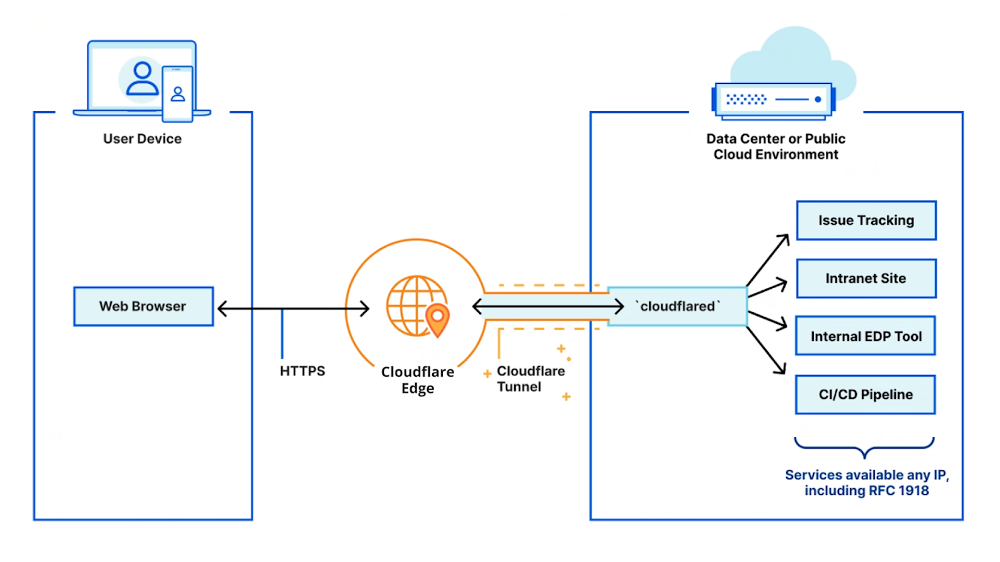
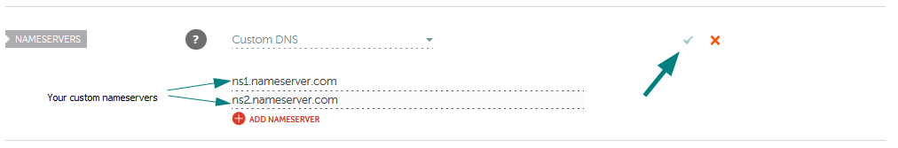
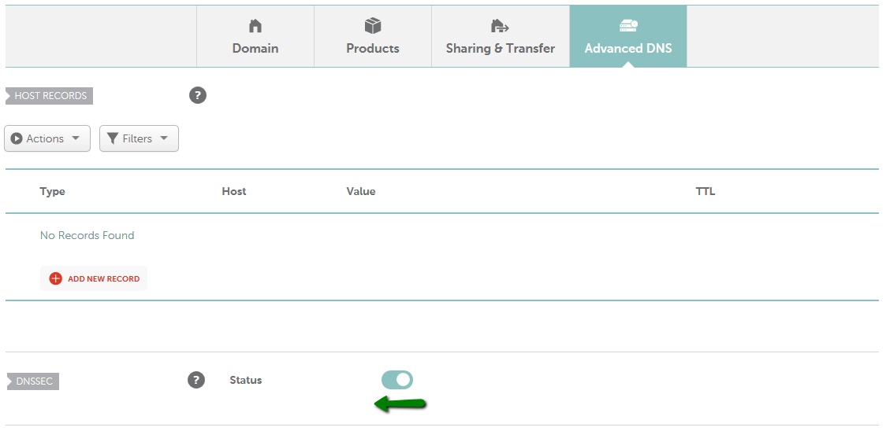
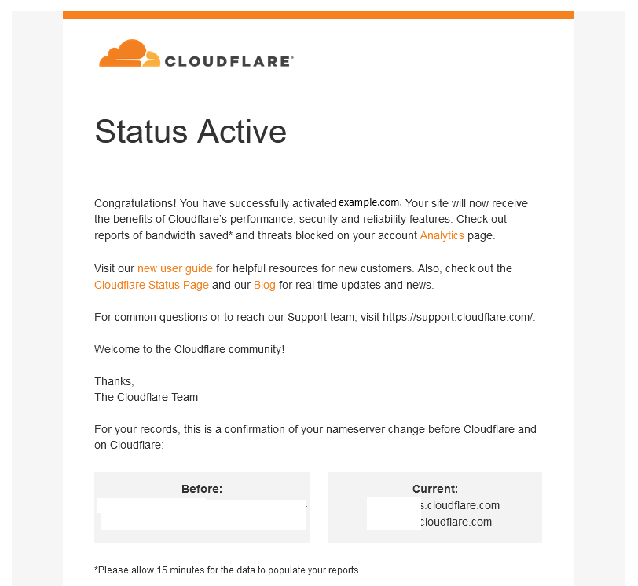
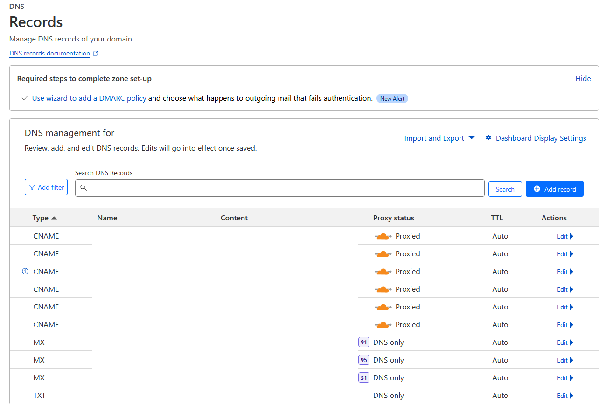
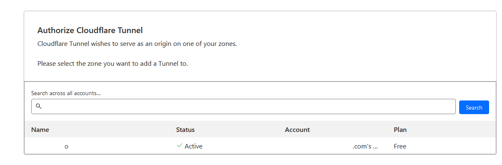
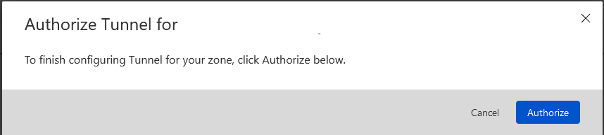
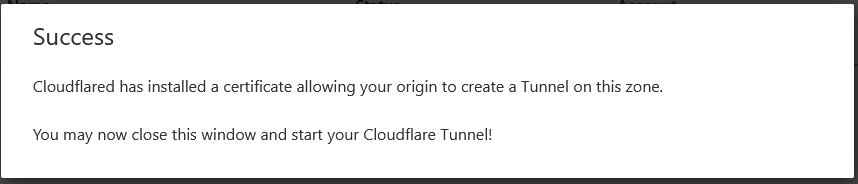
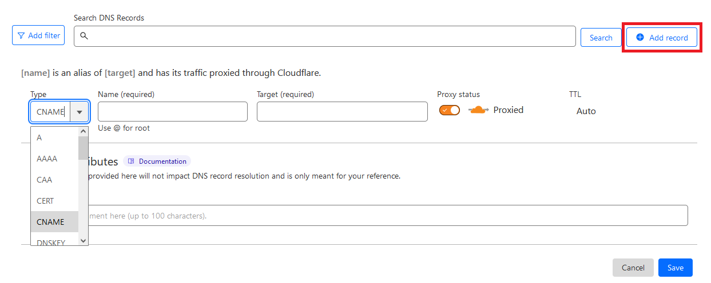
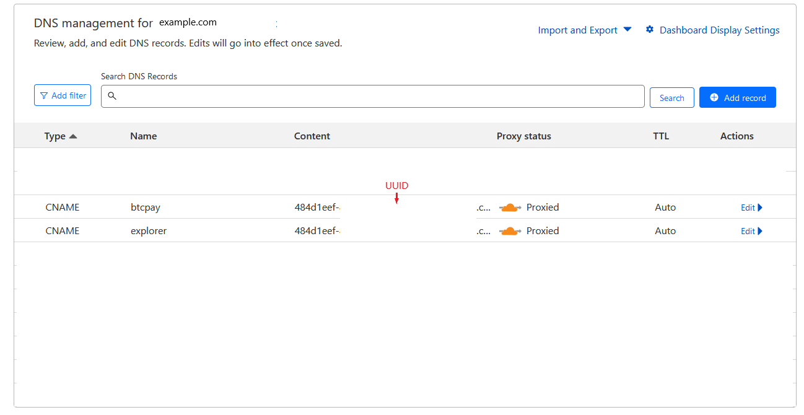

---
layout:
  title:
    visible: true
  description:
    visible: false
  tableOfContents:
    visible: true
  outline:
    visible: true
  pagination:
    visible: true
---

# Cloudflare tunnel

Exposing your local server on the Internet (clearnet) has various solutions, but the Cloudflare Tunnel stands out as the easiest and most cost-effective option. Traditionally, configuring Firewalls, using Tor, or setting up an SSH reverse tunnel to a public VPS were common approaches, each with its challenges and costs. Cloudflare Tunnel offers an alternative, though it acts as a middleman and can access or modify your traffic.


Cost: Paid service



Difficulty: Medium


<figure><figcaption></figcaption></figure>

With Cloudflare Tunnel, you gain low latency access to your server on clearnet, without the need for complex firewall or router configurations, dynamic DNS, or relying on an internet service provider.

<figure><figcaption></figcaption></figure>

Cloudflare Tunnel ensures secure connectivity without exposing your server's publicly routable IP address. Instead, a lightweight daemon, cloudflared, creates outbound-only connections to Cloudflare's global network. This establishes persistent tunnels that route traffic to DNS records. You can run multiple cloudflared processes within a tunnel, connecting your resources securely to Cloudflare's nearest data center.

## Requirements

Before you start, make sure you:

### Buy a domain name

* **Buy a domain or use an existing one**, there are different options to buy a domain, to this example, we will use Namecheap
  * Go to the [Namecheap](https://www.namecheap.com/), search your wish domain between available, and follow the registration and buying process (you can pay using Bitcoin onchain), the price depends on the domain extensions chosen, a common extension like .com or .net generally has an annual cost between 10€ and 20€, but some less common extensions may have higher prices. In general, the most common extensions like .com, .net, and .org usually have low costs due to their popularity and availability. However, other less common extensions, such as .xyz or .online, are often offered at lower prices to attract more users.

### Create an account on Cloudflare

* [Create an account on Cloudflare](https://dash.cloudflare.com/sign-up) and add the recently created domain to it:
  * In the top navigation bar, click **\[Add site]**
  * Enter your domain (`example.com`) and then click on the **\[Add site]** button again
  * **Select your plan level**. The **free plan is enough** for this case of use. For more details on features and pricing of available plans, refer to the [Plans page](https://www.cloudflare.com/plans/#compare-features). Click **Continue**
  * Click **Done, take note of the nameservers** assigned to your account
  * On **Overview**, locate the nameserver names in **2**

<figure><figcaption></figcaption></figure>

### **Change the domain nameservers to Cloudflare**

* Before your domain can begin using Cloudflare for DNS resolution, all requests should be redirected to Cloudflare’s network first, where Access policies can be applied. You need to **add these nameservers to your registrar** (Namecheap in our case)
  * Access your Namecheap account or the registrar selected, from the left sidebar, select **Dashboard,** and click on the **Manage** button next to your domain
  * Staying in the **Domain** tab, go to the **Nameservers section**, select **CustomDNS,** type the **nameservers provided for Cloudflare** before, and click on the green checkmark to save the changes

<figure><figcaption></figcaption></figure>

* Make sure **DNSSEC** **is disabled** at this point
  * Select the **Advanced DNS** tab and find the DNSSEC section
  * Toggle the **button to the left** if are to the right

<figure><figcaption></figcaption></figure>


Once all of this is done, you need to wait for the registrar to update the nameservers. This process can take up to 24 hours, but it is usually much more immediate. In any case, Cloudflare will send an email when the process is finished


<figure><figcaption><p>Example of email notification received from Cloudflare</p></figcaption></figure>

### Check DNS records

* From the left sidebar, select **Websites,** click on your site added, and again from the new left sidebar click on **DNS -> Records**

<figure><figcaption></figcaption></figure>


You can add a new record manually by clicking on the **Add record** button. More later we will use this. Right now you will not have any record



Keep this Cloudflare session open, we will add and modify some registries to configure the tunnel


## Installation

* With user `admin`, go to the temporary folder

```bash
$ cd /tmp
```

* Set a temporary version environment variable to the installation

```bash
$ VERSION=2024.4.1
```

* Download Cloudflare Tunnel Client (Cloudflared)

<pre class="language-bash" data-overflow="wrap"><code class="lang-bash"><strong>$ wget https://github.com/cloudflare/cloudflared/releases/download/$VERSION/cloudflared-linux-amd64.deb
</strong></code></pre>

* Use the deb package manager to install it

```bash
$ sudo dpkg -i cloudflared-linux-amd64.deb
```

* Check the correct installation

```bash
$ cloudflared --version
```

**Example** of expected output:

```
> cloudflared version 2023.6.1 (built 2023-06-20-0926 UTC)
```

* Remove the package installation file

```bash
$ sudo rm cloudflared-linux-amd64.deb
```


If you come to update this is the final step


### Authenticate on Cloudflare and authorize <a href="#id-2-authenticate-cloudflared" id="id-2-authenticate-cloudflared"></a>

* With user `admin`, authenticate Cloudflared with your Cloudflare account

```bash
$ cloudflared tunnel login
```

**Example** of expected output:

```
Please open the following URL and log in with your Cloudflare account:

https://dash.cloudflare.com/argotunnel?aud=&callback=https%3A%2F%2Flogin.cloudflareaccess.org%2FCbH_YLs-WM2zIR5j4NahjstGErge5AE79YIBNiZsV1Y%4D

Leave cloudflared running to download the cert automatically.
You have successfully logged in.
If you wish to copy your credentials to a server, they have been saved to:
/home/admin/.cloudflared/cert.pem
```


Leave Cloudflared running to download the cert automatically while you complete the authentication on the Cloudflare account


* In the same browser session with the Cloudflare account already open, enter the URL of the prompt provided earlier. Then, select your pre-configured site on Cloudflare to authorize the tunnel for that site

<figure><figcaption></figcaption></figure>

* Authorize its connection

<figure><figcaption></figcaption></figure>

<figure><figcaption></figcaption></figure>

* Go back to the MiniBolt terminal session, and you will see this:

Expected output:

```
> You have successfully logged in.
> If you wish to copy your credentials to a server, they have been saved to:
> /home/admin/.cloudflared/cert.pem
```

### Create a tunnel and give it a name <a href="#id-3-create-a-tunnel-and-give-it-a-name" id="id-3-create-a-tunnel-and-give-it-a-name"></a>

```bash
$ cloudflared tunnel create <NAME>
```


Suggestion: **\<NAME>** = miniboltunnel


**Example** of expected output:

```
Tunnel credentials written to /home/admin/.cloudflared/<UUID>.json. cloudflared chose this file based on where your origin certificate was found. Keep this file secret. To revoke these credentials, delete the tunnel.

Created tunnel <NAME> with id <UUID>
```


Take note of the tunnel ID ->`<UUID>: e.g: 8666c35d-6ac3-4b39-9324-12ae32ce64a7` you will need it later


* Ensure that the tunnel has been created

```bash
$ cloudflared tunnel list
```

**Example** of expected output:

```
You can obtain more detailed information for each tunnel with `cloudflared tunnel info <name/uuid>`
ID                                      NAME              CREATED               CONNECTIONS
8666c35d-6ac3-4b39-9324-12ae32ce64a7    miniboltunnel     2023-04-01T15:44:48Z
```

* You can obtain more detailed information about the tunnel with

```bash
$ cloudflared tunnel info <NAME>
```

**Example** of expected output:

```
NAME:     miniboltunnel
ID:       8666c35d-6ac3-4b39-9324-12ae32ce64a7
CREATED:  2023-07-09 19:16:12.744487 +0000 UTC

CONNECTOR ID                         CREATED              ARCHITECTURE VERSION   ORIGIN IP      EDGE
8666c35d-6ac3-4b39-9324-12ae32ce64a7 2023-07-10T16:20:41Z linux_amd64  2023.6.1 <yourpublicip>
```

### Start routing traffic <a href="#id-5-start-routing-traffic" id="id-5-start-routing-traffic"></a>

* Now assign a CNAME record that points traffic to your tunnel subdomain


> If you want to tunnel only a specific service, you can choose the final subdomain for that service, for example, if you going to expose only the `BTC RPC Explorer`, choose `explorer.<domain.com>` or if you want to expose only the `BTCpay Server`, choose `btcpay.<domain.com>`

> Replace **`<UUID>`** for your one obtained before


<pre class="language-bash" data-overflow="wrap"><code class="lang-bash"><strong>$ cloudflared tunnel route dns &#x3C;UUID> subdomain.domain.com
</strong></code></pre>

**Example** of expected output:

```
> 2023-07-09T18:01:07Z INF Added CNAME explorer.domain.com which will route to this tunnel tunnelID=8666c35d-6ac3-4b39-9324-12ae32ce64a7
```

## Configuration

We will create a configuration file in your `.cloudflared` directory. This file will configure the tunnel to route traffic from a given origin to the hostname of your choice. We will use ingress rules to let you specify which local services traffic should be proxied to.

* Staying with user `admin`, create `config.yml`

```bash
$ nano /home/admin/.cloudflared/config.yml
```

* Here you should choose services that you want to expose publicly. This is only an example, so replace the ingress rules with your preferences. For example, you can replace `btcpay` or `explorer` with your name (subdomain) chosen for the service, and `<domain.com>` with the domain, you purchased previously. Ensure to replace `<UUID>` with your obtained before

```
# MiniBolt: cloudflared configuration
# /home/admin/.cloudflared/config.yml

tunnel: <UUID>
credentials-file: /home/admin/.cloudflared/<UUID>.json

ingress:

# BTCPay Server
  - hostname: btcpay.<domain.com>
    service: http://localhost:23000

# BTC RPC Explorer
  - hostname: explorer.<domain.com>
    service: http://localhost:3002

  - service: http_status:404
```


> 1. Electrum server are not supported using Cloudflared

> 2. For security reasons, you shouldn't expose publically the administration access services using Cloudflared e.g SSH or Thunderhub, for these cases you should use [Wireguard VPN](../../bonus/system/wireguard-vpn.md)
> 3.  If you want to expose only a service, you can delete or comment the associated lines of other services, always maintaining the "`- service: http_status:404"` line at the end of the rules. Example, expose only BTCPay Server, the comment the associated lines for BTC RPC Explorer:&#x20;
>
>     ```
>     # BTC RPC Explorer
>     #  - hostname: explorer.<domain.com>
>     #    service: http://localhost:3002
>     ```


### Configure Cloudflare DNS records

* Now, we go back to the Cloudflare DNS records table to do modifications.

If you wanted to expose 2 services or more, that is to say, you ingressed more than one service on the ingress rules, follow the next steps, if not, you can only check the current recently created registry or jump directly to the next [Increase the maximum UDP Buffer Sizes](cloudflare-tunnel.md#increase-the-maximum-udp-buffer-sizes) section:

> 1. **Edit the existing CNAME record** that was recently created, and replace the `name` value with the name of the first or one of the services selected, or keep it if it's correct. For example, if you selected `btcpay`, keep the existing target content, which is the UUID of your tunnel
> 2. Add a new record by selecting **CNAME** type.Enter the second subdomain selected in the second ingress rule e.g `explorer`, in the `name` box, and in the `target` content, enter the `UUID` of your tunnel (the same content as before)
> 3. Ensure you have **enabled `Proxy`** for each record you have added **(Proxy status: Proxied)**

<figure><figcaption></figcaption></figure>

**Example** of DNS record table:

<figure><figcaption></figcaption></figure>

### Increase the maximum UDP Buffer Sizes

Experiments have shown that QUIC transfers on high-bandwidth connections can be limited by the size of the UDP receive and send buffer.

* With user `admin`, increase the maximum buffer size by editing the next file to add kernel parameters

```bash
$ sudo nano /etc/sysctl.conf
```

* Here are the lines you’ll want to add at the end of the file. Save and exit

```
net.core.rmem_max=2500000
net.core.wmem_max=2500000
```

* Then apply the changes with

```bash
$ sudo sysctl --system
```


These parameters would increase the maximum send and receive buffer size to roughly 2.5 MB


### Create systemd service

* Create the configuration file in the nano text editor and copy the following content. Save and exit

```bash
$ sudo nano /etc/systemd/system/cloudflared.service
```

<pre><code># MiniBolt: systemd unit for Cloudflared
# /etc/systemd/system/cloudflared.service

[Unit]
Description=Cloudflared
Wants=network-online.target
After=network-online.target

[Service]
ExecStart=/usr/bin/cloudflared --no-autoupdate --config /home/admin/.cloudflared/config.yml tunnel run
<strong>
</strong># Process management
####################
Type=notify
<strong>TimeoutStartSec=0
</strong>
[Install]
WantedBy=multi-user.target
</code></pre>

* Enable autoboot **(optional)**

```bash
$ sudo systemctl enable cloudflared
```

* Prepare `cloudflared` monitoring by the systemd journal and checking the logging output. You can exit monitoring at any time with Ctrl-C

```bash
$ journalctl -f -u cloudflared
```


Keep **this terminal open,** you'll need to come back here on the next step to monitor the logs


## Run <a href="#id-6-run-the-tunnel" id="id-6-run-the-tunnel"></a>

To keep an eye on the software movements, [start your SSH program](../../index-1/remote-access.md#access-with-secure-shell) (eg. PuTTY) a second time, connect to the MiniBolt node, and log in as `admin`. Commands for the **second session** start with the prompt **`$2` (which must not be entered)**. Run the tunnel to proxy incoming traffic from the tunnel to any number of services running locally on your origin.

* Start the service

```bash
$2 sudo systemctl start cloudflared
```

<details>

<summary><strong>Example</strong> of expected output on the first terminal with <code>$ journalctl -f -u cloudflared</code> ⬇️</summary>

```
Jul 10 18:20:40 minibolt cloudflared[3405663]: 2023-07-10T16:20:40Z INF Starting tunnel tunnelID=8666c35d-6ac3-4b39-9324-12ae32ce64a7
Jul 10 18:20:40 minibolt cloudflared[3405663]: 2023-07-10T16:20:40Z INF Version 2023.6.1
Jul 10 18:20:40 minibolt cloudflared[3405663]: 2023-07-10T16:20:40Z INF GOOS: linux, GOVersion: go1.19.6, GoArch: amd64
Jul 10 18:20:40 minibolt cloudflared[3405663]: 2023-07-10T16:20:40Z INF Settings: map[config:/home/admin/.cloudflared/config.yml cred-file:/home/admin/.cloudflared/8666c35d-6ac3-4b39-9324-12ae32ce64a7.json credentials-file:/home/admin/.cloudflared/8666c35d-6ac3-4b39-9324-12ae32ce64a7.json no-autoupdate:true]
Jul 10 18:20:40 minibolt cloudflared[3405663]: 2023-07-10T16:20:40Z INF Generated Connector ID: ca7ebf91-844d-4025-89f0-e28df084d0a2
Jul 10 18:20:40 minibolt cloudflared[3405663]: 2023-07-10T16:20:40Z INF cloudflared will not automatically update if installed by a package manager.
Jul 10 18:20:40 minibolt cloudflared[3405663]: 2023-07-10T16:20:40Z INF Initial protocol quic
Jul 10 18:20:40 minibolt cloudflared[3405663]: 2023-07-10T16:20:40Z INF ICMP proxy will use 192.168.1.87 as source for IPv4
Jul 10 18:20:40 minibolt cloudflared[3405663]: 2023-07-10T16:20:40Z INF ICMP proxy will use fe80::42a8:f0ff:feb0:aa4d in zone eno1 as source for IPv6
Jul 10 18:20:40 minibolt cloudflared[3405663]: 2023-07-10T16:20:40Z INF Starting metrics server on 127.0.0.1:46345/metrics
Jul 10 18:20:40 minibolt cloudflared[3405663]: 2023/07/10 18:20:40 failed to sufficiently increase receive buffer size (was: 208 kiB, wanted: 2048 kiB, got: 416 kiB). See https://github.com/quic-go/quic-go/wiki/UDP-Receive-Buffer-Size for details.
Jul 10 18:20:41 minibolt cloudflared[3405663]: 2023-07-10T16:20:41Z INF Registered tunnel connection connIndex=0 connection=0c293573-9581-4087-ab56-504d7eca57a1 event=0 ip=198.41.200.23 location=MAD protocol=quic
Jul 10 18:20:41 minibolt systemd[1]: Started cloudflared.
Jul 10 18:20:41 minibolt cloudflared[3405663]: 2023-07-10T16:20:41Z INF Registered tunnel connection connIndex=1 connection=cb1e7bb6-9051-43da-802e-1791687f7385 event=0 ip=198.41.192.57 location=MRS protocol=quic
Jul 10 18:20:43 minibolt cloudflared[3405663]: 2023-07-10T16:20:43Z INF Registered tunnel connection connIndex=2 connection=749064a4-fe1d-4c07-b0b9-71dbc0bcbe3a event=0 ip=198.41.192.227 location=MRS protocol=quic
Jul 10 18:20:43 minibolt cloudflared[3405663]: 2023-07-10T16:20:43Z INF Registered tunnel connection connIndex=3 connection=00f2ca81-1dd1-4695-9857-6815b376855b event=0 ip=198.41.200.33 location=MAD protocol=quic
```

</details>

* Now point your browser to the hostnames created in your `config.yml` e.g `https://explorer.domain.com` or `https://btcpay.domain.com` and check if it resolves correctly to the local service


You should see the service properly running as if it were a local connection


Ensure Cloudflared is listening on the random port assigned:

<pre class="language-bash"><code class="lang-bash"><strong>$ sudo ss -tulpn | grep LISTEN | grep cloudflared
</strong></code></pre>

**Example** of expected output:

<pre><code>> tcp   LISTEN 0      4096       127.0.0.1:<a data-footnote-ref href="#user-content-fn-1">37599</a>      0.0.0.0:*    users:(("cloudflared",pid=311164,fd=3))
</code></pre>

## Upgrade

* With user `admin`, stop Cloudflared

```bash
$ sudo systemctl stop cloudflared
```

* Check the current version of Cloudflared

```bash
$ cloudflared --version
```

* Follow again the [installation section](cloudflare-tunnel.md#installation) of this guide, replacing the environment variable `"VERSION=x.xx"` value for the [latest](https://github.com/cloudflare/cloudflared/releases) if it has not been already changed in this guide
* Start Cloudflared again

```bash
$ sudo systemctl start cloudflared
```


Monitor logs with **`$ journalctl -fu cloudflared`** to ensure that all is still working well


## Uninstall

* With user `admin`, stop the Cloudflared

```bash
$ sudo systemctl stop cloudflared
```

* Use the deb package manager to uninstall Cloudflared

```bash
$ sudo dpkg -r cloudflared
```

**Example** of expected output:

```
> (Reading database ... 74004 files and directories currently installed.)
> Removing cloudflared (2023.7.2) ...
> Processing triggers for man-db (2.10.2-1) ...
```

## Port reference

|  Post  | Protocol |     Use     |
| :----: | :------: | :---------: |
| Random |    TCP   | Random port |

[^1]: Random port
