---
layout:
  title:
    visible: true
  description:
    visible: false
  tableOfContents:
    visible: true
  outline:
    visible: true
  pagination:
    visible: true
---

# NYM mixnet

The NYM mixnet technology ensures enhanced privacy and anonymity for online communications. It utilizes a decentralized network to encrypt and route data, ensuring that the origin and destination are concealed. By implementing the NYM mixnet, users can protect their online activities and sensitive information, safeguarding their privacy from surveillance and censorship. This advanced networking technology provides a secure environment for transmitting data and maintaining anonymity.


Difficulty: Intermediate


<div data-full-width="false">

<figure><figcaption></figcaption></figure>

</div>

<figure><figcaption></figcaption></figure>

The technology involves two key components: the **Network Requester** and the **SOCKS5 Client**. The Network Requester acts as an intermediary, **encrypting and routing data** through a decentralized mixnet network to **enhance privacy and prevent surveillance**. The SOCKS5 Client establishes a **secure connection** to the mixnet, enabling users to **route network traffic** and enjoy **improved privacy**.

<figure><figcaption></figcaption></figure>

Implementing these components empowers users to protect their **online activities** and **sensitive information**. **Service providers**, such as the network requester and mix nodes, offer services that leverage **data mixing, identity protection**, and **traffic routing**, further enhancing privacy in the NYM network.

Together, these components and service providers create a decentralized infrastructure within the NYM network, safeguarding **user anonymity** and protecting **online activities**.

## Requirements

* Others
  * [Rustup + Cargo](rustup-+-cargo.md)

## Preparations

### Install dependencies

* With user `admin`, make sure that all necessary software packages are installed

```bash
$ sudo apt install pkg-config build-essential libssl-dev jq
```

* Check if you already have Rustc

```bash
$ rustc --version
```

**Example** of expected output:

```
> rustc 1.71.0 (8ede3aae2 2023-07-12)
```

* And cargo installed

```bash
$ cargo -V
```

**Example** of expected output:

```
> cargo 1.71.0 (cfd3bbd8f 2023-06-08)
```


If you obtain "command not found" outputs, you need to follow the [Rustup + Cargo bonus section](rustup-+-cargo.md) to install it and then come back to continue with the guide


### Configure Firewall

* Stay login with the user `admin`, configure the firewall to allow incoming requests to the nym-socks5-client

```bash
$ sudo ufw allow 1080/tcp comment 'allow NYM socks5 client from anywhere'
```

## Installation, Configuration & Run

### Compile NYM binaries from the source code

* Now we will go to the temporary folder to create the NYM binaries that we will need for the installation process

```bash
$ cd /tmp
```

* Clone the latest version of the source code from the GitHub repository

```bash
$ git clone https://github.com/nymtech/nym.git
```

* Enter to the nym folder

```bash
$ cd nym
```

* Enter the command to compile

```bash
$ cargo build --release
```


This process can take quite a long time, 10-15 minutes or more, depending on the performance of your device. Please be patient until the prompt shows again



If the prompt shows you this error:

`error: rustup could not choose a version of cargo to run, because one wasn't specified explicitly, and no default is configured. help: run 'rustup default stable' to download the latest stable release of Rust and set it as your default toolchain.`

You need to type "**`$ rustup default stable"`** and wait for the process to finish, then try again the command before

Also, that could help [Upgrade Rust](rustup-+-cargo.md#upgrade) to the latest version



If you come to update, this is the final step, go back to the [Upgrade section](nym-mixnet.md#upgrade) to continue


### Install network Requester

### Create the nym user

* Create the user nym with this command

```bash
$ sudo adduser --gecos "" --disabled-password nym
```

* Staying in the temporary folder, copy to the home nym user the "nym network requester" binary

```bash
$ sudo cp /tmp/nym/target/release/nym-network-requester /home/nym/
```

* Assign the owner of the binary to the nym user

```bash
$ sudo chown nym:nym /home/nym/nym-network-requester
```

### Init network requester

* Switch to the user "nym"

```bash
$ sudo su - nym
```

* Init the network requester for the first time with `gateway based selection` flag to choose a gateway based on its location relative to your device

```bash
$ ./nym-network-requester init --id bitcoin --latency-based-selection
```


If you want to select the gateway that your network requester will be connected to, you could add the flag `--gateway <gatewayID>` replacing the `<gatewayID>` with someone on this [list](https://explorer.nymtech.net/network-components/gateways) and delete the `--latency-based-selection flag`


<details>

<summary>Example of expected output ⬇️</summary>

<pre><code>      _ __  _   _ _ __ ___
     | '_ \| | | | '_ \ _ \
     | | | | |_| | | | | | |
     |_| |_|\__, |_| |_| |_|
            |___/

             (nym-network-requester - version 1.1.21)


Initialising client...
 2023-06-17T20:28:30.210Z INFO  nym_client_core::init::helpers > choosing gateway by latency...
 2023-06-17T20:28:49.963Z INFO  nym_client_core::init::helpers > chose gateway 2xU4CBE6QiiYt6EyBXSALwxkNvM7gqJfjHXaMkjiFmYW with average latency of 42.730304ms
Registering with new gateway
 2023-06-17T20:28:50.244Z INFO  nym_gateway_client::client     > the gateway is using exactly the same protocol version as we are. We're good to continue!
 2023-06-17T20:28:50.252Z INFO  nym_config                     > Configuration file will be saved to "/home/nym/.nym/service-providers/network-requester/bitcoin/config/config.toml"
Saved configuration file to "/home/nym/.nym/service-providers/network-requester/bitcoin/config/config.toml"
Using gateway: 2xU4CBE6QiiYt6EyBXSALwxkNvM7gqJfjHXaMkjiFmYW
Client configuration completed.

Version: 1.1.14
ID: bitcoin
Identity key: <a data-footnote-ref href="#user-content-fn-1">84K1SPBsSPGcCGQ6hK4AYKXuZHb5iU3zBc9gYb3cJp6o</a>
Encryption: Cfc67agMVw6GRjPb7ZyEfZSwLeVSvYtqKCKmATewYJa5
Gateway ID: 2xU4CBE6QiiYt6EyBXSALwxkNvM7gqJfjHXaMkjiFmYW
Gateway: ws://194.182.172.173:9000
Address of this network-requester: 84K1SPBsSPGcCGQ6hK4AYKXuZHb5iU3zBc9gYb3cJp6o.Cfc67agMVw6GRjPb7ZyEfZSwLeVSvYtqKCKmATewujajT@2xU4CBE6QiiYt6EyBXSALwxkNvM7gqJfjHXaMkjhdjywS
</code></pre>

</details>


Take note of your network requester address **\<requesteraddress>**


> **Example** ->`Address of this network-requester: 84K1SPBsSPGcCGQ6hK4AYKXuZHb5iU3zBc9gYb3cJp6o.Cfc67agMVw6GRjPb7ZyEfZSwLeVSvYtqKCKmATewujajT@2xU4CBE6QiiYt6EyBXSALwxkNvM7gqJfjHXaMkjhdjywS`


**Important!** It is strongly advised **not to share** the address of your NYM service provider with anyone. Sharing this information could potentially involve you in illicit activities carried out by others using your network requester as a router. Please bear in mind that we operate in **open proxy mode** to avoid centralizing connections to concrete nodes of Bitcoin and servers of the other services. Safeguarding the confidentiality of your service provider address is essential to protect yourself and prevent any legal implications

Additionally, you can use the exit policy feature to avoid malicious connections using your network requester, by following the [Use the exit policy feature](nym-mixnet.md#use-the-exit-policy-feature)


* Check the correct installation

```bash
$ ./nym-network-requester -V
```

**Example** of expected output:

```
> nym-network-requester 1.1.24
```

* Exit from the nym user session

```bash
$ exit
```

### Create network requester systemd service

The system needs to run the network requester daemon automatically in the background, even when nobody is logged in. We use `"systemd"`, a daemon that controls the startup process using configuration files.

* As user `admin`, create the service file

<pre class="language-bash"><code class="lang-bash"><strong>$ sudo nano /etc/systemd/system/nym-network-requester.service
</strong></code></pre>

* Paste the following configuration. Save and exit

```
# MiniBolt: systemd unit for nym network requester
# /etc/systemd/system/nym-network-requester.service

[Unit]
Description=Nym Network Requester
Wants=network-online.target
After=network-online.target

StartLimitInterval=350
StartLimitBurst=10

[Service]
ExecStart=/home/nym/nym-network-requester run --id bitcoin --open-proxy true

User=nym
Group=nym

# Process management
####################
Restart=on-failure
RestartSec=30
KillSignal=SIGINT

# Hardening Measures
####################
LimitNOFILE=65536

[Install]
WantedBy=multi-user.target
```

* Enable autoboot **(optional)**

```bash
$ sudo systemctl enable nym-network-requester
```

* Prepare “nym-network-requester” monitoring by the systemd journal and check the logging output. You can exit monitoring at any time with Ctrl-C

```bash
$ journalctl -f -u nym-network-requester
```

### Running network requester

To keep an eye on the software movements, [start your SSH program](../../index-1/remote-access.md#access-with-secure-shell) (eg. PuTTY) a second time, connect to the MiniBolt node, and log in as "admin". Commands for the **second session** start with the prompt **`$2` (which must not be entered).**

* Start the nym network requester service

```bash
$2 sudo systemctl start nym-network-requester
```

<details>

<summary><strong>Example</strong> of expected output on the first terminal with <code>$ journalctl -f -u nym-network-requester</code> ⬇️</summary>

```
Jun 25 20:43:00 minibolt systemd[1]: Started Nym Network Requester.
Jun 25 20:43:00 minibolt nym-network-requester[1774351]:  2023-06-25T18:43:00.402Z INFO  nym_network_requester::cli::run > Starting socks5 service provider
Jun 25 20:43:00 minibolt nym-network-requester[1774351]:  2023-06-25T18:43:00.592Z INFO  nym_client_core::client::base_client::non_wasm_helpers > creating fresh surb database
Jun 25 20:43:00 minibolt nym-network-requester[1774351]:  2023-06-25T18:43:00.644Z INFO  nym_client_core::client::replies::reply_storage::backend::fs_backend::manager > Database migration finished!
Jun 25 20:43:00 minibolt nym-network-requester[1774351]:  2023-06-25T18:43:00.718Z INFO  nym_client_core::client::base_client                                          > Starting nym client
Jun 25 20:43:01 minibolt nym-network-requester[1774351]:  2023-06-25T18:43:01.104Z INFO  nym_gateway_client::client                                                    > the gateway is using exactly the same protocol version as we are. We're good to continue!
Jun 25 20:43:01 minibolt nym-network-requester[1774351]:  2023-06-25T18:43:01.104Z INFO  nym_gateway_client::client                                                    > Claiming more bandwidth for your tokens. This will use 1 token(s) from your wallet. Stop the process now if you don't want that to happen.
Jun 25 20:43:01 minibolt nym-network-requester[1774351]:  2023-06-25T18:43:01.104Z WARN  nym_gateway_client::client                                                    > Not enough bandwidth. Trying to get more bandwidth, this might take a while
Jun 25 20:43:01 minibolt nym-network-requester[1774351]:  2023-06-25T18:43:01.104Z INFO  nym_gateway_client::client                                                    > The client is running in disabled credentials mode - attempting to claim bandwidth without a credential
Jun 25 20:43:01 minibolt nym-network-requester[1774351]:  2023-06-25T18:43:01.155Z INFO  nym_client_core::client::base_client                                          > Obtaining initial network topology
Jun 25 20:43:01 minibolt nym-network-requester[1774351]:  2023-06-25T18:43:01.581Z INFO  nym_client_core::client::base_client                                          > Starting topology refresher...
Jun 25 20:43:01 minibolt nym-network-requester[1774351]:  2023-06-25T18:43:01.581Z INFO  nym_client_core::client::base_client                                          > Starting received messages buffer controller...
Jun 25 20:43:01 minibolt nym-network-requester[1774351]:  2023-06-25T18:43:01.581Z INFO  nym_client_core::client::base_client                                          > Starting mix traffic controller...
Jun 25 20:43:01 minibolt nym-network-requester[1774351]:  2023-06-25T18:43:01.581Z INFO  nym_client_core::client::base_client                                          > Starting real traffic stream...
Jun 25 20:43:01 minibolt nym-network-requester[1774351]:  2023-06-25T18:43:01.581Z INFO  nym_client_core::client::base_client                                          > Starting loop cover traffic stream...
Jun 25 20:43:01 minibolt nym-network-requester[1774351]:  2023-06-25T18:43:01.581Z INFO  nym_network_requester::core                                                   > The address of this client is: Zq2pc3b7tiSWbjdgvQi9Xw5WLvmVVzfTouSvy8DUws9.HCThYe3mTBHPZDayqH46p73iYLMe3GNEKrgVtoPjjdte@BTZNB3bkkEePsT14GN8ofVtM1SJae4YLWjpBerrKust
Jun 25 20:43:01 minibolt nym-network-requester[1774351]:  2023-06-25T18:43:01.581Z INFO  nym_network_requester::core                                                   > All systems go. Press CTRL-C to stop the server.
Jun 25 20:43:01 minibolt nym-network-requester[1774351]:  2023-06-25T18:43:01.582Z INFO  nym_network_requester::allowed_hosts::standard_list                           > Refreshing standard allowed hosts
```

</details>


All network requester specific configurations can be found in `/home/nym/.nym/service-providers/network-requester/bitcoin/config/config.toml`. If you do edit any configs, remember to restart the service


### Install socks5 client

* Stay logged in with `admin`user, go to the temporary folder

```bash
$ cd /tmp
```

* Copy to the home nym user the "nym socks5 client" binary

```bash
$ sudo cp /tmp/nym/target/release/nym-socks5-client /home/nym/
```

* Assign the owner of the binary to the nym user

```bash
$ sudo chown nym:nym /home/nym/nym-socks5-client
```

### Init socks5 client

* Switch to the user "nym"

```bash
$ sudo su - nym
```

* Init the nym socks5 client for the first time with `gateway based selection` flag to choose a gateway based on its location relative to your device and replace **\<requesteraddress>** with the obtained in the [Run NYM network requester](nym-mixnet.md#run-nym-network-requester) step before


```bash
$ ./nym-socks5-client init --id bitcoin --latency-based-selection --provider <requesteraddress>
```



If you want to select the gateway that your socks5 client will be connected to, you could add the flag `--gateway <gatewayID>` replacing the `<gatewayID>` with someone on this [list](https://explorer.nymtech.net/network-components/gateways) and delete the `--latency-based-selection flag`


<details>

<summary>Example of expected output ⬇️</summary>

```
      _ __  _   _ _ __ ___
     | '_ \| | | | '_ \ _ \
     | | | | |_| | | | | | |
     |_| |_|\__, |_| |_| |_|
            |___/

             (nym-socks5-client - version 1.1.21)


Initialising client...
 2023-06-17T20:32:16.857Z INFO  nym_client_core::init::helpers > choosing gateway by latency...
 2023-06-17T20:32:36.948Z INFO  nym_client_core::init::helpers > chose gateway FQon7UwF5knbUr2jf6jHhmNLbJnMreck1eUcVH59kxYE with average latency of 44.796394ms
Registering with new gateway
 2023-06-17T20:32:37.195Z INFO  nym_gateway_client::client     > the gateway is using exactly the same protocol version as we are. We're good to continue!
 2023-06-17T20:32:37.200Z INFO  nym_config                     > Configuration file will be saved to "/home/nym/.nym/socks5-clients/bitcoin/config/config.toml"
Saved configuration file to "/home/nym/.nym/socks5-clients/bitcoin/config/config.toml"
Using gateway: FQon7UwF5knbUr2jf6jHhmNLbJnMreck1eUcVH59kxYE
Client configuration completed.

Version: 1.1.14
ID: bitcoin
Identity key: GwFEXSpQP1VFZwDdYRkuRTUpQ28v3zvZbq3mtQnNELwr
Encryption: EeAiN8mySPwcFco1hgipD86ymzK8UfShjgdMKkKvbk3a
Gateway ID: FQon7UwF5knbUr2jf6jHhmNLbJnMreck1eUcVH59kxYE
Gateway: ws://116.203.182.89:9000
SOCKS5 listening port: 1080
Address of this client: GwFEXSpQP1VFZwDdYRkuRTUpQ28v3zvZbq3mtQnNELwr.EeAiN8mySPwcFco1hgipD86ymzK8UfShjgdMKkKvghste@FQon7UwF5knbUr2jf6jHhmNLbJnMreck1eUcVH59usta
```

</details>

* Check the correct installation

```bash
$ ./nym-socks5-client -V
```

**Example** of expected output:

```
> nym-socks5-client 1.1.24
```

* Exit from the nym user session

```bash
$ exit
```

### Create socks5 client systemd service

The system needs to run the network requester daemon automatically in the background, even when nobody is logged in. We use `"systemd"`, a daemon that controls the startup process using configuration files.

* As user `admin`, create the service file

```bash
$ sudo nano /etc/systemd/system/nym-socks5-client.service
```

* Paste the following configuration. Save and exit

```
# MiniBolt: systemd unit for nym socks5 client
# /etc/systemd/system/nym-socks5-client.service

[Unit]
Description=Nym Socks5 client
Wants=network-online.target
After=network-online.target

StartLimitInterval=350
StartLimitBurst=10

[Service]
ExecStart=/home/nym/nym-socks5-client run --id bitcoin --host 0.0.0.0

User=nym
Group=nym

# Process management
####################
Restart=on-failure
RestartSec=30
KillSignal=SIGINT

# Hardening Measures
####################
LimitNOFILE=65536

[Install]
WantedBy=multi-user.target
```


(Optional) You can add `--fastmode` attribute to the `ExecStart` parameter to enable this feature, this means the connection will not mixed up as much, but you will still be covered by the same privacy standard/minimum that NYM provides:

```bash
ExecStart=/home/nym/nym-socks5-client run --id bitcoin --fastmode
```


* Enable autoboot **(optional)**

```bash
$ sudo systemctl enable nym-network-requester
```

* Prepare “nym-socks5-client” monitoring by the systemd journal and check the logging output. You can exit monitoring at any time with Ctrl-C

```bash
$ journalctl -f -u nym-socks5-client
```

### Running socks5 client

To keep an eye on the software movements, [start your SSH program](../../index-1/remote-access.md#access-with-secure-shell) (eg. PuTTY) a second time, connect to the MiniBolt node, and log in as "admin". Commands for the **second session** start with the prompt **`$2` (which must not be entered).**

* Start the nym socks5 client service

```bash
$2 sudo systemctl start nym-socks5-client
```

<details>

<summary><strong>Example</strong> of expected output on the first terminal with <code>$ journalctl -f -u nym-socks5-client</code> ⬇️</summary>

```
Jun 25 21:19:30 minibolt systemd[1]: Started Nym Socks5 client.
Jun 25 21:19:30 minibolt nym-socks5-client[1776937]:  2023-06-25T19:19:30.577Z INFO  nym_client_core::client::base_client                                          > Starting nym client
Jun 25 21:19:30 minibolt nym-socks5-client[1776937]:  2023-06-25T19:19:30.947Z INFO  nym_gateway_client::client                                                    > the gateway is using exactly the same protocol version as we are. We're good to continue!
Jun 25 21:19:30 minibolt nym-socks5-client[1776937]:  2023-06-25T19:19:30.947Z INFO  nym_gateway_client::client                                                    > Claiming more bandwidth for your tokens. This will use 1 token(s) from your wallet. Stop the process now if you don't want that to happen.
Jun 25 21:19:30 minibolt nym-socks5-client[1776937]:  2023-06-25T19:19:30.947Z WARN  nym_gateway_client::client                                                    > Not enough bandwidth. Trying to get more bandwidth, this might take a while
Jun 25 21:19:30 minibolt nym-socks5-client[1776937]:  2023-06-25T19:19:30.947Z INFO  nym_gateway_client::client                                                    > The client is running in disabled credentials mode - attempting to claim bandwidth without a credential
Jun 25 21:19:30 minibolt nym-socks5-client[1776937]:  2023-06-25T19:19:30.987Z INFO  nym_client_core::client::base_client                                          > Obtaining initial network topology
Jun 25 21:19:31 minibolt nym-socks5-client[1776937]:  2023-06-25T19:19:31.394Z INFO  nym_client_core::client::base_client                                          > Starting topology refresher...
Jun 25 21:19:31 minibolt nym-socks5-client[1776937]:  2023-06-25T19:19:31.394Z INFO  nym_client_core::client::base_client                                          > Starting received messages buffer controller...
Jun 25 21:19:31 minibolt nym-socks5-client[1776937]:  2023-06-25T19:19:31.394Z INFO  nym_client_core::client::base_client                                          > Starting mix traffic controller...
Jun 25 21:19:31 minibolt nym-socks5-client[1776937]:  2023-06-25T19:19:31.394Z INFO  nym_client_core::client::base_client                                          > Starting real traffic stream...
Jun 25 21:19:31 minibolt nym-socks5-client[1776937]:  2023-06-25T19:19:31.394Z INFO  nym_client_core::client::base_client                                          > Starting loop cover traffic stream...
Jun 25 21:19:31 minibolt nym-socks5-client[1776937]:  2023-06-25T19:19:31.394Z INFO  nym_socks5_client_core                                                        > Running with Mix packets
Jun 25 21:19:31 minibolt nym-socks5-client[1776937]:  2023-06-25T19:19:31.394Z INFO  nym_socks5_client_core                                                        > Starting socks5 listener...
Jun 25 21:19:31 minibolt nym-socks5-client[1776937]:  2023-06-25T19:19:31.394Z INFO  nym_socks5_client_core::socks::server                                         > Listening on 127.0.0.1:1080
Jun 25 21:19:31 minibolt nym-socks5-client[1776937]:  2023-06-25T19:19:31.394Z INFO  nym_socks5_client_core                                                        > Client startup finished!
Jun 25 21:19:31 minibolt nym-socks5-client[1776937]:  2023-06-25T19:19:31.394Z INFO  nym_socks5_client_core                                                        > The address of this client is: GjcMYVkzBmX51e4ZGPknAAgc7Zdk5pn3d9jaAmKMszK9.C82LFDSF6MXfJcZb4rxt3vJSrDBMmSPi2BoAPerthFsg@FYnDMQzT49ZGM23gVqpTxfih14V6wuedNXirekmtIshr
Jun 25 21:19:31 minibolt nym-socks5-client[1776937]:  2023-06-25T19:19:31.394Z INFO  nym_socks5_client_core::socks::server                                         > Serving Connections...
```

</details>

* Ensure the service is working and listening at the default `1080` port

```bash
$2 sudo ss -tulpn | grep LISTEN | grep nym-socks5
```

Expected output:

```
> tcp  LISTEN 0  1024  0.0.0.0:1080  0.0.0.0:*  users:(("nym-socks5-clie",pid=3610164,fd=16))
```

* Delete the NYM compilation folder to be ready for the next update and free up space

```bash
$ sudo rm -r /tmp/nym
```


All socks5-client-specific configurations can be found in `/home/nym/.nym/socks5-clients/bitcoin/config/config.toml`. If you do edit any configs, remember to restart the service



You can get more information about the complete documentation [here](https://nymtech.net/docs/)


## Extras (optional)

### Use the exit policy feature

Recently, NYM has introduced an option to publicly share your network requester (service provider address) and disallow all connections, minimizing the risk of your network requester being used to do malicious things. To achieve this, NYM uses a [URL](https://nymtech.net/.wellknown/network-requester/exit-policy.txt) with an upstream source of the exit policy, to which a connection should be refused if trying to certain addresses (publicly recognized as malicious by different public reputation database sites). **Important advice:** this list could be deprecated and not include all of the malicious known addresses, so you could be allowing connections to malicious sites not included in it, acting under your responsibility.

* With user `admin`, stop `NYM socks5 client & NYM Network requester`

```bash
$ sudo systemctl stop nym-socks5-client
```

```bash
$ sudo systemctl stop nym-network-requester
```

* Edit the `config.toml` of the network requester


```bash
$ sudo nano /home/nym/.nym/service-providers/network-requester/bitcoin/config/config.toml
```


* Change `use_deprecated_allow_list` = `true` to `false`. Save and exit

```
use_deprecated_allow_list = false
```

* Edit the network requester systemd service

```bash
$ sudo nano /etc/systemd/system/nym-network-requester.service --linenumbers
```

* Delete the `--open-proxy true` parameter on the line `13`

```
ExecStart=/home/nym/nym-network-requester run --id bitcoin
```

* Start the `Nym network requester & Nym socks5 client` again

```bash
$ sudo systemctl start nym-network-requester
```

```bash
$ sudo systemctl start nym-socks5-client
```


Now you can share your previously obtained service provider (network requester) address publicly, without exposing you so much as using the open-proxy feature


### Proxying Bitcoin Core

So far, we have been routing all clearnet network traffic through Tor. However, it is also possible to proxy outbound clearnet connections (IPv4/IPv6) using the NYM mixnet. By doing this, we can reduce the volume of traffic on the Tor network.

* With user `admin`, edit the `bitcoin.conf` file

```bash
$ sudo nano /data/bitcoin/bitcoin.conf
```

* Modify the following line. Save and exit

```
# Connect to clearnet using NYM socks5 proxy
proxy=127.0.0.1:1080
```

* Restart bitcoind to apply changes

```bash
$ sudo systemctl restart bitcoind
```

* Check the correct proxy change network connection

```bash
$ bitcoin-cli getnetworkinfo | grep -A 3 ipv
```

Expected output:

```
      "name": "ipv4",
      "limited": false,
      "reachable": true,
      "proxy": "127.0.0.1:1080",
--
      "name": "ipv6",
      "limited": false,
      "reachable": true,
      "proxy": "127.0.0.1:1080",
```


If you have installed the NYM socks5 client installed in a machine inside of your local network, you can point the service to its IP address **instead of localhost** (127.0.0.1), e.g. `192.168.1.94:1080`


### NYM connect

NymConnect is an easy-to-use interface that enables you to connect other applications to the NYM mixnet for enhanced privacy. This desktop application allows you to effortlessly run the NYM SOCKS5 client without the need for manual commands.

Simply download the [NYM Connect](https://nymtech.net/download-nymconnect/) app for your operating system and click the prominent green button in the center of the screen. By default, the app automatically connects to a random gateway from a [predefined list](https://explorer.nymtech.net/network-components/gateways) and utilizes a random service provider of this [list](https://nymtech.net/.wellknown/connect/service-providers.json).

These service providers grant access to specific applications such as Keybase, Telegram, Electrum, Monero Wallet, and Blockstream Green Wallet. However, it is worth noting the benefits of configuring your service provider with an "open proxy/exit policy" enabled.\
\
The previously configured Nym SOCKS5 client can run in the background as a daemon, commonly used in server operating systems without a desktop interface. Meanwhile, NYM Connect is typically utilized in desktop versions of operating systems.

<figure>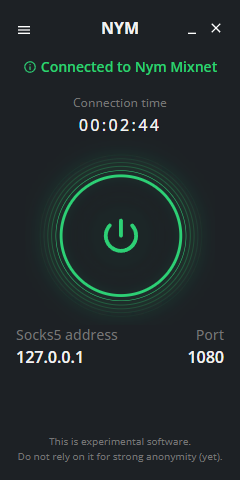<figcaption></figcaption></figure>


If you wish to choose your gateway from the provided [list](https://explorer.nymtech.net/network-components/gateways) or configure your service provider, you can do so by accessing the settings menu. Simply click on the **hamburger** icon located in the top-left corner -> **Settings -> Select your gateway** / **Select your service provider** using **\<requesteraddress>** before configured


### Proxying wallets

#### Electrum

Follow the [Electrum Wallet desktop guide](../../bonus/bitcoin/electrum-wallet-desktop.md). You have 2 options:

1. If you don't have your node and you want to **proxy** all connections (**The Electrum Servers** of the wallet & **third-party server connections**) using the NYM mixnet

Use this **example** of a shortcut for Linux to select a public server automatically proxying using NYM mixnet:

```bash
$ ./electrum-4.4.5-x86_64.AppImage -p socks5:localhost:1080
```

Or directly on the interface; on the top menu, go to **Tools** --> **Network** --> Proxy tab, check "**Use proxy**", select "**SOCKS5**"

> > Host: 127.0.0.1 or localhost
>
> > Port: 1080

<div>

<figure>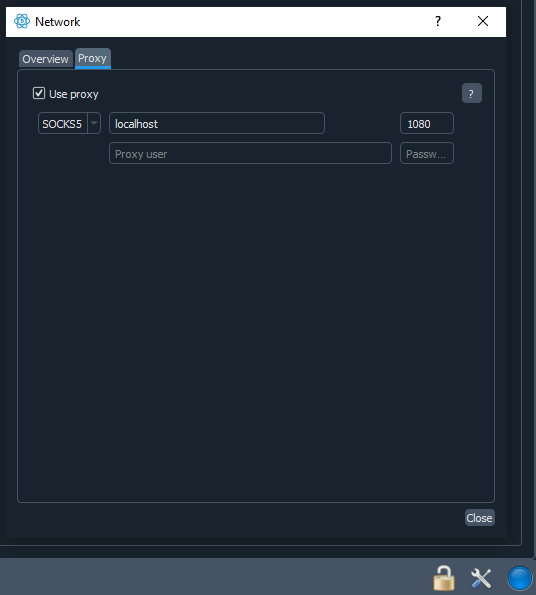<figcaption><p>Electrum SOCKS5 proxy configuration</p></figcaption></figure>

 

<figure>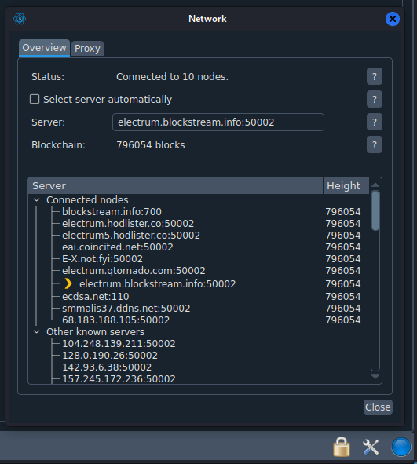<figcaption><p>Electrum servers connected using NYM mixnet</p></figcaption></figure>

</div>

2. If you have your node and you only want to proxy all third-party connections (price servers, Whirlpool, etc.) using the NYM mixnet

Use this **example** of a shortcut for Linux to select your private server (your MiniBolt Electrum server), proxying through NYM mixnet:


```bash
$ ./electrum-4.4.5-x86_64.AppImage -1 -s 192.168.1.147:50002:s -p socks5:localhost:1080
```


<figure>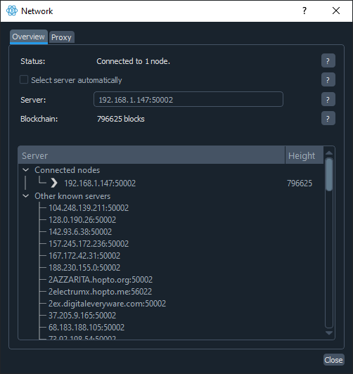<figcaption></figcaption></figure>


If you have installed the NYM socks5 client installed in a machine inside of your local network, you can point the service to its IP address **instead of localhost** (127.0.0.1), e.g. `192.168.1.94:1080`


#### Sparrow desktop

Follow the [Desktop wallet: Sparrow Wallet](../../bitcoin/desktop-wallet.md) until the [(Optional) Set up a Tor proxy for external services](../../bitcoin/desktop-wallet.md#optional-set-up-a-tor-proxy-for-external-services), which could be used for these 2 cases of uses:

1. If you don't have your node and you want to **proxy** all connections (**The Electrum Servers** of the wallet & **third-party server connections**) using the NYM mixnet

> > URL: select one of the public serveres provided for Sparrow
>
> > Swich "Use proxy"
>
> > Proxy URL: 127.0.0.1 --> Port: 1080

<div align="center" data-full-width="false">

<figure>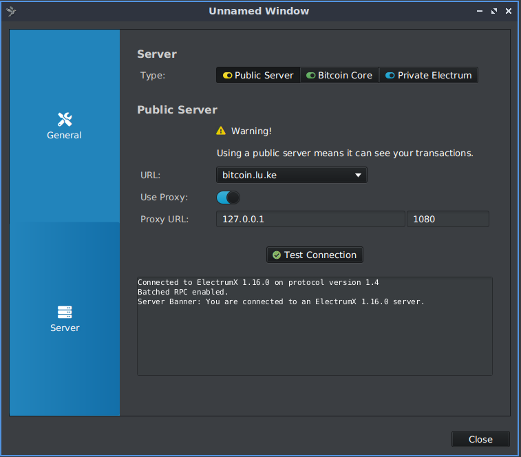<figcaption></figcaption></figure>

</div>

2. If you have your node and you only want to proxy all third-party connections (price servers, Whirlpool, etc.) using the NYM mixnet

<figure>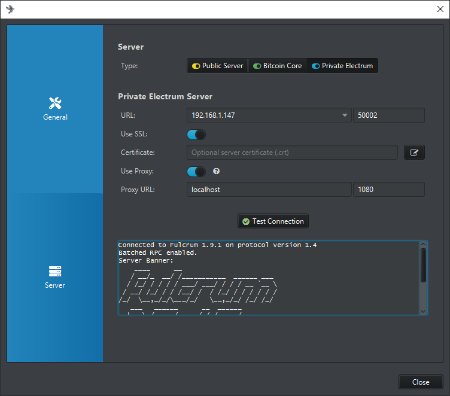<figcaption></figcaption></figure>


If you have installed the NYM socks5 client installed in a machine inside of your local network, you can point the service to its IP address **instead of localhost** (127.0.0.1), e.g. `192.168.1.94:1080`


#### Sparrow server

Follow the [Sparrow server bonus guide](../../bonus/bitcoin/sparrow-server.md), which could be used for these 2 cases of uses:

1. If you have your node and you only want to proxy all third-party connections (price servers, Whirlpool, etc.) using the NYM mixnet

Go to **Preferences -> Server -> Private Electrum**

> > URL: select your MiniBolt IP address or localhost (127.0.0.1) if running on the same device, and select 50001 (mainnet) / 60001 (testnet) (TCP) or 50002 (mainnet) / 60002 (testnet) (SSL) port
>
> > Select "**yes**" to use SSL, if you use 50002 (mainnet) / 60002 (testnet) SSL connection
>
> > Select "**yes**" to use use proxy -> Proxy URL: 127.0.0.1 -> port 1080

<figure>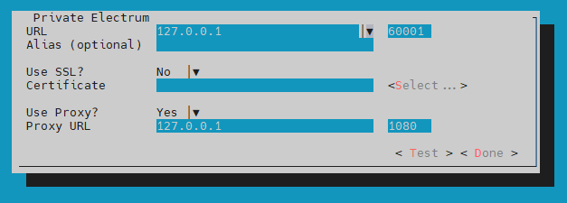<figcaption><p>Sparrow server using Electrum Server testnet mode in localhost and proxy NYM mixnet</p></figcaption></figure>

* Press "Test" or "Done" and wait to connect


You have Sparrow server configured to proxy third parties servers connection using NYM mixnet


2. If you don't have your node and you want to **proxy** all connections (**The Electrum Servers** of the wallet & **third-party server connections**) using the NYM mixnet

Go to **Preferences -> Server -> Public Electrum**

> > URL: select one of the public serveres provided for Sparrow
>
> > Select "yes" to use use proxy -> Proxy URL: 127.0.0.1 -> port 1080

<figure>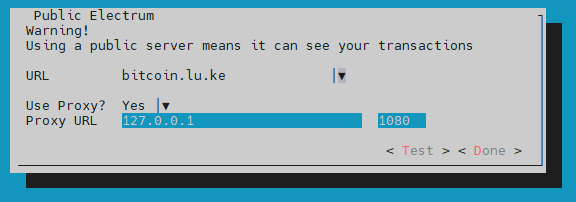<figcaption></figcaption></figure>


You have Sparrow server configured to proxy public Electrum servers and third parties servers connection using NYM mixnet



If you have installed the NYM socks5 client installed in a machine inside of your local network, you can point the service to its IP address **instead of localhost** (127.0.0.1), e.g. `192.168.1.94:1080`


#### Blockstream Green

Download the [Blockstream Greenwallet app](https://github.com/Blockstream/green\_qt/releases) for your OS and install it.

Go to **App Settings ->** Navigate to **Network ->** switch "**Connect through a proxy**"

> > Proxy host: 127.0.0.1
>
> > Proxy port: 1080

<figure>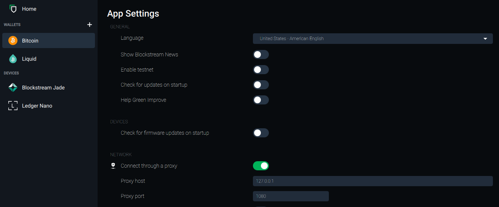<figcaption><p>Screenshot showing a proxy connection using NYM mixnet</p></figcaption></figure>

#### Bitbox app

Download the [Bitbox app](https://bitbox.swiss/download/?source=bitboxapp) for your OS and install it.

Go to **Settings** -> **Advanced settings -> Enable Tor proxy,** check **"Enable Tor proxy"** and type `127.0.0.1:1080` -> **Set proxy address**

Go to "Connect your full node" -> Check the pre-setted Electrum servers Bitbox app or choose one of your elections, Go to Add a server:

1. Enter the endpoint: `electrum.blockstream.info:50002`
2. Click on the **"Download remote certificate"** button
3. Click on the "**Check**" button, click **OK**
4. Finally, click on the "**Add**" button and click again on the "**Check**" button, and "**OK**"

<figure>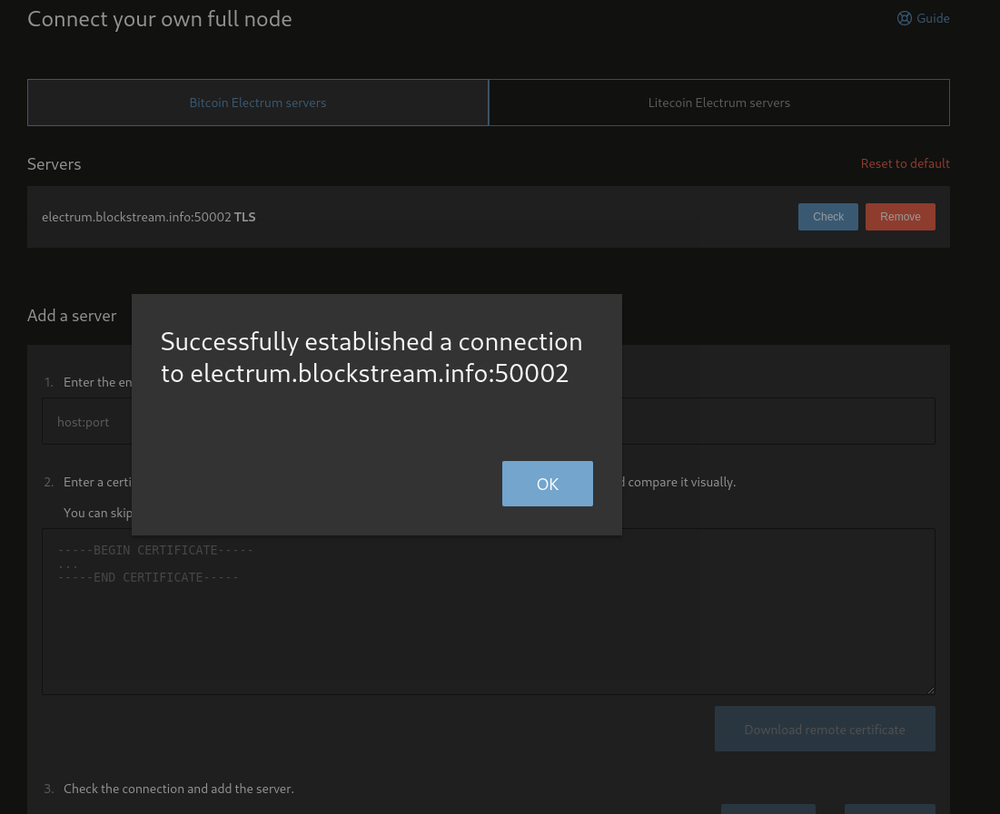<figcaption></figcaption></figure>


If you have installed the NYM socks5 client installed in a machine inside of your local network, you can point the service to its IP address **instead of localhost** (127.0.0.1), e.g. `192.168.1.94:1080`


#### Nunchuk desktop

[Download](https://github.com/nunchuk-io/nunchuk-desktop/releases) the Nunchuk wallet desktop version for your OS and install it.

Go to **Settings** -> **Network Settings** -> **Enable Tor proxy,** check **"Enable Tor proxy"** and type in the "Proxy address" box:`127.0.0.1` and in the "Port" box: `1080`. Above, enable "Connect to Electrum server", select "Mainnet server", keep the public Nunchuk address server by default, or click on the "Reset" button. Leave the rest of the boxes blank and finally click on "Save network settings".

<div>

<figure>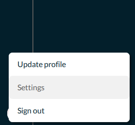<figcaption></figcaption></figure>

 

<figure>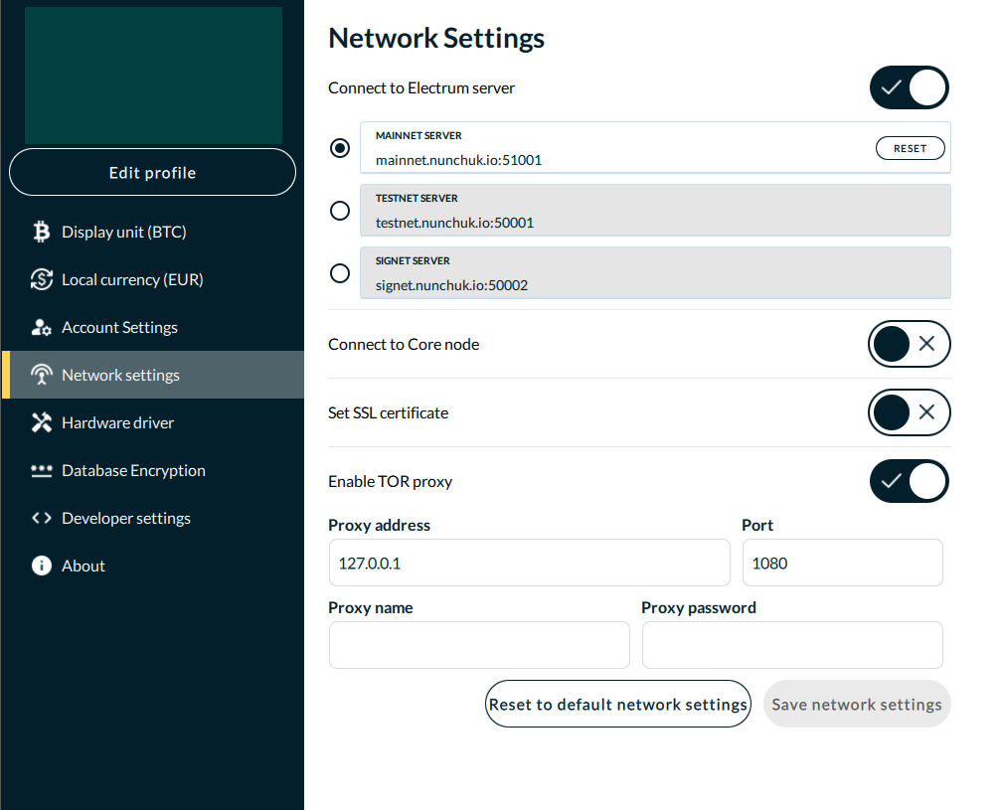<figcaption></figcaption></figure>

</div>


If you have installed the NYM socks5 client installed in a machine inside of your local network, you can point the service to its IP address **instead of localhost** (127.0.0.1), e.g. `192.168.1.94:1080`


### Proxying other services

#### Keybase

Download the [Keybase](https://keybase.io/download) app for your OS and install it\
\
Go to **Settings** -> **Advanced ->** Navigate to **"Proxy settings",** and check **"SOCKS5",** type this info:

> > Proxy Address: 127.0.0.1
>
> > Proxy Port: 1080

<figure>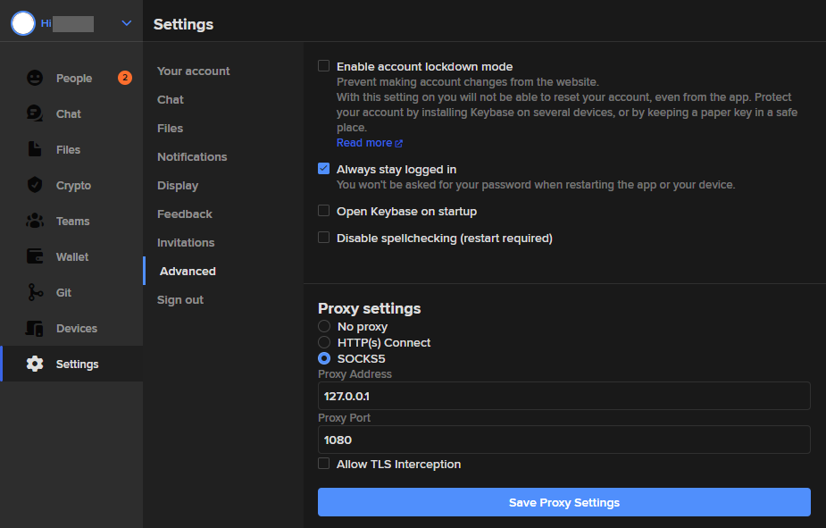<figcaption></figcaption></figure>


**Save proxy Settings**



If you have installed the NYM socks5 client installed in a machine inside of your local network, you can point the service to its IP address **instead of localhost** (127.0.0.1), e.g. `192.168.1.94:1080`


#### Telegram Desktop

Download the [Telegram](https://desktop.telegram.org/) app for your OS

Use this [link](https://t.me/socks?server=127.0.0.1\&port=1080) to automatically save the configuration, click on "**Enable**" or go to **Settings -> Advanced -> Connection type -> Check "use custom proxy"**

<figure>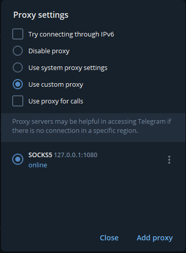<figcaption></figcaption></figure>


Save and close all banners to go back to the running app



If you have installed the NYM socks5 client installed in a machine inside of your local network, you can point the service to its IP address **instead of localhost** (127.0.0.1), e.g. `192.168.1.94:1080`


#### Browser (Firefox-based browsers)

Download [Firefox](https://www.mozilla.org/es-ES/firefox/all/#product-desktop-release) | [Librewolf](https://librewolf.net/installation/) | [Mullvad](https://mullvad.net/es/download/browser/linux) or any Firefox-based browser for your OS\
\
Go to **General** -> **Network Settings** -> **Settings**...

Fill the form with the next data:

<figure>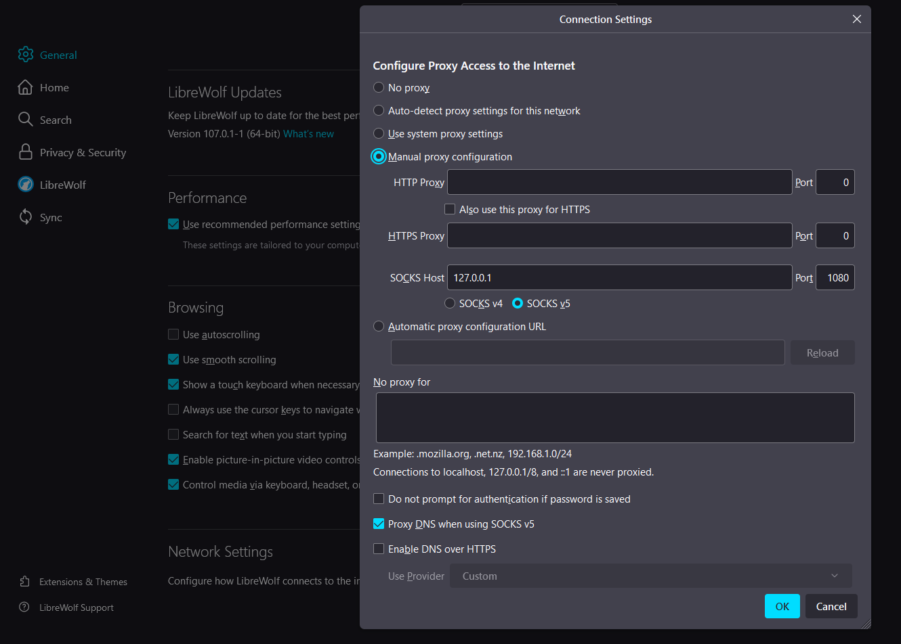<figcaption></figcaption></figure>


Press OK and start the navigation



If you have installed the NYM socks5 client installed in a machine inside of your local network, you can point the service to its IP address **instead of localhost** (127.0.0.1), e.g. `192.168.1.94:1080`


### NYM android

At the moment, the Android app is undergoing constant development, and the download link on the GitHub repository is being regularly updated, with some updates being non-functional. The following link is not available on GitHub, but it is a static and functional link, although it is also a pre-alpha version and may have bugs on certain occasions.

Download [here](https://nymtech.net/nyms5-arm64-v8a-debug.apk) or in the future, download [here](https://github.com/nymtech/nym/releases/tag/nyms5-android-v1.0)

<figure>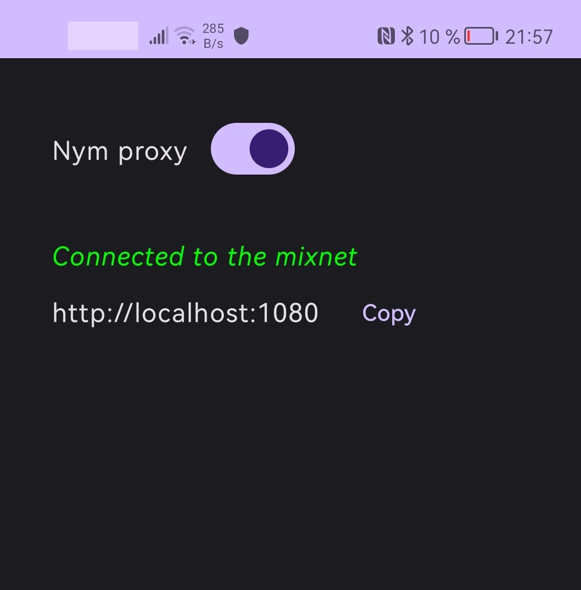<figcaption></figcaption></figure>


You could use NYM proxy with the Telegram app for example ⬇️


Scan [**this QR code**](https://files.gitbook.com/v0/b/gitbook-x-prod.appspot.com/o/spaces%2Fdgm2BbSsYdaTVDCk9Tde%2Fuploads%2FtMxUa6RB6JGOvLsg4rR0%2Ftg-app-nym-proxy-qr.jpg?alt=media\&token=653cdc12-2144-4dd5-8d76-1fccfc97265c)**,** click on **"Connect proxy"** or manually, go to **Settings** -> **Data and Storage** -> **Proxy Settings ->** switch **"Use proxy"**

> > Keep selected **"SOCKS5 proxy"**
>
> > Server: 127.0.0.1
>
> > Port: 1080


Save, switch "Use proxy" again


<div>

<figure>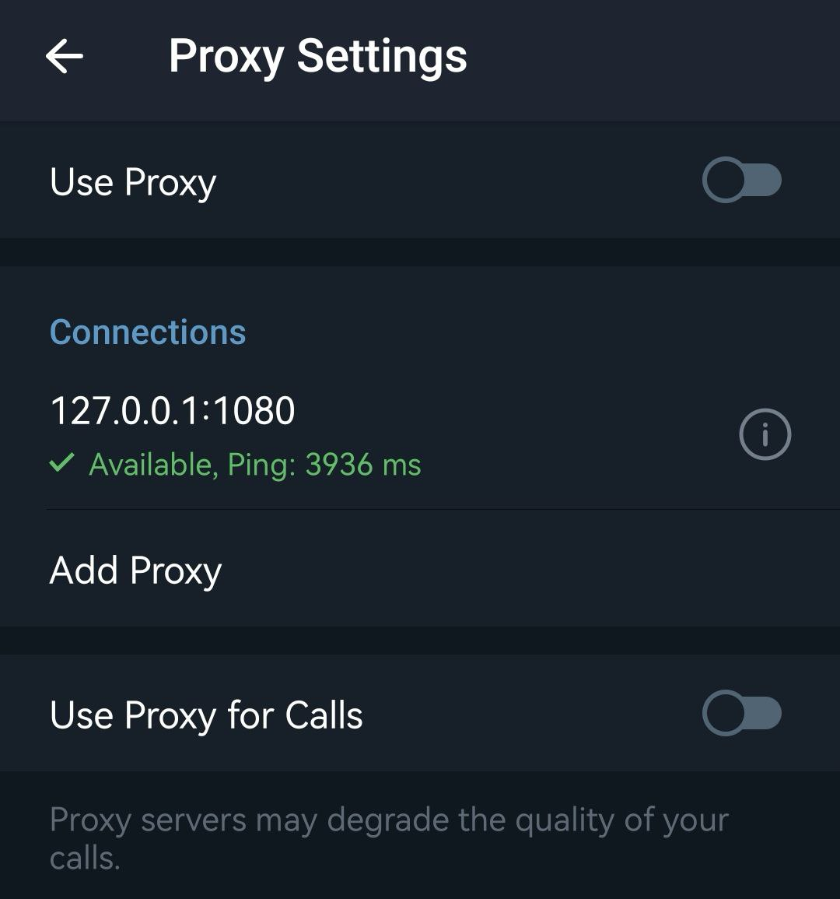<figcaption></figcaption></figure>

 

<figure>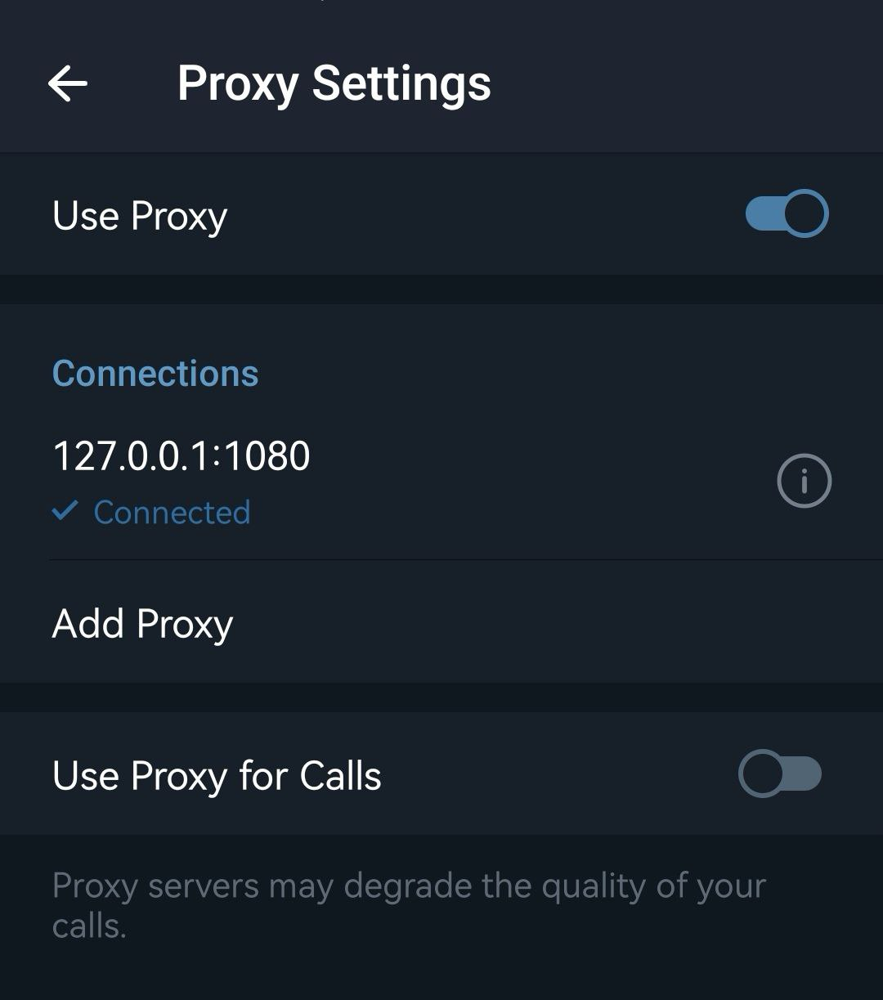<figcaption></figcaption></figure>

</div>


**Notice**: This app **consumes significant data and battery** when connected to the mixnet network. Please be aware that prolonged usage may result in increased data usage and reduced battery life. This is primarily due to the constant emission of false packets by the app



If you have installed the NYM socks5 client installed in a machine inside of your local network, you can point the service to its IP address **instead of localhost** (127.0.0.1), e.g. `192.168.1.94:1080`


### Other NYM tools



An adaptation of pastebin.com, using NYM mixnet, to protect users and their data but especially their metadata\
\
[Link](https://pastenym.ch) | [GitHub](https://github.com/notrustverify/pastenym)\
\
Paste NYM-CLI -> [GitHub](https://github.com/notrustverify/pastenym-cli)



A simple chat client that sends its traffic through the NYM mixnet

[Link](https://chat-demo.nymtech.net/) | [GitHub](https://github.com/nymtech/demo-mixnet-chat-client)



Proxy for using Nostr over Nym mixnet. Nostr-nym is a proxy for using Nostr through the Nym Mixnet. It stands between Nostr users and a specific Nostr relay, preferably on the same machine as the relay, allowing users to connect to this relay without leaking their IP address to it

[GitHub](https://github.com/notrustverify/nostr-nym)



A Nostr client connected to a Nostr-NYM Proxy\
\
[Link](https://nostrnym.pnproxy.org/) | [GitHub](https://github.com/Pineapple-Proxy-DAO/iris-messenger)





\[Unofficial] Swap different tokens <> NYM token

[Link](https://nymswap.com/)



Explorer to get information on the NYM network components

[Link](https://explorer.nymtech.net/)



## Upgrade

* First, ensure that you have the latest Rustc version following the [Upgrade section](rustup-+-cargo.md#upgrade) of the Rustup + Cargo bonus guide
* Follow again the entire [Compile NYM binaries from the source code](nym-mixnet.md#compile-nym-binaries-from-the-source-code) section until the **"Enter the command to compile"** step (inclusive), once you do that, continue with the next steps below:
* With `admin` user, stop `NYM socks5 client & NYM Network requester`

```bash
$ sudo systemctl stop nym-network-requester
```

```bash
$ sudo systemctl stop nym-socks5-client
```

### Upgrade network requester

* Replace the network requester binary

```bash
$ sudo cp /tmp/nym/target/release/nym-network-requester /home/nym/
```

* Change to the nym user

```bash
$ sudo su - nym
```

* Init again the network requester to update the `config.toml` file if needed

```bash
$ ./nym-network-requester init --id bitcoin --latency-based-selection
```

* Check the correct update

```bash
$ ./nym-network-requester -V
```

**Example** of expected output:

```
> nym-network-requester 1.1.24
```

* Exit from the `nym` user session

```bash
$ exit
```

* Start network requester again

```bash
$ sudo systemctl start nym-network-requester
```

### Upgrade socks5 client

* Replace the socks5 client binary

```bash
$ sudo cp /tmp/nym/target/release/nym-socks5-client /home/nym/
```

* Change to the nym user

```bash
$ sudo su - nym
```

* Init again the socks5 client with the same command and service provider, this updates the `config.toml` file if needed


```bash
$ ./nym-socks5-client init --id bitcoin --latency-based-selection --provider <requesteraddress>
```


* Check the correct update

```bash
$ ./nym-socks5-client -V
```

**Example** of expected output:

```
>  nym-socks5-client 1.1.24
```

* Exit from the `nym` user

```bash
$ exit
```

* Start socks5 client again

```bash
$ sudo systemctl start nym-socks5-client
```

* Delete the NYM compilation folder to be ready for the next update and free up space

```bash
$ sudo rm -r /tmp/nym
```

## Uninstall

* With user `admin`, stop network requester and socks5 client services

```bash
$ sudo systemctl stop nym-network-requester
```

```bash
$ sudo systemctl stop nym-socks5-client
```

* Delete network requester and socks5 client services

```bash
$ sudo rm /etc/systemd/system/nym-network-requester.service
```

```bash
$ sudo rm /etc/systemd/system/nym-socks5-client.service
```

* Delete nym user. Don't worry about `userdel: nym mail spool (/var/mail/nym) not found` output, the uninstall has been successful

```bash
$ sudo userdel -rf nym
```

## Troubleshooting

NYM is currently in development and may experience occasional issues.

<figure>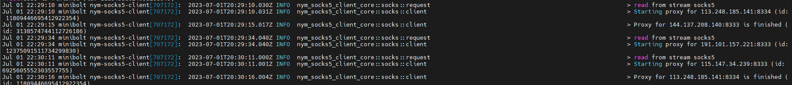<figcaption><p>Example of issues with a nym socks5 client</p></figcaption></figure>

If you encounter any issues, they may be related to the gateway. To resolve this, you can attempt to change the gateway by deleting the data folder.

**Case NYM network requester issues:**

* With user `admin`, stop the network requester

```bash
$ sudo systemctl stop nym-network-requester
```

* Change to the nym user

```bash
$ sudo su - nym
```

* Init again network requester, by following the [Init NYM network requester](nym-mixnet.md#install-nym-network-requester) section, this time with `--force-register-gateway` and `--gateway` flags (remember deleting `--latency-based-selection flag`). Choose one gateway from this [list](https://explorer.nymtech.net/network-components/gateways), using its ID key


**Example:** `./nym-network-requester init --id bitcoin --gateway 2xU4CBE6QiiYt6EyFCSALwxKNvM7gqJfjHXaMkjiFmYW --force-register-gateway`



Take note of the new "`Address of this network-requester:..."` to refresh it on socks5 clients are using this network requester ("`--provider"` flag)


* Exit the nym user session to go back to the admin user

```bash
$ exit
```

* Start network requester again

```bash
$ sudo systemctl start nym-network-requester
```

**Case NYM socks5 client issues:**

* With user `admin`, stop the socks5 client

```bash
$ sudo systemctl stop nym-socks5-client
```

* Change to the nym user

```bash
$ sudo su - nym
```

* Init again the socks5 client by following the [Init NYM socks5 client](nym-mixnet.md#init-nym-socks5-client) section, this time with `--force-register-gateway` and -`-gateway` flags (remember deleting `--latency-based-selection flag`). Choose one gateway from this [list](https://explorer.nymtech.net/network-components/gateways), using its ID key. Remember to change the network requester address (service provider) if you change it at any moment


**Example:** `./nym-socks5-client init --id bitcoin --gateway 2xU4CBE6QiiYt6EyFCSALwxKNvM7gqJfjHXaMkjiFmYW --provider 84K1SPBsSPGcCGQ6hK4AYKXuZHb5iU3zBc9gYb3cJp6o.Cfc67agMVw6GRjPb7ZyEfZSwLeVSvYtqKCKmATewujajT@2xU4CBE6QiiYt6EyBXSALwxkNvM7gqJfjHXaMkjhdjywS --force-register-gateway`


* If you want to change only the service provider of your nym socks5 client connected, edit the config file and replace the `provider_mix_address =` parameter with the new one. With user `nym.` Save and exit

```bash
$ nano /home/nym/.nym/socks5-clients/bitcoin/config/config.toml
```

<details>

<summary>Example ⬇️</summary>

```
[core.socks5]

# The mix address of the provider to which all requests are going to be sent.
provider_mix_address = '84K1SPBsSPGcCGQ6hK4AYKXuZHb5iU3zBc9gYb3cJp6o.Cfc67agMVw6GRjPb7ZyEfZSwLeVSvYtqKCKmATewujajT@2xU4CBE6QiiYt6EyBXSALwxkNvM7gqJfjHXaMkjhdjywS'
```

</details>

* Exit the `nym` user session to go back to the `admin` user

```bash
$ exit
```

* Start socks5 client again

```bash
$ sudo systemctl start nym-socks5-client
```

## Port reference

| Port | Protocol |             Use            |
| :--: | :------: | :------------------------: |
| 1080 |    TCP   | Socks5 client default port |

[^1]: ID key of the gateway selected or assigned
