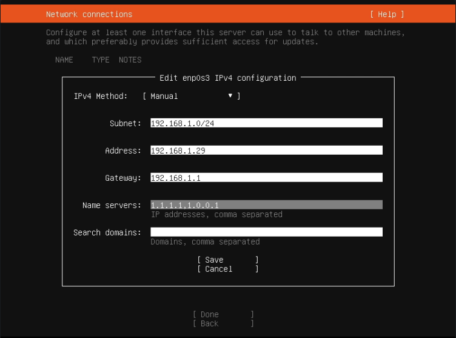
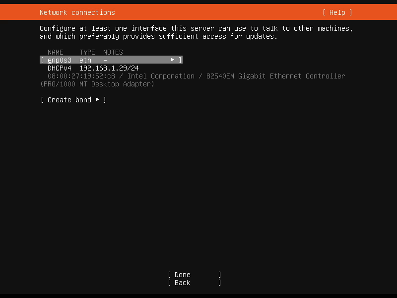

---
layout:
  title:
    visible: true
  description:
    visible: false
  tableOfContents:
    visible: true
  outline:
    visible: true
  pagination:
    visible: true
---

# Static IP & custom DNS servers

Set a static IP address and custom DNS nameservers for your MiniBolt.


Difficulty: Easy


<figure><figcaption></figcaption></figure>

The router reserves the IP address of the device for a time after going out, but if the device goes out soo time, the next time that the device starts, the router could assign a different IP and you could lose access to your node. To avoid this, you need to set a static IP to your node.


**Be careful by setting this!** If you change the router, could be the new router doesn't work in the same IP address range as the old router, the device won't be registered on the local network and will be completely out of the connection.

💡 To avoid this, you will need to **enable the "Automatic (DHCP)" mode before changing the router**, following the [Set the DCHP (automatic) configuration](static-ip-and-custom-dns-servers.md#set-the-automatic-dhcp-mode-configuration-by-command-line) to ensure that the DHCP server auto assigns an IP to the node in the range you are working on, and if you want, after router change, reconfigure the static IP address again following the [Option 2](static-ip-and-custom-dns-servers.md#option-2-after-ubuntu-server-installation-by-command-line) of this guide.

If you don't do this, you will have to attach the monitor screen or television and keyboard to fix this.


In addition, you can customize your DNS servers to improve your privacy, normally your ISP, gives you the router with its own DNS servers configured by default, and this does that you expose all of your navigation trackings to your ISP, affecting seriously your privacy.

### Option 1: At the beginning, during the Ubuntu Server installation GUI

When you arrive at **step 5** of the [Ubuntu Server installation](../../index-1/operating-system.md#ubuntu-server-installation), you can want to choose set a static IP address and customize the DNS name server/s.

Wait for the router automatically assign the IP address to your MiniBolt node to find out what IP range the node is in, you will be able to assign the same or a different IP in the next step.

<figure><figcaption><p>GIF example of a Static IP &#x26; custom DNS server configuration</p></figcaption></figure>

> > **Subnet:** your router subnet, e.g 192.168.1.0/24
>
> > **Address**: your assigned local IP address, eg. 192.168.1.29
>
> > **Gateway:** you router IP, eg. 192.168.1.1
>
> > **Name servers:** DNS servers choosen, eg. same of gateway (192.168.1.1,192.168.1.1) (your ISP DNS) or Cloudflare DNS server (1.1.1.1,1.0.0.1) <- **(recommended)**
>
> > **Search domains:** \<left blank>


This is **only** an **example** if your local network IP range is `192.168.1.0-255,` because for this case, the router assigned to the device the IP address **192.168.1.29**, but could be **192.168.0.29** (`192.168.0.0-255)`, then you will need to set this instead:

> **Subnet:** 192.168.0.0/24

> **Gateway:** 192.168.0.1



In this step, you can set DNS name servers too, for this example, we have configured [Cloudflare DNS name servers](https://www.cloudflare.com/learning/dns/what-is-1.1.1.1/) (1.1.1.1/1.0.0.1) but you could set [others](https://www.quad9.net/service/service-addresses-and-features)


### Option 2: After Ubuntu Server installation (by command line)

After having done the [1.3 Remote access](remote-access.md) section, you could want to set a static IP address to your MiniBolt by the command line.

#### Preparations

* Stay login with user **admin**, and check your current data network interface by doing

```bash
$ ip address
```

Check your own configuration, the next output is **only** an **example** of a concrete case, but in your case could be different:

<pre><code>1: lo: &#x3C;LOOPBACK,UP,LOWER_UP> mtu 65536 qdisc noqueue state UNKNOWN group default qlen 1000
    link/loopback 00:00:00:00:00:00 brd 00:00:00:00:00:00
    inet 127.0.0.1/8 scope host lo
       valid_lft forever preferred_lft forever
    inet6 ::1/128 scope host
       valid_lft forever preferred_lft forever
2: <a data-footnote-ref href="#user-content-fn-1">eno1</a>: &#x3C;BROADCAST,MULTICAST,UP,LOWER_UP> mtu 1500 qdisc fq_codel state UP group default qlen 1000
    link/ether 40:a8:f0:ac:6a:37 brd ff:ff:ff:ff:ff:ff
    altname enp0s25
    inet 192.168.1.147/24 metric 100 brd 192.168.1.255 scope global dynamic eno1
       valid_lft 76855sec preferred_lft 76855sec
    inet6 fe80::42a8:f0ff:feac:6a37/64 scope link
       valid_lft forever preferred_lft forever
</code></pre>

Definitions in the case of before:

> > ```
> > <interface> = e.g eno1
> > ```
>
> > ```
> > <ipaddress> = e.g 192.168.1.147
> > ```
>
> > ```
> > <gateway> = 192.168.1.1 (this case) -> case 192.168.0.147, choose 192.168.0.1
> > ```


Take note of your case data, you will need it later


* Check the current DNS server set, typing the next command

```bash
$ resolvectl status
```

**Example** of expected output (more common):

```
Global
       Protocols: -LLMNR -mDNS -DNSOverTLS DNSSEC=no/unsupported
resolv.conf mode: stub

Link 2 (eno1)
    Current Scopes: DNS
         Protocols: +DefaultRoute +LLMNR -mDNS -DNSOverTLS DNSSEC=no/unsupported
Current DNS Server: 192.168.1.1
       DNS Servers: 192.168.1.1
        DNS Domain: home
```

In the case of before:

> ```
> <nameserver1> = 192.168.1.1 ( = <gateway>, the DNS servers of your ISP)
> ```
>
> ```
> <nameserver2> = (secondary DNS server, not setted in this case)
> ```

#### Configuration

* Edit the content of the next file

<pre class="language-bash"><code class="lang-bash"><strong>$ sudo nano /etc/netplan/00-installer-config.yaml
</strong></code></pre>

* Replace the content to match this template

```
# This is the network config written by 'subiquity'
network:
  ethernets:
    <interface>:
      addresses:
      - <ipaddress>/24
      nameservers:
        addresses:
        - <nameserver1>
        - <nameserver2>
        search: []
      routes:
      - to: default
        via: <gateway>
  version: 2
```


Replace **\<interface>**, **\<ipaddress>**, **\<nameserver1>, \<nameserver2>** <-- (optional but recommended)**,** and **\<gateway>** to your own data.\
\
You can choose the DNS server (**\<nameserver1> +** **\<nameserver2>**) whatever you want, including the default one set in the DNS server of your router (normally DNS servers of your ISP), in this last case, you should type the **\<gateway>** address in **\<nameserver1>** and the same in **\<nameserver2>**.

For this example, we have configured [Cloudflare DNS name servers](https://www.cloudflare.com/learning/dns/what-is-1.1.1.1/) (1.1.1.1,1.0.0.1) <-- (recommended), but you could set [others](https://www.quad9.net/service/service-addresses-and-features)


<details>

<summary>Example ⬇️</summary>

```
# This is the network config written by 'subiquity'
network:
  ethernets:
    eno1:
      addresses:
      - 192.168.1.87/24
      nameservers:
        addresses:
        - 1.1.1.1
        - 1.0.0.1
        search: []
      routes:
      - to: default
        via: 192.168.1.1
  version: 2
```

</details>

* Finally, type this command to apply the changes

```bash
$ sudo netplan apply
```


Now you have set your static IP address and custom DNS servers



If you chose a different IP address than the router assigned you at first and has currently, this step could break the current SSH connection, reconnect using the new and chosen IP address


#### Check changes

* To check the successful IP address change, type the next command

```bash
$ ip address
```


The output of this command **may not change**, depending on whether you chose the same IP that the router originally assigned you at first, or whether you chose to change to another


* To check the successful DNS servers change, type the next command

```bash
$ resolvectl status
```

<details>

<summary>Example of expected output⬇️</summary>

```
Global
       Protocols: -LLMNR -mDNS -DNSOverTLS DNSSEC=no/unsupported
resolv.conf mode: stub

Link 2 (eno1)
    Current Scopes: DNS
         Protocols: +DefaultRoute +LLMNR -mDNS -DNSOverTLS DNSSEC=no/unsupported
Current DNS Server: 1.1.1.1
       DNS Servers: 1.1.1.1 1.0.0.1
[...]
```

</details>

### Set the A**utomatic (DHCP) mode** configuration (by command line)

If you go to change the router you could want to enable or check if you have enabled the a**utomatic (DHCP) mode** configuration to avoid problems

* Edit the content of the next file

<pre class="language-bash"><code class="lang-bash"><strong>$ sudo nano /etc/netplan/00-installer-config.yaml
</strong></code></pre>

* Replace the content to match this template, replacing **\<interface>** with your data obtained in the [Preparations](static-ip-and-custom-dns-servers.md#preparations) section before

<pre><code><strong># This is the network config written by 'subiquity'
</strong>network:
  ethernets:
    &#x3C;interface>:
      dhcp4: true
  version: 2
</code></pre>

* Finally, type this command to apply the changes

```bash
$ sudo netplan apply
```


Check changes are applied correctly following the [same step](static-ip-and-custom-dns-servers.md#check-changes) as before



You have gone back to the **automatic (DHCP) mode** configuration successfully


[^1]: \<interface>
