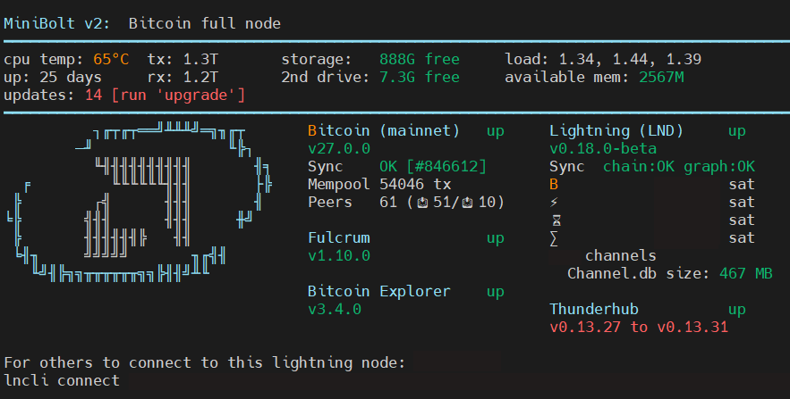

---
layout:
  title:
    visible: true
  description:
    visible: false
  tableOfContents:
    visible: true
  outline:
    visible: true
  pagination:
    visible: true
---

# System Overview

To get a quick overview of the system status, you can use [a shell script](https://github.com/minibolt-guide/system\_overview) that gathers the most relevant data about the service on the main guide.


Difficulty: Easy


<figure><figcaption></figcaption></figure>

### Acknowledgments <a href="#acknowledgments" id="acknowledgments"></a>

This is a fork of the [minibolt\_info](https://github.com/rmnscb/minibolt\_info) repository, the main developer of this project is [rmnscb](https://github.com/rmnscb), a member of the MiniBolt community, all the merits go to him. Thank you for your contribution 🧡🫂

## Installation

### Install dependencies

* With user `admin`, install the necessary dependencies using the apt package manager

```bash
sudo apt install jq net-tools netcat
```

### Install

* Go to the temporary folder

```bash
cd /tmp
```

* Clone the GitHub repository and enter it


```bash
git clone https://github.com/minibolt-guide/system_overview && cd system_overview
```



You can inspect the scripts to make sure it does not do bad things, by going to the [GitHub repository](https://github.com/minibolt-guide/system\_overview)


* Install it to the system

```bash
sudo install -m 0755 -o root -g root -t /usr/local/bin *.sh
```

**(Optional)** Delete the folder of the temporary folder to be ready for the upgrade

```bash
sudo rm -r /tmp/system_overview
```

## Run

* Exec the script by typing the next command

```bash
minibolt.sh
```


> You should see a loading process, and if you have an `admin` user password set, the prompt should ask you for this. Enter the `password [A]` and enter

> To avoid the prompt asking you to enter the user admin password before the script load, follow [this section](../../bonus/system/ssh-keys.md#disable-admin-password-request-optional-caution). ⚠️**Taking into account that it carries a security risk** ⚠️

> ✅ Finally, the terminal shows you something like [the cover photo of this bonus guide](https://v2.minibolt.info/bonus-guides/system/system-overview) 🎨


## Extras (optional)

### Show on login <a href="#show-on-login-optional" id="show-on-login-optional"></a>

> Run the welcome script automatically every time you log in

* With user `admin`, add `minibolt.sh` to the end of your `.bashrc` file

```bash
echo "minibolt.sh" >> ~/.bashrc
```


Now log in again as a user `admin` [opening a new SSH session](../../index-1/remote-access.md#access-with-secure-shell) you can see the process of exec script before the prompt shows you.

> To avoid the prompt asking you to enter the user admin password before the script load, follow [this section](../../bonus/system/ssh-keys.md#disable-admin-password-request-optional-caution). ⚠️**Taking into account that it carries a security risk** ⚠️

> If you’re in a hurry, you can always press `Ctrl`-`C` to skip the script



To uninstall the show on login feature, type the next command:

```bash
sed -i '/minibolt.sh/d' ~/.bashrc
```

Now log in again as a user `admin` [opening a new SSH session](../../index-1/remote-access.md#access-with-secure-shell) to see that it doesn't appear anymore


### Get the `channel.db` size of an old LND bbolt database backend

* With user `admin`, go to the temporary folder

```bash
cd /tmp
```

* Clone the dedicated branch of the GitHub repository and enter it


```bash
git clone --branch LND_bboltdb https://github.com/minibolt-guide/system_overview && cd system_overview
```


* Check out again the correct branch

```bash
git checkout LND_bboltdb
```

Expected output:

```
Already on 'LND_bboltdb'
Your branch is up to date with 'origin/LND_bboltdb'.
```

* Install it to the system

```bash
sudo install -m 0755 -o root -g root -t /usr/local/bin *.sh
```

* Run following the properly [Run section](system-overview.md#run)

**(Optional)** Delete the folder of the temporary folder to be ready for the upgrade

```bash
sudo rm -r /tmp/system_overview
```

### Use the MobaXterm compatibility version

MobaXterm is not compatible with special characters like "₿", by default. So we should replace it with the simple character "B".

* With user `admin`, go to the temporary folder

```bash
cd /tmp
```

* Clone the dedicated branch of the GitHub repository and enter it


```bash
git clone --branch LND_postgres_mobaX https://github.com/minibolt-guide/system_overview && cd system_overview
```


* Check out again the correct branch

```bash
git checkout LND_postgres_mobaX
```

Expected output:

```
Already on 'LND_postgres_mobaX'
Your branch is up to date with 'origin/LND_postgres_mobaX'.
```

* Install it to the system

```bash
sudo install -m 0755 -o root -g root -t /usr/local/bin *.sh
```

* Run following the properly [Run section](system-overview.md#run)

**(Optional)** Delete the folder of the temporary folder to be ready for the upgrade

```bash
sudo rm -r /tmp/system_overview
```

## Upgrade

To upgrade, follow the complete [Installation process](system-overview.md#install) and [Run](system-overview.md#run) again

## Uninstall

* With user `admin`, type the next command to uninstall


```bash
sudo rm /usr/local/bin/minibolt.sh && sudo rm /usr/local/bin/get_LND_data.sh && sudo rm /usr/local/bin/get_CLN_data.sh
```

