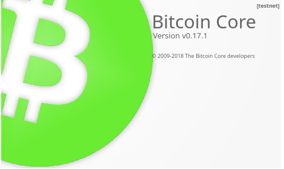

---
layout:
  title:
    visible: true
  description:
    visible: false
  tableOfContents:
    visible: true
  outline:
    visible: true
  pagination:
    visible: true
---

# MiniBolt on Testnet

You can run your MiniBolt node on testnet to develop and experiment with new applications, without putting real money at risk. This bonus guide highlights all configuration changes compared to the main guide.


Difficulty: Medium


<figure><figcaption></figcaption></figure>

## Introduction

Running a testnet node is a great way to get acquainted with the MiniBolt and the suite of Bitcoin-related software typical of these powerful setups. Moreover, testnet empowers users to tinker with the software and its many configurations without the threat of losing funds. Helping bitcoiners run a full testnet setup is a goal worthy of the MiniBolt, and this page should provide you with the knowledge to get there.

The great news is that most of the MiniBolt guide can be used as-is. The small adjustments come in the form of changes to the config files and ports for testnet. You can follow the guide and simply replace the following configurations in the right places as you go.


> <mark style="color:red;">**Advice:**</mark>
>
> For the moment, this guide will touch only the case of an **only testnet mode** situation, in the future, we will study adding the case of configuration to enable the parallel/simultaneous mode (mainnet+testnet in the same device) in an extra section in this guide.

> The services mentioned in this guide are those that have been tested using testnet configuration and these worked fine. Later, in the next versions of this guide, we will go to adding other process to adapt other services to the testnet mode.


## Bitcoin

### [Bitcoin client: Bitcoin Core](../../index-2/bitcoin-client.md)

* Follow the complete MiniBolt guide from the beginning [(Bitcoin client included)](../../index-2/bitcoin-client.md), when you arrive at the ["Configuration section"](../../index-2/bitcoin-client.md#configuration), stay tuned to replace and add the next lines on the `"bitcoin.conf"` file

```sh
$ nano /home/bitcoin/.bitcoin/bitcoin.conf
```

```
## Replace the parameter
startupnotify=chmod g+r /home/bitcoin/.bitcoin/testnet3/.cookie
## Add the parameter
testnet=1
```

* When you finish the [Running Bitcoin](../../index-2/bitcoin-client.md#running-bitcoind) section, with the user `admin` provide read and execute permissions to the Bitcoin group for the testnet folder

```bash
$ sudo chmod g+rx /data/bitcoin/testnet3
```


**Attention:** the step before is **important!** to allow LND to access to the `.cookie` file and startup without problems



The rest of the Bitcoin client guide is the same as the mainnet mode. Note that the seeds nodes of the ["Reject non-privacy networks"](../../index-2/bitcoin-client.md#reject-non-private-networks) section will be different, being correct those on this [list](https://github.com/bitcoin/bitcoin/blob/master/contrib/seeds/nodes\_test.txt). Only exist Tor and I2P seed nodes, not clearnet nodes.


### [Electrum server: Fulcrum](../../bitcoin/electrum-server.md)

Follow the complete Electrum server guide from the beginning, when you arrive at the ["Configure Firewall"](../../bitcoin/electrum-server.md#configure-firewall) section:

[Configure Firewall](../../bitcoin/electrum-server.md#configure-firewall)

* Replace the next lines to 60001/60002 ports, to match with the Testnet mode

```sh
$ sudo ufw allow 60001/tcp comment 'allow Fulcrum Testnet TCP from anywhere'
```

```sh
$ sudo ufw allow 60002/tcp comment 'allow Fulcrum Testnet SSL from anywhere'
```

* When you arrive at the ["Data directory"](../../bitcoin/electrum-server.md#data-directory) section on the _"Download the custom Fulcrum banner based on MiniBolt..." step_. Download the Fulcrum testnet banner instead of the mainnet banner


```bash
$ wget https://raw.githubusercontent.com/minibolt-guide/minibolt/main/resources/fulcrum-banner-testnet.txt
```


[Configuration](../../bitcoin/electrum-server.md#configuration)

* In the next [Configuration](../../bitcoin/electrum-server.md#configuration) step, stay tuned to replace the next lines on the `fulcrum.conf` file, to match with the testnet mode

```sh
$ nano /data/fulcrum/fulcrum.conf
```

```
# Bitcoin Core settings
bitcoind = 127.0.0.1:18332
rpccookie = /data/bitcoin/testnet3/.cookie

# Fulcrum server general settings
ssl = 0.0.0.0:60002
tcp = 0.0.0.0:60001

# Banner
banner = /data/fulcrum/fulcrum-banner-testnet.txt
```

[Remote access over Tor](../../bitcoin/electrum-server.md#remote-access-over-tor)

* When you arrive at the[ remote access over the Tor section](../../bitcoin/electrum-server.md#remote-access-over-tor), edit torrc file

```sh
$ sudo nano /etc/tor/torrc
```

* Replace ports to 60001/60002 to match with testnet mode

```
############### This section is just for location-hidden services ###
# Hidden Service Fulcrum Testnet TCP & SSL
HiddenServiceDir /var/lib/tor/hidden_service_fulcrum_testnet_tcp_ssl/
HiddenServiceVersion 3
HiddenServicePoWDefensesEnabled 1
HiddenServicePort 60001 127.0.0.1:60001
HiddenServicePort 60002 127.0.0.1:60002
```

* Reload the Tor configuration and get your connection addresses

```sh
$ sudo systemctl reload tor
```

```sh
$ sudo cat /var/lib/tor/hidden_service_fulcrum_testnet_tcp_ssl/hostname
```

**Example** of expected output:

```
> abcdefg..............xyz.onion
```


You should now be able to connect to your Fulcrum server remotely via Tor using your hostname and port 60001 (TCP) or 60002 (SSL)



The rest of the **Fulcrum** guide is exactly the same as the mainnet mode


### [Blockchain Explorer: BTC RPC Explorer](../../bitcoin/blockchain-explorer.md)

* Follow the complete guide from the beginning, when you arrive at the [Configuration section](../../bitcoin/blockchain-explorer.md#configuration), set the next lines with the next values instead of the existing ones for mainnet. Edit **`.env`** file

```sh
$ nano /home/btcrpcexplorer/btc-rpc-explorer/.env
```

```
BTCEXP_BITCOIND_PORT=18332
BTCEXP_BITCOIND_COOKIE=/data/bitcoin/testnet3/.cookie
BTCEXP_ELECTRUM_SERVERS=tcp://127.0.0.1:60001
```


The rest of the **BTC RPC Explorer** guide is exactly the same as the mainnet mode


## Lightning

### [Lightning client: LND](../../lightning/lightning-client.md)

* Follow the complete guide from the beginning, when you arrive at the [Configur](../../lightning/lightning-client.md#configuration)[ation](../../lightning/lightning-client.md#configuration) section, edit `lnd.conf`

```bash
$ nano /data/lnd/lnd.conf
```

* Replace the parameter `"bitcoin.mainnet=true"` with the `"bitcoin.testnet=true"` to enable LND in testnet mode

```
[Bitcoin]
bitcoin.testnet=true
```

* When you arrive at the [Create systemd service](../../lightning/lightning-client.md#create-systemd-service) section, edit the `lnd.service` file and replace `ExecStop` parameter to this

```
ExecStop=/usr/local/bin/lncli --network=testnet stop
```


When you arrive at the [Watchtower client](../../lightning/lightning-client.md#watchtower-client-recommended) section, keep in mind that the Watchtower server suggested won't work with the LND testnet, same with the LND mainnet peer suggested to open the channel and send a payment


**Interacting with the LND daemon**

* Note that when interacting with the LND daemon, you'll need to use the `"--network testnet"` flag. Example:

```sh
$2 lncli --network=testnet --tlscertpath /data/lnd/tls.cert.tmp create
```


Note that it has [a list of testnet aliases](https://raw.githubusercontent.com/minibolt-guide/minibolt-gitbook/main/resources/.bash\_aliases) related to these commonly used commands to make it easier to introduce in the terminal. Follow the ["Aliases bonus guide"](../system/aliases.md) to install it



The rest of the **Lightning Clien**t guide is exactly the same as the mainnet mode


### [Channel backup](../../lightning/channel-backup.md)

* Follow the complete guide from the beginning, when you arrive at the ["Create script"](../../lightning/channel-backup.md#create-script) section, create the script

```sh
$ sudo nano /usr/local/bin/scb-backup --linenumbers
```

* Replace the `line 18` in the script to match with the testnet path

```
SCB_SOURCE_FILE="/data/lnd/data/chain/bitcoin/testnet/channel.backup"
```


**If you have a mainnet node running on another device** and you want to use the same GitHub account for the testnet channel backups:

* Change this line on the script to this for example: `REMOTE_BACKUP_DIR="/data/lnd/remote-lnd-testnet-backup"`
* When you arrive at the ["Create a GitHub repository"](../../lightning/channel-backup.md#create-a-github-repository) section, change the name of the GitHub repo to for example: "`remote-lnd-testnet-backup"`
* When you arrive at the ["Clone the repository to your node"](../../lightning/channel-backup.md#clone-the-repository-to-your-node) section, replace the command with: `$ git clone git@github.com:<YourGitHubUsername>/remote-lnd-testnet-backup.git`
* When you arrive at the ["GitHub test"](../../lightning/channel-backup.md#github-test) section, replace the command to: `$ cd remote-lnd-testnet-backup`



The rest of the **Channel Backup guide** is exactly the same as the mainnet mode


### [Web app: ThunderHub](../../lightning/web-app.md)

* Follow the complete guide from the beginning, when you arrive at the [Configuration](../../lightning/web-app.md#configuration) section, replace the next parameter to match with the testnet mode on the `.env.local` file

```
MEMPOOL_URL='https://mempool.space/testnet'
```

* And replace the next parameter on the `thubConfig.yaml` file

```
macaroonPath: /data/lnd/data/chain/bitcoin/testnet/admin.macaroon
```


The rest of the **Web app: Thunderhub** is exactly the same as the mainnet mode


### [Mobile app: Zeus](../../lightning/mobile-app.md)

* Follow the complete guide from the beginning, when you arrive at the [**Create a lndconnect QR code**](../../lightning/mobile-app.md#create-a-lndconnect-qr-code) section, modify the "lndconnect" command to match with the next

For **example**, to generate a QR code for a Wireguard VPN connection, enter this command:


```sh
$ lndconnect --host=10.0.1.1 --port=8080 --bitcoin.testnet --adminmacaroonpath=/home/admin/.lnd/data/chain/bitcoin/testnet/admin.macaroon --nocert
```



Be careful to add `--nocert` parameter only to the onion and Wireguard VPN network, the local network could be shared with more devices and you should use a valid certificate to encrypt the connection, so don't add that parameter in this case


## Bonus section

### Bitcoin

#### [Electrs](electrs.md)

Follow the complete guide from the beginning, when you arrive at the ["Firewall & reverse proxy section"](electrs.md#firewall-and-reverse-proxy), follow the next steps:

[Firewall & reverse proxy](electrs.md#firewall-and-reverse-proxy)

* Configure the Firewall to allow incoming requests

```sh
$ sudo ufw allow 60002/tcp comment 'allow Electrs SSL from anywhere'
```

```sh
$ sudo ufw allow 60001/tcp comment 'allow Electrs TCP from anywhere'
```

* Create the `electrs-reverse-proxy.conf` file

```sh
$ sudo nano /etc/nginx/streams-enabled/electrs-reverse-proxy.conf
```

* Replace the mainnet ports `50001/50002` with the `60001/60001` testnet ports

```nginx
upstream electrs {
  server 127.0.0.1:60001;
}
server {
  listen 60002 ssl;
  proxy_pass electrs;
}
```

* Test and reload NGINX configuration

```sh
$ sudo nginx -t
```

```bash
$ sudo systemctl reload nginx
```

[Configuration](electrs.md#configuration)

* When you arrive at the [Configuration](electrs.md#configuration) section, replace it with the next lines

```sh
$ nano /data/electrs/electrs.conf
```

<pre><code># MiniBolt: electrs testnet configuration
# /data/electrs/electrs.conf

# Bitcoin Core settings
<strong>network = "testnet"
</strong>cookie_file = "/data/bitcoin/testnet3/.cookie"
skip_block_download_wait = true

# Electrs settings
electrum_rpc_addr = "0.0.0.0:60001"
server_banner = "Welcome to electrs (Electrum Rust Server) running on a MiniBolt node testnet!"
</code></pre>

[Remote access over Tor](electrs.md#remote-access-over-tor-optional)

* When you arrive at the [Remote access over Tor](electrs.md#remote-access-over-tor-optional) section

```sh
$ sudo nano /etc/tor/torrc
```

* Edit torrc and replace ports to `60001/60002` to match with testnet mode

```
# Hidden Service Electrs Testnet TCP & SSL
HiddenServiceDir /var/lib/tor/hidden_service_electrs_testnet_tcp_ssl/
HiddenServiceVersion 3
HiddenServicePoWDefensesEnabled 1
HiddenServicePort 60001 127.0.0.1:60001
HiddenServicePort 60002 127.0.0.1:60002
```

* Reload the Tor configuration and get your connection addresses

```sh
$ sudo systemctl reload tor
```

```sh
$ sudo cat /var/lib/tor/hidden_service_electrs_testnet_tcp_ssl/hostname
```

**Example** of expected output:

```
> abcdefg..............xyz.onion
```


The rest of the **Channel Backup guide** is the same as the mainnet mode


## Port reference

Here we are going to describe only what ports differ from the mainnet mode:

|  Port |  Protocol |                   Use                  |
| :---: | :-------: | :------------------------------------: |
| 18333 |    TCP    |            P2P testnet port            |
| 18334 |    TCP    |       P2P testnet secondary port       |
| 18332 |    TCP    |            RPC testnet port            |
| 60001 |    TCP    |      Electrum server testnet port      |
| 60002 | TCP (SSL) | Electrum server testnet encrypted port |
