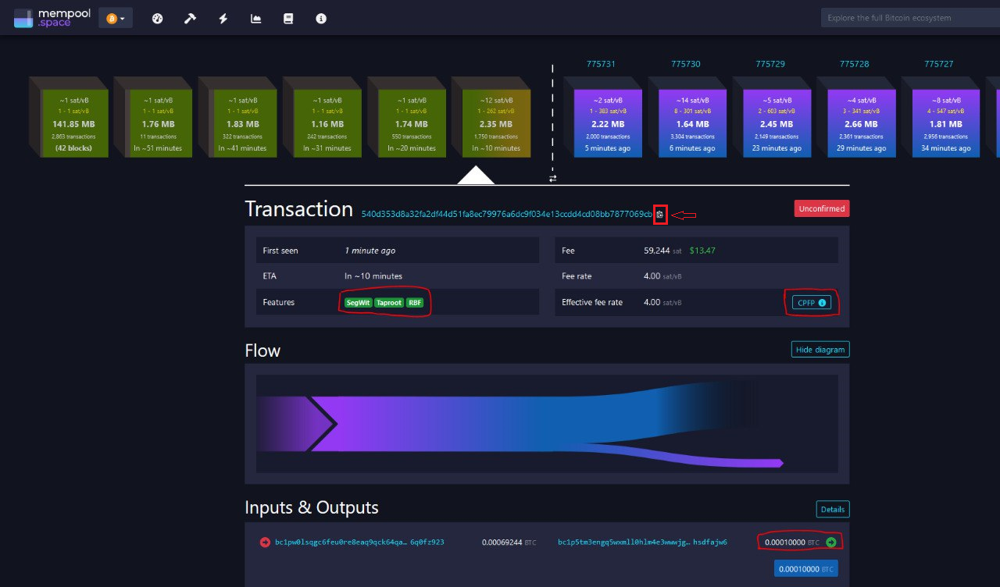
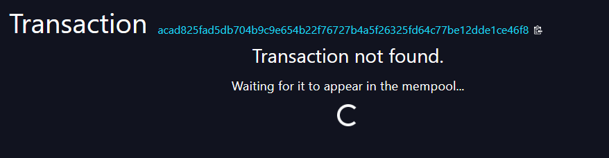

# Ordisrespector spam filter

[Ordinals](https://ordinals.com/) is a project created to number sats. It also has a feature called inscriptions, which is the problematic part and what is mainly being touched on in this guide. An inscription is basically data stored onchain associated with a sat.


Difficulty: Medium



## Context

Why are they an attack on Bitcoin?

First of all, we probably should look at what Bitcoin is:

> A Peer-to-Peer Electronic Cash System [(Bitcoin Whitepaper)](https://bitcoin.org/bitcoin.pdf)

There is no mention of data storage on the chain and only financial transactions. Ordinals abuse the Bitcoin timechain which was meant to process financial transactions to store data, and this has some issues, such as:

* Pushing out financial transactions, such as ones that need immediate confirmation such as force closes with pending HTLCs or a sweep-all TX.
* Driving up fee rates for the sole reason of inscribing a JPEG.
* It makes it way more expensive to maintain their node in the long term.
* It makes them liable for any illegal content in their jurisdiction that they store on their disk and broadcast freely.

...while paying 4x less for the same bytes.

[Ordisrespector](https://twitter.com/oomahq/status/1621899175079051264) is a _**spam patch filter**_ that works by detecting the pattern of Ordinals transactions that are entering the mempool of the node and _**rejecting them**_. The original patch was created by Luke Dashjr, you can see it here. [Archive](https://web.archive.org/web/20230207212859/https://gist.github.com/luke-jr/4c022839584020444915c84bdd825831)



## Preparations


You enter commands and the PC answers by printing the results below your command. To clarify where a command begins, every command in this guide starts with the `"$"` sign. The system response is marked with the `">"` character


* Login as `admin` user (for a MiniBolt environment), or your assigned user with `sudo` permissions
* Update and upgrade your OS

```sh
$ sudo apt update && sudo apt full-upgrade
```

* Install the next dependencies packages


```bash
$ sudo apt install autoconf automake build-essential libboost-filesystem-dev libboost-system-dev libboost-thread-dev libevent-dev libsqlite3-dev libtool pkg-config libzmq3-dev --no-install-recommends
```


## Installation

* Change to the temporary directory which is cleared on reboot

```sh
$ cd /tmp
```

* Set the next environment variable

```sh
$ VERSION=27.0
```

* Get the latest source code, the list of cryptographic checksums, and the signatures attesting to the validity of the checksums

```sh
$ wget https://bitcoincore.org/bin/bitcoin-core-$VERSION/bitcoin-$VERSION.tar.gz
```

```sh
$ wget https://bitcoincore.org/bin/bitcoin-core-$VERSION/SHA256SUMS
```

```sh
$ wget https://bitcoincore.org/bin/bitcoin-core-$VERSION/SHA256SUMS.asc
```


If you already had Bitcoin Core installed and the OTS client with the IBD completed, you could do the timestamp check verification


* Download the timestamp file

```sh
$ wget https://bitcoincore.org/bin/bitcoin-core-$VERSION/SHA256SUMS.ots
```

* Execute the OTS verification command (**skip this step if you stay building a new node**)

```sh
$ ots --no-cache verify SHA256SUMS.ots -f SHA256SUMS
```

The following output is just an **example** of one of the versions:

```
> Got 1 attestation(s) from https://btc.calendar.catallaxy.com
> Got 1 attestation(s) from https://finney.calendar.eternitywall.com
> Got 1 attestation(s) from https://bob.btc.calendar.opentimestamps.org
> Got 1 attestation(s) from https://alice.btc.calendar.opentimestamps.org
> Success! Bitcoin block 766964 attests existence as of 2022-12-11 UTC
```


Now, just check that the timestamp date is close to the [release](https://github.com/bitcoin/bitcoin/releases) date of the version you're installing


### **Checksum check**

* Check that the reference checksum in the file `SHA256SUMS` matches the checksum calculated by you (ignore the "lines are improperly formatted" warning)

```sh
$ sha256sum --ignore-missing --check SHA256SUMS
```

**Example** of expected output:

```sh
> bitcoin-26.0.tar.gz: OK
```

### **Signature check**

Bitcoin releases are signed by several individuals, each using its key. To verify the validity of these signatures, you must first import the corresponding public keys into your GPG key database.

* The next command downloads and imports automatically all signatures from the [Bitcoin Core release attestations (Guix)](https://github.com/bitcoin-core/guix.sigs) repository


```bash
$ curl -s "https://api.github.com/repositories/355107265/contents/builder-keys" | grep download_url | grep -oE "https://[a-zA-Z0-9./-]+" | while read url; do curl -s "$url" | gpg --import; done
```


Expected output:

```
> gpg: key 17565732E08E5E41: 29 signatures not checked due to missing keys
> gpg: /home/admin/.gnupg/trustdb.gpg: trustdb created
> gpg: key 17565732E08E5E41: public key "Andrew Chow <andrew@achow101.com>" imported
> gpg: Total number processed: 1
> gpg:               imported: 1
> gpg: no ultimately trusted keys found
[...]
```

* Verify that the checksums file is cryptographically signed by the release signing keys. The following command prints signature checks for each of the public keys that signed the checksums

```sh
$ gpg --verify SHA256SUMS.asc
```

* Check that at least a few signatures show the following text

Expected output:

```
> gpg: Good signature from ...
> Primary key fingerprint: ...
[...]
```

* If you're satisfied with the checksum, signature, and timestamp checks, extract the Bitcoin Core source code, install them, and check the version

```sh
$ tar -xvf bitcoin-$VERSION.tar.gz
```

### **Build it from the source code**

* Build BerkeleyDB 4.8 to allow for legacy wallets, necessary to use JoinMarket, Electrum Personal Server, and possibly other tools


```bash
$ wget -O bdb.sh https://raw.githubusercontent.com/bitcoin/bitcoin/aef8b4f43b0c4300aa6cf2c5cf5c19f55e73499c/contrib/install_db4.sh
```


* Assign execute permissions

```bash
$ chmod +x bdb.sh
```

* Execute the `bdb.sh` script

```bash
$ ./bdb.sh bitcoin-$VERSION
```

* Enter to the Bitcoin Core source code folder

```sh
$ cd bitcoin-$VERSION
```

* Execute the `autogen.sh` script

```sh
$ ./autogen.sh
```

* The next command will pre-configure the installation, we will discard some features and include others. Enter the complete next command in the terminal and press enter

```sh
export BDB_PREFIX="/tmp/bitcoin-$VERSION/db4"
./configure \
   BDB_LIBS="-L${BDB_PREFIX}/lib -ldb_cxx-4.8" BDB_CFLAGS="-I${BDB_PREFIX}/include" \
  --disable-bench \
  --disable-gui-tests \
  --disable-maintainer-mode \
  --disable-man \
  --disable-tests \
  --with-daemon=yes \
  --with-gui=no \
  --with-qrencode=no \
  --with-utils=yes
```

### **Apply the "Ordisrespector" patch**


Skip this step if you want only to build Bitcoin Core from the source code but not apply the Ordisrespector patch


* Download the Ordisrespector patch


```bash
$ wget https://raw.githubusercontent.com/minibolt-guide/minibolt/main/resources/ordisrespector.patch
```


* **(Optional)** Inspect `ordisrespector.patch` file to make sure it does not do bad things. If you see all OK, exit with Ctrl-X and continue with the next command

```sh
$ nano ordisrespector.patch
```

* Apply the patch

```sh
$ git apply ordisrespector.patch
```

### **Build**

* Enter the command to compile

```sh
$ make -j$(nproc)
```


This process can take quite a long time, 10-15 minutes or more, depending on the performance of your device. Please be patient until the prompt shows again


### **Install**

* Enter the next command to install the new binaries precompiled for yourself on the OS

```sh
$ sudo make install
```

* Check the correct installation requesting the output of the version

```sh
$ bitcoin-cli --version
```

The following output is just an **example** of one of the versions:

```
> Bitcoin Core version v24.1.0
> Copyright (C) 2009-2022 The Bitcoin Core developers
> [...]
```


Now you can continue with the installation progress of the Bitcoin Client following the [Create the bitcoin user](../../index-2/bitcoin-client.md#create-the-bitcoin-user) section or if you already had it installed, only continue with the next steps


* Return to the `tmp` folder

```bash
$ cd ..
```

* Clean the installation files to be ready for the next update


```bash
$ sudo rm -r bitcoin-$VERSION && rm bdb.sh && rm bitcoin-$VERSION.tar.gz && rm db-4.8.30.NC.tar.gz & rm SHA256SUMS && rm SHA256SUMS.asc && rm SHA256SUMS.ots
```


* Delete no needed binaries before installed by `make install` command


```bash
$ sudo rm /usr/local/bin/bitcoin-tx && sudo rm /usr/local/bin/bitcoin-wallet && sudo rm /usr/local/bin/bitcoin-util
```


* If you have an existing Bitcoin Core installation without Ordisrespector applied, restart it using systemd and start a new instance with the Ordisrespector patch applied

```sh
$ sudo systemctl restart bitcoind
```

* Monitor by the systemd journal and check the logging output. You can exit monitoring at any time with Ctrl+C and continue

```sh
$ journalctl -f -u bitcoind
```

## Extras (optional)

### **How to detect Ordinals transactions**


After starting Bitcoin Core, wait a few minutes for Bitcoin Core to load the mempool, the indicator for this is the log: _**"Imported mempool transactions from disk: ..."**_. A rather high indicator of "failed" imported transactions may have appeared, which is a good sign, it's the filter is taking effect and rejecting the Ordinals transactions after to apply the patch


* Go to the public mempool.space [clearnet](https://mempool.space) or [Tor](http://mempoolhqx4isw62xs7abwphsq7ldayuidyx2v2oethdhhj6mlo2r6ad.onion) link official web page
* Click on the first mempool candidate blocks in the green/yellow color blocks


* Put the pointer above the cube's dynamic graphic at the bottom right, and find transactions with for example **0.00010000 BTC**, **0.00005000 BTC**, **0.00000546 BTC**, **0.00000330 BTC**, **0.000005386 BTC**... output amount, or similar recurrency amount and click on the cube of the transaction to do a second verification


* Look for "Taproot", "Segwit", "RBF" and "CPFP" tags (this last doesn't appear always)



#### **Check the Ordisrespector filter working on your mempool**

* Click on the "copy to the clipboard" icon to copy the transaction id `(<txid>)`, and paste this on your own Bitcoin Explorer (BTC RPC Explorer / Mempool), in a BTC RPC Explorer running on a MiniBolt environment, go to [https://minibolt.local:4000](https://minibolt.local:4000)
* Search the `"<txid>"` on the browser of your own Bitcoin Explorer

_**Mempool space**_ expected output:



_**BTC RPC Explorer**_ expected output:


Or if you prefer, check directly through the Bitcoin Core CLI command, doing

```sh
$ bitcoin-cli getmempoolentry <txid>
```

Expected output:

```
error code: -5
error message:
Transaction not in mempool
```


The before information indicates that the filter is working properly


### **Add Ordisrespector node peers (optional)**

Add [Bitcoin Barcelona node](https://bitcoinbarcelona.xyz/servicios\_bbo) as a peer in your node, or Ordisrespector runners community peers that shared their public addresses, in this way, it is easier to invade the network with Ordisrespector node runners.

* Edit and add to the `bitcoin.conf` file, the next line/s at the end of the file

```sh
$ sudo nano /data/bitcoin/bitcoin.conf
```

If you have enabled the Tor network

```
addnode=.....2pk5umz5vieqwcp3ead.onion:8333
```

If you have enabled the I2P network, add this line as well

```
addnode=.....3q5hw6625xyqekprljz6uasa.b32.i2p:0
```

### Add an external fee estimator to the LND

By applying Ordisrespector to our node, would can have a different version of the mempool compared to the rest of the network and with it the estimation of the fees. It is possible to point the fee estimator to another node without Ordisrespector applied

* With user admin, stop LND if you have installed

```bash
$ sudo systemctl stop lnd
```

* Edit `lnd.conf`

```bash
$ sudo nano /data/lnd/lnd.conf
```

* Add the next lines inside of `[Application Options]` section

```
# Use external fee estimator
feeurl=https://nodes.lightning.computer/fees/v1/btc-fee-estimates.json
```

* Start LND again

```bash
$ sudo systemctl start lnd
```

## Upgrade

The latest release can be found on the [GitHub page](https://github.com/bitcoin/bitcoin/releases) of the Bitcoin Core project. Always read the [RELEASE NOTES](https://github.com/bitcoin/bitcoin/tree/master/doc/release-notes) first! When upgrading, there might be breaking changes or changes in the data structure that need special attention

Go to the [Installation section](ordisrespector.md#installation), and replace the environment variable `"VERSION=x.xx"` value for the latest version if it has not been already changed in this guide. Continue until complete the entire [Installation section](ordisrespector.md#installation)


Remember to restart the Bitcoin Core to apply the new version with `$ sudo systemctl restart bitcoind`


## Uninstall

To uninstall Bitcoin Core with the Ordisrespector patch applied, follow the entire Bitcoin Core [uninstall section](../../index-2/bitcoin-client.md#uninstall)

## Port reference

Same as the [Bitcoin Core section](../../index-2/bitcoin-client.md#port-reference)
