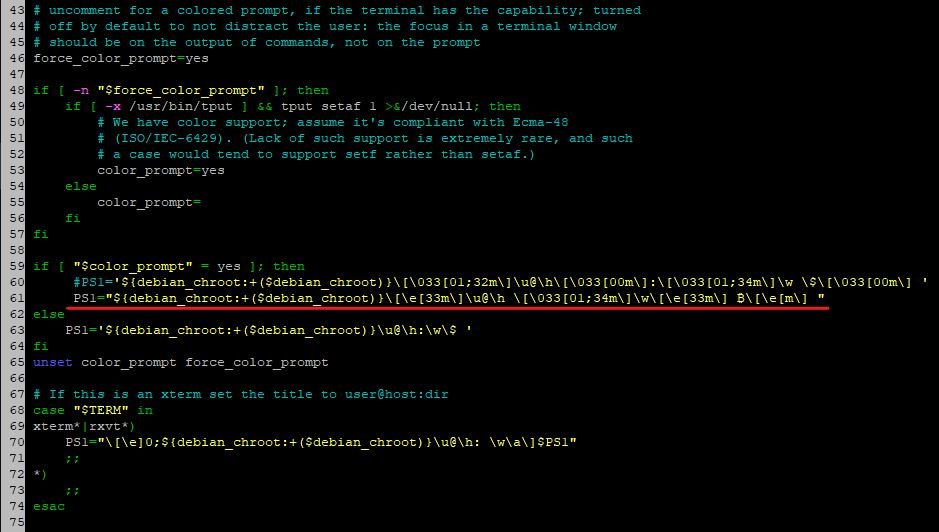
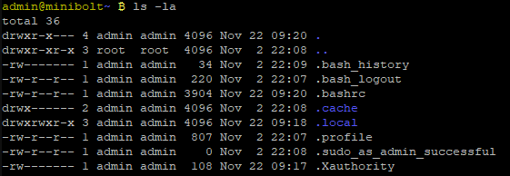

# Pimp the command line

In this section, we are going to do instructions for changing the prompt "$" symbol to the Bitcoin symbol "₿" and color and install bash completion scripts for Bitcoin Core and Lightning projects command CLI instructions.


Difficulty: Easy


### Command prompt

You can prettify your command prompt for each user by enabling color output and setting a custom prompt

* With user `admin`, open and edit `.bashrc` as shown below. Save and exit

```sh
$ nano /home/admin/.bashrc --linenumbers
```

* Uncomment line 46

```
force_color_prompt=yes
```

* Comment the existing line 60 (backup)

```
#PS1='${debian_chroot:+($debian_chroot)}\[\033[01;32m\]\u@\h\[\033[00m\]:\[\033[01;34m\]\w\[\033[00m\]\$ '
```

* Add the next line (in line 61)

```
PS1="${debian_chroot:+($debian_chroot)}\[\e[33m\]\u@\h\[\033[01;34m\]\w\[\e[33m\] ₿\[\e[m\] "
```

* Insert the following at the end of the file

```
alias ls='ls -la --color=always'
```

<figure><figcaption></figcaption></figure>

* Apply changes

```sh
$ source /home/admin/.bashrc
```

<figure><figcaption></figcaption></figure>

### Bash completion

* As user `admin`, install bash completion scripts for Bitcoin Core and LND. You then can complete partial commands by pressing the Tab key (e.g. bitcoin-cli getblockch \[Tab] → bitcoin-cli getblockchaininfo)

```bash
$ cd /tmp/
```

<pre class="language-bash" data-overflow="wrap"><code class="lang-bash"><strong>$ wget https://raw.githubusercontent.com/bitcoin/bitcoin/master/contrib/completions/bash/bitcoind.bash
</strong></code></pre>


```bash
$ wget https://raw.githubusercontent.com/bitcoin/bitcoin/master/contrib/completions/bash/bitcoin-cli.bash
```



```bash
$ wget https://raw.githubusercontent.com/lightningnetwork/lnd/master/contrib/lncli.bash-completion
```



```bash
$ sudo mv bitcoind.bash bitcoin-cli.bash lncli.bash-completion /etc/bash_completion.d/
```



Bash completion will be enabled after your next login

