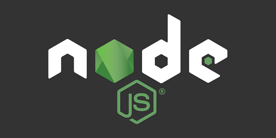

# Node + NPM

[Node.js](https://nodejs.org) is an open-source, cross-platform JavaScript runtime environment. Node.js includes NPM in the installation package as well.


Difficulty: Easy


 

## Installation

* With user `admin`, update the packages and upgrade to keep up to date with the OS, press "**y**" and "**enter**" when needed

```bash
$ sudo apt update && sudo apt full-upgrade
```

* We will use the NodeSource Node.js Binary Distributions [repository](https://github.com/nodesource/distributions) instructions. Download and import the NodeSource GPG key


```sh
$ curl -fsSL https://deb.nodesource.com/gpgkey/nodesource-repo.gpg.key | sudo gpg --dearmor -o /etc/apt/keyrings/nodesource.gpg
```


* Set the environment variable of the version

```bash
$ VERSION=20
```

* Create deb repository


```bash
$ echo "deb [signed-by=/etc/apt/keyrings/nodesource.gpg] https://deb.nodesource.com/node_$VERSION.x nodistro main" | sudo tee /etc/apt/sources.list.d/nodesource.list
```


* Run update

```sh
$ sudo apt update
```

* Install Node.js + NPM using the apt package manager

```sh
$ sudo apt install nodejs
```

* Check the correct installation of nodejs

```sh
$ node -v
```

**Example** of expected output:

```
> v18.16.0
```

* Check the correct installation of NPM

```sh
$ npm -v
```

**Example** of expected output:

```
> 9.5.1
```

## Upgrade

* With user `admin`, stop the current dependencies services of the Node + NPM, that are actually BTC RPC Explorer + Thunderhub

```bash
$ sudo systemctl stop btcrpcexplorer && sudo systemctl stop thunderhub
```

* To upgrade simply type this command

```sh
$ sudo apt update && sudo apt full-upgrade
```


If you want to update to the upper version LTS release ([see here](https://nodejs.org/en/download)), e.g. 18.x to 20.x you need to follow the next steps:


* Check the current version installed of the nodejs

```bash
$ node -v
```

* If you have 18.x version, set the environment variable to the new number of versions, for example to 20.x

```bash
$ VERSION=20
```

* Update the current deb repository


```bash
$ echo "deb [signed-by=/etc/apt/keyrings/nodesource.gpg] https://deb.nodesource.com/node_$VERSION.x nodistro main" | sudo tee /etc/apt/sources.list.d/nodesource.list
```


* Run the update and upgrade command to update the nodejs to the latest version. Press "**y**" and "**enter**" when needed

```bash
$ sudo apt update & sudo apt full-upgrade
```

* Check the correct installation to the latest release

```bash
$ node -v
```

* Start BTC RPC Explorer & Thunderhub again

```bash
$ sudo systemctl start btcrpcexplorer && sudo systemctl start thunderhub
```

## Uninstall

* To uninstall type this command and press "**y**" and "**enter**" when needed


```sh
$ sudo apt purge nodejs && sudo rm -r /etc/apt/sources.list.d/nodesource.list && sudo rm -r /etc/apt/keyrings/nodesource.gpg
```

