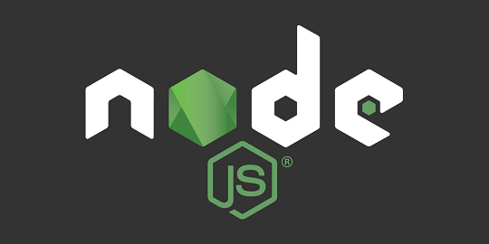

# Node + NPM

[Node.js](https://nodejs.org) is an open-source, cross-platform JavaScript runtime environment. Node.js includes NPM in the installation package as well.


Difficulty: Easy


 

## Installation

* With user `admin`, update the packages and upgrade to keep up to date with the OS, press "**y**" and "**enter**" when needed

```bash
sudo apt update && sudo apt full-upgrade
```

* Change to a temporary directory that is cleared on reboot

```bash
cd /tmp
```

* Set the environment variable for the version

```bash
VERSION=22
```

* We will use the NodeSource Node.js Binary Distributions [repository](https://github.com/nodesource/distributions) instructions. Download the setup script


```sh
curl -fsSL https://deb.nodesource.com/setup_$VERSION.x -o nodesource_setup.sh
```


* Run the setup script

```bash
sudo -E bash nodesource_setup.sh
```

* Update the package manager and install Node.js + NPM. Press "**y**" and `enter` or directly `enter` if the prompt asks you

```sh
sudo apt update && sudo apt install nodejs
```

* Check the correct installation of Node.js

```sh
node -v
```

**Example** of expected output:

```
v18.16.0
```

* Check the correct installation of NPM

```sh
npm -v
```

**Example** of expected output:

```
9.5.1
```

* **(Optional)** Delete the setup script

```bash
rm nodesource_setup.sh
```


**(Optional)** Improve your privacy by opting out of Next.js [telemetry](https://nextjs.org/telemetry)

```bash
npx next telemetry disable
```

When the prompt asks you this:

```
Need to install the following packages:
next@16.2.1
Ok to proceed? (y)
```

* Type "y" and press `Enter`

Expected output:

```
Attention: Next.js now collects completely anonymous telemetry regarding usage.
This information is used to shape Next.js' roadmap and prioritize features.
You can learn more, including how to opt-out if you'd not like to participate in this anonymous program, by visiting the following URL:
https://nextjs.org/telemetry

Your preference has been saved to /home/thunderhub/.config/nextjs-nodejs/config.json.

Status: Disabled

You have opted-out of Next.js' anonymous telemetry program.
No data will be collected from your machine.

Learn more: https://nextjs.org/telemetry
npm notice
npm notice New major version of npm available! 10.9.7 -> 11.12.1
npm notice Changelog: https://github.com/npm/cli/releases/tag/v11.12.1
npm notice To update run: npm install -g npm@11.12.1
npm notice
```

If you are not sure if you have already disabled the telemetry, check with the next command:

```bash
npx next telemetry status
```

**Example** of expected output:

<pre><code>Next.js Telemetry

Status: <a data-footnote-ref href="#user-content-fn-1">Disabled</a>

You have opted-out of Next.js' anonymous telemetry program.
No data will be collected from your machine.

Learn more: https://nextjs.org/telemetry
</code></pre>


## Upgrade

* With user `admin`, stop the current dependencies services of the Node + NPM, that are actually BTC RPC Explorer + ThunderHub

```bash
sudo systemctl stop btcrpcexplorer && sudo systemctl stop thunderhub
```

* To upgrade, type this command

```sh
sudo apt update && sudo apt full-upgrade
```

* Check the correct installation of the latest release

```bash
node -v && npm -v
```

* **(Optional)** Delete the setup script

```bash
rm nodesource_setup.sh
```

* Start BTC RPC Explorer & ThunderHub again

```bash
sudo systemctl start btcrpcexplorer && sudo systemctl start thunderhub
```

### Upgrade to the major version

* With user `admin`, stop the current dependencies services of the Node + NPM, that are actually BTC RPC Explorer + ThunderHub

```bash
sudo systemctl stop btcrpcexplorer && sudo systemctl stop thunderhub
```

* Change to a temporary directory that is cleared on reboot

```bash
cd /tmp
```

* Set the environment variable for the version

```bash
VERSION=22
```


You must change the environment variable to the immediately higher LTS version, for example: `20 > 22`


* We will use the NodeSource Node.js Binary Distributions [repository](https://github.com/nodesource/distributions) instructions. Download the setup script


```sh
curl -fsSL https://deb.nodesource.com/setup_$VERSION.x -o nodesource_setup.sh
```


* Run the setup script

```bash
sudo -E bash nodesource_setup.sh
```

* Update the package manager and install Node.js + NPM. Press "**y**" and `enter` or directly `enter` if the prompt asks you

```sh
sudo apt update && sudo apt install nodejs
```

* Check the correct installation of the latest release

```bash
node -v && npm -v
```

* **(Optional)** Delete the setup script

```bash
rm nodesource_setup.sh
```

* Start BTC RPC Explorer & ThunderHub again

```bash
sudo systemctl start btcrpcexplorer && sudo systemctl start thunderhub
```

## Uninstall


Warning: This section removes the installation. Only run these commands if you intend to uninstall


* To uninstall, type this command and press "**y**" and "**enter**" when needed


```sh
sudo apt autoremove nodejs --purge && sudo rm /etc/apt/sources.list.d/nodesource.sources
```


[^1]: Check this
