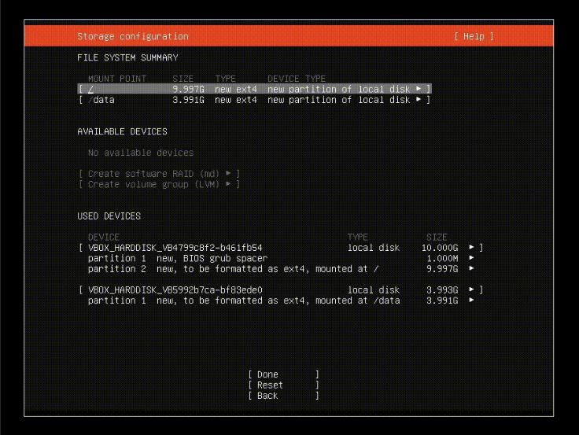
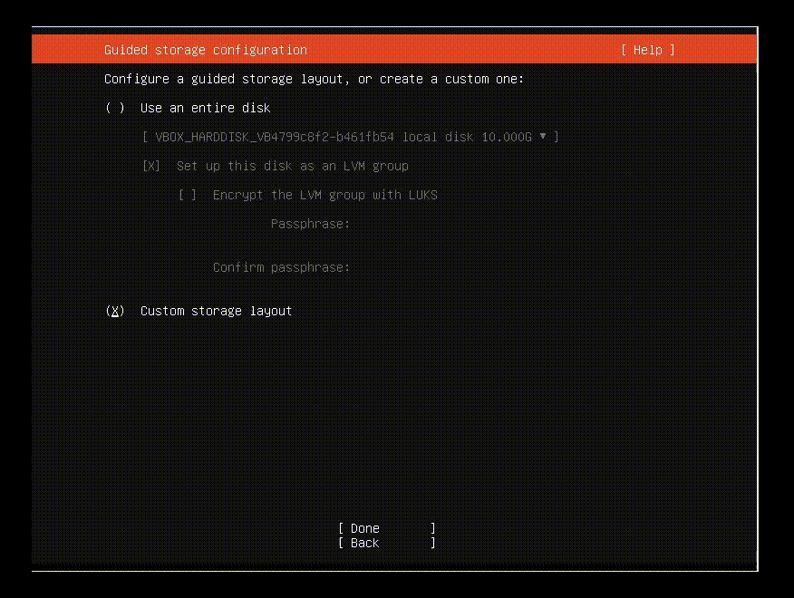

# Store data in a secondary disk

If you want to use a different disk to store data (blockchain and other databases) independently of the disk of the system, you can follow these instructions.


Difficulty: Easy




## Case 1: during the Ubuntu server guided installation

When you arrive at the **"Guided storage configuration"** **(step 8)** on the [Ubuntu server installation](broken-reference/), follow the next steps:

**8.2.** Pay attention to checking **"Custom storage layout"** instead of ~~Use an entire disk~~, select **"Done"** and press **enter**

📝 Under **AVAILABLE DEVICES** you will see both drives you installed on the PC, identify each one by **drive model name** and **storage**


It is recommended to choose the **smallest size drive** for the system and the **bigger size drive** for the data storage **`(/data)`** (blockchain, databases, etc)


> **8.2.1.** Select the section where appeared the **MODEL** of the **primary disk** between `"[]"` and press enter -> Select **"Use As Boot Device"** and press **enter** again


This will select this storage as the boot disk and create automatically a new partition for the **"BIOS grub spacer"** on it.


> **8.2.2.** Select the **"free space"** section of the same device, and select **"Add GPT Partition"**. Ensure the format is selected as **`"ext4"`**, select **`"/"`** in the dropdown as mount point, select **"Create"** and press **enter**

> **8.2.3.** Now select the **"free space"** of the **secondary disk** on "AVAILABLE DEVICES" -> **Add GPT partition**. Ensure the format is selected as `"ext4"`, select **"Other"** in the dropdown, type `/data` to assign to the new **("/data")** folder, select **"Create"** and press enter

**9.** Select **"Done"** and press enter. Confirm destructive action warning banner hitting **"Continue"**


**This will delete all existing data on the disks, including existing partitions!**


<figure><figcaption></figcaption></figure>


The GIF above is a recreation of a scenario made with a virtual machine **-->** **VBOX\_HARDDISK\_**_VB4_... would be the **primary disk**, and **-->** **VBOX\_HARDDISK\_**_VB5_... would be the **secondary disk**. In your case, this probably **will not match exactly**


### Continue with the guide


That's it: when you finish the [Operating system](../../index-1/operating-system.md) section, your PC will boot the system from the primary disk while the data directory **`(/data)`** will be located on the secondary disk.


**-->** Now you can continue with **step 10** of the [Ubuntu Server installation](../../index-1/operating-system.md#ubuntu-server-installation)

## **Case 2: build it after system installation (by command line)**

Attach the secondary disk to the MiniBolt node

### **Format secondary disk**

* List all block devices with additional information

```sh
$ lsblk -o NAME,MOUNTPOINT,UUID,FSTYPE,SIZE,LABEL,MODEL
```

**Example** of expected output without existing partitions:

```
> NAME          MOUNTPOINT UUID       FSTYPE   SIZE    LABEL  MODEL
> sdb                                          931.5G         Samsung SSD 870
```

_Example_ expected output with existing partitions:

```
> NAME          MOUNTPOINT UUID              FSTYPE   SIZE    LABEL  MODEL
> sdb                                                 931.5G         Samsung SSD 870
> sdb1                     2219-782E         ext4     931.5G
```


Here we will see if the new disk has been detected by the system and what unit name has been assigned to it. Normally `sda` is the name assigned for the primary disk and `sdb` for the secondary disk, but your case could be different, pay attention to the "MODEL" column to identify each one, e.g: Samsung SSD 870"


### **Delete the existing partition & create a new one**

* Type this command to use the `"fdisk"` utility and manage the secondary disk

```sh
$ sudo fdisk /dev/sdb
```

* Now we select the option wished pressing the option letter and enter
  * Press **`"n"`** to create a new partition and then enter. Press `enter` until the prompt show **(Command (m for help))** again

> **Case 1:** if you had existing partition/s, the prompt will show you **"All space for primary partitions is in use"**, you will need to type **`d`** and press enter until the prompt shows you **"Partition X has been deleted",** if not, press enter until the prompt shows you **"Created a new partition X of type 'Linux filesystem'"** and...

> **Case 2:** if you had existing partition/s, the prompt will show you **"Partition #1 contains an ext4 signature"** **"Do you want to remove the signature? \[Y]es/\[N]o"**, type **`Y`** and press enter until the prompt shows you **"The signature will be removed by a write command",** if not, press enter until the prompt shows you **"Created a new partition X of type 'Linux filesystem'"** and...

* Finally, don't forget, to type **`w`** to automatically write on disk and exit


This will create a new partition called probably **`"sdb1"`**


* Finally, format the new partition to `"Ext4"` and obtain the **UUID**

```sh
$ sudo mkfs.ext4 /dev/[NAME_P]
```

**Example** of expected output:

```
mke2fs 1.46.5 (30-Dec-2021)
Creating filesystem with 1572608 4k blocks and 393216 inodes
***Filesystem UUID:*** **dafc3c67-c6e5-4eaa-8840-adaf604c85db**
Superblock backups stored on blocks:
        32768, 98304, 163840, 229376, 294912, 819200, 884736
```


Take note of your **UUID** e.g dafc3c67-c6e5-4eaa-8840-adaf604c85db and the partition name of your secondary disk (normally **"sdb1"**)


### **Mount the secondary disk**

The secondary disk is then attached to the file system and becomes available as a regular folder (this is called “mounting”).

* List the block devices once more and copy the new partitions `UUID` into a text editor on your main machine

```sh
$ lsblk -o NAME,MOUNTPOINT,UUID,FSTYPE,SIZE,LABEL,MODEL
```

**Example** of expected output:

```
> NAME        MOUNTPOINT UUID                                 FSTYPE   SIZE LABEL  MODEL
> sdb                                                                931.5G        Samsung SSD 870
> └─sdb1                 3aab0952-3ed4-4652-b203-d994c4fdff20 ext4   931.5G
```

* Edit the `"fstab"` file and add the following as a new line **at the end**, replacing `<yourUUID>` with your own `UUID`

```sh
$ sudo nano /etc/fstab
```

```
UUID=<yourUUID> /data ext4 defaults 0 2
```

* Create the data directory as a mount point

```sh
$ sudo mkdir /data
```

* Assign as the owner to the `admin` user

```sh
$ sudo chown admin:admin /data
```

* Mount all disks and check the file system

```sh
$ sudo mount -a
```

* Is “/data” listed?

```sh
$ df -h /data
```

**Example** expected output:

```
> Filesystem      Size  Used Avail Use% Mounted on
> /dev/sdb1       938G   77M  891G   1% /data
```

* Check measure the speed of your secondary drive with

```sh
$ sudo hdparm -t --direct /dev/sdb
```


If the measured speeds are more than 100 MB/s, you're good


**-->** Now you can continue with the Security section of the guide, press [here](../../index-1/security.md)
