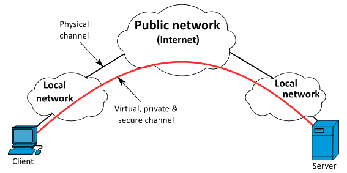
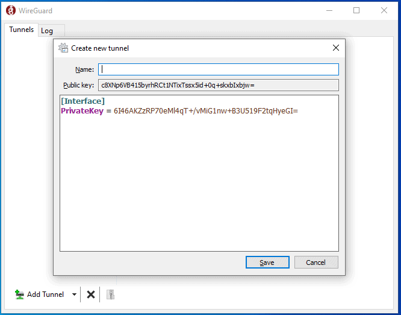

# WireGuard: a simple yet fast VPN

The following guide was derived from contributions by [Pantamis](https://github.com/Pantamis)

[WireGuard](https://www.wireguard.com) is a VPN you can set up to access your MiniBolt from the outside. It makes it easier to run services on your node without exposing its ports to the public Internet. It has support on all major computer OS; and apps for Android and iOS. The only requirement is to forward a UDP port from your home router to the MiniBolt node.


Difficulty: Hard



## Acknowledgments

## Why use WireGuard and trade-off

A VPN is an encrypted tunnel between two computers over the internet. In our case, MiniBolt will play the role of the server, and you will be able to access your home network from outside with configured client devices. Several trade-offs are using a VPN versus using Tor.

**Advantages:**

* The connection with the VPN is a lot faster than using Tor (Bitcoin Core and LND will still use Tor)
* WireGuard has an incredibly low resource usage.
* The attack surface on your home network and MiniBolt is reduced as fewer ports are open on your router.

**Disadvantages:**

* However, a VPN is not anonymous, a spy can see that you send encrypted traffic to your home router, but he cannot know what you are doing.
* WireGuard is not censorship-resistant. The encrypted byte headers contain identifiable data which allows telling that you are using WireGuard VPN.
* You need to open one port on your router.



## Prerequisites

Before starting with the installation proper, you need to:

1. Figure out if your Internet Service Provider (ISP) uses [Carrier-Grade NAT](https://superuser.com/questions/713422/how-would-i-test-to-see-if-im-behind-carrier-grade-or-regular-nat). If that's the case **you have no way of doing port forwarding**, and you'll need to contact them asking to **put you out of CG-NAT** (this means giving your router a dedicated public IP). Most ISPs simply do this on request or charge a small fee to allocate a public IP just for you
2. Figure out the public IP of your home network. If you have a **static public IP** it'll simplify the setup, but it's not mandatory. There are plenty of websites that show you your public IP. One such site is [https://whatismyipaddress.com](https://whatismyipaddress.com/)
3. Forward the `"51820"` port and `"UDP"` protocol of your router to the local IP of your MiniBolt. This procedure changes from router to router so we can't be very specific, but involves logging into your router's administrative web interface (usually at [http://192.168.1.1](http://192.168.1.1) or [http://192.168.0.1](http://192.168.0.1)) and finding the relevant settings page. See [portforward.com](https://portforward.com) for directions on how to port forward with your NAT/router device. The configuration procedure will depend on the specific type of router which is why we can't provide a tutorial for all of them. However, in the extra [Port forwarding section](wireguard-vpn.md#port-forwarding), you can show a few instructions to do this for the most common cases

📝 In the next steps, we will create different keys, IDs, passwords, and others, remember to take note of all of those in your preferred password manager (Bitwarden, Keypass) or an offline document paper:

**Server keys:**

> **`<Your_Server_Private_Key>`**

> **`<Your_Server_Public_Key>`**

**Client keys:**

> **`<Your_Client_Private_Key>`**

> **`<Your_Client_Public_Key>`**

**Desec provider data:**

> * Desec email: **email**
> * Desec password: **password**
> * TOKEN: `<YOUR_SECRET_TOKEN>`
> * Domain: `<yoursubdomain.dedyn.io>`

## Set up Dynamic DNS

Unless you have a static IP (unlikely if it is a residential IP) your ISP can change it at any minute, thus breaking the setup we will make.

To fix this, we can maintain a DNS record that always points to your latest IP, and the WireGuard clients can use that instead of the IP.

Now we are going to execute a universal way of configuring our IP by updating it to the dynamic DNS provider using the MiniBolt node via a script, but this job can be done by your router, especially if we are not sure that we are going to have MiniBolt running 24/7. Go to the [Use your router’s DDNS preconfigured provider](wireguard-vpn.md#use-your-routers-ddns-preconfigured-provider) extra section.


If you have a contracted static IP on your ISP, you can log in to the MiniBolt directly, go to the [configure firewall](wireguard-vpn.md#configure-firewall) section, and continue with the guide from there.


### Desec registration

*   Go to Desec [official webpage](https://desec.io) and fill out the first form with this:

    **1.** Type your preferred **email**

    **2.** Select the **"dynDNS account"** box

    **3.** Hit the **"CREATE ACCOUNT"** button


**You'll see the following form:**


* Ensure to keep selecting the second option **Register a new domain under dedyn.io (dynDNS).**
* For this demo, I've typed **`yoursubdomain`**, but _**you can use anything memorable**_ to you as long as no one has already taken that name. We'll it call **`"<yoursubdomain.dedyn.io>"`** from now on.
* Complete the **"CAPTCHA"** and check the box **"Yes, I agree to the..."** option, and click on the **"SIGN UP"** button.

After this, deSEC will email you to confirm the address. It will contain a **verification link** that will send you to this page:


* Take note of the **"Token secret"**, you'll need it later as **`"<YOUR_SECRET_TOKEN>"`**

**5.** Click on the **"ASSIGN ACCOUNT PASSWORD"** button down below to lock down your account.

* Type again your email, complete the **"CAPTCHA"** and click on the **"RESET PASSWORD"** button.


This will prompt deSEC to send you another email with another link that will let you **set your account password**.

**6.** After all that is done, click **LOG IN** and use your **email** and the **password** set before.



Keep **this dashboard open,** you'll need to come back here later.


## Server configuration (part 1)

### Dynamic IP script

Now we'll write a Bash script for MiniBolt that will periodically poll its own IP and send it to deSEC. We'll need the **`"<YOUR_SECRET_TOKEN>"`** and **`"<yoursubdomain.dedyn.io>"`** from the deSEC registration step.

* As `admin` user, [log in](../../index-1/remote-access.md#access-with-secure-shell) to MiniBolt, and create the following script

```sh
$ sudo nano /opt/dynamic-ip-refresh.sh
```

* Replace **`"<yoursubdomain.dedyn.io>"`** and **`"<YOUR_SECRET_TOKEN>"`** for the before created. Save and exit

```
#!/usr/bin/env bash

set -euo pipefail

DEDYN_DOMAIN=<yoursubdomain.dedyn.io>
DEDYN_TOKEN=<YOUR_SECRET_TOKEN>

CURRENT_IP=$(curl -s https://api.ipify.org/)

curl -i -s \
  -H "Authorization: Token ${DEDYN_TOKEN}" \
  -X GET "https://update.dedyn.io/?hostname=${DEDYN_DOMAIN}&ip=${CURRENT_IP}"
```

* After creating the script, make it executable and restrict access to it (because it contains sensitive data)

```sh
$ sudo chmod 700 /opt/dynamic-ip-refresh.sh
```

* Create a crontab entry for root to run it every 2 minutes. Type `"1"` and press enter to choose the "nano" editor

```sh
$ sudo crontab -e
```

* Add the next line at the end of the file. Save and exit

```
*/2 * * * *     /opt/dynamic-ip-refresh.sh
```


Keep the MiniBolt SSH session on the terminal opened to go back later, return to [deSEC web page](https://desec.io/domains), ensure you are on the **"DOMAIN MANAGEMENT"** tab, and **click on your domain**



**Wait 2 minutes**, and refresh the page, you should see a new **"type A"** DNS record entry with your public IP address, created automatically



You now have a free domain that always points to your existing public IP address. Now you can log out of the Desec webpage by clicking on the `"LOG OUT"` button on the top right, we won't need it anymore


### Configure Firewall

* Return to the MiniBolt SSH session to continue configuring it. Allow incoming Wireguard requests from outside the Firewall

```sh
$ sudo ufw allow 51820/udp comment 'allow WireGuard VPN from anywhere'
```


Remember to have forwarded the **`"51820"`** port and the **`"UDP"`** protocol of your router to the local IP of your MiniBolt, previously indicated in the [prerequisites](wireguard-vpn.md#prerequisites) section and following the [Port Forwarding](wireguard-vpn.md#port-forwarding) extra section


### Install WireGuard VPN on server

* Update the packages and upgrade to keep up to date with the OS

```sh
$ sudo apt update && sudo apt full-upgrade
```

* Install the WireGuard VPN package

```sh
$ sudo apt install wireguard
```

### Generate server key pair

* Now we are going to generate our server key pair. The following command is to generate a private key

```sh
$ wg genkey | tee private_key
```

Private key _**example expected output**_, we'll call **`"<Your_Server_Private_Key>"`** from now on

```
e.g: mJFGKxeQqxafyDdLDEDHRml6rDJUs7JZte3uqfJBQ0Q=
```

📝 Take note and **securely backup** this private key in your preferred password manager (Bitwarden, Lastpass, Keypass...)

* Now obtain the public key related to the private key

```sh
$ sudo cat private_key | wg pubkey | tee public_key
```

Public key _**example**_ expected output, we'll call **`"<Your_Server_Public_Key>"`** from now on

```
e.g: GOQi4j/yvmu/7f3cRvFZwlXvnWS3gRLosQbjrb13sFY=
```

📝 Take note and backup this public key in your preferred password manager (Bitwarden, Lastpass, Keypass...)

* Create `wg0.conf` file

```sh
$ sudo nano /etc/wireguard/wg0.conf
```

* Write the following content and replace only **`<Your_Server_Private_Key>`** with the data previously obtained. **`<Your_Client_Public_Key>`** will be replaced later when we get the public key from our client, keep alert to replace it later in [part 2 of the server configuration](wireguard-vpn.md#server-configuration-part-2)

```
# MiniBolt: Wireguard configuration
# /etc/wireguard/wg0.conf

## Server configuration (Minibolt node)
[Interface]
PrivateKey = <Your_Server_Private_Key>
Address = 10.0.0.1/24
ListenPort = 51820

## Client configuration
[Peer]
PublicKey = <Your_Client_Public_Key>
AllowedIPs = 10.0.0.2/32
```


Replace **`"<Your_Server_Private_Key>"`**


* Enable autoboot on startup

```sh
$ sudo systemctl enable wg-quick@wg0.service
```


This will **turn it on permanently**, and also **start it automatically** when MiniBolt reboots. We won't do this on the client because we want it to be able to connect to the VPN selectively.


* Delete the `private_key` and `public_key` files, but ensure before you take note of the server's keys in your preferred password manager

```sh
$ sudo rm /home/admin/private_key && rm /home/admin/public_key
```


Keep the MiniBolt SSH session open in the terminal to come back later


## Install WireGuard VPN on Client

Now, on your client (on a regular computer, regular mobile, tablet, etc...), start by visiting [WireGuard's installation page](https://www.wireguard.com/install) and download and install the relevant version of WireGuard for your OS. Here, we'll assume your client is a Linux desktop OS; because it is the most similar to setting up the server, but you can see [Windows](wireguard-vpn.md#install--configure-wireguard-vpn-client-on-windows) or [Mobile](wireguard-vpn.md#install--configure-the-wireguard-vpn-client-on-a-mobile-phone) configurations in the extra section.

* On your Linux regular computer, for instance, you do this by simply installing the **`"Wireguard VPN"`** package

```sh
$ sudo apt install wireguard
```

### Generate client key pair

* Now we are going to generate our client key pair. The following command is to generate a private key

```sh
$ wg genkey | tee private_key
```

Private key _**example**_ expected output, we'll call **`"<Your_Client_Private_Key>"`** from now on

```
e.g: GGH/UCK3K9qzd48u8m872azvsdeyaSjs9cVs0pl4fko=
```

📝 Take note and **securely backup** this private key in your preferred password manager (Bitwarden, Lastpass, Keypass...)

* Now obtain the public key related to the private key

```sh
$ cat private_key | wg pubkey | tee public_key
```

Public key _**example**_ expected output, we'll call **`"<Your_Client_Public_Key>"`** from now on

```
e.g: pNfWyNJ9WnbMqlLzHxwhvGnZ0/alT18MGy6K0iOxHCI=
```

📝 Take note and **securely backup** this private key in your preferred password manager (Bitwarden, Lastpass, Keypass...)

### Client configuration (part 1)

* Create `wg0.conf` file

```sh
$ sudo nano /etc/wireguard/wg0.conf
```

* Write the following contents to the `wg0.conf` file

```
## Client configuration
[Interface]
PrivateKey = <Your_Client_Private_Key>
Address = 10.0.0.2/32

## Server configuration (MiniBolt node)
[Peer]
PublicKey = <Your_Server_Public_Key>
AllowedIPs = 10.0.0.1/32
Endpoint = <yoursubdomain.dedyn.io>:51820
```

📝 A few things to note here:

> Replace `"PrivateKey"` parameter designed as **`"Your_Client_Private_Key"`** by created previous step.

> Replace `"PublicKey"` parameter designed as **`"Your_Server_Public_Key"`** by the public key of MiniBolt created on the [generate key pair](wireguard-vpn.md#generate-server-key-pair) section.

> Replace `"Endpoint"` parameter designed as **`"yoursubdomain.dedyn.io"**`** by created in [Desec registration](wireguard-vpn.md#desec-registration) section.

* Now you can delete the `private_key` and `public_key` files from the disk, but make sure you have noted this previously

```sh
$ sudo rm /home/<yourusername>/private_key && rm /home/<yourusername>/public_key
```


Keep this terminal open to come back later


## Server configuration (part 2)

Now return to the MiniBolt node to allow access to the newly created Wireguard VPN client.

* Ensure are you logged in as `admin` user, and edit the `"wg0.conf"` file

```sh
$ sudo nano /etc/wireguard/wg0.conf
```

Now we are going to complete the previous parameter **`<Your_Client_Public_Key>`** that we left pending to complete before with the created in the [**"generate client key pair"**](wireguard-vpn.md#generate-client-key-pair) section

* Replace the existing **`<Your_Client_Public_Key>`** parameter with your one

```
# MiniBolt: Wireguard configuration
# /etc/wireguard/wg0.conf

## Client configuration
[Peer]
PublicKey = <Your_Client_Public_Key>
AllowedIPs = 10.0.0.2/32
```

* Start Wireguard VPN on MiniBolt

```bash
$ sudo systemctl start wg-quick@wg0.service
```

* Check the VPN server status using

```sh
$ sudo wg show
```

**Example** of expected output:

```
interface: wg0
public key: <Your_Server_Public_Key>
private key: (hidden)
listening port: 51820

peer: <Your_Client_Public_Key>
endpoint: ClientPublicIP:<randomPort>
allowed ips: 10.0.0.1/32
latest handshake: 1 minute, 4 seconds ago
transfer: 655.58 KiB received, 39.35 KiB sent
```

* Ensure that service is working and listening at the default 51820 ports

```sh
$ sudo ss -tulpn | grep 51820
```

Expected output:

```
udp   UNCONN 0      0                0.0.0.0:51820      0.0.0.0:*
udp   UNCONN 0      0                   [::]:51820         [::]:*
```

* Check the systemd journal to see Wireguard VPN real-time updates output logs

```sh
$ sudo journalctl -f -u wg-quick@wg0.service
```


Now the server is ready to allow connection from the Wireguard VPN client.


## Client configuration (part 2)

* Return to the Linux client to finally test the VPN MiniBolt connection running this command

```sh
$ wg-quick up wg0
```

Expected output:

```
[#] ip link add wg0 type wireguard
[#] wg setconf wg0 /dev/fd/63
[#] ip -4 address add 10.0.0.2/32 dev wg0
[#] ip link set mtu 1420 up dev wg0
[#] ip -4 route add 10.0.0.1/32 dev wg0
```


Try to create a [new SSH session](broken-reference/) to the MiniBolt, using this time the VPN IP instead of the local IP address


```sh
$ ssh admin@10.0.0.1
```


Try to navigate to web services such as BTC RPC Explorer, and open your favorite browser, using this time the VPN IP instead of the local IP address: `https://10.0.0.1:4000`


* Check the VPN client status using

```sh
$ sudo wg show
```

Expected output:

```
interface: wg0
public key: <Your_Client_Public_Key>
private key: (hidden)
listening port: <randomPort>

peer: <Your_Server_Public_Key>
endpoint: ServerPublicIP:51820
allowed ips: 10.0.0.1/32
latest handshake: 1 minute, 4 seconds ago
transfer: 655.58 KiB received, 39.35 KiB sent
```

To turn the VPN connection off, use

```sh
$ wg-quick down wg0
```

Expected output:

```
[#] ip link delete dev wg0
```

## Extras (optional)

### Install & configure the WireGuard VPN Client on a mobile phone

Entering all information about the Wireguard VPN Client into a mobile phone is particularly cumbersome. A nice feature of the mobile Wireguard apps is that they can import the full configuration for a tunnel through a QR code format.

To do that you need to install the `qrencode` package on your regular computer with Linux and Wireguard VPN client installed as we explained previously in the [client configuration](wireguard-vpn.md#client-configuration-part-1) section.

```sh
$ sudo apt install qrencode
```


Now, you can convert the `"wg0.conf"` file to a QR code like so


* Change to root user to create a temporary root session

```sh
$ sudo su
```

* Generate the QR code related to the same Wireguard VPN client `"wg0.conf"` configurated on the [client configuration](wireguard-vpn.md#client-configuration-part-1) section

```sh
$ qrencode -t ansiutf8 < /etc/wireguard/wg0.conf
```

* Exit root user session

```sh
$ exit
```


Keep the MiniBolt SSH session open in the terminal to come back later and scan the Qr code.


* Install the Wireguard VPN client for the mobile version and start it

Link to [iOS](https://apps.apple.com/us/app/wireguard/id1441195209) | Link to [Android](https://play.google.com/store/apps/details?id=com.wireguard.android) | [F-Droid](https://f-droid.org/en/packages/com.wireguard.android/)

1. Hit on **(+)** button
2. Select the **"SCAN FROM QR CODE"** option. It will ask for camera permission, then you should be able to scan your code. Press `ALLOW`
3. Scan the QR code generated previously
4. Type a **name** for the tunnel, e.g. "MiniBolt\_WG", and hit on **"Create tunnel"**
5. Press on the **switch at the right** to activate the Wireguard tunnel. Press **OK** to accept the connection request


You could create a Wireguard VPN client connection manually from scratch filling in the form with the content of `"wg0.conf"` configured on the [client configuration](wireguard-vpn.md#client-configuration-part-1) section. Select **"CREATE FROM SCRATCH"** instead of **"SCAN FROM QR CODE"** on the second step, fill out the form, and hit on the diskette icon on the top right to save and follow the same steps from **4**


### Install & configure WireGuard VPN Client on Windows

* Download and install the Wireguard VPN [Windows version](https://download.wireguard.com/windows-client/wireguard-installer.exe)
* Hit on the little arrow down on the bottom left and select **"Add empty tunnel"**



* Paste the entire [configure Wireguard VPN Client](wireguard-vpn.md#client-configuration-part-1) content of the `"wg0.conf"` file in the big text box and push on **"Save"**
* Click on the **"Activate"** button to enable the VPN connection
* Test it creating a [new SSH connection](broken-reference/) to MiniBolt for example, this time with the VPN IP address

### Configure additional clients

For each additional client, you must install the WireGuard software in each of them and you could reuse the client's key pair previously created on the [generate client key pair](wireguard-vpn.md#generate-client-key-pair) section and all [client configuration](wireguard-vpn.md#client-configuration-part-1) sections.

### Configure additional servers

At this point, we have defined a Virtual Private Network in the `10.0.0.1/24` network range, where MiniBolt is at `10.0.0.1` and your client is at `10.0.0.2`. You could use any other [private IP range](https://en.wikipedia.org/wiki/Private\_network#Private\_IPv4\_addresses).

* Another additional server would define it for example as `10.0.1.1/24` where `10.0.1.1` would be the additional server and `10.0.1.2` for the clients in this case
* If you want to set additional servers on the same LAN, you also have to define a different external port on [port forwarding](wireguard-vpn.md#port-forwarding) of the router, e.g **51821**, and point your Wireguard VPN Client to the **51821** port on the endpoint configuration: **`Endpoint = <yoursubdomain.dedyn.io>:51821`**

### Use your router’s DDNS preconfigured provider

Some routers have support for Dynamic DNS providers like NO-IP or deSEC, out of the box, and you just need to select the right option (deSEC, desec.io, dedyn, NoIP, dynDNS, or similar). It would be a great idea if your MiniBolt server won't be running 24/7, but it's probably your router yes.

If your router does not have your DDNS provider preconfigured, the configuration procedure will depend on the specific type of router which is why we can't provide a tutorial for all of them. However, most of the time it boils down to entering the following details in your router configuration.

🔍 Search for some section called dynDNS, DDNS, Dynamic DNS, or similar, and set them with these instructions:

* **Provider/Service:** select on the drop-down the name of the provider, e.g. noip, www.no-ip.com, dynDNS, etc
* **Domain name/hostname:** subdomain you want to update, e.g. `<yoursubdomain.dedyn.io>` previously created an account on [desec registration](wireguard-vpn.md#desec-registration) section
* **Username:** selected username or email (depending on the provider) of the previously created account on [desec registration](wireguard-vpn.md#desec-registration) section
* **Password/Token secret:** password selected for your DDNS provider account or Token secret (depending on the provider) previously created account on [desec registration](wireguard-vpn.md#desec-registration) section


Save and apply changes


### Port forwarding

Port forwarding, allows you to direct incoming traffic from the WAN side (identified by Protocol and External port) to the Internal server with the private IP address on the LAN side.

🔍 Search for some section called NAT/PAT, Virtual Servers, Port forwarding, or similar and set these parameters:

* **Server name/Rule name:** e.g MiniBolt\_WG
* **External port:** 51820 (this parameter should be different if different external ports need to be converted to the same port number used by the server on the LAN side), e.g: different Wireguard servers on the same LAN
* **Internal port** _**(optional in some cases):**_ 51820
* **Protocol:** UDP
* **Server IP address:** MiniBolt IP address, e.g: 192.168.X.XXX
* **WAN interface** _**(some cases):**_ ppp0.1 or similar


Save and apply changes


## Port reference

|  Port | Protocol |      Use     |
| :---: | :------: | :----------: |
| 51820 |    UDP   | Default port |
