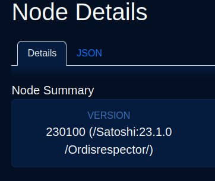

<!-- markdownlint-disable MD014 MD022 MD025 MD033 MD040 -->

# Bonus guide: Ordisrespector spam filter

{: .no_toc }

---

[Ordinals](https://ordinals.com/) is a project created to number sats. It also has a feature called inscriptions, which is the problematic part and what is mainly being touched on in this guide. An inscription is basically data stored on chain associated with a sat.
And why are they an attack on Bitcoin?

First of all, we probably should look at what Bitcoin is:

    A Peer-to-Peer Electronic Cash System [(Bitcoin Whitepaper)](https://bitcoin.org/bitcoin.pdf)

There is no mention of data storage on the chain and only financial transactions.
Ordinals abuse the Bitcoin timechain which was meant to process financial transactions to store data, and this has some issues, such as:

- Pushing out financial transactions, such as ones that need immediate confirmation such as force closes with pending HTLCs or a sweep-all TX.
- Driving up fee rates for the sole reason of inscribing a JPEG.
- It makes it way more expensive to maintain their node in the long term.
- It makes them liable for any illegal content in their jurisdiction that they store on their disk and broadcast freely.

while paying 4x less for the same bytes.

[Ordisrespector](https://twitter.com/oomahq/status/1621899175079051264){:target="_blank"} is a ***spam patch filter*** that works by detecting the pattern of Ordinals transactions that are entering the mempool of the node and ***rejecting them***. The original patch was created by Luke Dashjr, you can see it here: https://gist.github.com/luke-jr/4c022839584020444915c84bdd825831 [(Archive)](https://web.archive.org/web/20230207212859/https://gist.github.com/luke-jr/4c022839584020444915c84bdd825831)

Difficulty: Medium
{: .label .label-yellow }

Status: Tested MiniBolt
{: .label .label-blue }



---

## Table of contents
{: .text-delta }

1. TOC
{:toc}

---

## Preparations

* Login as "admin" user (for a MiniBolt environment) or your assigned user with `sudo` permissions, and set the next environment variable

  ```sh
  $ VERSION=24.0.1
  ```

* Install the next dependencies

  ```sh
  $ sudo apt update
  ```

  ```sh
  $ sudo apt-get install autoconf automake build-essential libboost-filesystem-dev libboost-system-dev libboost-thread-dev libevent-dev libsqlite3-dev libtool pkg-config --no-install-recommends
  ```

## Installation

* Change to the temporary directory which is cleared on reboot

  ```sh
  $ cd /tmp
  ```

* Get the latest binaries and signatures

  ```sh
  $ wget https://bitcoincore.org/bin/bitcoin-core-$VERSION/bitcoin-$VERSION.tar.gz
  ```

  ```sh
  $ wget https://bitcoincore.org/bin/bitcoin-core-$VERSION/SHA256SUMS
  ```

  ```sh
  $ wget https://bitcoincore.org/bin/bitcoin-core-$VERSION/SHA256SUMS.asc
  ```

### Checksum check

* Check that the reference checksum in file `SHA256SUMS` matches the checksum calculated by you (ignore the "lines are improperly formatted" warning)

  ```sh
  $ sha256sum --ignore-missing --check SHA256SUMS
  ```

Expected output:

  ```sh
  > bitcoin-$VERSION.tar.gz: OK
  ```

### Signature check

Bitcoin releases are signed by several individuals, each using its own key. To verify the validity of these signatures, you must first import the corresponding public keys into your GPG key database.

* The next command download and imports automatically all signatures from the [Bitcoin Core release attestations (Guix)](https://github.com/bitcoin-core/guix.sigs) repository

  ```sh
  $ curl -s "https://api.github.com/repositories/355107265/contents/builder-keys" | grep download_url | grep -oE "https://[a-zA-Z0-9./-]+" | while read url; do curl -s "$url" | gpg --import; done
  ```

Expected output:

  ```sh
  > gpg: key 17565732E08E5E41: 29 signatures not checked due to missing keys
  > gpg: /home/admin/.gnupg/trustdb.gpg: trustdb created
  > gpg: key 17565732E08E5E41: public key "Andrew Chow <andrew@achow101.com>" imported
  > gpg: Total number processed: 1
  > gpg:               imported: 1
  > gpg: no ultimately trusted keys found
  [...]
  ```

* Verify that the checksums file is cryptographically signed by the release signing keys.
  The following command prints signature checks for each of the public keys that signed the checksums.

  ```sh
  $ gpg --verify SHA256SUMS.asc
  ```

* Check that at least a few signatures show the following text

Expected output:

  ```sh
  > gpg: Good signature from ...
  > Primary key fingerprint: ...
  ```

* If you're satisfied with the checksum, signature and timestamp checks, extract the Bitcoin Core source code, install them and check the version.

  ```sh
  $ tar -xvf bitcoin-$VERSION.tar.gz
  ```

### Build it from the source code

* Enter the Bitcoin Core source code folder

  ```sh
  $ cd bitcoin-$VERSION
  ```

* Execute the next command

  ```sh
  $ ./autogen.sh
  ```

* The next command will pre-configure the installation, enter the complete next command in the terminal and press enter

  ```sh
  $ ./configure \
      --disable-bench \
      --disable-gui-tests \
      --disable-maintainer-mode \
      --disable-man \
      --disable-tests \
      --with-daemon=yes \
      --with-gui=no \
      --with-libmultiprocess=no \
      --with-libs=no \
      --with-miniupnpc=no \
      --with-mpgen=no \
      --with-natpmp=no \
      --with-qrencode=no \
      --with-utils=yes
  ```

### Apply the patch "Ordisrespector"

* Apply ***"Ordisrespector"*** spam filter by entering the complete next command in the terminal and pressing enter

  ```
  git apply << EOF
  --- a/src/script/interpreter.cpp
  +++ b/src/script/interpreter.cpp
  @@ -504,6 +504,14 @@ bool EvalScript(std::vector<std::vector<unsigned char> >& stack, const CScript&
                      return set_error(serror, SCRIPT_ERR_MINIMALDATA);
                  }
                  stack.push_back(vchPushValue);
  +                if ((flags & SCRIPT_VERIFY_DISCOURAGE_UPGRADABLE_NOPS) && opcode == OP_FALSE) {
  +                    auto pc_tmp = pc;
  +                    opcodetype next_opcode;
  +                    valtype dummy_data;
  +                    if (script.GetOp(pc_tmp, next_opcode, dummy_data) && next_opcode == OP_IF) {
  +                        return set_error(serror, SCRIPT_ERR_DISCOURAGE_UPGRADABLE_NOPS);
  +                    }
  +                }
              } else if (fExec || (OP_IF <= opcode && opcode <= OP_ENDIF))
              switch (opcode)
              {
  EOF
  ```

* Patch the user agent with the tag "Ordisrespector" to identify our custom version to the rest of the network. Enter the complete next command in the terminal and press enter

  ```
  git apply << EOF
  --- a/src/clientversion.cpp
  +++ b/src/clientversion.cpp
  @@ -73,7 +73,7 @@ std::string FormatSubVersion(const std::string& name, int nClientVersion, const
              ss << "; " << *it;
          ss << ")";
      }
  -    ss << "/";
  +    ss << "/Ordisrespector/";
      return ss.str();
  }
  EOF
  ```

### Build

* Enter the command to build the custom binaries

  ```sh
  $ make -j$(nproc)
  ```

### Install

* Enter the next command to install the binaries on the system

  ```sh
  $ sudo make install
  ```

* Restart the Bitcoin Core to start Bitcoin Core with the Ordisrespector patch change

  ```sh
  $ sudo systemctl restart bitcoind
  ```

* Check changes are been correctly applied and the "User Agent" shows "Ordisrespector" word
  
  ```sh
  $ bitcoin-cli -netinfo
  ```

Expected output:

  ```
  > Bitcoin Core client v24.0.1 - server 70016/Satoshi:24.1.0/Ordisrespector/
  ```

<br /><br />

---

<< Back: [+ Bitcoin](index.md)
