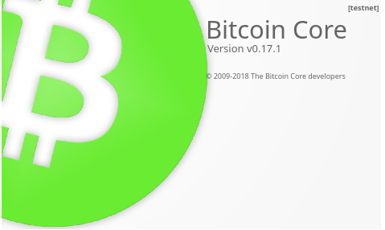

<!-- markdownlint-disable MD014 MD022 MD025 MD033 MD040 -->

# Bonus guide: MiniBolt on Testnet

{: .no_toc }

---

You can run your MiniBolt node on testnet to develop and experiment with new applications, without putting real money at risk. This bonus guide highlights all configuration changes compared to the main guide.

Difficulty: Medium
{: .label .label-yellow }

Status: Tested MiniBolt
{: .label .label-blue }



---

## Table of contents
{: .text-delta }

1. TOC
{:toc}

---

# Introduction

Running a testnet node is a great way to get acquainted with the MiniBolt and the suite of Bitcoin-related software typical of these powerful setups. Moreover, testnet empowers users to tinker with the software and its many configurations without the threat of losing funds. Helping bitcoiners run a full testnet setup is a goal worthy of the MiniBolt, and this page should provide you with the knowledge to get there.

The great news is that most of the MiniBolt guide can be used as-is. The small adjustments come in the form of changes to the config files and ports for testnet. You can follow the guide and simply replace the following configurations in the right places as you go.

# Only testnet mode

## Bitcoin

### **Bitcoin client**

Follow the complete MiniBolt guide from the beginning, Bitcoin client included, when you arrive at the ["Configuration section"](../../bitcoin/bitcoin-client.md#configuration), stay tuned to replace and add the next lines on the "bitcoin.conf" file:

  ```sh
  $ nano /home/bitcoin/.bitcoin/bitcoin.conf
  ```

  ```
  ## Replace
  startupnotify=chmod g+r /home/bitcoin/.bitcoin/testnet3/.cookie
  ## Add
  testnet=1
  ```

The rest of the Bitcoin client guide is exactly the same. Note that the seeds nodes of the [privacy mode](../../bitcoin/bitcoin-client.md#privacy-mode) section will be different, being correct those on this [list](https://github.com/bitcoin/bitcoin/blob/master/contrib/seeds/nodes_test.txt). There are only Tor seed nodes, no clearnet or I2P nodes.

### **Electrum server**

Follow the complete Electrum server guide from the beginning, when you arrive to the ["Configure Firewall"](../../bitcoin/electrum-server.md#configure-firewall) section.

#### **Configure Firewall**

  ```sh
  $ sudo ufw allow 60001/tcp comment 'allow Fulcrum Testnet TCP from anywhere'
  ```

  ```sh
  $ sudo ufw allow 60002/tcp comment 'allow Fulcrum Testnet SSL from anywhere'
  ```

When you arrive at the ["Data directory"](../../bitcoin/electrum-server.md#data-directory) section on the "Download the custom Fulcrum banner based on MiniBolt...". Download the Fulcrum Testnet banner instead of mainnet.

  ```sh
  $ wget https://raw.githubusercontent.com/twofaktor/minibolt/main/resources/fulcrum-banner-testnet.txt
  ```

In the next ["Configuration"](../../bitcoin/electrum-server.md#configuration) step, stay tuned to replace the next lines on the `"/fulcrum.conf"` file:

  ```sh
  $ nano /data/fulcrum/fulcrum.conf
  ```

  ```
  # Bitcoin Core settings
  bitcoind = 127.0.0.1:18332
  rpccookie = /data/bitcoin/testnet3/.cookie

  # Fulcrum server general settings
  ssl = 0.0.0.0:60002
  tcp = 0.0.0.0:60001

  # Banner
  banner = /data/fulcrum/fulcrum-banner-testnet.txt
  ```

#### **Remote access over Tor**

* Ensure that you are logged in with user "admin" and add the following three lines in the section for "location-hidden services" in the torrc file. Save and exit

  ```sh
  $ sudo nano /etc/tor/torrc
  ```

* Edit torrc

  ```
  ############### This section is just for location-hidden services ###
  # Hidden Service Fulcrum Testnet TCP & SSL
  HiddenServiceDir /var/lib/tor/hidden_service_fulcrum_testnet_tcp_ssl/
  HiddenServiceVersion 3
  HiddenServicePort 60001 127.0.0.1:60001
  HiddenServicePort 60002 127.0.0.1:60002
  ```

* Reload the Tor configuration and get your connection addresses

  ```sh
  $ sudo systemctl reload tor
  ```

  ```sh
  $ sudo cat /var/lib/tor/hidden_service_fulcrum_testnet_tcp_ssl/hostname
  ```

**Example** of expected output:

  ```
  > abcdefg..............xyz.onion
  ```

* You should now be able to connect to your Fulcrum server remotely via Tor using your hostname and port 60001 (TCP) or 60002 (SSL)

The rest of the Fulcrum guide is exactly the same to the mainnet.

### **Blockchain Explorer**

Follow the complete Blockchain Explorer guide from the beginning, when you arrive to the ["Configuration section"](../../bitcoin/blockchain-explorer.md#configuration) section. Set the next lines with the next values instead of the existing for mainnet.

  ```sh
  $ nano /home/btcrpcexplorer/btc-rpc-explorer/.env --linenumbers
  ```

  ```
  BTCEXP_BITCOIND_PORT=18332
  BTCEXP_BITCOIND_COOKIE=/data/bitcoin/testnet3/.cookie
  BTCEXP_ELECTRUM_SERVERS=tcp://127.0.0.1:60001
  ```

### **Electrs**

Follow the complete guide from the beginning, when you arrive at the [Firewall & reverse proxy](../bitcoin/electrs.md#firewall--reverse-proxy) section.

#### **Firewall & reverse proxy**

* Enable NGINX reverse proxy to add SSL/TLS encryption to the Electrs communication.
  Create the configuration file and paste the following content

  ```sh
  $ sudo nano /etc/nginx/streams-enabled/electrs-reverse-proxy.conf
  ```

  ```nginx
  upstream electrs {
    server 127.0.0.1:60001;
  }
  server {
    listen 60002 ssl;
    proxy_pass electrs;
  }
  ```

* Test and reload NGINX configuration

  ```sh
  $ sudo nginx -t
  $ sudo systemctl reload nginx
  ```

* Configure the Firewall to allow incoming requests

  ```sh
  $ sudo ufw allow 60002/tcp comment 'allow Electrs SSL from anywhere'
  ```

  ```sh
  $ sudo ufw allow 60001/tcp comment 'allow Electrs TCP from anywhere'
  ```

When you arrive to the ["Configuration"](../bitcoin/electrs.md#configuration) section, replace with the next lines

  ```sh
  $ nano /data/electrs/electrs.conf
  ```

  ```
  network = "testnet"
  cookie_file = "/data/bitcoin/testnet3/.cookie"
  daemon_rpc_addr = "127.0.0.1:18332"
  daemon_p2p_addr = "127.0.0.1:18333"
  electrum_rpc_addr = "127.0.0.1:60001"

  server_banner = "Welcome to electrs (Electrum Rust Server) running on a MiniBolt node testnet!"
  ```

#### **Remote access over Tor**

* Ensure are you logged in with user `admin`, add the following lines in the section for "location-hidden services" in the `torrc` file

  ```sh
  $ sudo nano /etc/tor/torrc
  ```

  ```
  ############### This section is just for location-hidden services ###
  # Hidden Service Electrs Testnet TCP & SSL
  HiddenServiceDir /var/lib/tor/hidden_service_electrs_testnet_tcp_ssl/
  HiddenServiceVersion 3
  HiddenServicePort 60001 127.0.0.1:60001
  HiddenServicePort 60002 127.0.0.1:60002
  ```

* Reload the Tor configuration and get your connection addresses

  ```sh
  $ sudo systemctl reload tor
  ```

  ```sh
  $ sudo cat /var/lib/tor/hidden_service_electrs_testnet_tcp_ssl/hostname
  ```

*Example* expected output:

  ```
  > abcdefg..............xyz.onion
  ```

## Lightning

### **Lightning client**

When you arrive to the ["Configure LND"](../../lightning/lightning-client.md#configure-lnd) section, replace `"bitcoin.mainnet=true"` parameter to the `"bitcoin.testnet=true"`

  ```
  [Bitcoin]
  bitcoin.testnet=true
  ```

On the ["Allow user "admin" to work with LND"](../../lightning/lightning-client.md#allow-user-admin-to-work-with-lnd) step, replace the following command to the correct testnet path.

  ```sh
  $ sudo chmod g+r /data/lnd/data/chain/bitcoin/testnet/admin.macaroon
  ```

#### **Interacting with the LND daemon**

Note that when interacting with the LND daemon, you'll need to use the `"--network testnet"` option like so:

  ```sh
  $ lncli --network testnet walletbalance
  ```

Note that it has a list of testnet aliases related to these commonly used commands to make it easier to introduce in the terminal

### **Channel backup**

  ```sh
  $ sudo nano /usr/local/bin/scb-backup
  ```

  ```
  SCB_SOURCE_FILE="/data/lnd/data/chain/bitcoin/testnet/channel.backup"
  ```

### **Web app**

#### **ThunderHub**

  ```sh
  $ sudo cp /data/lnd/data/chain/bitcoin/testnet/admin.macaroon /home/thunderhub/admin.macaroon
  ```

### **Mobile app**

#### **Zeus**

  ```sh
  --bitcoin.testnet       Use the test network
  ```

# Parallel mainnet & testnet mode

## **Bitcoin client**

Crear dos servicios uno con "bitcoind" y otro con "bitcoind -testnet"

  ```
  [main]
  startupnotify=chmod g+r /home/bitcoin/.bitcoin/.cookie

  [test]
  startupnotify=chmod g+r /home/bitcoin/.bitcoin/testne3/.cookie
  ```

## **Electrum server**

### **Fulcrum**

Dos servicios, uno con un config un normal y uno con el archivo testnet

Diferentes directorios para las bases de datos

### **Electrs**

Igual que fulcrum

## **Blockchain explorer**

## **Lightning client**

###

---

<< Back: [+ Bitcoin](index.md)
