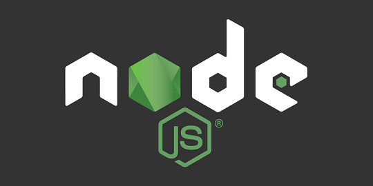

<!-- markdownlint-disable MD014 MD022 MD025 MD033 MD040 -->

## Install / Update / Uninstall Node.js + NPM

{: .no_toc }

Node.js [https://nodejs.org] is an open-source, cross-platform JavaScript runtime environment. Node.js includes NPM in the installation package as well.

Difficulty: Easy
{: .label .label-green }

Status: Tested MiniBolt
{: .label .label-blue }




---

## Table of contents
{: .no_toc .text-delta }

1. TOC
{:toc}

---

## Install Node.js + NPM

* With user "admin", set the environment variable

  ```sh
  $ VERSION=18
  ```

* Add the [Node.js](https://nodejs.org){:target="_blank"} package repository

  ```sh
  $ curl -fsSL https://deb.nodesource.com/setup_$VERSION.x | sudo -E bash -
  ```

* Install Node.js using the apt package manager

  ```sh
  $ sudo apt install nodejs
  ```

* Check the correct installation of nodejs

  ```sh
  $ node -v
  ```

* Check the correct installation of NPM

  ```sh
  $ npm -v
  ```

## Update

* To upgrade simply type this command

  ```sh
  $ sudo apt update && sudo apt upgrade
  ```

## Uninstall

* To uninstall type this command

  ```sh
  $ sudo apt autoremove nodejs
  ```

<br /><br />

---

<< Back: [+ System](index.md)
