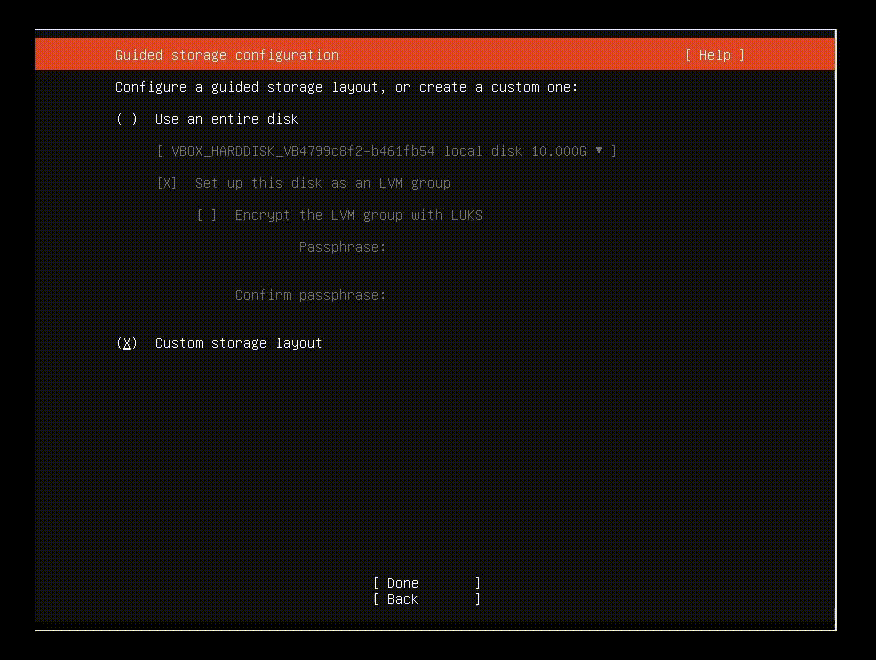

<!-- markdownlint-disable MD014 MD022 MD025 MD033 MD040 -->

# Bonus Guide: Store data in a secondary disk

{: .no_toc }

---

If you want to use a different disk to store data (blockchain and other databases) independently of the disk of the system, you can follow these instructions.

Difficulty: Easy
{: .label .label-green }

Status: Tested MiniBolt
{: .label .label-blue }

---

## Table of contents
{: .text-delta }

1. TOC
{:toc}

---

### **Case 1 (build it during system installation - recommended)**

When you arrive to **"Guided storage configuration"** step on system installation, follow next steps

* Select **"Custom storage layout"** and press **"Done"**

Under **AVAILABLE DEVICES** you will see both drives you installed on the PC, identify each one by drive model name and storage
It is recommended to choose the smallest size drive for the system and the bigger size driver for the data storage **`(/data)`**

* Select section where appeard the **MODEL** of the primary disk between `"[]"` and press enter -> Select **"Use As Boot Device"** and press enter again

This will select this storage as the boot disk and create automatically a new partition for the **"BIOS grub spacer"** on it.

* Select **"free space"** section of the same device, select **"Add GPT Partition"**. Ensure format is selected as `"ext4"`, select **"/"** in the dropdown as mount point, select **"Create"** and press enter

* Now select the **"free space"** of the **secondary disk** on "AVAILABLE DEVICES" -> **Add GPT partition**. Ensure format is selected as `"ext4"`, select **"Other"** in the dropdown, type `/data` to assign to the a new **("/data")** folder, select **"Create"** and press enter

* Select **"Done"** and press enter. Confirm destructive action warning banner hitting **"Continue"**

🚨 **This will delete all existing data on the secondary disk, including existing partitions!**



### **Case 2 (build it after system installation)**

#### **Steps required**

To use a different disk to store data (blockchain and others databases) independently of the disk of the system, there are a few additional steps compared to the default MiniBolt guide.
Below is a summary of the main differences, with detailed guidance in the following sections.

1. [Operating system](../../system/operating-system.md)

    * write the data (blockchain and other databases) in a secondary disk instead of the primary disk

1. [System configuration](../../system/system-configuration.md)

    * attach the secondary disk
    * format the disk and create a partition
    * mount the disk to `/data` folder

### **System configuration**

Follow the [System configuration](../../system/configuration.md) section until you reach [Data directory](../../system/configuration.md#data-directory), continuing with the instructions below.

#### **Format secondary disk**

* List all block devices with additional information

  ```
  $ lsblk -o NAME,MOUNTPOINT,UUID,FSTYPE,SIZE,LABEL,MODEL
  ```

*Example* expected output without existing partitions:

  ```
  > NAME          MOUNTPOINT UUID                          FSTYPE   SIZE    LABEL  MODEL
  > **sdb**                                                         931.5G         Samsung SSD 870
  ```

*Example* expected output with existing partitions:

  ```
  > NAME          MOUNTPOINT UUID                          FSTYPE   SIZE    LABEL  MODEL
  > sdb                                                             931.5G         Samsung SSD 870
  > sdb1                     2219-782E                     ext4     931.5G
  ```

Here we will see if the new disk has been detected by the system and what unit name has been assigned to it. Normally `sda` is name assigned for the primary disk and `sdb` for the secondary disk, but your case could be different, pay attention to the "MODEL" column to identify each one, e.g: "Samsung SSD 870".

#### **Delete existing partition & create a new one**

* Type this command to use the `"fdisk"` utility and manage the secondary disk

  ```sh
  $ sudo fdisk /dev/sdb
  ```

* Now we are select the option wished pressing the option letter and enter.

  * Press **`"n"`** to create a new partition and then enter.
  Press enter until prompt show **"(Command (m for help))"** again.

If you had existing partition/s, the prompt shows you **"All space for primary partitions is in use"**, you will need typing **`"d"`** and press enter until the prompt shows you **"Partition X has been deleted"** if not, press enter until the prompt shows you **"Created a new partition X of type 'Linux filesystem'"** and....

If you had existing partition/s, the prompt will shows you **"Partition #1 contains a ext4 signature"** **"Do you want to remove the signature? [Y]es/[N]o"**, type **`"Y"`** and press enter and the prompt shows **"The signature will be removed by a write command"** if not, press enter until the prompt shows you **"Created a new partition X of type 'Linux filesystem'"** and....

* Finally, don't forget, type **`"w"`** to write on disk and exit

This will create a new partition called probably `"sdb1"`

* Finally format the new partition to `"Ext4"` and obtain the **UUID**

  ```sh
  $ sudo mkfs.ext4 /dev/[NAME_P]
  ```

  ```
  mke2fs 1.46.5 (30-Dec-2021)
  Creating filesystem with 1572608 4k blocks and 393216 inodes
  ***Filesystem UUID:*** **dafc3c67-c6e5-4eaa-8840-adaf604c85db**
  Superblock backups stored on blocks:
          32768, 98304, 163840, 229376, 294912, 819200, 884736
  ```

Take note of your UUID e.g dafc3c67-c6e5-4eaa-8840-adaf604c85db

* Make a note of the partition name of your secondary disk (normally **"sdb1"**)

#### **Mount secondary disk**

The secondary disk is then attached to the file system and becomes available as a regular folder (this is called “mounting”).

* List the block devices once more and copy the new partition's `UUID` into a text editor on your main machine.

*Example* expected output:

  ```
  $ lsblk -o NAME,MOUNTPOINT,UUID,FSTYPE,SIZE,LABEL,MODEL
  > NAME        MOUNTPOINT UUID                                 FSTYPE   SIZE LABEL  MODEL
  > sdb                                                                931.5G        Samsung SSD 870
  > └─sdb1                 3aab0952-3ed4-4652-b203-d994c4fdff20 ext4   931.5G
  ```

* Edit the `"fstab"` file and add the following as a new line **at the end**, replacing `123456...` with your own `UUID`.

  ```sh
  $ sudo nano /etc/fstab
  ```

  ```
  UUID=123456... /data ext4 defaults 0 2
  ```

* Create the data directory as a mount point
  We also make the directory immutable to prevent data from being written on the system primary disk if the secondary disk is not mounted.

  ```sh
  $ sudo mkdir /data
  $ sudo chown admin:admin /data
  $ sudo chattr +i /data
  ```

* Mount all disks and check the file system.
  Is “/data” listed?

  ```sh
  $ sudo mount -a
  $ df -h /data
  > Filesystem      Size  Used Avail Use% Mounted on
  > /dev/sda1       938G   77M  891G   1% /data
  ```

### Continue with the guide

That's it: your PC now boots from the primary disk while the data directory **`(/data)`** is located on the secondary disk.

You can now continue with the MiniBolt guide.

---

<< Back: [+ System](index.md)
