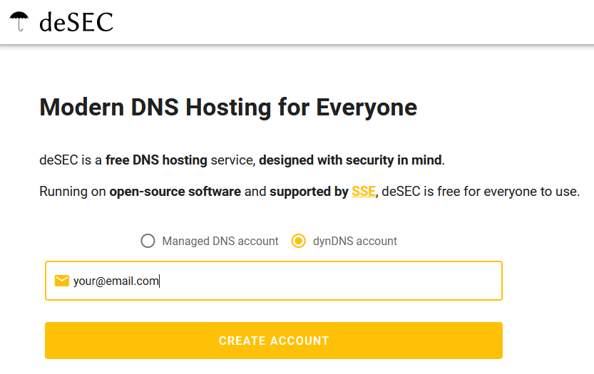
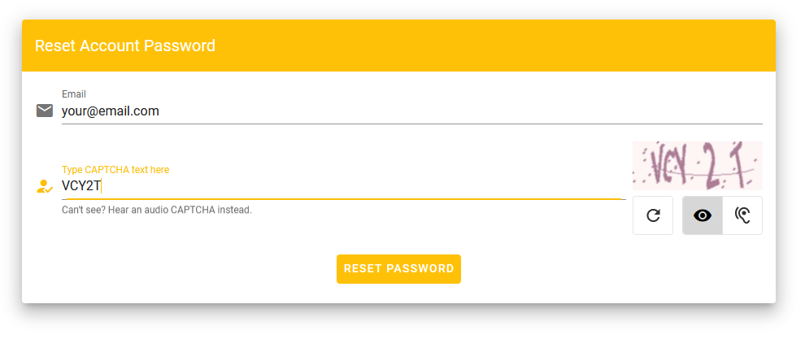
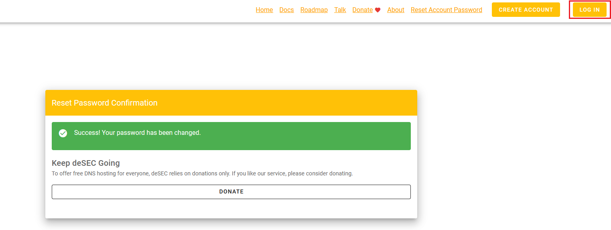
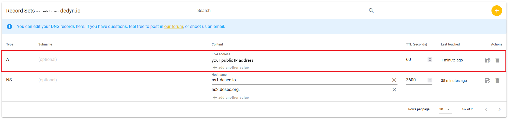

<!-- markdownlint-disable MD014 MD022 MD025 MD033 MD040 -->

## Bonus guide: WireGuard: a simple yet fast VPN

{: .no_toc }

---

The following guide was derived from contributions by [Pantamis](https://github.com/Pantamis).

[WireGuard](https://www.wireguard.com) is a VPN you can set up to access your MiniBolt from the outside.
It makes it easier to run services on your node without exposing its ports to the public Internet.
It has support on all major computer OSes, and apps for Android and iOS.
The only requirement is to forward a UDP port from your home router to the MiniBolt node.


Difficulty: Intermediate
{: .label .label-yellow }

Status: Tested MiniBolt
{: .label .label-blue }

---

## Table of contents
{: .no_toc .text-delta }

1. TOC
{:toc}

---

## Acknowledgments

## Why use WireGuard and trade-off

A VPN is an encrypted tunnel between two computers over the internet.
In our case, MiniBolt will play the role of the server, and you will be able to access your home network from outside with configured client devices.
Several trade-offs are using a VPN versus using Tor.

Advantages:

* The connection with the VPN is a lot faster than using Tor (Bitcoin Core and LND will still use Tor)
* WireGuard has an incredibly low resource usage.
* The attack surface on your home network and MiniBolt is reduced as fewer ports are open on your router.

Disadvantages:

* However, a VPN is not anonymous, a spy can see that you send encrypted traffic to your home router, but he cannot know what you are doing.
* WireGuard is not censorship-resistant. The encrypted byte headers contain identifiable data which allows telling that you are using WireGuard VPN.
* You need to open one port on your router.


## Prerequisites

Before starting with the installation proper, you need to:

1. Figure out if your Internet Service Provider (ISP) uses [Carrier-Grade NAT](https://superuser.com/questions/713422/how-would-i-test-to-see-if-im-behind-carrier-grade-or-regular-nat).
   If that's the case you have no way of accessing your home network from the outside, and you'll need to contact them asking to put you out of CG-NAT (this means giving your router a dedicated public IP).
   Most ISP simply do this on request or either charge a small fee to allocate a public IP just for you.
2. Figure out the public IP of your home network. If you have a static public IP it'll simplify the setup, but it's not mandatory.
   There are plenty of websites that show you your public IP. One such site is [https://whatismyipaddress.com/](https://whatismyipaddress.com/)
3. Forward the `51820` port and "UDP" protocol of your router to the local IP of your MiniBolt.
   This procedure changes from router to router so we can't be very specific, but involves logging into your router's administrative web interface (usually at [http://192.168.1.1](http://192.168.1.1) or [http://192.168.0.1](http://192.168.0.1)) and finding the relevant settings page. See [portforward.com](https://portforward.com/) for directions on how to port forward with your NAT/router device.

## Set up Dynamic DNS

However, unless it is a static IP (unlikely if it is a residential IP) your ISP can change it at any minute, thus breaking the setup we made.
In order to fix this we can maintain a DNS record that always points to your latest IP, and the WireGuard clients can use that instead of the IP.

### Desec registration

Go to  [https://desec.io](https://desec.io), type your preferred email, select dynDNS account and hit the "CREATE ACCOUNT" button.



You'll see the following form:


Ensure are selected the second option (Register a new domain under dedyn.io)

For the purposes of this demo, I've typed a random subdomain `"yoursubdomain"`, but ***you can use anything memorable*** to you as long as no one has already taken that name.

Type CAPTCHA and check the box "Yes, I agree to the..." option.

After clicking SIGN UP, deSEC will email you to confirm the address. It will contain a verification link that will send you to this page:


Take note of the "Token secret", you'll need it later as "YOUR_SECRET_TOKEN", but for now, click on "ASSIGN ACCOUNT PASSWORD" button down below to lock down your account.

Type again your email, complete the captcha and click on the "RESET PASSWORD" button.



This will prompt deSEC to send you another email with another link that will let you set your account password.

After all that is done, click LOG IN and use your email and password.



### Dynamic IP script (on MiniBolt)

Now we'll write a Bash script for MiniBolt that will periodically poll its own IP and send it to deSEC.
We'll need the "secret token" from the deSEC registration step.

* As `"admin"` user, log in to MiniBolt and paste the following script into `/opt/dynamic-ip-refresh.sh`

  ```sh
  $ sudo nano /opt/dynamic-ip-refresh.sh
  ```

Replace yoursubdomain.dedyn.io and YOUR_SECRET_TOKEN before created. Save and exit

  ```
  #!/usr/bin/env bash

  set -euo pipefail

  DEDYN_DOMAIN=yoursubdomain.dedyn.io
  DEDYN_TOKEN=YOUR_SECRET_TOKEN

  CURRENT_IP=$(curl -s https://api.ipify.org/)

  curl -i -s \
    -H "Authorization: Token ${DEDYN_TOKEN}" \
    -X GET "https://update.dedyn.io/?hostname=${DEDYN_DOMAIN}&ip=${CURRENT_IP}"
  ```

After writing the script make it executable and restrict access to it (because it contains sensitive data), and create a crontab entry for root to run it every two minutes:

  ```sh
  $ sudo chmod 700 /opt/dynamic-ip-refresh.sh
  ```

  ```sh
  $ sudo crontab -e
  ```

Type 1 to choose "nano" editor and add the next line at the end of the file. Save and exit

  ```
  */2 * * * *     /opt/dynamic-ip-refresh.sh
  ```

Return to deSEC web interface and click on your domain:


After 2 minutes, you should see a new automatic registry "type A" with your IP address of the DNS record has changed automatically:



You now have a free domain (yoursubdomain.dedyn.io) that always points to your home public IP address.

The only step left is replacing the IP of your WireGuard clients configuration with it.
So the Endpoint section would change from `youpublicIP:51820` to `yoursubdomain.dedyn.io:51820`.

### Configure Firewall

* Log in as user `"admin"` on MiniBolt node, and configure the firewall to allow incoming requests

  ```sh
  $ sudo ufw allow 51820/udp comment 'allow WireGuard VPN from anywhere'
  ```

### Install WireGuard

* Update the packages, upgrade and install WireGuard

  ```sh
  $ sudo apt update && sudo apt full-upgrade
  ```

  ```sh
  $ sudo apt install wireguard
  ```

* Now we generate key pair. The next command is for generating a private key:

  ```sh
  $ wg genkey | tee private_key
  ```

Private key ***example expected output***, we'll it call `"<Your_Server_Private_Key>"` from now on.

  ```
  mJFGKxeQqxafyDdLDEDHRml6rDJUs7JZte3uqfJBQ0Q=
  ```

* Now obtain the public key related to the private key

  ```sh
  $ sudo cat private_key | wg pubkey | tee public_key
  ```

Public key ***example expected output***, we'll it call `"<Your_Server_Public_Key>"` from now on:

  ```
  GOQi4j/yvmu/7f3cRvFZwlXvnWS3gRLosQbjrb13sFY=
  ```

Take note and securely back up this public key in your preferred password manager (Bitwarden, Lastpass, Keypass...).

* Edit `wg0.conf` file

  ```sh
  $ sudo nano /etc/wireguard/wg0.conf
  ```

Write the following contain and replace only `"<Your_Server_Private_Key>"` with the last obtained output:

  ```
  ## Server configuration
  [Interface]
  Address = 10.0.0.1/24
  ListenPort = 51820
  PrivateKey = <Your_Server_Private_Key>
  ```

* Enable autoboot

  ```sh
  $ sudo systemctl enable wg-quick@wg0.service
  ```

* Start Wireguard VPN

  ```
  $ sudo systemctl start wg-quick@wg0.service
  ```

This will turn it on permanently, and also start it automatically when MiniBolt reboots.
We won't do this on the client because we want it to be able to connect to the VPN selectively.

Delete the `private_key` and `public_key` files, but ensure before you take note of the server's keys in your preferred password manager.

  ```sh
  $ sudo rm /home/admin/private_key && rm /home/admin/public_key
  ```

## Installation

## Server configuration (MiniBolt)

## Client configuration Linux (part 1)

Start by visiting [WireGuard's installation page](https://www.wireguard.com/install/) and download and install the relevant version of WireGuard for your OS.
Here, we'll assume your client is a Linux desktop OS, because it is the most similar to setting up the server.

* On Linux, for instance, you do this by simply installing the `wireguard` package:

  ```sh
  sudo apt install wireguard
  ```

* Now we generate key pair. The next command is for generating a private key:

  ```sh
  $ wg genkey | tee private_key
  ```

Private key ***example expected output***, we'll it call `"Your_Client_Private_Key"` from now on.

  ```
  GGH/UCK3K9qzd48u8m872azvsdeyaSjs9cVs0pl4fko=
  ```

* Now obtain the public key related to the private key:

  ```sh
  $ cat private_key | wg pubkey | tee public_key
  ```

Public key ***example expected output***, we'll it call `"Your_Client_Public_Key"` from now on.

  ```
  pNfWyNJ9WnbMqlLzHxwhvGnZ0/alT18MGy6K0iOxHCI=
  ```

These commands will show both the private and public keys on screen for your convenience, but will also write them in files `"private_key"` and `"public_key"`.

For the next part, you need to become root to be able to create and write the `"/etc/wireguard/wg0.conf"` file.
When you install the `"wireguard"` package the directory is created automatically, but it is empty.

  ```sh
  $ sudo nano /etc/wireguard/wg0.conf
  ```

Write the following contents to the `wg0.conf` file:

  ```
  ## Client configuration
  [Interface]
  Address = 10.0.0.2/24
  PrivateKey = <Your_Client_Private_Key>

  ## Server configuration (MiniBolt)
  [Peer]
  PublicKey = <Your_Server_Public_Key>
  AllowedIPs = 10.0.0.1/32
  Endpoint = yoursubdomain.dedyn.io:51820
  ```

📝 A few things to note here:

> In the `PrivateKey` section, you have to fill in the client's private key that we generated in the previous step.

> The `PublicKey` of the Peer refers to the public key of MiniBolt. We don't know it because we haven't set it up yet.

> In `Endpoint`, you need to fill in your router's public IP that you should have found out in the Prerequisites step.
Later on we'll set up a DNS record that will always point to your home's public IP even if your ISP changes it, but for now the raw IP will suffice.

Now that the configuration is written you can delete the `private_key` and `public_key` files from the disk, but take note of the client's public key before moving on to configure MiniBolt.

  ```sh
  $ sudo rm /home/admin/private_key && rm /home/admin/public_key
  ```

## Client configuration (part 2)

Now that the WireGuard server is running and we know its public key we can complete our client setup and test it.

* As user admin, edit the `wg0.conf` file and fill in the peer's `PublicKey`.

  ```sh
  $ sudo nano /etc/wireguard/wg0.conf
  ```

  ```
  [Peer]
  PublicKey = Your_Client_Public_Key
  AllowedIPs = 10.0.0.2/32
  ```

Now, to finally test the VPN connection run this command and try to log in to MiniBolt with SSH using the VPN IP.

  ```sh
  $ wg-quick up wg0
  ```

Expected output:

  ```
  [#] ip link add wg0 type wireguard
  [#] wg setconf wg0 /dev/fd/63
  [#] ip -4 address add 10.0.0.2/24 dev wg0
  [#] ip link set mtu 1420 up dev wg0
  ```

  ```sh
  $ ssh admin@10.0.0.1
  ```

To turn it off use `wg down` instead of `up`

* To check the VPN status use `sudo wg show`

  ```sh
  $ sudo wg show
  ```

Expected output:

  ```
  interface: wg0
    public key: pNfWyNJ9WnbMqlLzHxwhvGnZ0/alT18MGy6K0iOxHCI=
    private key: (hidden)
    listening port: 54124

  peer: GOQi4j/yvmu/7f3cRvFZwlXvnWS3gRLosQbjrb13sFY=
    endpoint: Your_Public_IP:51820
    allowed ips: 10.0.0.1/32
    latest handshake: 10 minutes, 46 seconds ago
    transfer: 49.56 KiB received, 52.36 KiB sent
  ```

  ```sh
  $ wg-quick down wg0
  ```

Expected output:

  ```sh
  [#] ip link delete dev wg0
  ```

## Tip for configuring a mobile client

Entering public and private key material into a mobile phone is particularly cumbersome.
A nice feature of the mobile Wireguard apps is that they can import the full configuration for a tunnel in QR code format.

To do that you need the `qrencode` package on MiniBolt:

  ```sh
  $ sudo apt install qrencode
  ```

Now, assuming you have written a WireGuard configuration file at `config.txt` you can convert it to a QR code like so:

  ```sh
  $ qrencode -t ansiutf8 < config.txt
  ```

## Extras

## Configure additional clients

For each additional client, you need to install the WireGuard software, and reuse the key pair before created for it and write it's configuration file.
This time you'll already know the server's public key and endpoint from the start.

## Configure additional servers

At this point, we have defined a Virtual Private Network in the `10.0.0.1/24` network range where MiniBolt is at `10.0.0.1` and your client at `10.0.0.2`.
You could use any other [private IP range](https://en.wikipedia.org/wiki/Private_network#Private_IPv4_addresses).
Here we chose `10.0.0.1/24` because it stands out and is not likely to collide with any other network from your machines.

### Use your router’s DDNS preconfigured provider

Some routers have support for Dynamic DNS providers like NO-IP or deSEC, out of the box, and you just need to select the right option (“deSEC”, “desec.io”, “dedyn”, NoIP or similar). For example, if you run a router with the OpenWRT operation system, watch out for the “desec.io” provider.

If your router does not have deSEC preconfigured, the configuration procedure will depend on the specific type of router which is why we can’t provide a tutorial for all of them. However, most of the time it boils down to entering the following details in your router configuration:

  * Provider: select on the drop-down, the provider ID, e.g. www.no-ip.com
  * Domain name: the full name of the domain you want to update, e.g. yoursubdomain.dedyn.io
  * Username: selected username or email of the previously created account
  * Password/Token secret (long random string for authentication, displayed after sign-up)

---

<< Back: [+ System](index.md)
