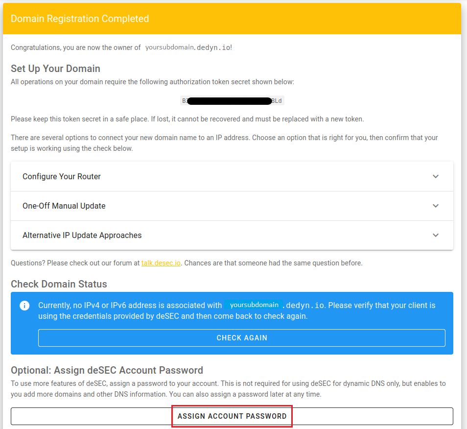

<!-- markdownlint-disable MD014 MD022 MD025 MD033 MD040 -->

## Bonus guide: WireGuard: a simple yet fast VPN

{: .no_toc }

---

Difficulty: Intermediate
{: .label .label-yellow }

Status: Tested MiniBolt
{: .label .label-blue }

---

## Table of contents

{: .no_toc .text-delta }

1. TOC
{:toc}

---

## Acknowledgments

The following guide was derived from contributions by [Pantamis](https://github.com/Pantamis).

[WireGuard](https://www.wireguard.com) is a VPN you can set up to access your MiniBolt from the outside.
It makes it easier to run services on your node without exposing their ports to the public Internet.
It has support on all major computer OSes, and apps for Android and iOS.
The only requirement is to forward a UDP port from your home router to the MiniBolt node.


## Why using WireGuard and trade-off

A VPN is an encrypted tunnel between two computers over the internet.
In our case MiniBolt will play the role of the server, and you will be able to access your home network from outside with configured client devices.
Depending on the configuration of the client, you can redirect all your internet traffic through the VPN which will hide the true destination from the internet provider your client is currently using (the classical case is public network).
However, your home internet provider (where your MiniBolt is connected) will be able to tell what you are doing, but it will see it coming from your home.

There are several trade-off using a VPN versus using Tor:

* The connection with the VPN is a lot faster than using Tor (bitcoin and lnd will still use Tor if it was already the case)
* WireGuard has an incredible low resource usage. It will automatically go to sleep when not use and instantaneously reconnect if needed whereas Tor has a significant initialization time.
* The attack surface on your home network and MiniBolt is reduced as fewer ports are open on your router.
* However, a VPN is not anonymous, a spy can see that you send encrypted traffic to your home router, but he cannot know what you are doing.
* WireGuard is not censorship-resistant. The encrypted byte headers contain identifiable data which allows to tell that you are using WireGuard VPN.
* You need to open one port on your router if you don't use IPv6, which is more than none when you rely only on Tor (notice that this is the case for all services that are not Tor-compatible like lndhub, Joule, Juggernaut....)


Copy-pasting command line instructions should work (except when you have to complete with private and public keys).
However, you need to know the public URL/IP of your home router where the MiniBolt is connected and to forward a port (51820 if you just copy-paste command lines).
The procedure can be different for each router, so you are on your own to do it.
If your router does support NAT Loopback, it must be active if you want to be able to connect your VPN client from the local network of the MiniBolt with IPv4 (which is useless in theory but disconnecting the VPN several time at home may be inconvenient if you enable VPN at boot on one client device).

## Prerequisites

Before starting with the installation proper, you need to:

1. Figure out if your Internet Service Provider (ISP) uses [Carrier-Grade NAT](https://superuser.com/questions/713422/how-would-i-test-to-see-if-im-behind-carrier-grade-or-regular-nat).
   If that's the case you have no way of accessing your home network from the outside, and you'll need to phone them asking to put you out of CG-NAT (this means giving your router a dedicated public IP).
   Most ISP simply do this on request or either charge a small fee to allocate a public IP just for you.
2. Figure out the public IP of your home network. If you have a static public IP it'll simplify the setup, but it's not mandatory.
   There are plenty of websites that show you your public IP. One such site is [https://whatismyipaddress.com/](https://whatismyipaddress.com/)
3. Forward the `51820/UDP` port of your router to the local IP of your MiniBolt.
   This procedure changes from router to router so we can't be very specific, but involves logging into your router's administrative web interface (usually at [http://192.168.1.1](http://192.168.1.1)) and find the relevant settings page.

## Client configuration

Start by visiting [WireGuard's installation page](https://www.wireguard.com/install/) and download and install the relevant version of WireGuard for your OS.
Here, we'll assume your client is a Linux desktop because it the most similar to setting up the server.
On Ubuntu, for instance, you do this by simply installing the `wireguard` package:

  ```sh
  sudo apt install wireguard
  ```

* After that, use the `wg` command to generate a WireGuard key pair:

  ```sh
  $ wg genkey | tee private_key
  GGH/UCK3K9qzd48u8m872azvsdeyaSjs9cVs0pl4fko=
  $ cat private_key | wg pubkey | tee public_key
  pNfWyNJ9WnbMqlLzHxwhvGnZ0/alT18MGy6K0iOxHCI=
  ```

These commands will show both the private and public keys on screen for your convenience, but will also write them in files `private_key` and `public_key`.
Note that each time you run `wg genkey` you get a brand new private key.
However, given the same private key `wg pubkey` will always derive the same public key.

For the next part, you need to become root to be able to create and write the `/etc/wireguard/wg0.conf` file.
When you install the `wireguard` package the directory is created automatically, but it is empty.

  ```sh
  $ sudo su
  $ cd /etc/wireguard
  $ nano wg0.conf
  ```

* Write the following contents to the `wg0.conf` file:

  ```
  [Interface]
  Address = 10.0.0.2/24
  PrivateKey = Client_Private_Key

  [Peer]
  PublicKey = Server_Public_Key
  Endpoint = Your_Public_IP:51820
  AllowedIPs = 10.0.0.1/32
  ```

A few things to note here.

In the `PrivateKey` section you have to fill in the client's private key that we generated in the previous step.

The `PublicKey` of the Peer refers to the public key of MiniBolt. We don't know it because we haven't set it up yet.

In `Endpoint` you need to fill in your router's public IP that you should have found out in the Prerequisites step.
Later on we'll set up a DNS record that will always point to your home's public IP even if your ISP changes it, but for now the raw IP will suffice.

Now that the configuration is written you can delete the `private_key` and `public_key` files from disk, but take note of the client's public key before moving on to configure MiniBolt.

## Server configuration (MiniBolt)

### Configure Firewall

* As user admin, configure the firewall to allow incoming requests

  ```sh
  $ sudo ufw allow 51820/udp comment 'allow WireGuard VPN from anywhere'
  ```

* Update the packages and install WireGuard

  ```sh
  $ sudo apt-get update
  $ sudo apt install wireguard
  ```

* Now we generate another key pair as we did on the client:

  ```sh
  $ wg genkey | tee private_key
  mJFGKxeQqxafyDdLDEDHRml6rDJUs7JZte3uqfJBQ0Q=
  $ cat private_key | wg pubkey | tee public_key
  GOQi4j/yvmu/7f3cRvFZwlXvnWS3gRLosQbjrb13sFY=
  ```

* Again, become root so that you can create and write the `/etc/wireguard/wg0.conf` file.

  ```sh
  $ sudo su
  $ cd /etc/wireguard
  $ nano wg0.conf
  ```

This time write the following:

  ```
  [Interface]
  Address = 10.0.0.1/24
  ListenPort = 51820
  PrivateKey = Server_Private_Key

  [Peer]
  PublicKey = Client_Public_Key
  AllowedIPs = 10.0.0.2/32
  ```

Fill in the server's private key in the `PrivateKey` section and the client's public key in `PublicKey`.

At this point we have defined a Virtual Private network in the `10.0.0.1/24` network range where MiniBolt is at
`10.0.0.1` and your client at `10.0.0.2`.
You could use any other [private IP range](https://en.wikipedia.org/wiki/Private_network#Private_IPv4_addresses).
Here we chose `10.0.0.1/24` because it stands out and is not likely to collide with any other network from your machines.

Now exit root to go back to the admin user and register the newly created WireGuard service with systemd.
This will turn it on permanently, and also start it automatically when MiniBolt reboots.
We won't do this on the client because we want it to be able to connect to the VPN selectively.

  ```sh
  $ exit
  $ sudo systemctl enable wg-quick@wg0.service
  $ sudo systemctl start wg-quick@wg0.service
  ```

Delete the `private_key` and `public_key` files, but take note of the server's public key and go back to the client machine.

## Client configuration (part 2)

Now that the WireGuard server is running and we know its public key we can complete our client setup and test it.

Become root to edit the `/etc/wireguard/wg0.conf` file and fill in the peer's `PublicKey`.

Now, to finally test the VPN connection run this command and try to log in to MiniBolt with SSH using the VPN IP.

  ```sh
  $ wg-quick up wg0
  ```

Expected output:

  ```
  [#] ip link add wg0 type wireguard
  [#] wg setconf wg0 /dev/fd/63
  [#] ip -4 address add 10.0.0.2/24 dev wg0
  [#] ip link set mtu 1420 up dev wg0
  ```

  ```sh
  $ ssh admin@10.0.0.1
  ```

To turn it off use `wg down` instead of `up`

* To check the VPN status use `sudo wg show`

  ```sh
  $ sudo wg show
  ```

Expected output:

  ```
  interface: wg0
    public key: pNfWyNJ9WnbMqlLzHxwhvGnZ0/alT18MGy6K0iOxHCI=
    private key: (hidden)
    listening port: 54124

  peer: GOQi4j/yvmu/7f3cRvFZwlXvnWS3gRLosQbjrb13sFY=
    endpoint: Your_Public_IP:51820
    allowed ips: 10.0.0.1/32
    latest handshake: 10 minutes, 46 seconds ago
    transfer: 49.56 KiB received, 52.36 KiB sent
  ```

  ```sh
  $ wg-quick down wg0
  ```

Expected output:

  ```sh
  [#] ip link delete dev wg0
  ```

## Configure additional clients

For each additional client you need to install the WireGuard software, generate a new key pair for it and write it's configuration file.
This time you'll already know the server's public key and endpoint from the start.

Mind that each new client has to be allocated a new IP inside the VPN's network range. For instance, a second client could have the IP `10.0.0.3`,
as `10.0.0.1` and `10.0.0.2` are already taken by the server and the first client, respectively.

For instance, in Windows the WireGuard program already generates the key pair and writes a stub for the configuration just by clicking "Create new Tunnel".


## Configure additional clients (MiniBolt)

Each time you want to add a new client you just need to append a new `[Peer]` section in MiniBolt's `/etc/wireguard/wg0.conf` configuration file:

  ```
  [Peer]
  PublicKey = A_New_Client_Public_Key
  AllowedIPs = 10.0.0.3/32
  ```

After that you need to restart the WireGuard server for the changes to take effect. Mind that if you logged it to MiniBolt through WireGuard from
an already configured client this command will kick you out of MiniBolt temporarily:

  ```sh
  $ sudo systemctl restart wg-quick@wg0.service
  ```

## Set up Dynamic DNS

As of now, the clients have the public IP of MiniBolt hardcoded in their configuration.
However, unless it is a static IP (unlikely if it is a residential IP) your ISP can change it at any minute, thus breaking the setup we made.

In order to fix this we can maintain a DNS record that always point to your latest IP, and the WireGuard clients can use that instead of the IP.
We'll use [deSEC.io](https://desec.io/) because it allows registering subdomains free of charge.

### Registration

Head over to [https://desec.io/](https://desec.io/) and hit CREATE ACCOUNT.
You'll see the folloing form:


Here you must select the second option (Register a new domain under dedyn.io) and your desired subdomain name.
For the purposes of this demo I've generated a random string, but you can use anything memorable to you as long
as no one has already taken that name.

After clicking SIGN UP, deSEC will email you to confirm the address. It will contain a verification link that
will send you to this page:



Take note of the "token secret", you'll need it later.
But for now, click ASSIGN ACCOUNT PASSWORD down below to lock down your account.
This will prompt deSEC to send you another email with another link that will let you set your account password.

After all that is done, click LOG IN and use your email and password.
Once inside, click on your domain, and then on the big plus (+) symbol to add a new DNS record like so:


The record type must be `A`.

Subname can be whatever you want, but make it descriptive.

For the IP I recommend making it up (e.g. `1.2.3.4`) because in the next step we'll want to test if our IP updating mechanism works.

The TTL field is very important. It is the number of seconds that the DNS clients will cache the result of a DNS query before making another one again.
In this case we want to set it as low as possible.
In the case of deSEC this is 60 seconds.

### Dynamic IP script

Now we'll write a Bash script for MiniBolt that will periodically poll its own IP and send it to deSEC.
We'll need the "secret token" from the deSEC registration step.

Log into MiniBolt and paste the following script into `/opt/dynamic-ip-refresh.sh`

  ```sh
  $ sudo nano /opt/dynamic-ip-refresh.sh
  ```
  ```
  #!/usr/bin/env bash

  set -euo pipefail

  DEDYN_DOMAIN=wg.r4kkz4feflfx.dedyn.io
  DEDYN_TOKEN=YOUR_SECRET_TOKEN

  CURRENT_IP=$(curl -s https://api.ipify.org/)

  curl -i -s \
    -H "Authorization: Token ${DEDYN_TOKEN}" \
    -X GET "https://update.dedyn.io/?hostname=${DEDYN_DOMAIN}&ip=${CURRENT_IP}"
  ```

After writing the script make it executable and restrict access to it (because it contains sensitive data), and create a crontab entry for root to run it every two minutes:

  ```sh
  $ sudo chmod 700 /opt/dynamic-ip-refresh.sh
  ```
  ```sh
  $ sudo crontab -e
  ```
  ```
  */2 * * * *     /opt/dynamic-ip-refresh.sh
  ```

After a few minutes, you should see in the deSEC web interface that the IP of the `wg` DNS record has changed automatically:


You now have a free domain (wg.r4kkz4feflfx.dedyn.io) that always points to your home IP address.

The only step left is replacing the IP of your WireGuard clients configuration with it.
So the Endpoint section would change from `188.86.27.80:51820` to `wg.r4kkz4feflfx.dedyn.io:51820`.

## Tip for configuring a mobile client

Entering public and private key material into a mobile phone is particularly cumbersome.
A nice feature of the mobile Wireguard apps is that they can import the full configuration for a tunnel in QR code format.

To do that you need the `qrencode` package on MiniBolt:

  ```sh
  $ sudo apt install qrencode
  ```

Now, assuming you have written a WireGuard configuration file at `config.txt` you can convert it to a QR code like so:

  ```sh
  $ qrencode -t ansiutf8 < config.txt
  ```
