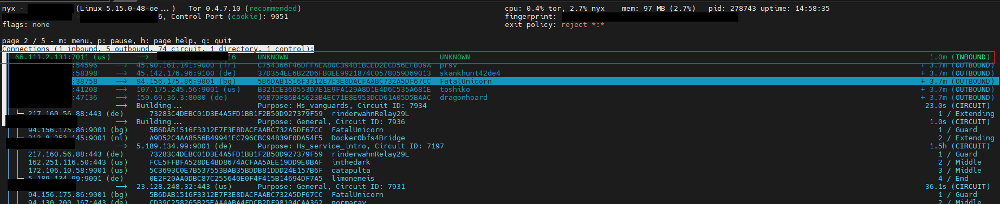
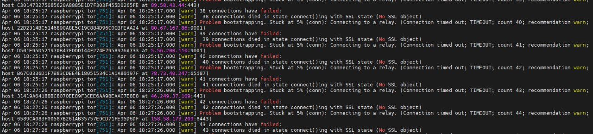
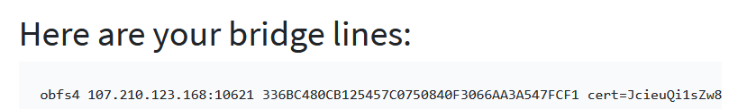
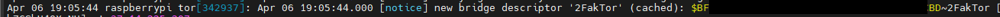

---
layout:
  title:
    visible: true
  description:
    visible: false
  tableOfContents:
    visible: true
  outline:
    visible: true
  pagination:
    visible: true
---

# Tor obfs4 bridge

The design of the Tor network means that the IP address of Tor relays is public. However, one of the ways Tor can be blocked by governments or ISPs is by blocklisting the IP addresses of these public Tor nodes. [Tor Bridges](https://tb-manual.torproject.org/bridges/) are nodes in the network that are not listed in the public Tor directory, which makes it harder for ISPs and governments to block them. We are going to use a kind of [pluggable transport](https://tb-manual.torproject.org/circumvention/) called [obfs4](https://gitlab.com/yawning/obfs4), a special kind of bridge, to address this by adding a layer of obfuscation.


_USE WITH CAUTION - For this guide to work properly, you will need to open ports too are reachable from outside_



Difficulty: Medium


<div data-full-width="false">


</div>

## Requirements

* [Tor](../../index-1/privacy.md#tor-installation)

## Preparations

### **Install dependencies**

[obfs4](https://gitlab.com/yawning/obfs4) makes Tor traffic look random and also prevents censors from finding bridges by Internet scanning. One of the most important things to keep your relay secure is to install security updates timely and ideally automatically so we can configure all.

* Ensure you are logged in with the user `admin` and install obfs4 proxy

```sh
$ sudo apt install obfs4proxy
```

## **Installation**

* Ensure you have Tor daemon installed in your system

```sh
$ tor --version
```

**Example** of expected output:

```sh
> Tor version 0.4.7.10.
[...]
```


If not obtain results, follow the [Privacy section](../../index-1/privacy.md#tor-installation) to install it


## Configuration

* Stay logged in with `admin` user, edit the torrc config file

```sh
$ sudo nano /etc/tor/torrc
```

* Add the next lines **at the end of the file**. We will use 2 ports: <**TODO1>** and <**TODO2>, m**ake sure you replace them. Save and exit

```
BridgeRelay 1
ExtORPort auto
ServerTransportPlugin obfs4 exec /usr/bin/obfs4proxy

ORPort <TODO1> IPv4Only
ServerTransportListenAddr obfs4 0.0.0.0:<TODO2>

ContactInfo <address@email.com>
Nickname <PickANickname>
```

<details>

<summary>💡 &#x3C;TODO1> ⬇️</summary>


```
Replace <TODO1> with a Tor port of your choice >1024. Avoid port 9001 because it's commonly associated with Tor and censors may be scanning the Internet for this port.
```


</details>

<details>

<summary>💡 &#x3C;TODO2> ⬇️</summary>


```
Replace <TODO2> with an obfs4 port of your choice. This port must be externally reachable and must be different from the one specified for ORPort <TODO1>. Avoid port 9001 because it's commonly associated with Tor and censors may be scanning the Internet for this port.
```


</details>

<details>

<summary>💡 ContactInfo ⬇️</summary>


```
Replace <address@email.com> with your email address so we can contact you if there are problems with your bridge. This line can be used to contact you if your relay or bridge is misconfigured or something else goes wrong. Note that we archive and publish all descriptors containing these lines and that Google indexes them, so spammers might also collect them. You may want to obscure the fact that it's an email address and/or generate a new address for this purpose. e.g ContactInfo Random Person <nobody AT example dot com>. You might also include your PGP or GPG fingerprint if you have one. This is optional but encouraged.
```


</details>

<details>

<summary>💡 Nickname ⬇️</summary>


```
Replace <PickANickname> with a nickname that you like for your bridge. Nicknames must be between 1 and 19 characters inclusive and must contain only the characters [a-zA-Z0-9]. This is optional.
```


</details>


Don't forget to change the ORPort <**TODO1>**, ServerTransportListenAddr <**TODO2>**, ContactInfo [address@email.com](mailto:\*\*address@email.com), and Nickname <**PickANickname>** options.



By default, Tor will advertise your bridge to users through various [mechanisms](https://bridges.torproject.org/info?lang=en). If you want to run a private bridge, for example, you'll give out your bridge address manually to your friends. **Add** the next line at the end of the torrc file:

> ```
> BridgeDistribution none
> ```

Currently valid, recognized options are: `none` | `any` | `https` | `email` | `moat`


If you don't specify this line, by default the method will be `any` , this means that you give the choice of whatever method it sees fit


### **Configure Firewall & Router**

* Configure the firewall to allow incoming requests to be replaced `<TODO1>` and `<TODO2>` previously configured in the section before

```sh
$ sudo ufw allow <TODO1>/tcp comment 'allow OR port Tor bridge from anywhere'
```

```sh
$ sudo ufw allow <TODO2>/tcp comment 'allow obsf4 port Tor bridge from anywhere'
```


Note that both Tor's OR port and its obfs4 port must be reachable from outside.

If your bridge is behind a NAT, make sure to open both ports. See [portforward.com](https://portforward.com/) for directions on how to port forward with your NAT/router device.&#x20;

You can use our reachability [test](https://bridges.torproject.org/scan/) to see if your obfs4 port **`<TODO2>`** is reachable from the Internet.&#x20;

Enter the website your public **"IP ADDRESS"** obtained with **`$ curl icanhazip.com`** or navigate directly with your regular browser to [icanhazip.com](https://icanhazip.com/) on your personal computer inside of the same local network, and put your **`<TODO2>`** port.


### **Systemd hardening**

* To work around systemd hardening, you will also need to set Tor services, edit the next files

```sh
$ sudo nano /lib/systemd/system/tor@default.service
```

* Change `"NoNewPrivileges=yes"` to `"NoNewPrivileges=no"`. Save and exit

```
# Hardening
NoNewPrivileges=no
```

* Same for `"tor@.service"` file, edit the service

```sh
$ sudo nano /lib/systemd/system/tor@.service
```

* &#x20;Change `"NoNewPrivileges=yes"` to `"NoNewPrivileges=no"`. Save and exit

```
# Hardening
NoNewPrivileges=no
```

* Reload systemd manager configuration to apply service changes

```sh
$ sudo systemctl daemon-reload
```

* Restart Tor to apply changes

```sh
$ sudo systemctl restart tor
```

## Testing

* Check the systemd journal to see Tor logs since the last update output logs. Press Ctrl-C to exit

```sh
$ journalctl -f -u tor@default --since '1 hour ago'
```

* Verify that your relay works, if your logfile (syslog) contains the following entry after starting your tor daemon your relay should be up and running as expected

```
[...]
Your Tor server's identity key fingerprint is '<YourNickname> <FINGERPRINT>'
Your Tor bridge's hashed identity key fingerprint is '<YourNickname> <HASHED FINGERPRINT>'
Your Tor server's identity key ed25519 fingerprint is '<YourNickname> <KEY ED25519 FINGERPRINT>'
You can check the status of your bridge relay at https://bridges.torproject.org/status?id=<HASHED FINGERPRINT>
[...]
```

```
[...]
> Now checking whether IPv4 ORPort <IP ADDRESS:<TODO1>> is reachable... (this may take up to 20 minutes -- look for log messages indicating success)
> Self-testing indicates your ORPort <IP ADDRES:<TODO1>> is reachable from the outside. > Excellent. Publishing server descriptor.
> Performing bandwidth self-test...done
[...]
```


About **3 hours** after you start your relay, it should appear on [Relay Search](https://metrics.torproject.org/rs.html) on the Metrics portal. You can search for your relay using your nickname or IP address and can monitor your obfs4 bridge's usage on Relay Search. Just enter your bridge's **"HASHED FINGERPRINT"** in the form and click on "Search"


* If you want to connect to your bridge manually, you will need to know the bridge's obfs4 certificate. Open the file **"obfs4\_bridgeline.txt"** to obtain your bridge info

```sh
$ sudo cat /var/lib/tor/pt_state/obfs4_bridgeline.txt | grep Bridge
```

* Paste the next entire bridge line into your Tor browser

```
Bridge obfs4 <IP ADDRESS>:<PORT> <FINGERPRINT> cert=<CERTIFICATE> iat-mode=0
```


Remember to exclude the "Bridge" word to avoid incompatibility with the Tor Browser Android version



You'll need to replace **"IP ADDRESS"**, **"PORT"**, and **"FINGERPRINT"** with the actual values, which you can find in the tor log. Make sure that you use **"PORT"** as the obfs4 port <**TODO2>,** not ~~**\<TODO1>,**~~ and that you chose **"FINGERPRINT",** not ~~**"HASHED FINGERPRINT"**~~



More info to connect the Tor browser to your own Tor bridge on this [website](https://tb-manual.torproject.org/bridges/) in the `"ENTERING BRIDGE ADDRESSES"` section


## Extras (optional)

### **Enable automatic software updates**

One of the most important things to keep your relay secure is to install security updates timely and ideally automatically so you can not forget about them. Follow the instructions to enable automatic software updates for your operating system.

* Install dependencies

```sh
$ sudo apt install unattended-upgrades apt-listchanges
```

* Edit the next file and enter the next lines at the end of the file. Save and exit

```sh
$ sudo nano /etc/apt/apt.conf.d/50unattended-upgrades
```

```
Unattended-Upgrade::Origins-Pattern {
    "origin=Debian,codename=${distro_codename},label=Debian-Security";
    "origin=TorProject";
};
Unattended-Upgrade::Package-Blacklist {
};
```

* **(Optional)** If you want to automatically reboot add the following at the end of the file

```
Unattended-Upgrade::Automatic-Reboot "true";
```

* You can test your unattended-upgrades setup with the following command

```sh
$ unattended-upgrade --debug
```

* If you just want to see the debug output but don't change anything use

```sh
$ unattended-upgrade --debug --dry-run
```

### **Install Nyx**

[Nyx](https://github.com/torproject/nyx) is a command-line monitor for Tor. With this, you can get detailed real-time information about your relays such as bandwidth usage, connections, logs, and much more.

* With user `admin`, install the package

```sh
$ sudo apt install nyx
```

* Add the user `admin` to the `debian-tor` group

```bash
$ sudo adduser admin debian-tor
```

* The assigned group becomes active only in a new user session. Log out from SSH

```bash
$ exit
```

* Log in as the user `admin` again -> `ssh admin@minibolt.local`
* Execute Nyx

```sh
$ nyx
```

* Press the right -> navigation key to navigate to page 2/5 to show the traffic of your Tor instance



* Press `"q"` key **2 times** to exit

### **Add bridge to Tor daemon**

On some occasions, due to some circumstances, your ISP, the company's network, your country, etc, could be censoring your access to Tor and with it the proper functioning of MiniBolt.



Visit [this website](https://bridges.torproject.org/bridges/?transport=obfs4), and complete the captcha to get bridges. Select one of the 3 lines and replace the content in the next `torrc` configuration:



* On the MiniBolt node, with the user `admin`, install the `ofbs4` proxy

```bash
$ sudo apt install obfs4proxy
```

* Edit the `torrc` file

```sh
$ sudo nano /etc/tor/torrc
```

* Add the next lines at the end of the file

```
ClientTransportPlugin obfs4 exec /usr/bin/obfs4proxy
UseBridges 1
Bridge obfs4 <IP ADDRESS>:<PORT> <FINGERPRINT> cert=<CERTIFICATE> iat-mode=0
```


Add the needed lines with the number of bridges that you wish, replacing <**IP\_ADDRESS>**, <**PORT>**, <**FINGERPRINT>**, and <**CERTIFICATE>** with those obtained before


* Restart Tor to apply changes

```sh
$ sudo systemctl restart tor
```

* Monitor tor logs to ensure all is correct

```bash
$ journalctl -fu tor@default
```

**Example** output:



## Upgrade

* To upgrade simply use apt by typing this command

```bash
$ sudo apt update && sudo apt upgrade
```

## Uninstall

### **Uninstall obfs4 proxy**

* Uninstall obfs4proxy software

```sh
$ sudo apt autoremove obfs4proxy --purge
```

### **Uninstall Tor configuration**

* Reverts "torrc" file configuration commenting previously configured lines. Save and exit

```sh
$ sudo nano /etc/tor/torrc
```

```
#BridgeRelay 1
#ContactInfo <address@email.com>
#Nickname PickANickname
#ExtORPort auto
#ServerTransportListenAddr obfs4 0.0.0.0:TODO2
#ServerTransportPlugin obfs4 exec /usr/bin/obfs4proxy
```

### **Uninstall FW configuration and router NAT**

* Display the UFW firewall rules and note the numbers of the rules for Tor bridge (e.g. W, Z, Y, and Z below)

```sh
$ sudo ufw status numbered
```

Expected output:

```
> [...]
> [W] <TODO1>           ALLOW IN    Anywhere           # allow OR port Tor bridge from anywhere
> [X] <TODO1> (v6)      ALLOW IN    Anywhere (v6)      # allow OR port Tor bridge from anywhere
> [Y] <TODO2>           ALLOW IN    Anywhere           # allow obsf4 port Tor bridge from anywhere
> [Z] <TODO2> (v6)      ALLOW IN    Anywhere (v6)      # allow obsf4 port Tor bridge from anywhere
```

* Delete the rule with the correct number and confirm with "yes"

```sh
$ sudo ufw delete X
```

* Check the correct update of the rules

```sh
$ sudo ufw status verbose
```


Reverts router NAT configuration following the same [Configure Firewall and NAT](https://raspibolt.org/guide/bonus/raspberry-pi/tor-bridge.html#configure-firewall-and-router-nat) previous step but this time deleting the configuration setting


### **Uninstall systemd hardening**

* Reverts "systemd hardening" in service files configuration changing the next files

```sh
$ sudo nano /lib/systemd/system/tor@default.service
```

* Change `"NoNewPrivileges=no"` to `"NoNewPrivileges=yes"`. Save and exit

```sh
# Hardening
NoNewPrivileges=yes
```

* Same for `"tor@.service"` file, change `"NoNewPrivileges=no"` to `"NoNewPrivileges=yes"`. Save and exit

```sh
$ sudo nano /lib/systemd/system/tor@.service
```

```sh
# Hardening
NoNewPrivileges=yes
```

* Reload systemd manager configuration to apply the service changes

```sh
$ sudo systemctl daemon-reload
```

## Port reference

|   Port   | Protocol |     Use    |
| :------: | :------: | :--------: |
| \<TODO1> |    TCP   |   OR port  |
| \<TODO2> |    TCP   | obfs4 port |
