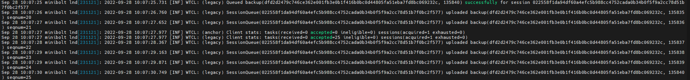

# 3.1 Lightning client: LND

We set up [LND](https://github.com/lightningnetwork/lnd), the Lightning Network Daemon by [Lightning Labs](https://lightning.engineering/).

<div align="center">


</div>

## Requirements

* [Bitcoin Core](../index-2/bitcoin-client.md)

## Preparations

The installation of LND is straightforward, but the application is quite powerful and capable of things not explained here. Check out their [GitHub repository](https://github.com/lightningnetwork/lnd/) for a wealth of information about their open-source project and Lightning in general.

### Configure Bitcoin Core

Before running LND, we need to set up settings in the Bitcoin Core configuration file to enable the LND RPC connection.

* Login as user `admin`, edit the `bitcoin.conf` file

```sh
$ sudo nano /data/bitcoin/bitcoin.conf
```

* Add the following lines. Save and exit

```
# LND RPC connection
zmqpubrawblock=tcp://127.0.0.1:28332
zmqpubrawtx=tcp://127.0.0.1:28333
```

* Restart Bitcoin Core to apply changes

```sh
$ sudo systemctl restart bitcoind
```

* Check Bitcoin Core is enabled `zmqpubrawblock` and `zmqpubrawtx` on the `28332` and `28333` port

```bash
$ sudo ss -tulpn | grep LISTEN | grep bitcoind | grep 2833
```

Expected output:

<pre><code>> tcp   LISTEN 0      100        127.0.0.1:<a data-footnote-ref href="#user-content-fn-1">28332</a>      0.0.0.0:*    users:(("bitcoind",pid=773834,fd=20))
> tcp   LISTEN 0      100        127.0.0.1:<a data-footnote-ref href="#user-content-fn-2">28333</a>      0.0.0.0:*    users:(("bitcoind",pid=773834,fd=22))
</code></pre>

## Installation

### Download binaries

We'll download, verify, and install LND.

* Navigate to the temporary directory

```sh
$ cd /tmp
```

* Set a temporary version environment variable to the installation

```sh
$ VERSION=0.17.5
```

* Download the application, checksums, and signature


```sh
$ wget https://github.com/lightningnetwork/lnd/releases/download/v$VERSION-beta/lnd-linux-amd64-v$VERSION-beta.tar.gz
```



```bash
$ wget https://github.com/lightningnetwork/lnd/releases/download/v$VERSION-beta/manifest-v$VERSION-beta.txt.ots
```



```bash
$ wget https://github.com/lightningnetwork/lnd/releases/download/v$VERSION-beta/manifest-v$VERSION-beta.txt
```



```bash
$ wget https://github.com/lightningnetwork/lnd/releases/download/v$VERSION-beta/manifest-roasbeef-v$VERSION-beta.sig.ots
```



```sh
$ wget https://github.com/lightningnetwork/lnd/releases/download/v$VERSION-beta/manifest-roasbeef-v$VERSION-beta.sig
```


### Checksum check

* Verify the signed checksum against the actual checksum of your download

```sh
$ sha256sum --check manifest-v$VERSION-beta.txt --ignore-missing
```

**Example** of expected output:

```
> lnd-linux-amd64-v0.16.3-beta.tar.gz: OK
```

### Signature check

Now that we've verified the integrity of the downloaded binary, we need to check the authenticity of the manifest file we just used, starting with its signature.

* Get the public key from a LND developer, who signed the manifest file; and add it to your GPG keyring


```bash
$ curl https://raw.githubusercontent.com/lightningnetwork/lnd/master/scripts/keys/roasbeef.asc | gpg --import
```


Expected output:

<pre data-full-width="false"><code><strong>>   % Total    % Received % Xferd  Average Speed   Time    Time     Time  Current
</strong>>                                  Dload  Upload   Total   Spent    Left  Speed
> 100  6900  100  6900    0     0  19676      0 --:--:-- --:--:-- --:--:-- 19714
> gpg: key 372CBD7633C61696: "Olaoluwa Osuntokun &#x3C;laolu32@gmail.com>" <a data-footnote-ref href="#user-content-fn-3">imported</a>
> gpg: Total number processed: 1
> gpg:              unchanged: 1
</code></pre>

* Verify the signature of the text file containing the checksums for the application

```sh
$ gpg --verify manifest-roasbeef-v$VERSION-beta.sig manifest-v$VERSION-beta.txt
```

**Example** of expected output:

<pre><code>> gpg: Signature made Mon 13 Nov 2023 11:45:38 PM UTC
> gpg:                using RSA key 60A1FA7DA5BFF08BDCBBE7903BBD59E99B280306
> gpg: <a data-footnote-ref href="#user-content-fn-4">Good signature</a> from "Olaoluwa Osuntokun &#x3C;laolu32@gmail.com>" [unknown]
> gpg: WARNING: This key is not certified with a trusted signature!
> gpg:          There is no indication that the signature belongs to the owner.
> Primary key fingerprint: E4D8 5299 674B 2D31 FAA1  892E 372C BD76 33C6 1696
>      Subkey fingerprint: 60A1 FA7D A5BF F08B DCBB  E790 3BBD 59E9 9B28 0306
</code></pre>

### Timestamp check

We can also check that the manifest file was in existence around the time of the release using its timestamp.

* Let's verify the timestamp of the file matches the release date


```bash
$ ots --no-cache verify manifest-roasbeef-v$VERSION-beta.sig.ots -f manifest-roasbeef-v$VERSION-beta.sig
```


**Example** of expected output:

<pre><code>> Got 1 attestation(s) from https://alice.btc.calendar.opentimestamps.org
> Got 1 attestation(s) from https://btc.calendar.catallaxy.com
> Got 1 attestation(s) from https://finney.calendar.eternitywall.com
> Got 1 attestation(s) from https://bob.btc.calendar.opentimestamps.org
> <a data-footnote-ref href="#user-content-fn-5">Success!</a> Bitcoin block <a data-footnote-ref href="#user-content-fn-6">765521 attests existence as of 2022-12-01 UTC</a>
</code></pre>


```bash
$ ots --no-cache verify manifest-v$VERSION-beta.txt.ots -f manifest-v$VERSION-beta.txt
```


**Example** of expected output:

<pre><code>> Got 1 attestation(s) from https://alice.btc.calendar.opentimestamps.org
> Got 1 attestation(s) from https://btc.calendar.catallaxy.com
> Got 1 attestation(s) from https://finney.calendar.eternitywall.com
> Got 1 attestation(s) from https://bob.btc.calendar.opentimestamps.org
> <a data-footnote-ref href="#user-content-fn-7">Success!</a> Bitcoin block <a data-footnote-ref href="#user-content-fn-8">829257 attests existence as of 2024-02-06 UTC</a>
</code></pre>


Check that the date of the timestamp is close to the [release date](https://github.com/lightningnetwork/lnd/releases) of the LND binary


* Having verified the integrity and authenticity of the release binary, we can safely

```sh
$ tar -xvf lnd-linux-amd64-v$VERSION-beta.tar.gz
```

**Example** of expected output:

```
> lnd-linux-amd64-v0.17.1-beta/lnd
> lnd-linux-amd64-v0.17.1-beta/lncli
> lnd-linux-amd64-v0.17.1-beta/
```

### Binaries installation

* Install it


```sh
$ sudo install -m 0755 -o root -g root -t /usr/local/bin lnd-linux-amd64-v$VERSION-beta/lnd lnd-linux-amd64-v$VERSION-beta/lncli
```


* Ensure you are installed by running the version command

```sh
$ lnd --version
```

**Example** of expected output:

```
> lnd version 0.16.3-beta commit=v0.16.3-beta
```

* Clean the LND files of the `tmp` folder


```bash
$ sudo rm -r lnd-linux-amd64-v$VERSION-beta && sudo rm lnd-linux-amd64-v$VERSION-beta.tar.gz && sudo rm manifest-roasbeef-v$VERSION-beta.sig && sudo rm manifest-roasbeef-v$VERSION-beta.sig.ots && sudo rm manifest-v$VERSION-beta.txt && sudo rm manifest-v$VERSION-beta.txt.ots
```



If you come to update this is the final step


### Create the lnd user & group

* Create the `lnd` user and group

```sh
$ sudo adduser --disabled-password --gecos "" lnd
```

* Add the `lnd` user to the groups "bitcoin" and "debian-tor"

```sh
$ sudo usermod -a -G bitcoin,debian-tor lnd
```

* Add the user `admin` to the group "lnd"

```sh
$ sudo adduser admin lnd
```

### Create data folder

* Create the LND data folder

```sh
$ sudo mkdir /data/lnd
```

* Assign as owner the `lnd` user&#x20;

```sh
$ sudo chown -R lnd:lnd /data/lnd
```

* Open a `lnd` user session

```sh
$ sudo su - lnd
```

* Create symbolic links pointing to the LND and bitcoin data directories

```sh
$ ln -s /data/lnd /home/lnd/.lnd
```

```sh
$ ln -s /data/bitcoin /home/lnd/.bitcoin
```

* Check symbolic links have been created correctly

```bash
$ ls -la
```

Expected output:

<pre><code>total 20
drwxr-x--- 2 lnd  lnd  4096 Jul 15 20:57 .
drwxr-xr-x 7 root root 4096 Jul 15 20:54 ..
-rw-r--r-- 1 lnd  lnd   220 Jul 15 20:54 .bash_logout
-rw-r--r-- 1 lnd  lnd  3771 Jul 15 20:54 .bashrc
lrwxrwxrwx 1 lnd  lnd    13 Jul 15 20:57 <a data-footnote-ref href="#user-content-fn-9">.bitcoin -> /data/bitcoin</a>
lrwxrwxrwx 1 lnd  lnd     9 Jul 15 20:56 <a data-footnote-ref href="#user-content-fn-10">.lnd -> /data/lnd</a>
-rw-r--r-- 1 lnd  lnd   807 Jul 15 20:54 .profile
</code></pre>

### Wallet password

LND includes a Bitcoin wallet that manages your onchain and Lightning coins. It is password protected and must be unlocked when LND starts. This creates the dilemma that you either manually unlock LND after each restart of your PC, or store the password somewhere on the node.

For this initial setup, we choose the easy route: we store the password in a file that allows LND to unlock the wallet automatically.

* Still as user `lnd`, create a text file and enter your LND wallet `password [C]`. **Password should have at least 8 characters.** Save and exit

```sh
$ nano /data/lnd/password.txt
```

* Tighten access privileges and make the file readable only for user `lnd`

```sh
$ chmod 600 /data/lnd/password.txt
```

## Configuration

* Create the LND configuration file

```sh
$ nano /data/lnd/lnd.conf
```

* Paste the following content (set your alias `"<YOUR_FANCY_ALIAS>"`, your preferred color `"<#ff9900>"`, your minimum channel size **`"minchansize"`** , and fees). Save and exit

<pre><code># MiniBolt: lnd configuration
# /data/lnd/lnd.conf

[Application Options]
# Up to 32 UTF-8 characters, accepts emojis i.e ⚡🧡​ https://emojikeyboard.top/
alias=<a data-footnote-ref href="#user-content-fn-11">&#x3C;YOUR_FANCY_ALIAS></a>
# You can choose the color you want at https://www.color-hex.com/
color=#ff9900

# Automatically unlock wallet with the password in this file
wallet-unlock-password-file=/data/lnd/password.txt
wallet-unlock-allow-create=true

# The TLS private key will be encrypted to the node's seed
tlsencryptkey=true

# Automatically regenerate certificate when near expiration
tlsautorefresh=true

# Do not include the interface IPs or the system hostname in TLS certificate
tlsdisableautofill=true

# Channel settings
# Fee settings - default LND base fee = 1000 (mSat),
# default LND fee rate = 1 (ppm)
# You can choose whatever you want e.g ZeroFeeRouting (0,0) or ZeroBaseFee (0,1)
<a data-footnote-ref href="#user-content-fn-12">#bitcoin.basefee=0</a>
<a data-footnote-ref href="#user-content-fn-13">#bitcoin.feerate=0</a>

# Minimum channel size (default: 20000 sats). You can choose whatever you want
<a data-footnote-ref href="#user-content-fn-14">#minchansize=20000</a>

maxpendingchannels=5
accept-keysend=true
accept-amp=true
protocol.wumbo-channels=true
coop-close-target-confs=24

# Set to enable support for the experimental taproot channel type
protocol.simple-taproot-chans=true

# Watchtower client
wtclient.active=true

# Specify the fee rate with which justice transactions will be signed
# (default: 10 sat/byte)
<a data-footnote-ref href="#user-content-fn-15">#wtclient.sweep-fee-rate=10</a>

# Watchtower server
watchtower.active=true

# Performance
gc-canceled-invoices-on-startup=true
gc-canceled-invoices-on-the-fly=true
ignore-historical-gossip-filters=true
stagger-initial-reconnect=true

# Database
[bolt]
# Set the next value to false to disable auto-compact DB
# and fast boot and comment the next line
db.bolt.auto-compact=true
# Uncomment to do DB compact at every LND reboot (default: 168h)
<a data-footnote-ref href="#user-content-fn-16">#db.bolt.auto-compact-min-age=0h</a>

# Optional (uncomment the next 2 lines (default: CONSERVATIVE))
#[Bitcoind]
<a data-footnote-ref href="#user-content-fn-17">#bitcoind.estimatemode=ECONOMICAL</a>

[Bitcoin]
bitcoin.active=true
bitcoin.mainnet=true
bitcoin.node=bitcoind

[tor]
tor.active=true
tor.v3=true
tor.streamisolation=true
</code></pre>


This is a standard configuration. Check the official LND [sample-lnd.conf](https://github.com/lightningnetwork/lnd/blob/master/sample-lnd.conf) with all possible options


* Exit of the `lnd` user session to return to the **admin** user session

```sh
$ exit
```

### Create systemd service

Now, let's set up LND to start automatically on system startup.

* As user `admin`, create LND systemd unit

```sh
$ sudo nano /etc/systemd/system/lnd.service
```

* Enter the following complete content. Save and exit

```
# MiniBolt: systemd unit for lnd
# /etc/systemd/system/lnd.service

[Unit]
Description=Lightning Network Daemon
Wants=bitcoind.service
After=bitcoind.service

[Service]
ExecStart=/usr/local/bin/lnd
ExecStop=/usr/local/bin/lncli stop

# Process management
####################
Restart=on-failure
RestartSec=60
Type=notify
TimeoutStartSec=1200
TimeoutStopSec=3600

# Directory creation and permissions
####################################
RuntimeDirectory=lightningd
RuntimeDirectoryMode=0710
User=lnd
Group=lnd

# Hardening Measures
####################
PrivateTmp=true
ProtectSystem=full
NoNewPrivileges=true
PrivateDevices=true
MemoryDenyWriteExecute=true

[Install]
WantedBy=multi-user.target
```

* Enable autoboot **(optional)**

```sh
$ sudo systemctl enable lnd
```

* Now, the daemon information is no longer displayed on the command line but is written into the system journal. You can check on it using the following command. You can exit monitoring at any time with `Ctrl-C`

```sh
$ journalctl -f -u lnd
```

## Run

To keep an eye on the software movements, [start your SSH program](../index-1/remote-access.md#access-with-secure-shell) (eg. PuTTY) a second time, connect to the MiniBolt node, and log in as `admin`. Commands for the **second session** start with the prompt **`$2` (which must not be entered).**

* Start the service

```sh
$2 sudo systemctl start lnd
```

<details>

<summary><strong>Example</strong> of expected output on the first terminal with <code>$ journalctl -f -u lnd</code> ⬇️</summary>

```
Nov 26 18:57:25 minibolt systemd[1]: Started LND.
Nov 26 18:57:27 minibolt lnd[1004]: Attempting automatic RPC configuration to bitcoind
Nov 26 18:57:27 minibolt lnd[1004]: Automatically obtained bitcoind's RPC credentials
Nov 26 18:57:27 minibolt lnd[1004]: 2023-11-26 18:57:27.299 [INF] LTND: Version: 0.17.2-beta commit=v0.17.2-beta, build=production, logging=default, debuglevel=info
Nov 26 18:57:27 minibolt lnd[1004]: 2023-11-26 18:57:27.300 [INF] LTND: Active chain: Bitcoin (network=testnet)
Nov 26 18:57:27 minibolt lnd[1004]: 2023-11-26 18:57:27.300 [INF] RPCS: Generating ephemeral TLS certificates...
Nov 26 18:57:27 minibolt lnd[1004]: 2023-11-26 18:57:27.304 [INF] RPCS: Done generating ephemeral TLS certificates
Nov 26 18:57:27 minibolt lnd[1004]: 2023-11-26 18:57:27.321 [INF] RPCS: RPC server listening on 127.0.0.1:10009
Nov 26 18:57:27 minibolt lnd[1004]: 2023-11-26 18:57:27.408 [INF] RPCS: gRPC proxy started at 127.0.0.1:8080
Nov 26 18:57:27 minibolt lnd[1004]: 2023-11-26 18:57:27.408 [INF] LTND: Opening the main database, this might take a few minutes...
Nov 26 18:57:27 minibolt lnd[1004]: 2023-11-26 18:57:27.408 [INF] LTND: Opening bbolt database, sync_freelist=false, auto_compact=true
Nov 26 18:57:27 minibolt lnd[1004]: 2023-11-26 18:57:27.445 [INF] LTND: Creating local graph and channel state DB instances
Nov 26 18:57:27 minibolt lnd[1004]: 2023-11-26 18:57:27.473 [INF] CHDB: Checking for schema update: latest_version=31, db_version=31
Nov 26 18:57:27 minibolt lnd[1004]: 2023-11-26 18:57:27.474 [INF] CHDB: Checking for optional update: prune_revocation_log=false, db_version=empty
Nov 26 18:57:27 minibolt lnd[1004]: 2023-11-26 18:57:27.493 [INF] LTND: Database(s) now open (time_to_open=84.180567ms)!
Nov 26 18:57:27 minibolt lnd[1004]: 2023-11-26 18:57:27.493 [INF] LTND: We're not running within systemd or the service type is not 'notify'
Nov 26 18:57:27 minibolt lnd[1004]: 2023-11-26 18:57:27.493 [INF] LTND: Waiting for wallet encryption password. Use `lncli create` to create a wallet, `lncli unlock` to unlock an existing wallet, or `lncli changepassword` to change the password of an existing wallet and unlock it.
```

</details>

### Wallet setup

Once LND is started, the process waits for us to create the integrated Bitcoin onchain wallet.

* Change to the `lnd` user

```sh
$2 sudo su - lnd
```

* Create the LND wallet

```sh
$2 lncli --tlscertpath /data/lnd/tls.cert.tmp create
```

Expected output:

```
Input wallet password:
Confirm password:
```


Enter your `password [C]` as wallet password 2 times (it must be the same one you stored in `password.txt` on the [Wallet password](lightning-client.md#wallet-password) step)


Expected output

```
Do you have an existing cipher seed mnemonic or extended master root key you want to use?
Enter 'y' to use an existing cipher seed mnemonic, 'x' to use an extended master root key
or 'n' to create a new seed (Enter y/x/n):
```


\-> Now, you could have 2 possible scenarios, follow the proper steps depending on your case⬇️




#### <mark style="color:green;">**If you are creating a new node and you wish to create a new seed**</mark>

* Press `n` and enter


If you choose this option, the next step will be choosing the passphrase **(optional -** press enter to proceed without a cipher seed passphrase**)**


Expected output:

<pre><code><strong>Your cipher seed can optionally be encrypted.
</strong>Input your passphrase if you wish to encrypt it (or press enter to proceed without a cipher seed passphrase):
</code></pre>

* Type the passphrase and press enter \[the prompt will request you to enter your `password [C]` one more time (`Confirm password:`)] or if you choose not to use the passphrase press enter simply

**Example** of expected output:

```
Generating fresh cipher seed...

!!!YOU MUST WRITE DOWN THIS SEED TO BE ABLE TO RESTORE THE WALLET!!!

---------------BEGIN LND CIPHER SEED---------------
 1. ability   2. soap    3. album    4. resource
 5. plate     6. fiber   7. immune   8. fringe
[...]

!!!YOU MUST WRITE DOWN THIS SEED TO BE ABLE TO RESTORE THE WALLET!!!

lnd successfully initialized!
```


These 24 words are all that you need (and the `channel.backup` file in case of disaster recovery) to restore the Bitcoin onchain wallet and possible UTXOs blocked

**Write these 24 words down manually on a piece of paper and store it in a safe place**

You can use a simple piece of paper, write them on the custom themed [Shiftcrypto backup card](https://shiftcrypto.ch/backupcard/backupcard\_print.pdf), or even [stamp the seed words into metal](../bonus/bitcoin/safu-ninja.md)



This piece of paper is all an attacker needs to empty your on-chain wallet!


🚫 **Do not store it on a computer**

🚫 **Do not take a picture with your mobile phone**

🚫 **This information should never be stored anywhere in digital form**


This information must be kept secret at all times


**Return to the first terminal with `$ journalctl -f -u lnd`. Example of expected output ⬇️**

```
Nov 26 19:17:38 raspiboltest lnd[1004]: 2023-11-26 19:17:38.037 [INF] LNWL: Opened wallet
Nov 26 19:17:38 raspiboltest lnd[1004]: 2023-11-26 19:17:38.204 [INF] CHRE: Primary chain is set to: bitcoin
Nov 26 19:17:38 raspiboltest lnd[1004]: 2023-11-26 19:17:38.244 [INF] LNWL: Started listening for bitcoind block notifications via ZMQ on 127.0.0.1:28332
Nov 26 19:17:38 raspiboltest lnd[1004]: 2023-11-26 19:17:38.245 [INF] CHRE: Initializing bitcoind backed fee estimator in CONSERVATIVE mode
Nov 26 19:17:38 raspiboltest lnd[1004]: 2023-11-26 19:17:38.244 [INF] LNWL: Started listening for bitcoind transaction notifications via ZMQ on 127.0.0.1:28333
Nov 26 19:17:40 raspiboltest lnd[1004]: 2023-11-26 19:17:40.576 [INF] LNWL: The wallet has been unlocked without a time limit
Nov 26 19:17:40 raspiboltest lnd[1004]: 2023-11-26 19:17:40.712 [INF] CHRE: LightningWallet opened
Nov 26 19:17:40 raspiboltest lnd[1004]: 2023-11-26 19:17:40.722 [INF] SRVR: Proxying all network traffic via Tor (stream_isolation=true)! NOTE: Ensure the backend node is proxying over Tor as well
Nov 26 19:17:40 raspiboltest lnd[1004]: 2023-11-26 19:17:40.723 [INF] TORC: Starting tor controller
Nov 26 19:17:40 raspiboltest lnd[1004]: 2023-11-26 19:17:40.744 [INF] HSWC: Cleaning circuits from disk for closed channels
Nov 26 19:17:40 raspiboltest lnd[1004]: 2023-11-26 19:17:40.744 [INF] HSWC: Finished cleaning: no closed channels found, no actions taken.
[...]
```



#### <mark style="color:orange;">**If you had an old node and an existing cipher seed**</mark>

* Press `y` and enter to recover it

If you choose this option, the next step will be to enter the **seed words of your old node**

Expected output:

```
Input your 24-word mnemonic separated by spaces:
```

* Type your 24-word mnemonic separated by spaces and press enter

Expected output:

```
Input your cipher seed passphrase (press enter if your seed doesn't have a passphrase):
```

* If you used a passphrase, enter it, if not, press enter again directly


If you were wrong with the passphrase, don't worry, LND shows you the next log and will not run: `[lncli] rpc error: code = Unknown desc = invalid passphrase`, recheck, and try again, if not, the prompt shows you the next


Expected output:

```
Input an optional address look-ahead used to scan for used keys (default 2500):
```


Now the LND will enable the RECOVERY MODE


* **Press enter again** when the prompt above asks you, the default windows recovery is enough

**Example** of expected output:

```
Generating fresh cipher seed...

!!!YOU MUST WRITE DOWN THIS SEED TO BE ABLE TO RESTORE THE WALLET!!!

---------------BEGIN LND CIPHER SEED---------------
 1. ability   2. soap    3. album    4. resource
 5. plate     6. fiber   7. immune   8. fringe
[...]

!!!YOU MUST WRITE DOWN THIS SEED TO BE ABLE TO RESTORE THE WALLET!!!

lnd successfully initialized!
```

Return to the first terminal with `$ journalctl -f -u lnd`. Search to the next lines to ensure LND already entered the RECOVERY MODE and go out of this ⬇️

<pre><code>Apr 17 21:17:19 roamingrpi lnd[63591]: 2024-04-17 21:17:19.288 [INF] LNWL: Opened wallet
Apr 17 21:17:19 roamingrpi lnd[63591]: 2024-04-17 21:17:19.288 [INF] LTND: Wallet recovery mode enabled with address lookahead of 2500 addresses
<strong>[...]
</strong><strong>Nov 26 19:47:08 minibolt lnd[1321]: 2023-11-26 19:47:08.642 [INF] LNWL: RECOVERY MODE ENABLED -- rescanning for used addresses with recovery_window=2500
</strong>Nov 26 19:47:08 minibolt lnd[1321]: 2023-11-26 19:47:08.685 [INF] LNWL: Seed birthday surpassed, starting recovery of wallet from height=2540246 hash=00000000000000178484e446a4fb5c966b5fd5db76121421bfa470c7c879ff05 with recovery-window=2500
Nov 26 19:47:09 minibolt lnd[1321]: 2023-11-26 19:47:09.859 [INF] LNWL: Scanning 311 blocks for recoverable addresses
Nov 26 19:48:36 minibolt lnd[1321]: 2023-11-26 19:48:36.328 [INF] LNWL: Recovered addresses from blocks 2540246-2540556
Nov 26 19:48:36 minibolt lnd[1321]: 2023-11-26 19:48:36.338 [INF] LNWL: Started rescan from block 000000000000001e297a052a69708908dbe9769d834a07447d85e446b6b4b2a0 (height 2540556) for 0 addresses
Nov 26 19:48:36 minibolt lnd[1321]: 2023-11-26 19:48:36.360 [INF] LNWL: Catching up block hashes to height 2540557, this might take a while
Nov 26 19:48:36 minibolt lnd[1321]: 2023-11-26 19:48:36.361 [INF] LNWL: Done catching up block hashes
Nov 26 19:48:36 minibolt lnd[1321]: 2023-11-26 19:48:36.361 [INF] LNWL: Finished rescan for 0 addresses (synced to block 00000000443337ee5135e26cc7611c570f0cfface2823516a59fee41fc9750b0, height 2540557)
[...]
</code></pre>




The current state of your channels, however, cannot be recreated from this seed. For this, the Static Channel Backup stored `/data/lnd/data/chain/bitcoin/mainnet/channel.backup` is updated for each channel opening and closing

There is a dedicated [guide](channel-backup.md) to making an automatic backup


* Type "exit" to return to the `admin` user

```sh
$2 exit
```

* Check that LND is running and related ports listening

```bash
$2 sudo ss -tulpn | grep LISTEN | grep lnd
```

Expected output:

<pre><code>> tcp   LISTEN 0      4096       <a data-footnote-ref href="#user-content-fn-18">127.0.0.1:9735</a>      0.0.0.0:*    users:(("lnd",pid=774047,fd=51))
> tcp   LISTEN 0      4096      <a data-footnote-ref href="#user-content-fn-19">127.0.0.1:10009</a>      0.0.0.0:*    users:(("lnd",pid=774047,fd=8))
> tcp   LISTEN 0      4096             <a data-footnote-ref href="#user-content-fn-20">*:9911</a>            *:*    users:(("lnd",pid=774047,fd=50))
</code></pre>

### Allow user "admin" to work with LND

We interact with LND using the application `lncli`. At the moment, only the user "lnd" has the necessary access privileges. To make the user "admin" the main administrative user, we make sure it can interact with LND as well.

* As user `admin`, link the LND data directory in the user "`admin`" home. As a member of the group "`lnd`", the "`admin`" user has read-only access to certain files

```sh
$2 ln -s /data/lnd /home/admin/.lnd
```

* Check symbolic link has been created correctly

```bash
$2 ls -la /home/admin
```

<details>

<summary>Expected output ⬇️</summary>

<pre><code>total 96
drwxr-x--- 10 admin admin  4096 Jul 18 07:10 .
drwxr-xr-x  8 root  root   4096 Jul 16 09:28 ..
-rw-rw-r--  1 admin admin 13901 Jul 12 15:54 .bash_aliases
-rw-------  1 admin admin 13993 Jul 18 06:31 .bash_history
-rw-r--r--  1 admin admin   220 Jul 11 20:25 .bash_logout
-rw-r--r--  1 admin admin  3792 Jul 12 07:56 .bashrc
lrwxrwxrwx  1 admin admin    13 Jul 12 10:41 .bitcoin -> /data/bitcoin
drwx------  2 admin admin  4096 Jul 11 20:27 .cache
drwxrwxr-x  5 admin admin  4096 Jul 12 07:57 .cargo
drwxrwxr-x  3 admin admin  4096 Jul 11 20:32 .config
drwx------  3 admin admin  4096 Jul 15 20:54 .gnupg
-rw-------  1 admin admin    20 Jul 11 22:09 .lesshst
lrwxrwxrwx  1 admin admin     9 Jul 18 07:10 <a data-footnote-ref href="#user-content-fn-21">.lnd -> /data/lnd</a>
drwxrwxr-x  3 admin admin  4096 Jul 12 09:15 .local
drwxrwxr-x  3 admin admin  4096 Jul 16 09:23 .npm
-rw-r--r--  1 admin admin   828 Jul 12 07:56 .profile
drwxrwxr-x  6 admin admin  4096 Jul 12 07:56 .rustup
drwx------  2 admin admin  4096 Jul 11 20:47 .ssh
-rw-r--r--  1 admin admin     0 Jul 11 20:27 .sudo_as_admin_successful
-rw-rw-r--  1 admin admin   293 Jul 15 20:53 .wget-hsts
-rw-------  1 admin admin   228 Jul 18 07:04 .Xauthority
</code></pre>

</details>

* &#x20;Make all directories browsable for the group&#x20;

```sh
$2 sudo chmod -R g+X /data/lnd/data/
```

* Check if you can use `lncli` with the `admin` user by querying LND for information

```sh
$2 lncli getinfo
```

## LND in action

💊 Now your Lightning node is ready. This is also the point of no return. Up until now, you can just start over. Once you send real Bitcoin to your MiniBolt, you have "skin in the game"


The next commands can be entered in any new session without keeping a specific terminal opened with logs, but I recommend keeping this just in case any log could give extra information about the command you just entered


### Watchtower client

Lightning channels need to be monitored to prevent malicious behavior by your channel peers. If your MiniBolt goes down for a longer time, for instance, due to a hardware problem, a node on the other side of one of your channels might try to close the channel with an earlier channel balance that is better for them.

Watchtowers are other Lightning nodes that can monitor your channels for you. If they detect such bad behavior, they can react on your behalf, and send a punishing transaction to close this channel. In this case, all channel funds will be sent to your LND on-chain wallet.

A watchtower can only send such a punishing transaction to your wallet, so you don't have to trust them. It's good practice to add a few watchtowers, just to be on the safe side.

* With user `admin`, add the [Lightning Network+ watchtower](https://lightningnetwork.plus/watchtower) Tor address as a first example


```bash
$ lncli wtclient add 023bad37e5795654cecc69b43599da8bd5789ac633c098253f60494bde602b60bf@iiu4epqzm6cydqhezueenccjlyzrqeruntlzbx47mlmdgfwgtrll66qd.onion:9911
```


* Or the clearnet address


```bash
$ lncli wtclient add 023bad37e5795654cecc69b43599da8bd5789ac633c098253f60494bde602b60bf@34.216.52.158:9911
```


* If you want to list your towers and active watchtowers

```sh
$ lncli wtclient towers
```

Expected output:

```
{
    "towers": [
        {
            "pubkey": "023bad37e5795654cecc69b43599da8bd5789ac633c098253f60494bde602b60bf",
            "addresses": [
                "iiu4epqzm6cydqhezueenccjlyzrqeruntlzbx47mlmdgfwgtrll66qd.onion:9911"
            ],
            "active_session_candidate": true,
            "num_sessions": 0,
            "sessions": [
            ]
        },
    ]
}
```

* If you want to deactivate an active tower

```sh
$ lncli wtclient remove <pubkey>
```


Monitor logs with `$ journalctl -f -u lnd` to check the watchtower client is working fine, it should show you after a while, the next logs ⬇️


<figure><figcaption></figcaption></figure>

### Watchtower server

Same as you can connect as a watchtower client to other watchtower servers, you could give the same service running an altruist watchtower server. **This was previously activated** in the `lnd.conf`, and you can see the information about it by typing the following command and sharing it with your peers.

```sh
$ lncli tower info
```

Expected output:

```
{
  "pubkey": "023bad37e5795654cecc69b43599da8bd5789ac633c098253f60494bde602b60bf",
  "listeners": [
      "[::]:9911"
  ],
  "uris": [
      "iiu4epqzm6cydqhezueenccjlyzrqeruntlzbx47mlmdgfwgtrll66qd.onion:9911"
  ]
}
```


This watchtower server service is not recommended to activate if you have a slow device without high-performance features, if yes consider disabling it commenting, or deleting the line `watchtower.active=true` of the `lnd.conf` file



Almost all of the following steps could be run with the [mobile](mobile-app.md) | [web](web-app.md) app guides. We strongly recommend using these applications with intuitive and visual UI to manage the Lightning Node, instead of using the command line


## Extras (optional)

### Funding your Lightning node

* Generate a new Bitcoin address (p2tr = taproot/bech32m) to receive funds on-chain and send a small amount of Bitcoin to it from any wallet of your choice

```sh
$ lncli newaddress p2tr
```

Expected output:

```
> "address": "bc1p..."
```

* Check your LND wallet balance

```sh
$ lncli walletbalance
```

**Example** of expected output:

```
{
    "total_balance": "712345",
    "confirmed_balance": "0",
    "unconfirmed_balance": "712345"
}
```

As soon as your funding transaction is mined (1 confirmation), LND will show its amount as "confirmed\_balance".


If you want to open a few channels, you might want to send a few transactions. If you have only one UTXO, you need to wait for the change to return to your wallet after every new channel opening


### Opening channels

Although LND features an optional "autopilot", we manually open some channels.

We recommend going on [amboss.space](https://amboss.space) or [1ML.com](https://1ml.com) and looking for a mix of big and small nodes with decent Node Ranks. Another great way to find peers to collaboratively set up channels is [LightningNetwork+](https://lightningnetwork.plus/).

To connect to a remote node, you need its URI that looks like `<pubkey>@host`:

* the `<pubkey>` is just a long hexadecimal number, like `02b03a1d133c0338c0185e57f0c35c63cce53d5e3ae18414fc40e5b63ca08a2128`
* the `host` can be a domain name, a clearnet IP address, or a Tor onion address, followed by the port number (usually `:9735`)

Just grab the whole URI above the big QR code and use it as follows (we will use the `⚡2FakTor⚡` LN node **as an example**):

* **Connect** to the remote node, with the full URI


```bash
$ lncli connect 02b03a1d133c0338c0185e57f0c35c63cce53d5e3ae18414fc40e5b63ca08a2128@aopvxn7cf7kv42u5oxfo3mplhl5oerukndi3wos7vpsfvqvc7vvmgyqd.onion:9735
```


* **Open a channel** using the `<pubkey>` only (_i.e._, the part of the URI before the `@`) and the channel capacity in satoshis.

The command has a built-in fee estimator, but to avoid overpaying fees, you can manually control the fees for the funding transaction by using the `sat_per_vbyte` argument as follows (to select the appropriate fee, in sats/vB, check [mempool.space](https://mempool.space/))


```bash
$ lncli openchannel --sat_per_vbyte 8 02b03a1d133c0338c0185e57f0c35c63cce53d5e3ae18414fc40e5b63ca08a2128 500000 0
```


* **Check your funds**, both in the on-chain wallet and the channel balances

```sh
$ lncli walletbalance
```

```sh
$ lncli channelbalance
```

* **List active channels**. Once the channel funding transaction has been mined and gained enough confirmations, your channel is fully operational. That can take an hour or more

```sh
$ lncli listchannels
```

* **Make a Lightning payment**. By default, these work with invoices, so when you buy something or want to send money, you need to get an invoice first. However, you can also pay without requesting an invoice as long the receiving node supports the keysend or amp feature!

To try, why not send me satoshis! You simply need to input my node pubkey [`2FakTor`](https://amboss.space/node/02b03a1d133c0338c0185e57f0c35c63cce53d5e3ae18414fc40e5b63ca08a2128)⚡, the amount in satoshis and add the "`–keysend`" flag. Replace `<amount in sats>` parameter with what you want


```sh
$ lncli sendpayment --dest 02b03a1d133c0338c0185e57f0c35c63cce53d5e3ae18414fc40e5b63ca08a2128 --amt <amount in sats> --keysend
```


### Some useful commands

A quick reference with special commands to play around with:

* Pay an AMP invoice (both sender and receiver nodes have to have AMP enabled)

```sh
$ lncli payinvoice --amt <amount> <amp invoice>
```

* Send payment to node without invoice using AMP invoice (both sender and receiver nodes have to have AMP enabled)

```sh
$ lncli sendpayment --dest <destination public key> --amt <amount> --amp
```

* Send payment to a node without an invoice using Keysend (both sender and receiver nodes have to have Keysend enabled)

```sh
$ lncli sendpayment --dest <destination public key> --amt <amount> --keysend
```

* Create your own Re-Usable Static AMP invoice


```bash
$ lncli addinvoice --memo "your memo here" --amt <amount in sats> --expiry <time in seconds> --amp
```



The default flags "--memo" "--amt" and "--expiry" are optional. The default expiry time will be 30 days by default and the rest can be empty


Copy the output \[lnbc...] of the "payment\_request": "lnbc...". Transform your output payment request into a QR code, embed it on your website, or add it to your social media. LibreOffice has built-in functionality, and there are plenty of freely available online tools.

* List all invoices

```sh
$ lncli listinvoices
```

* Close all channels in cooperative mode

```sh
$ lncli closeallchannels --sat_per_byte <sat/byte>
```


More: full [LND API reference](https://api.lightning.community/)


## Upgrade

Upgrading LND can lead to some issues. **Always** read the [LND release notes](https://github.com/lightningnetwork/lnd/releases) completely to understand the changes. These also cover a lot of additional topics and many new features not mentioned here.

* Check your current LND version

```sh
$ lnd --version
```

* Download, verify, and install the latest LND binaries as described in the [Installation section](lightning-client.md#installation) of this guide, replacing the environment variable `"VERSION=x.xx"` value for the latest if it has not been already changed in this guide
* Restart LND to apply the new version

```sh
$ sudo systemctl restart lnd
```

## Uninstall

### Uninstall service & user

* Ensure you are logged in with the user `admin`, stop, disable autoboot (if enabled), and delete the service

```bash
$ sudo systemctl stop lnd
```

```bash
$ sudo systemctl disable lnd
```

```bash
$ sudo rm /etc/systemd/system/lnd.service
```

* Delete the `lnd` user. Don't worry about `userdel: lnd mail spool (/var/mail/lnd) not found` output, the uninstall has been successful

```bash
$ sudo userdel -rf lnd
```

* Delete the complete `lnd` directory

```bash
$ sudo rm -rf /data/lnd/
```

### Uninstall binaries

* Delete the binaries installed

```bash
$ sudo rm /usr/local/bin/lnd && sudo rm /usr/local/bin/lncli
```

### Uninstall FW configuration

If you followed the [Mobile app: Zeus guide](mobile-app.md), probably you needed to add an allow rule on UFW to allow the incoming connection to the `8080` LND REST port

* Ensure you are logged in with the user `admin`, display the UFW firewall rules, and note the numbers of the rules for LND REST (e.g. "Y" below)

```bash
$ sudo ufw status numbered
```

Expected output:

```
> [Y] 8080           ALLOW IN    Anywhere          # allow LND REST from anywhere
```

* Delete the rule with the correct number and confirm with "`yes`"

```bash
$ sudo ufw delete X
```

## Port reference

|  Port | Protocol |           Use          |
| :---: | :------: | :--------------------: |
|  9735 |    TCP   |        P2P port        |
| 10009 |    TCP   |        gRPC port       |
|  9911 |    TCP   | Watchtower server port |

[^1]: zmqpubrawblock port

[^2]: zmqpubrawtx port

[^3]: Check this

[^4]: Check this

[^5]: Check this

[^6]: (**Example)**

[^7]: Check this

[^8]: (**Example)**

[^9]: Symbolic link

[^10]: Symbolic link

[^11]: (Customize)

[^12]: (Uncomment and customize the value)

[^13]: (Uncomment and customize the value)

[^14]: (Uncomment and customize the value)

[^15]: (Uncomment and customize the value)

[^16]: (Uncomment and customize the value or keep commented to left default)

[^17]: (Uncomment and customize the value)

[^18]: LND P2P host:port

[^19]: gRPC host:port

[^20]: Watchtower server host:port

[^21]: Symbolic link
