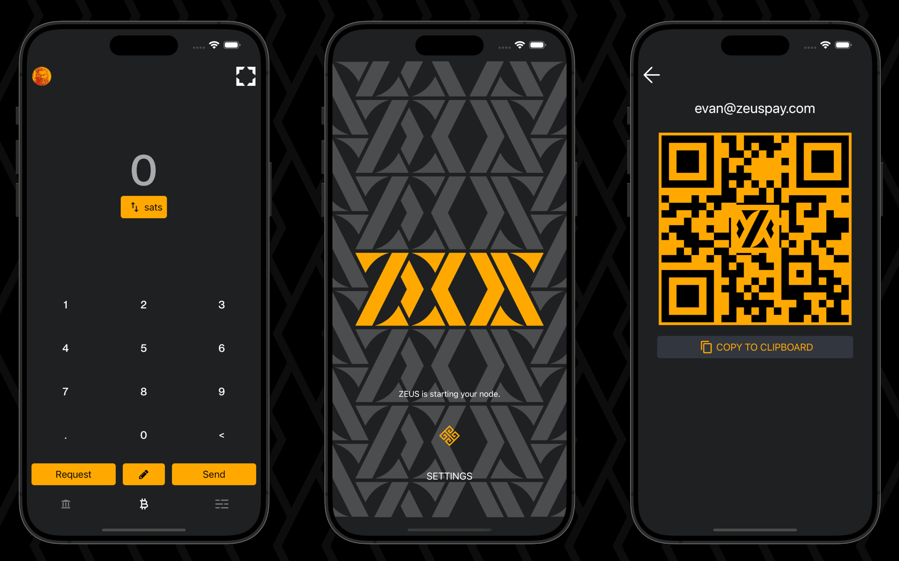

# 3.4 Mobile app: Zeus

We install [Zeus](https://zeusln.app/), a cross-platform mobile app that connects to your LN node over Tor. Make payments with lightning or on-chain and manage your channels while you're on the go.



## Requirements

* [Bitcoin Core](../index-2/bitcoin-client.md)
* [LND](lightning-client.md)

## Preparations

### Configure LND

* Login as `admin` user, and configure LND to allow LND REST from anywhere. Edit `lnd.conf`

```sh
$ sudo nano /data/lnd/lnd.conf
```

* Add the next line under the `[Application Options]` section. Save and exit

```
# Specify all ipv4 interfaces to listen on for REST connections
restlisten=0.0.0.0:8080
```

* Restart LND to apply changes

```sh
$ sudo systemctl restart lnd
```

* Ensure the gRPC proxy port is now binding to the `0.0.0.0`  host instead of `127.0.0.1`

```bash
$ sudo ss -tulpn | grep LISTEN | grep lnd | grep 8080
```

Expected output:

<pre><code>> tcp   LISTEN 0      4096         0.0.0.0:<a data-footnote-ref href="#user-content-fn-1">8080</a>       0.0.0.0:*    users:(("lnd",pid=774047,fd=32))
</code></pre>

### Configure Firewall

* Configure the Firewall to allow LND REST incoming requests

```sh
$ sudo ufw allow 8080/tcp comment 'allow LND REST from anywhere'
```

## Installation

### Install lndconnect

[lndconnect](https://github.com/LN-Zap/lndconnect), created by Zap, is a utility that generates QR Code or URI to connect applications to LND instances.

* As `admin` user, navigate to the `tmp` folder

```sh
$ cd /tmp
```

* Set the environment variable

```sh
$ VERSION=0.2.0
```

* Download


```sh
$ wget https://github.com/LN-Zap/lndconnect/releases/download/v$VERSION/lndconnect-linux-amd64-v$VERSION.tar.gz
```


* Extract

```sh
$ tar -xvf lndconnect-linux-amd64-v$VERSION.tar.gz
```

* Install


```bash
$ sudo install -m 0755 -o root -g root -t /usr/local/bin lndconnect-linux-amd64-v$VERSION/lndconnect
```


* Ensure `lndconnect` is correctly installed

```sh
$ lndconnect -h
```

<details>

<summary>Expected output ⬇️</summary>

```
Usage:
  lndconnect [OPTIONS]

Application Options:
      --lnddir=               The base directory that contains lnd's data, logs, configuration file, etc. (default: /home/admin/.lnd)
      --configfile=           Path to configuration file (default: /home/admin/.lnd/lnd.conf)
  -b, --datadir=              The directory to find lnd's data within (default: /home/admin/.lnd/data)
      --tlscertpath=          Path to read the TLS certificate from (default: /home/admin/.lnd/tls.cert)
      --adminmacaroonpath=    Path to read the admin macaroon from
      --readonlymacaroonpath= Path to read the read-only macaroon from
      --invoicemacaroonpath=  Path to read the invoice-only macaroon from
[...]
```

</details>

### Remote access over Tor (optional)

* Ensure that you are logged in with the user admin and add the following lines in the "location hidden services" section, below "`## This section is just for location-hidden services ##`" in the torrc file. Save and exit

```sh
$ sudo nano /etc/tor/torrc
```

```
# Hidden Service LND REST
HiddenServiceDir /var/lib/tor/hidden_service_lnd_rest/
HiddenServiceVersion 3
HiddenServicePoWDefensesEnabled 1
HiddenServicePort 8080 127.0.0.1:8080
```

* Reload the Tor configuration and get your connection address

```sh
$ sudo systemctl reload tor
```

```sh
$ sudo cat /var/lib/tor/hidden_service_lnd_rest/hostname
```

**Example** expected output:

```
> abcdefg..............xyz.onion
```

* Save the onion address in a safe place (e.g., password manager)

### Create a lndconnect QR code

lndconnect generates a URI and displays it as a QR code that Zeus can read.

* Still with the `admin` user, and use the following command
  * If you want to use the Tor connection, make sure to replace the `".onion"` address with the one you generated above

```sh
$ lndconnect --host=abcdefg......xyz.onion --port=8080 --nocert
```

* If you used the Wireguard VPN connection following the [Wireguard VPN bonus guide](../bonus/system/wireguard-vpn.md), replace the `.onion` address with the private Wireguard VPN IP address (recommended)

```sh
$ lndconnect --host=10.0.1.1 --port=8080 --nocert
```

* If you want to use the local connection with the IP address of MiniBolt, e.g: 192.168.X.XXX

```sh
$ lndconnect --host=192.168.X.XXX --port=8080
```

* It will be a big QR code, so maximize your terminal window and use `CTRL`+`-` / `"Terminal unzoom"` / `"Zoom out"` options of your terminal, to shrink the code further to fit the screen

⌛ Keep the SSH session with the QR code open, it will be necessary later to scan the obtained QR code

## Install the Zeus app

On Android, you can get Zeus from [Google Play](https://play.google.com/store/apps/details?id=app.zeusln.zeus), or directly from the [GitHub repository](https://github.com/ZeusLN/zeus/releases), if you can’t or do not want to use Google Play. Tap it, download it, and install it. If it's the first time you install an APK on your phone you will be asked to authorize the app to install unknown apps, simply follow the on-screen instructions to do so.

### Connect Zeus to LND

* Open Zeus and tap on **"SCAN LNDCONNECT CONFIG"** and, if prompted, allow Zeus to use the camera
* Scan the QR code generated earlier
* Enter a Nickname for your node (e.g. "MiniBolt LN")


If you will use the Tor connection hit on the switch **"Use Tor"**


* Click on **"SAVE NODE CONFIG"**
* A "Warning" banner will appear, push on **"I understand, save node config"**


Zeus is now connecting to your node, and it might take a while the first time depending on the selected connection ⏰



Once you verify that the connection has been made correctly with your Lightning Node, you can close the SSH session by pressing `Ctrl` + `D`


### Security

Anyone using Zeus on your phone controls your node and all its funds. Setting up a password or biometrics identification for the app is strongly recommended.

* In the app, tap on the Zeus icon in the top-left corner
* Click on `Security` and `Set/Change Password` to enter a Password/PIN or enable the Biometrics feature
* Save your password or PIN somewhere safe, e.g., in your password manager

### Privacy

To preserve your privacy, you can choose your private blockchain explorer when making inquiries about on-chain transactions.

* In the app, tap on the Zeus icon in the top-left corner
* Click on `Privacy` and change `Default Block explorer`, by selecting `Custom`, on the `Custom block explorer` box, enter your preferred Block Explorer URL, `.onion`, the local IP address of BTC RPC explorer: `https://192.168.X.XXX:4000`, or Wireguard VPN IP address: `https://10.0.0.1:4000`, depending on the situation

## Upgrade

To update Zeus, update the app using the same app store or the app source you chose to install it.

## Uninstall

To uninstall, you need to uninstall the app on your phone and deactivate the LND REST API Tor hidden service.

* Uninstall the app on your phone
* To deactivate the LND REST API Tor hidden service, comment out the hidden service lines in `torrc` and reload Tor

```sh
$ sudo nano /etc/tor/torrc
```

```
# Hidden Service LND REST
#HiddenServiceDir /var/lib/tor/hidden_service_lnd_rest/
#HiddenServiceVersion 3
HiddenServicePoWDefensesEnabled 1
#HiddenServicePort 8080 127.0.0.1:8080
```

* Reload Tor to apply changes

```bash
$ sudo systemctl reload tor
```

## Port reference

| Port | Protocol |      Use      |
| :--: | :------: | :-----------: |
| 8080 |    TCP   | LND REST port |

[^1]: gRPC proxy port
