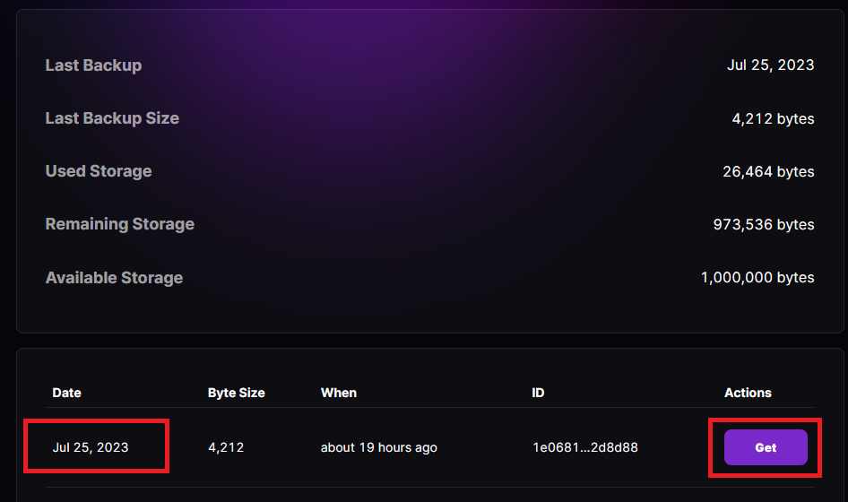

# 3.3 Web app: ThunderHub

[ThunderHub](https://thunderhub.io/) is an open source LND node manager where you can manage and monitor your node on any device or browser. It allows you to take control of the lightning network with a simple and intuitive UX and the most up-to-date tech stack.


## Requirements

* [Bitcoin Core](../index-2/bitcoin-client.md)
* [LND](lightning-client.md)
* Others
  * [Node + NPM](../bonus/system/nodejs-npm.md)

## Preparations

### Check Node + NPM

Node + NPM should have been installed for the [BTC RPC Explorer](../bitcoin/blockchain-explorer.md).

* With the user `admin`, check the Node version

```sh
$ node -v
```

**Example** of expected output:

```
> v16.14.2
```

* Check the NPM version

```sh
$ npm -v
```

**Example** of expected output:

```
> 8.19.3
```


If the version is `>=18`, you can move to the next section. If Node.js is not installed, follow this [Node + NPM bonus guide](../bonus/system/nodejs-npm.md) to install it


### Reverse proxy & Firewall

In the security [section](../index-1/security.md#prepare-nginx-reverse-proxy), we set up Nginx as a reverse proxy. Now we can add the ThunderHub configuration.

Enable the Nginx reverse proxy to route external encrypted HTTPS traffic internally to ThunderHub. The `error_page 497` directive instructs browsers that send HTTP requests to resend them over HTTPS.

* With user `admin`, create the reverse proxy configuration

```sh
$ sudo nano /etc/nginx/sites-available/thunderhub-reverse-proxy.conf
```

* Paste the complete following configuration. Save and exit

```nginx
server {
  listen 4002 ssl;
  error_page 497 =301 https://$host:$server_port$request_uri;

  location / {
    proxy_pass http://127.0.0.1:3000;
  }
}
```

* Create the symbolic link that points to the directory `sites-enabled`


```bash
$ sudo ln -s /etc/nginx/sites-available/thunderhub-reverse-proxy.conf /etc/nginx/sites-enabled/
```


* Test Nginx configuration

```sh
$ sudo nginx -t
```

Expected output:

```
> nginx: the configuration file /etc/nginx/nginx.conf syntax is ok
> nginx: configuration file /etc/nginx/nginx.conf test is successful
```

* Reload NGINX configuration to apply changes

```bash
$ sudo systemctl reload nginx
```

* Configure the firewall to allow incoming HTTP requests from anywhere to the web server

```sh
$ sudo ufw allow 4002/tcp comment 'allow ThunderHub SSL from anywhere'
```

## Installation

We do not want to run Thunderhub code alongside `bitcoind` and `lnd` because of security reasons. For that, we will create a separate user and we will be running the code as the new user. We are going to install Thunderhub in the home directory since it doesn't need too much space.

* Create a new `thunderhub` user

```sh
$ sudo adduser --disabled-password --gecos "" thunderhub
```

* Add `thunderhub` user to the `lnd` group

```sh
$ sudo adduser thunderhub lnd
```

* Change to the `thunderhub` user

```bash
$ sudo su - thunderhub
```

* Set a temporary version environment variable to the installation

```bash
$ VERSION=0.13.27
```

* Import the GPG key of the developer

```bash
$ curl https://github.com/apotdevin.gpg | gpg --import
```

* Download the source code directly from GitHub, selecting the latest release branch associated

```sh
$ git clone --branch v$VERSION https://github.com/apotdevin/thunderhub.git
```

* Enter the recently created `thunderhub` folder

<pre class="language-sh"><code class="lang-sh"><strong>$ cd thunderhub
</strong></code></pre>

* Verify the release

```bash
$ git verify-commit v$VERSION
```

**Example** of expected output:

```
gpg: Signature made Fri May 26 16:56:42 2023 CEST
gpg:                using RSA key 3C8A01A8344B66E7875CE5534403F1DFBE779457
gpg: Good signature from "Anthony Potdevin <potdevin.anthony@gmail.com>" [unknown]
gpg: WARNING: This key is not certified with a trusted signature!
gpg:          There is no indication that the signature belongs to the owner.
Primary key fingerprint: 3C8A 01A8 344B 66E7 875C  E553 4403 F1DF BE77 9457
```

* Install all dependencies and the necessary modules using NPM


**Not to run** the `$ npm audit fix` command, which could break the original code!!


```sh
$ npm install
```

<details>

<summary>Example of expected output ⬇️</summary>

```
npm WARN deprecated subscriptions-transport-ws@0.11.0: The `subscriptions-transport-ws` package is no longer maintained. We recommend you use `graphql-ws` instead. For help migrating Apollo software to `graphql-ws`, see https://www.apollographql.com/docs/apollo-server/data/subscriptions/#switching-from-subscriptions-transport-ws    For general help using `graphql-ws`, see https://github.com/enisdenjo/graphql-ws/blob/master/README.md
npm WARN deprecated apollo-server-plugin-base@3.7.2: The `apollo-server-plugin-base` package is part of Apollo Server v2 and v3, which are now deprecated (end-of-life October 22nd 2023). This package's functionality is now found in the `@apollo/server` package. See https://www.apollographql.com/docs/apollo-server/previous-versions/ for more details.
npm WARN deprecated apollo-server-types@3.8.0: The `apollo-server-types` package is part of Apollo Server v2 and v3, which are now deprecated (end-of-life October 22nd 2023). This package's functionality is now found in the `@apollo/server` package. See https://www.apollographql.com/docs/apollo-server/previous-versions/ for more details.
npm WARN deprecated apollo-server-express@3.12.0: The `apollo-server-express` package is part of Apollo Server v2 and v3, which are now deprecated (end-of-life October 22nd 2023). This package's functionality is now found in the `@apollo/server` package. See https://www.apollographql.com/docs/apollo-server/previous-versions/ for more details.
npm WARN deprecated apollo-server@3.12.0: The `apollo-server` package is part of Apollo Server v2 and v3, which are now deprecated (end-of-life October 22nd 2023). This package's functionality is now found in the `@apollo/server` package. See https://www.apollographql.com/docs/apollo-server/previous-versions/ for more details.
npm WARN deprecated apollo-reporting-protobuf@3.4.0: The `apollo-reporting-protobuf` package is part of Apollo Server v2 and v3, which are now deprecated (end-of-life October 22nd 2023). This package's functionality is now found in the `@apollo/usage-reporting-protobuf` package. See https://www.apollographql.com/docs/apollo-server/previous-versions/ for more details.
npm WARN deprecated apollo-server-core@3.12.0: The `apollo-server-core` package is part of Apollo Server v2 and v3, which are now deprecated (end-of-life October 22nd 2023). This package's functionality is now found in the `@apollo/server` package. See https://www.apollographql.com/docs/apollo-server/previous-versions/ for more details.
(#################⠂) ⠧ reify:value-or-promise: timing reifyNode:node_modules/foreground-child/node_modules/signal-exit Completed in 39393ms
[...]
> thunderhub@0.13.19 prepare
> husky install

husky - Git hooks installed

added 1879 packages, and audited 1880 packages in 1m

201 packages are looking for funding
  run `npm fund` for details

16 vulnerabilities (1 low, 5 moderate, 10 high)

To address all issues, run:
  npm audit fix

Run `npm audit` for details.
npm notice
npm notice New minor version of npm available! 9.5.1 -> 9.8.0
npm notice Changelog: https://github.com/npm/cli/releases/tag/v9.8.0
npm notice Run npm install -g npm@9.8.0 to update!
npm notice
```

</details>

**(Optional)** Improve your privacy by opt-out of Next.js [telemetry](https://nextjs.org/telemetry)

```bash
$ npx next telemetry disable
```

Expected output:

```
Your preference has been saved to /home/thunderhub/.config/nextjs-nodejs/config.json.

Status: Disabled

You have opted-out of Next.js' anonymous telemetry program.
No data will be collected from your machine.
Learn more: https://nextjs.org/telemetry
```

* Build it

```sh
$ npm run build
```

<details>

<summary>Example of expected output ⬇️</summary>

```
> thunderhub@0.13.19 prebuild
> rimraf dist && rimraf .next


> thunderhub@0.13.19 build
> npm run build:nest && npm run build:next


> thunderhub@0.13.19 build:nest
> nest build


> thunderhub@0.13.19 build:next
> cd src/client && next build

Attention: Next.js now collects completely anonymous telemetry regarding usage.
This information is used to shape Next.js' roadmap and prioritize features.
You can learn more, including how to opt-out if you'd not like to participate in this anonymous program, by visiting the following URL:
https://nextjs.org/telemetry

- info Linting and checking validity of types
- info Creating an optimized production build
- info Compiled successfully
- info Collecting page data
- info Finalizing page optimization

Route (pages)                              Size     First Load JS
┌ λ /                                      22.3 kB         377 kB
├   /_app                                  0 B             243 kB
├ λ /404                                   339 B           244 kB
├ λ /amboss                                3.19 kB         250 kB
├ λ /chain                                 5.39 kB         267 kB
├ λ /channels                              5.84 kB         309 kB
├ λ /channels/[slug]                       4.35 kB         251 kB
├ λ /chat                                  5.61 kB         252 kB
├ λ /dashboard                             568 B           247 kB
├ λ /forwards                              10.3 kB         353 kB
├ λ /leaderboard                           3.49 kB         279 kB
├ λ /lnmarkets                             5.06 kB         249 kB
├ λ /login                                 5.4 kB          249 kB
├ λ /peers                                 6.03 kB         268 kB
├ λ /rebalance                             8.16 kB         281 kB
├ λ /settings                              8.44 kB         257 kB
├ λ /settings/dashboard                    454 B           247 kB
├ λ /sso                                   2.7 kB          246 kB
├ λ /stats                                 6.13 kB         250 kB
├ λ /swap                                  11 kB           286 kB
├ λ /tools                                 7.12 kB         251 kB
└ λ /transactions                          4.86 kB         345 kB
+ First Load JS shared by all              247 kB
  ├ chunks/framework-d6b15d8b3dd1dcdb.js   45.2 kB
  ├ chunks/main-c500a90111607c9d.js        27.7 kB
  ├ chunks/pages/_app-a6dc7da2774e90d5.js  168 kB
  ├ chunks/webpack-e7ee4d06fbc921c4.js     2.09 kB
  └ css/d7f6629e77206f04.css               3.75 kB

λ  (Server)  server-side renders at runtime (uses getInitialProps or getServerSideProps)
```

</details>

* Check the correct installation by requesting the version

```bash
$ head -n 3 /home/thunderhub/thunderhub/package.json | grep version
```

**Example** of expected output:

```
> "version": "0.13.19",
```

## Configuration

* Copy the configuration file template

```sh
$ cp .env .env.local
```

* Edit the configuration file

```sh
$ nano .env.local
```

* Edit the following line to match with the next. Save and exit

```
ACCOUNT_CONFIG_PATH='/home/thunderhub/thunderhub/thubConfig.yaml'
```

* Create a new`thubConfig.yaml` file

```sh
$ nano thubConfig.yaml
```

* Copy and paste the next information

```
masterPassword: 'PASSWORD' # Default password unless defined in account
accounts:
  - name: 'MiniBolt'
    serverUrl: '127.0.0.1:10009'
    macaroonPath: '/data/lnd/data/chain/bitcoin/mainnet/admin.macaroon'
    certificatePath: '/data/lnd/tls.cert'
    password: '[E] ThunderHub password'
```


Replace the **`[E] ThunderHub password`** to your one, keeping quotes \[' ']


* **(Optional)** You can pre-enable automatic healthchecks ping and/or channel backups to Amboss before starting ThunderHub by adding some lines **at the end of the file** (without indentation)

Enable auto-backups:

```
backupsEnabled: true
```

Enable-auto healthchecks:

```
healthCheckPingEnabled: true
```


> Anyway is possible to enable this later using the ThunderHub interface that will be explained in the [Enable auto backups and healthcheck notifications](web-app.md#enable-auto-backups-and-healthcheck-notifications-to-the-amboss-account) extra section

> Keep in mind that if you stop ThunderHub, Amboss will interpret that your node is offline because the connection is established between ThunderHub <-> Amboss to send healthchecks pings



These features are not available for a testnet node


* Exit `thunderhub` user session to return to the `admin` user session

```sh
$ exit
```

### Create systemd service

* As user `admin`, create the service file

```sh
$ sudo nano /etc/systemd/system/thunderhub.service
```

* Paste the following configuration. Save and exit

<pre><code># MiniBolt: systemd unit for Thunderhub
# /etc/systemd/system/thunderhub.service

[Unit]
Description=ThunderHub
<strong>Wants=lnd.service
</strong>After=lnd.service

[Service]
WorkingDirectory=/home/thunderhub/thunderhub
ExecStart=/usr/bin/npm run start

User=thunderhub
Group=thunderhub

# Process management
####################
TimeoutSec=300

# Hardening Measures
####################
PrivateTmp=true
ProtectSystem=full
NoNewPrivileges=true
PrivateDevices=true

[Install]
WantedBy=multi-user.target
</code></pre>

* Enable autoboot **(optional)**

```sh
$ sudo systemctl enable thunderhub
```

* Prepare "thunderhub" monitoring by the systemd journal and check log logging output. You can exit monitoring at any time with `Ctrl-C`

```bash
$ journalctl -f -u thunderhub
```

## Run

To keep an eye on the software movements, [start your SSH program](../index-1/remote-access.md#access-with-secure-shell) straight forward (eg. PuTTY) a second time, connect to the MiniBolt node, and log in as "admin". Commands for the **second session** start with the prompt **`$2` (which must not be entered).**

* Start the service

```sh
$2 sudo systemctl start thunderhub
```

<details>

<summary><strong>Example</strong> of expected output on the first terminal with <code>$ journalctl -f -u thunderhub</code> ⬇️</summary>

```
Jun 28 23:35:43 minibolt npm[513274]: > thunderhub@0.13.15 start
Jun 28 23:35:43 minibolt npm[513274]: > cross-env NODE_ENV=production nest start
Jun 28 23:35:53 minibolt npm[513313]: [Nest] 513313  - 06/28/2023, 11:35:53 PM     LOG [NestFactory] Starting Nest application...
Jun 28 23:35:53 minibolt npm[513313]: Getting production env variables.
Jun 28 23:35:53 minibolt npm[513313]: [Nest] 513313  - 06/28/2023, 11:35:53 PM     LOG [InstanceLoader] AppModule dependencies initialized +82ms
Jun 28 23:35:53 minibolt npm[513313]: [Nest] 513313  - 06/28/2023, 11:35:53 PM     LOG [InstanceLoader] PassportModule dependencies initialized +1ms
Jun 28 23:35:53 minibolt npm[513313]: [Nest] 513313  - 06/28/2023, 11:35:53 PM     LOG [InstanceLoader] LndModule dependencies initialized +0ms
Jun 28 23:35:53 minibolt npm[513313]: [Nest] 513313  - 06/28/2023, 11:35:53 PM     LOG [InstanceLoader] ApiModule dependencies initialized +0ms
Jun 28 23:35:53 minibolt npm[513313]: [Nest] 513313  - 06/28/2023, 11:35:53 PM     LOG [InstanceLoader] MainModule dependencies initialized +0ms
Jun 28 23:35:53 minibolt npm[513313]: [Nest] 513313  - 06/28/2023, 11:35:53 PM     LOG [InstanceLoader] DiscoveryModule dependencies initialized +1ms
Jun 28 23:35:53 minibolt npm[513313]: [Nest] 513313  - 06/28/2023, 11:35:53 PM     LOG [InstanceLoader] ConfigHostModule dependencies initialized +0ms
Jun 28 23:35:53 minibolt npm[513313]: [Nest] 513313  - 06/28/2023, 11:35:53 PM     LOG [InstanceLoader] ScheduleModule dependencies initialized +1ms
Jun 28 23:35:53 minibolt npm[513313]: [Nest] 513313  - 06/28/2023, 11:35:53 PM     LOG [InstanceLoader] ConfigModule dependencies initialized +1ms
Jun 28 23:35:53 minibolt npm[513313]: [Nest] 513313  - 06/28/2023, 11:35:53 PM     LOG [InstanceLoader] ConfigModule dependencies initialized +0ms
Jun 28 23:35:53 minibolt npm[513313]: [Nest] 513313  - 06/28/2023, 11:35:53 PM     LOG [InstanceLoader] ThrottlerModule dependencies initialized +4ms
Jun 28 23:35:53 minibolt npm[513313]: [Nest] 513313  - 06/28/2023, 11:35:53 PM     LOG [InstanceLoader] JwtModule dependencies initialized +0ms
Jun 28 23:35:53 minibolt npm[513313]: [Nest] 513313  - 06/28/2023, 11:35:53 PM     LOG [InstanceLoader] ViewModule dependencies initialized +1ms
Jun 28 23:35:53 minibolt npm[513313]: [Nest] 513313  - 06/28/2023, 11:35:53 PM     LOG [InstanceLoader] GraphQLSchemaBuilderModule dependencies initialized +0ms
Jun 28 23:35:53 minibolt npm[513313]: [Nest] 513313  - 06/28/2023, 11:35:53 PM     LOG [InstanceLoader] WinstonModule dependencies initialized +1ms
Jun 28 23:35:53 minibolt npm[513313]: [Nest] 513313  - 06/28/2023, 11:35:53 PM     LOG [InstanceLoader] FilesModule dependencies initialized +0ms
Jun 28 23:35:53 minibolt npm[513313]: [Nest] 513313  - 06/28/2023, 11:35:53 PM     LOG [InstanceLoader] FetchModule dependencies initialized +0ms
Jun 28 23:35:53 minibolt npm[513313]: [Nest] 513313  - 06/28/2023, 11:35:53 PM     LOG [InstanceLoader] AuthenticationModule dependencies initialized +0ms
Jun 28 23:35:53 minibolt npm[513313]: [Nest] 513313  - 06/28/2023, 11:35:53 PM     LOG [InstanceLoader] AccountsModule dependencies initialized +1ms
Jun 28 23:35:53 minibolt npm[513313]: [Nest] 513313  - 06/28/2023, 11:35:53 PM     LOG [InstanceLoader] BaseModule dependencies initialized +0ms
Jun 28 23:35:53 minibolt npm[513313]: [Nest] 513313  - 06/28/2023, 11:35:53 PM     LOG [InstanceLoader] BitcoinModule dependencies initialized +1ms
Jun 28 23:35:53 minibolt npm[513313]: [Nest] 513313  - 06/28/2023, 11:35:53 PM     LOG [InstanceLoader] GithubModule dependencies initialized +0ms
Jun 28 23:35:53 minibolt npm[513313]: [Nest] 513313  - 06/28/2023, 11:35:53 PM     LOG [InstanceLoader] UserConfigModule dependencies initialized +0ms
Jun 28 23:35:53 minibolt npm[513313]: [Nest] 513313  - 06/28/2023, 11:35:53 PM     LOG [InstanceLoader] AuthenticationModule dependencies initialized +1ms
Jun 28 23:35:53 minibolt npm[513313]: [Nest] 513313  - 06/28/2023, 11:35:53 PM     LOG [InstanceLoader] AccountModule dependencies initialized +0ms
Jun 28 23:35:53 minibolt npm[513313]: [Nest] 513313  - 06/28/2023, 11:35:53 PM     LOG [InstanceLoader] NodeModule dependencies initialized +0ms
Jun 28 23:35:53 minibolt npm[513313]: [Nest] 513313  - 06/28/2023, 11:35:53 PM     LOG [InstanceLoader] BosModule dependencies initialized +0ms
Jun 28 23:35:53 minibolt npm[513313]: [Nest] 513313  - 06/28/2023, 11:35:53 PM     LOG [InstanceLoader] GraphQLModule dependencies initialized +1ms
Jun 28 23:35:53 minibolt npm[513313]: [Nest] 513313  - 06/28/2023, 11:35:53 PM     LOG [InstanceLoader] WsModule dependencies initialized +1ms
Jun 28 23:35:53 minibolt npm[513313]: [Nest] 513313  - 06/28/2023, 11:35:53 PM     LOG [InstanceLoader] WalletModule dependencies initialized +0ms
Jun 28 23:35:53 minibolt npm[513313]: [Nest] 513313  - 06/28/2023, 11:35:53 PM     LOG [InstanceLoader] ToolsModule dependencies initialized +0ms
Jun 28 23:35:53 minibolt npm[513313]: [Nest] 513313  - 06/28/2023, 11:35:53 PM     LOG [InstanceLoader] MacaroonModule dependencies initialized +0ms
Jun 28 23:35:53 minibolt npm[513313]: [Nest] 513313  - 06/28/2023, 11:35:53 PM     LOG [InstanceLoader] NetworkModule dependencies initialized +0ms
Jun 28 23:35:53 minibolt npm[513313]: [Nest] 513313  - 06/28/2023, 11:35:53 PM     LOG [InstanceLoader] PeerModule dependencies initialized +1ms
Jun 28 23:35:53 minibolt npm[513313]: [Nest] 513313  - 06/28/2023, 11:35:53 PM     LOG [InstanceLoader] ChainModule dependencies initialized +0ms
Jun 28 23:35:53 minibolt npm[513313]: [Nest] 513313  - 06/28/2023, 11:35:53 PM     LOG [InstanceLoader] EdgeModule dependencies initialized +0ms
Jun 28 23:35:53 minibolt npm[513313]: [Nest] 513313  - 06/28/2023, 11:35:53 PM     LOG [InstanceLoader] ChannelsModule dependencies initialized +0ms
Jun 28 23:35:53 minibolt npm[513313]: [Nest] 513313  - 06/28/2023, 11:35:53 PM     LOG [InstanceLoader] ForwardsModule dependencies initialized +1ms
Jun 28 23:35:53 minibolt npm[513313]: [Nest] 513313  - 06/28/2023, 11:35:53 PM     LOG [InstanceLoader] HealthModule dependencies initialized +0ms
Jun 28 23:35:53 minibolt npm[513313]: [Nest] 513313  - 06/28/2023, 11:35:53 PM     LOG [InstanceLoader] TransactionsModule dependencies initialized +0ms
Jun 28 23:35:53 minibolt npm[513313]: [Nest] 513313  - 06/28/2023, 11:35:53 PM     LOG [InstanceLoader] InvoicesModule dependencies initialized +0ms
Jun 28 23:35:53 minibolt npm[513313]: [Nest] 513313  - 06/28/2023, 11:35:53 PM     LOG [InstanceLoader] ChatModule dependencies initialized +0ms
Jun 28 23:35:53 minibolt npm[513313]: [Nest] 513313  - 06/28/2023, 11:35:53 PM     LOG [InstanceLoader] BoltzModule dependencies initialized +1ms
Jun 28 23:35:53 minibolt npm[513313]: [Nest] 513313  - 06/28/2023, 11:35:53 PM     LOG [InstanceLoader] NodeModule dependencies initialized +0ms
Jun 28 23:35:53 minibolt npm[513313]: [Nest] 513313  - 06/28/2023, 11:35:53 PM     LOG [InstanceLoader] AuthModule dependencies initialized +0ms
Jun 28 23:35:53 minibolt npm[513313]: [Nest] 513313  - 06/28/2023, 11:35:53 PM     LOG [InstanceLoader] LnUrlModule dependencies initialized +0ms
Jun 28 23:35:53 minibolt npm[513313]: [Nest] 513313  - 06/28/2023, 11:35:53 PM     LOG [InstanceLoader] AmbossModule dependencies initialized +1ms
Jun 28 23:35:53 minibolt npm[513313]: [Nest] 513313  - 06/28/2023, 11:35:53 PM     LOG [InstanceLoader] SubModule dependencies initialized +0ms
Jun 28 23:35:53 minibolt npm[513313]: [Nest] 513313  - 06/28/2023, 11:35:53 PM     LOG [InstanceLoader] LnMarketsModule dependencies initialized +0ms
Jun 28 23:35:53 minibolt npm[513313]: {
Jun 28 23:35:53 minibolt npm[513313]:   message: 'WS server created',
Jun 28 23:35:53 minibolt npm[513313]:   level: 'info',
Jun 28 23:35:53 minibolt npm[513313]:   timestamp: '2023-06-28T21:35:53.547Z'
Jun 28 23:35:53 minibolt npm[513313]: }
Jun 28 23:35:53 minibolt npm[513313]: {
Jun 28 23:35:53 minibolt npm[513313]:   context: 'RoutesResolver',
Jun 28 23:35:53 minibolt npm[513313]:   level: 'info',
Jun 28 23:35:53 minibolt npm[513313]:   message: 'ViewController {/}:',
Jun 28 23:35:53 minibolt npm[513313]:   timestamp: '2023-06-28T21:35:53.552Z'
Jun 28 23:35:53 minibolt npm[513313]: }
Jun 28 23:35:53 minibolt npm[513313]: {
Jun 28 23:35:53 minibolt npm[513313]:   context: 'RouterExplorer',
Jun 28 23:35:53 minibolt npm[513313]:   level: 'info',
Jun 28 23:35:53 minibolt npm[513313]:   message: 'Mapped {/, GET} route',
Jun 28 23:35:53 minibolt npm[513313]:   timestamp: '2023-06-28T21:35:53.555Z'
Jun 28 23:35:53 minibolt npm[513313]: }
Jun 28 23:35:53 minibolt npm[513313]: {
Jun 28 23:35:53 minibolt npm[513313]:   context: 'RouterExplorer',
Jun 28 23:35:53 minibolt npm[513313]:   level: 'info',
Jun 28 23:35:53 minibolt npm[513313]:   message: 'Mapped {/*, GET} route',
Jun 28 23:35:53 minibolt npm[513313]:   timestamp: '2023-06-28T21:35:53.555Z'
Jun 28 23:35:53 minibolt npm[513313]: }
Jun 28 23:35:53 minibolt npm[513313]: {
Jun 28 23:35:53 minibolt npm[513313]:   message: 'Server accounts that will be available: MiniBolt',
Jun 28 23:35:53 minibolt npm[513313]:   level: 'info',
Jun 28 23:35:53 minibolt npm[513313]:   timestamp: '2023-06-28T21:35:53.563Z'
Jun 28 23:35:53 minibolt npm[513313]: }
Jun 28 23:35:54 minibolt npm[513313]: Persisted queries are enabled and are using an unbounded cache. Your server is vulnerable to denial of service attacks via memory exhaustion. Set `cache: "bounded"` or `persistedQueries: false` in your ApolloServer constructor, or see https://go.apollo.dev/s/cache-backends for other alternatives.
Jun 28 23:35:54 minibolt npm[513313]: {
Jun 28 23:35:54 minibolt npm[513313]:   context: 'GraphQLModule',
Jun 28 23:35:54 minibolt npm[513313]:   level: 'info',
Jun 28 23:35:54 minibolt npm[513313]:   message: 'Mapped {/graphql, POST} route',
Jun 28 23:35:54 minibolt npm[513313]:   timestamp: '2023-06-28T21:35:54.092Z'
Jun 28 23:35:54 minibolt npm[513313]: }
Jun 28 23:35:54 minibolt npm[513313]: {
Jun 28 23:35:54 minibolt npm[513313]:   context: 'NestApplication',
Jun 28 23:35:54 minibolt npm[513313]:   level: 'info',
Jun 28 23:35:54 minibolt npm[513313]:   message: 'Nest application successfully started',
Jun 28 23:35:54 minibolt npm[513313]:   timestamp: '2023-06-28T21:35:54.524Z'
Jun 28 23:35:54 minibolt npm[513313]: }
Jun 28 23:35:54 minibolt npm[513313]: Application is running on: http://[::1]:3000
Jun 28 23:35:54 minibolt npm[513313]: (node:513313) [DEP0123] DeprecationWarning: Setting the TLS ServerName to an IP address is not permitted by RFC 6066. This will be ignored in a future version.
Jun 28 23:35:54 minibolt npm[513313]: (Use `node --trace-deprecation ...` to show where the warning was created)
[...]
```

</details>


> Your browser will display a warning because we use a self-signed SSL certificate. We can do nothing about that because we would need a proper domain name (e.g., https://yournode.com) to get an official certificate that browsers recognize. Click on "Advanced" and proceed to the ThunderHub web interface

> Now point your browser to `https://minibolt.local:4002` or the IP address (e.g. `https://192.168.x.xxx:4002`). You should see the home page of ThunderHub


* Ensure the service is working and listening at the default `3000` port and the HTTPS `4002` port

```bash
$ sudo ss -tulpn | grep -v 'dotnet' | grep 'LISTEN.*\(4002\|3000\)'
```

Expected output:

<pre><code><strong>> tcp   LISTEN 0      511          0.0.0.0:4002       0.0.0.0:*    users:(("nginx",pid=992796,fd=7),("nginx",pid=992795,fd=7),("nginx",pid=992794,fd=7),("nginx",pid=992793,fd=7),("nginx",pid=992792,fd=7))
</strong>> tcp   LISTEN 0      511                *:3000             *:*    users:(("next-router-wor",pid=1405797,fd=32))
</code></pre>


**Congratulations!** You now have Thunderhub up and running


## Extras (optional)

### Remote access over Tor

* Ensure that you are logged in with the user `admin` and edit the `torrc` file

```sh
$ sudo nano /etc/tor/torrc
```

* Add the following lines in the "location hidden services" section, below "`## This section is just for location-hidden services ##`". Save and exit

```
# Hidden Service Thunderhub
HiddenServiceDir /var/lib/tor/hidden_service_thunderhub/
HiddenServiceVersion 3
HiddenServicePoWDefensesEnabled 1
HiddenServicePort 80 127.0.0.1:3000
```

* Reload Tor to apply changes

```sh
$ sudo systemctl reload tor
```

* Get your Onion address

```sh
$ sudo cat /var/lib/tor/hidden_service_thunderhub/hostname
```

Expected output:

```
> abcdefg..............xyz.onion
```

* With the [Tor browser](https://www.torproject.org), you can access this onion address from any device

### Access to your Amboss node account

* In the "**Home**" screen - "**Quick Actions**" section, click on the Amboss icon "**Login**", wait for the top right corner notification to show you "**Logged in**" and click again on the Amboss icon "**Go to**". This will open a secondary tab in your browser to access your Amboss account node


If you can't do "**Login**", maybe the cause is that you don't have a **public** channel opened yet. **You'll need at least one public channel that has been open for a few days.** Planning to open a public small-size channel to be connected with some Lightning Network peers or directly to the [Amboss node](https://amboss.space/es/node/03006fcf3312dae8d068ea297f58e2bd00ec1ffe214b793eda46966b6294a53ce6). More info on [Amboss docs](https://amboss.tech/docs)


* Making sure we are connected to the [Amboss account](https://amboss.space/settings?page=account), now back to Thunderhub for the next steps

### Enable auto backups and healthcheck notifications to the Amboss account

#### Enable automatic backups to Amboss

1. In ThunderHub, from the left sidebar, click on 🌍**Amboss.**
2. In the **Backups section**, push on the **Push** button to test and push the first backup to Amboss. If all is good, you could enable automatic backups to Amboss, by pushing on **Enable** just above, now the backup file encrypted will be updated automatically on Amboss for every channel opening and closing.
3. Go to the Amboss website, [backups section](https://amboss.space/settings?page=backups).
4. Ensure that the last date of the backup is the same as before.

<figure><figcaption></figcaption></figure>


> You could test that the possible recovery process would be available, by clicking on the "**Get**" button and copying the entire string, then going back to the Thunderhub from the left sidebar, clicking on "**Tools",** going to the "Backups" section -> "Verify Channels Backup" -> click on "**Verify"** button, paste the before string copied and click on "Verify" button again. A green banner "**Valid backup String**" should appear.

> Also is recommended to download the backup file from ThunderHub and store locally it in a safe place for future recovery. You can do this "**Tools**" section in Thunderhub, "**Backups**" -> "Backup all channels" -> click the "**Download**" button.


#### Enable automatic healthcheck pings to Amboss

1. In ThunderHub, from the left sidebar, click on 🌍**Amboss.**
2. Go to the **Healthchecks section** and push the "**Enable**" button to enable automatic healthcheck pings to Amboss.
3. Now go to the Amboss [Monitoring section](https://amboss.space/settings?page=monitoring), and configure "Healthcheck Settings" as you wish.
4. Go to the [Notifications section](https://amboss.space/settings?page=notifications) to enable the different notification ways that you wish to be notified.


> Feel free to link to the Telegram bot notifications, enable different notifications, complete your public node profile in Amboss, and other things in the different sections of your account

> Keep in mind that if you stop ThunderHub, Amboss will interpret that your node is offline because the connection is established between ThunderHub <-> Ambos to send healthchecks pings


### Recovering channels using the ThunderHub method

After possible data corruption of your LND node, ensure that this old node is completely off before starting the recovery.

Once you have synced the new node, on-chain recovered with seeds, full on-chain re-scan complete, and Thunderhub installed and running, go to the Thunderhub dashboard.

1. From the left sidebar, click on "**Tools"**, and go to the "Backups" section -> "**Recover Funds from Channels**" -> push the "**Recover**" button.
2. In this box, enter the complete string text that contains your manually downloaded channels backup file in the step before, or use the string using the content of the latest Amboss automatic backup (recommended) and push again the "**Recover**" button.


All of the channels that you had opened in your old node will be forced closed and they will appear in the "Pending" tab in the "Channels" section until closings are confirmed. Check logs of LND to see how the recovery process is executed and get more information about it



Use this guide as a last resort if you have lost access to your node or are unable to start LND due to a fatal error. This guide will close all your channels. Your funds will become available on-chain at varying speeds


## Upgrade

Updating to a [new release](https://github.com/apotdevin/thunderhub/releases) should be straightforward.

* Stay logged in with the user `admin`, stop the service

```sh
$ sudo systemctl stop thunderhub
```

* Change to the `thunderhub` user

```sh
$ sudo su - thunderhub
```

* Go to the thunderhub folder

```sh
$ cd thunderhub
```

* Set the environment variable version

```bash
$ VERSION=0.13.27
```

* Pull the changes from GitHub

```bash
$ git pull https://github.com/apotdevin/thunderhub.git v$VERSION
```

<details>

<summary>Example of expected output ⬇️</summary>

```
From https://github.com/apotdevin/thunderhub
 * tag                 v0.13.28   -> FETCH_HEAD
Updating 1d5a3fe5..5e9b3f68
Fast-forward
 CHANGELOG.md                                    |   7 +++++++
 package-lock.json                               |   4 ++--
 package.json                                    |   2 +-
 src/server/modules/api/amboss/amboss.gql.ts     |   9 +++++++++
 src/server/modules/api/amboss/amboss.service.ts |  16 ++++++++++++++++
 src/server/modules/sub/sub.service.ts           | 113 +++++++++++++++++++++++++++++++++++++++++++++++++++++++++++++++++++++++++++++++++++++++++++++++++++++++++++++++++
 6 files changed, 148 insertions(+), 3 deletions(-)
```

</details>

* Install all the necessary modules

```bash
$ npm install
```

<details>

<summary>Example of expected output ⬇️</summary>

```
npm WARN deprecated subscriptions-transport-ws@0.11.0: The `subscriptions-transport-ws` package is no longer maintained. We recommend you use `graphql-ws` instead. For help migrating Apollo software to `graphql-ws`, see https://www.apollographql.com/docs/apollo-server/data/subscriptions/#switching-from-subscriptions-transport-ws    For general help using `graphql-ws`, see https://github.com/enisdenjo/graphql-ws/blob/master/README.md
npm WARN deprecated apollo-server-plugin-base@3.7.2: The `apollo-server-plugin-base` package is part of Apollo Server v2 and v3, which are now deprecated (end-of-life October 22nd 2023). This package's functionality is now found in the `@apollo/server` package. See https://www.apollographql.com/docs/apollo-server/previous-versions/ for more details.
npm WARN deprecated apollo-server-types@3.8.0: The `apollo-server-types` package is part of Apollo Server v2 and v3, which are now deprecated (end-of-life October 22nd 2023). This package's functionality is now found in the `@apollo/server` package. See https://www.apollographql.com/docs/apollo-server/previous-versions/ for more details.
npm WARN deprecated apollo-server-express@3.12.0: The `apollo-server-express` package is part of Apollo Server v2 and v3, which are now deprecated (end-of-life October 22nd 2023). This package's functionality is now found in the `@apollo/server` package. See https://www.apollographql.com/docs/apollo-server/previous-versions/ for more details.
npm WARN deprecated apollo-server@3.12.0: The `apollo-server` package is part of Apollo Server v2 and v3, which are now deprecated (end-of-life October 22nd 2023). This package's functionality is now found in the `@apollo/server` package. See https://www.apollographql.com/docs/apollo-server/previous-versions/ for more details.
npm WARN deprecated apollo-reporting-protobuf@3.4.0: The `apollo-reporting-protobuf` package is part of Apollo Server v2 and v3, which are now deprecated (end-of-life October 22nd 2023). This package's functionality is now found in the `@apollo/usage-reporting-protobuf` package. See https://www.apollographql.com/docs/apollo-server/previous-versions/ for more details.
npm WARN deprecated apollo-server-core@3.12.0: The `apollo-server-core` package is part of Apollo Server v2 and v3, which are now deprecated (end-of-life October 22nd 2023). This package's functionality is now found in the `@apollo/server` package. See https://www.apollographql.com/docs/apollo-server/previous-versions/ for more details.
(#################⠂) ⠧ reify:value-or-promise: timing reifyNode:node_modules/foreground-child/node_modules/signal-exit Completed in 39393ms
[...]
> thunderhub@0.13.19 prepare
> husky install

husky - Git hooks installed

added 1879 packages, and audited 1880 packages in 1m

201 packages are looking for funding
  run `npm fund` for details

16 vulnerabilities (1 low, 5 moderate, 10 high)

To address all issues, run:
  npm audit fix

Run `npm audit` for details.
npm notice
npm notice New minor version of npm available! 9.5.1 -> 9.8.0
npm notice Changelog: https://github.com/npm/cli/releases/tag/v9.8.0
npm notice Run npm install -g npm@9.8.0 to update!
npm notice
```

</details>

* Build it

<pre class="language-bash"><code class="lang-bash"><strong>$ npm run build
</strong></code></pre>

<details>

<summary>Example of expected output ⬇️</summary>

```

> thunderhub@0.13.24 prebuild
> rimraf dist && rimraf .next


> thunderhub@0.13.24 build
> npm run build:nest && npm run build:next


> thunderhub@0.13.24 build:nest
> nest build


> thunderhub@0.13.24 build:next
> cd src/client && next build


./src/components/chart/BarChart.tsx
61:6  Warning: React Hook useMemo has a missing dependency: 'dataKey'. Either include it or remove the dependency array.  react-hooks/exhaustive-deps

./src/components/chart/HorizontalBarChart.tsx
139:6  Warning: React Hook useMemo has a missing dependency: 'maxValue'. Either include it or remove the dependency array.  react-hooks/exhaustive-deps

./src/components/table/DebouncedInput.tsx
30:6  Warning: React Hook useEffect has missing dependencies: 'debounce' and 'onChange'. Either include them or remove the dependency array. If 'onChange' changes too often, find the parent component that defines it and wrap that definition in useCallback.  react-hooks/exhaustive-deps

info  - Need to disable some ESLint rules? Learn more here: https://nextjs.org/docs/basic-features/eslint#disabling-rules
 ✓ Linting and checking validity of types
   ▲ Next.js 14.0.1

Browserslist: caniuse-lite is outdated. Please run:
  npx browserslist@latest --update-db
  Why you should do it regularly: https://github.com/browserslist/browserslist#browsers-data-updating
 ✓ Creating an optimized production build
 ✓ Compiled successfully
 ✓ Collecting page data
 ✓ Collecting build traces
 ✓ Finalizing page optimization

Route (pages)                              Size     First Load JS
┌ λ /                                      23.8 kB         561 kB
├   /_app                                  0 B             246 kB
├ λ /404                                   344 B           246 kB
├ λ /amboss                                3.31 kB         252 kB
├ λ /chain                                 5.73 kB         268 kB
├ λ /channels                              6.75 kB         312 kB
├ λ /channels/[slug]                       4.47 kB         253 kB
├ λ /chat                                  6.76 kB         259 kB
├ λ /dashboard                             586 B           250 kB
├ λ /forwards                              24.1 kB         550 kB
├ λ /leaderboard                           3.62 kB         283 kB
├ λ /lnmarkets                             5.22 kB         251 kB
├ λ /login                                 5.6 kB          252 kB
├ λ /peers                                 6.3 kB          269 kB
├ λ /rebalance                             9.45 kB         289 kB
├ λ /settings                              8.73 kB         260 kB
├ λ /settings/dashboard                    458 B           250 kB
├ λ /sso                                   2.79 kB         249 kB
├ λ /stats                                 7.18 kB         256 kB
├ λ /swap                                  11.4 kB         291 kB
├ λ /tools                                 7.46 kB         253 kB
└ λ /transactions                          5.09 kB         527 kB
+ First Load JS shared by all              250 kB
  ├ chunks/framework-1ebad0ea60aef44d.js   45.7 kB
  ├ chunks/main-f884d18fd3231f30.js        33.2 kB
  ├ chunks/pages/_app-23ed15c0ff29868f.js  165 kB
  ├ chunks/webpack-9d8d1d250efc304b.js     2.17 kB
  └ css/ba8e388a301f6e52.css               3.78 kB

λ  (Dynamic)  server-rendered on demand using Node.js
```

</details>

* Check the correct update

```bash
$ head -n 3 /home/thunderhub/thunderhub/package.json | grep version
```

**Example** of expected output:

```
> "version": "0.13.20",
```

* Exit to go back to the `admin` user

```bash
$ exit
```

* Start the service again

```sh
$ sudo systemctl start thunderhub
```


If the update fails, you probably will have to stop Thunderhub, follow the [Uninstall ThunderHub section](web-app.md#uninstall-thunderhub) to delete `thunderhub` user, and repeat the installation process starting from the [Preparation section](web-app.md#preparation)


## Uninstall

### Uninstall service & user

* Stop, disable, and delete the Thunderhub systemd service

```sh
$ sudo systemctl stop thunderhub
```

```sh
$ sudo systemctl disable thunderhub
```

```sh
$ sudo rm /etc/systemd/system/thunderhub.service
```

* Delete the "thunderhub" user. It might take a long time as the Thunderhub user directory is big. Do not worry about the `userdel: thunderhub mail spool (/var/mail/thunderhub) not found`

```sh
$ sudo userdel -rf thunderhub
```

Expected output:

```
> userdel: thunderhub mail spool (/var/mail/thunderhub) not found
```

### Uninstall Tor hidden service

* Comment or remove the ThunderHub hidden service lines in torrc. Save and exit

```sh
$ sudo nano /etc/tor/torrc
```

```
# Hidden Service Thunderhub
#HiddenServiceDir /var/lib/tor/hidden_service_thunderhub/
#HiddenServiceVersion 3
#HiddenServicePoWDefensesEnabled 1
#HiddenServicePort 80 127.0.0.1:3000
```

* Reload the tor config to apply changes

```sh
$ sudo systemctl reload tor
```

### Uninstall reverse proxy & FW configuration

* Ensure you are logged in with the user `admin`, delete the reverse proxy config file

```bash
$ sudo rm /etc/nginx/sites-available/thunderhub-reverse-proxy.conf
```

* Delete the simbolic link

```bash
$ sudo rm /etc/nginx/sites-enabled/thunderhub-reverse-proxy.conf
```

* Test Nginx configuration

```bash
$ sudo nginx -t
```

Expected output:

```
> nginx: the configuration file /etc/nginx/nginx.conf syntax is ok
> nginx: configuration file /etc/nginx/nginx.conf test is successful
```

* Reload the Nginx configuration to apply changes

```bash
$ sudo systemctl reload nginx
```

* Display the UFW firewall rules and note the numbers of the rules for Thunderhub (e.g. "X" below)

```sh
$ sudo ufw status numbered
```

Expected output:

```
> [X] 4002    ALLOW IN    Anywhere         # allow ThunderHub SSL from anywhere
```

* Delete the two Thunderhub rules (check that the rule to be deleted is the correct one and type "y" and "Enter" when prompted)

```sh
$ sudo ufw delete X
```

## Port reference

| Port |  Protocol |       Use      |
| :--: | :-------: | :------------: |
| 3000 |    TCP    |  Default port  |
| 4002 | TCP (SSL) | Encrypted port |
