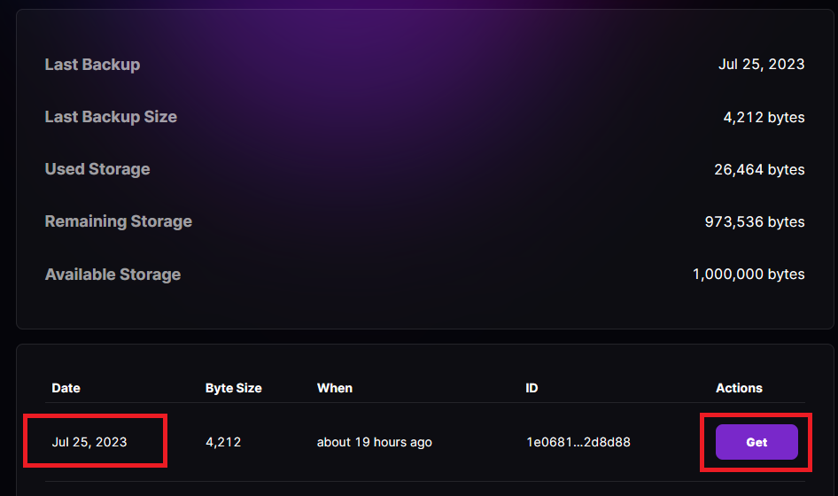

# 3.3 Web app: ThunderHub

[ThunderHub](https://thunderhub.io/) is an open-source LND node manager where you can manage and monitor your node on any device or browser. It allows you to take control of the Lightning Network with a simple and intuitive UX and the most up-to-date tech stack.

<figure><figcaption></figcaption></figure>

## Requirements

* [Bitcoin Core](../bitcoin/bitcoin/bitcoin-client.md)
* [LND](lightning-client.md)
* Others
  * [Node + NPM](../bonus/system/nodejs-npm.md)

## Preparations

### Check Node + NPM

* With the user `admin`, check the Node version

```sh
node -v
```

**Example** of expected output:

```
v16.14.2
```

* Check the NPM version

```sh
npm -v
```

**Example** of expected output:

```
8.19.3
```


2 options:

-> If the "`node -v"` output is **`>=22`**, you can move to the next section.

-> If Node.js is not installed (`-bash: /usr/bin/node: No such file or directory`), follow this [Node + NPM bonus guide](../bonus/system/nodejs-npm.md) to install it


### Reverse proxy & Firewall

In the security [section](../index-1/security.md#prepare-nginx-reverse-proxy), we set up Nginx as a reverse proxy. Now we can add the ThunderHub configuration.

Enable the Nginx reverse proxy to route external encrypted HTTPS traffic internally to ThunderHub. The `error_page 497` directive instructs browsers that send HTTP requests to resend them over HTTPS.

* With user `admin`, create the reverse proxy configuration

```sh
sudo nano /etc/nginx/sites-available/thunderhub-reverse-proxy.conf
```

* Paste the following complete configuration. Save and exit

```nginx
server {
  listen 4002 ssl;
  error_page 497 =301 https://$host:$server_port$request_uri;

  location / {
    proxy_pass http://127.0.0.1:3001;
  }
}
```

* Create the symbolic link that points to the directory `sites-enabled`


```bash
sudo ln -s /etc/nginx/sites-available/thunderhub-reverse-proxy.conf /etc/nginx/sites-enabled/
```


* Test Nginx configuration

```sh
sudo nginx -t
```

Expected output:

```
nginx: the configuration file /etc/nginx/nginx.conf syntax is ok
nginx: configuration file /etc/nginx/nginx.conf test is successful
```

* Reload the Nginx configuration to apply changes

```bash
sudo systemctl reload nginx
```

* Configure the firewall to allow incoming HTTPS requests from anywhere to the web server

```sh
sudo ufw allow 4002/tcp comment 'allow ThunderHub SSL from anywhere'
```

## Installation

### Create the thunderhub user & group

We do not want to run ThunderHub code alongside `bitcoind` and `lnd` because of security reasons. For that, we will create a separate user and run the code as the new user. We will install ThunderHub in the home directory since it doesn't need too much space.

* Create a new `thunderhub` user and group

```sh
sudo adduser --disabled-password --gecos "" thunderhub
```

* Add `thunderhub` user to the `lnd` group to allow the user `thunderhub` reading the `admin.macaroon` and `tls.cert` files

```sh
sudo adduser thunderhub lnd
```

* Change to the `thunderhub` user

```bash
sudo su - thunderhub
```

* Set a temporary version environment variable for the installation

```bash
VERSION=0.15.5
```

* Import the GPG key of the developer

```bash
curl https://github.com/apotdevin.gpg | gpg --import
```

* Download the source code directly from GitHub, select the latest release branch associated with it, and go to the `thunderhub` folder


```sh
git clone --branch v$VERSION https://github.com/apotdevin/thunderhub.git && cd thunderhub
```


* Verify the release

```bash
git verify-commit v$VERSION
```

**Example** of expected output:

<pre><code>gpg: Signature made Fri May 26 16:56:42 2023 CEST
gpg:                using RSA key 3C8A01A8344B66E7875CE5534403F1DFBE779457
gpg: <a data-footnote-ref href="#user-content-fn-1">Good signature</a> from "Anthony Potdevin &#x3C;potdevin.anthony@gmail.com>" [unknown]
gpg: WARNING: This key is not certified with a trusted signature!
gpg:          There is no indication that the signature belongs to the owner.
Primary key fingerprint: 3C8A 01A8 344B 66E7 875C  E553 4403 F1DF BE77 9457
</code></pre>

* Install all dependencies and the necessary modules using NPM


**Not to run** the `npm audit fix` command, which could break the original code!!


```sh
npm install
```

<details>

<summary><strong>Example</strong> of expected output ⬇️</summary>

```
npm warn ERESOLVE overriding peer dependency
npm warn While resolving: @apollo/server-plugin-landing-page-graphql-playground@4.0.1
npm warn Found: @apollo/server@5.4.0
npm warn node_modules/@apollo/server
npm warn   @apollo/server@"^5.4.0" from the root project
npm warn   2 more (@as-integrations/express5, @nestjs/apollo)
npm warn
npm warn Could not resolve dependency:
npm warn peer @apollo/server@"^4.0.0" from @apollo/server-plugin-landing-page-graphql-playground@4.0.1
npm warn node_modules/@apollo/server-plugin-landing-page-graphql-playground
npm warn   @apollo/server-plugin-landing-page-graphql-playground@"4.0.1" from @nestjs/apollo@13.2.4
npm warn   node_modules/@nestjs/apollo
npm warn
npm warn Conflicting peer dependency: @apollo/server@4.13.0
npm warn node_modules/@apollo/server
npm warn   peer @apollo/server@"^4.0.0" from @apollo/server-plugin-landing-page-graphql-playground@4.0.1
npm warn   node_modules/@apollo/server-plugin-landing-page-graphql-playground
npm warn     @apollo/server-plugin-landing-page-graphql-playground@"4.0.1" from @nestjs/apollo@13.2.4
npm warn     node_modules/@nestjs/apollo
npm warn deprecated @apollo/server-plugin-landing-page-graphql-playground@4.0.1: The use of GraphQL Playground in Apollo Server was supported in previous versions, but this is no longer the case as of December 31, 2022. This package exists for v4 migration purposes only. We do not intend to resolve security issues or other bugs with this package if they arise, so please migrate away from this to [Apollo Server's default Explorer](https://www.apollographql.com/docs/apollo-server/api/plugin/landing-pages) as soon as possible.
npm warn deprecated glob@10.5.0: Old versions of glob are not supported, and contain widely publicized security vulnerabilities, which have been fixed in the current version. Please update. Support for old versions may be purchased (at exorbitant rates) by contacting i@izs.me
npm warn deprecated glob@10.5.0: Old versions of glob are not supported, and contain widely publicized security vulnerabilities, which have been fixed in the current version. Please update. Support for old versions may be purchased (at exorbitant rates) by contacting i@izs.me
npm warn deprecated glob@10.5.0: Old versions of glob are not supported, and contain widely publicized security vulnerabilities, which have been fixed in the current version. Please update. Support for old versions may be purchased (at exorbitant rates) by contacting i@izs.me

> thunderhub@0.15.1 prepare
> husky


added 369 packages, removed 832 packages, changed 375 packages, and audited 1545 packages in 2m

224 packages are looking for funding
  run `npm fund` for details

17 vulnerabilities (3 low, 11 moderate, 2 high, 1 critical)

To address issues that do not require attention, run:
  npm audit fix

To address all issues (including breaking changes), run:
  npm audit fix --force

Run `npm audit` for details.
npm notice
npm notice New minor version of npm available! 11.9.0 -> 11.11.0
npm notice Changelog: https://github.com/npm/cli/releases/tag/v11.11.0
npm notice To update run: npm install -g npm@11.11.0
npm notice
```

</details>

* Build it

```sh
npm run build
```

<details>

<summary><strong>Example</strong> of expected output ⬇️</summary>

```
> thunderhub@0.15.5 prebuild
> rimraf dist && rimraf src/client/dist


> thunderhub@0.15.5 build
> npm run build:nest && npm run build:client


> thunderhub@0.15.5 build:nest
> nest build


> thunderhub@0.15.5 build:client
> cd src/client && npx vite build

vite v7.3.1 building client environment for production...
✓ 3468 modules transformed.
dist/index.html                                                       0.88 kB │ gzip:   0.47 kB
dist/assets/jetbrains-mono-vietnamese-wght-normal-Bt-aOZkq.woff2      7.50 kB
dist/assets/jetbrains-mono-greek-wght-normal-Bw9x6K1M.woff2           9.00 kB
dist/assets/noto-sans-greek-ext-wght-normal-12T8GTDR.woff2           10.76 kB
dist/assets/jetbrains-mono-cyrillic-wght-normal-D73BlboJ.woff2       12.11 kB
dist/assets/noto-sans-vietnamese-wght-normal-DLTJy58D.woff2          14.46 kB
dist/assets/jetbrains-mono-latin-ext-wght-normal-DBQx-q_a.woff2      15.20 kB
dist/assets/noto-sans-cyrillic-wght-normal-B2hlT84T.woff2            20.08 kB
dist/assets/noto-sans-greek-wght-normal-Ymb6dZNd.woff2               21.78 kB
dist/assets/noto-sans-latin-wght-normal-BYSzYMf3.woff2               35.82 kB
dist/assets/jetbrains-mono-latin-wght-normal-B9CIFXIH.woff2          40.40 kB
dist/assets/noto-sans-cyrillic-ext-wght-normal-DSNfmdVt.woff2        70.68 kB
dist/assets/noto-sans-devanagari-wght-normal-Cv-Vwajv.woff2          99.24 kB
dist/assets/noto-sans-latin-ext-wght-normal-W1qJv59z.woff2          167.96 kB
dist/assets/index-CaOutTYy.css                                      120.38 kB │ gzip:  21.24 kB
dist/assets/SettingsDashboardPage-Cw2lNbJ3.js                         2.06 kB │ gzip:   0.97 kB
dist/assets/DashboardPage-CdGPQaG7.js                                61.33 kB │ gzip:  20.51 kB
dist/assets/index-CM0qvWIF.js                                     1,736.10 kB │ gzip: 534.93 kB

(!) Some chunks are larger than 500 kB after minification. Consider:
- Using dynamic import() to code-split the application
- Use build.rollupOptions.output.manualChunks to improve chunking: https://rollupjs.org/configuration-options/#output-manualchunks
- Adjust chunk size limit for this warning via build.chunkSizeWarningLimit.
✓ built in 9.66s
```

</details>


This process can take quite **a long time**, 10-15 minutes or more, depending on the performance of your device. Please be patient until the prompt shows again


* Check the correct installation by requesting the version

```bash
head -n 3 /home/thunderhub/thunderhub/package.json | grep version
```

**Example** of expected output:

```
"version": "0.13.19",
```

## Configuration

* Copy the configuration file template

```sh
cp .env .env.local
```

* Edit the configuration file

```sh
nano .env.local
```

* Uncomment (delete the `#` symbol at the beginning of the line), and edit the following line to match the next. Save and exit

```
ACCOUNT_CONFIG_PATH='/home/thunderhub/thunderhub/thubConfig.yaml'
```

* Create a new `thubConfig.yaml` file

```sh
nano thubConfig.yaml
```

* Copy and paste the following information

<pre class="language-yaml"><code class="lang-yaml">masterPassword: '<a data-footnote-ref href="#user-content-fn-2">[E] ThunderHub password</a>'
accounts:
  - name: 'RaMiX'
    serverUrl: '127.0.0.1:10009'
    macaroonPath: '/data/lnd/data/chain/bitcoin/mainnet/admin.macaroon'
    certificatePath: '/data/lnd/tls.cert'
</code></pre>


Replace the **`[E] ThunderHub password`** to your one, keeping quotes \[' ']


* **(Optional)** You can pre-enable automatic healthchecks ping, and/or channel backups to Amboss before starting ThunderHub by adding some lines **at the end of the file** (**without indentation**)

Enable auto-backups:

```
backupsEnabled: true
```

Enable auto healthchecks:

```
healthCheckPingEnabled: true
```


> Anyway is possible to enable this later using the ThunderHub interface that will be explained in the [Enable auto backups and healthcheck notifications](web-app.md#enable-auto-backups-and-healthcheck-notifications-to-the-amboss-account) extra section

> Keep in mind that if you stop ThunderHub, Amboss will interpret that your node is offline because the connection is established between ThunderHub <> Amboss to send healthchecks pings



These features are not available for a testnet node


* Exit `thunderhub` user session to return to the `admin` user session

```sh
exit
```

### Create systemd service

* As user `admin`, create the service file

```sh
sudo nano /etc/systemd/system/thunderhub.service
```

* Paste the following configuration. Save and exit

<pre><code># MiniBolt: systemd unit for ThunderHub
# /etc/systemd/system/thunderhub.service

[Unit]
Description=ThunderHub
<strong>Requires=lnd.service
</strong>After=lnd.service

[Service]
WorkingDirectory=/home/thunderhub/thunderhub
ExecStart=/usr/bin/npm run start

User=thunderhub
Group=thunderhub

# Process management
####################
TimeoutSec=300

# Hardening Measures
####################
PrivateTmp=true
ProtectSystem=full
NoNewPrivileges=true
PrivateDevices=true

[Install]
WantedBy=multi-user.target
</code></pre>

* Enable autoboot **(optional)**

```sh
sudo systemctl enable thunderhub
```

* Prepare "thunderhub" monitoring by the systemd journal and check the log output. You can exit monitoring at any time with `Ctrl-C`

```bash
journalctl -fu thunderhub
```

## Run

To keep an eye on the software movements, [start your SSH program](../index-1/remote-access.md#access-with-secure-shell) straight forward (eg. PuTTY) a second time, connect to the MiniBolt node, and log in as "admin"

* Start the service

```sh
sudo systemctl start thunderhub
```

<details>

<summary><strong>Example</strong> of expected output on the first terminal with <code>journalctl -fu thunderhub</code> ⬇️</summary>

```
Apr 10 16:35:09 minibolt systemd[1]: Started ThunderHub.
Apr 10 16:35:09 minibolt npm[75525]: > thunderhub@0.15.5 start
Apr 10 16:35:09 minibolt npm[75525]: > cross-env NODE_ENV=production nest start
Apr 10 16:35:23 minibolt npm[75556]: [Nest] 75556  - 04/10/2026, 4:35:23 PM     LOG [NestFactory] Starting Nest application...
Apr 10 16:35:23 minibolt npm[75556]: Getting production env variables.
Apr 10 16:35:23 minibolt npm[75556]: [Nest] 75556  - 04/10/2026, 4:35:23 PM     LOG [InstanceLoader] AppModule dependencies initialized +50ms
Apr 10 16:35:23 minibolt npm[75556]: [Nest] 75556  - 04/10/2026, 4:35:23 PM     LOG [InstanceLoader] PassportModule dependencies initialized +0ms
Apr 10 16:35:23 minibolt npm[75556]: [Nest] 75556  - 04/10/2026, 4:35:23 PM     LOG [InstanceLoader] LndModule dependencies initialized +1ms
Apr 10 16:35:23 minibolt npm[75556]: [Nest] 75556  - 04/10/2026, 4:35:23 PM     LOG [InstanceLoader] ApiModule dependencies initialized +0ms
Apr 10 16:35:23 minibolt npm[75556]: [Nest] 75556  - 04/10/2026, 4:35:23 PM     LOG [InstanceLoader] MainModule dependencies initialized +0ms
Apr 10 16:35:23 minibolt npm[75556]: [Nest] 75556  - 04/10/2026, 4:35:23 PM     LOG [InstanceLoader] ConfigHostModule dependencies initialized +1ms
Apr 10 16:35:23 minibolt npm[75556]: [Nest] 75556  - 04/10/2026, 4:35:23 PM     LOG [InstanceLoader] LitdModule dependencies initialized +1ms
Apr 10 16:35:23 minibolt npm[75556]: [Nest] 75556  - 04/10/2026, 4:35:23 PM     LOG [InstanceLoader] DiscoveryModule dependencies initialized +0ms
Apr 10 16:35:23 minibolt npm[75556]: [Nest] 75556  - 04/10/2026, 4:35:23 PM     LOG [InstanceLoader] ConfigModule dependencies initialized +6ms
Apr 10 16:35:23 minibolt npm[75556]: [Nest] 75556  - 04/10/2026, 4:35:23 PM     LOG [InstanceLoader] ConfigModule dependencies initialized +0ms
Apr 10 16:35:23 minibolt npm[75556]: [Nest] 75556  - 04/10/2026, 4:35:23 PM     LOG [InstanceLoader] ProviderRegistryModule dependencies initialized +1ms
Apr 10 16:35:23 minibolt npm[75556]: [Nest] 75556  - 04/10/2026, 4:35:23 PM     LOG [InstanceLoader] ScheduleModule dependencies initialized +0ms
Apr 10 16:35:23 minibolt npm[75556]: [Nest] 75556  - 04/10/2026, 4:35:23 PM     LOG [InstanceLoader] ClientConfigModule dependencies initialized +0ms
Apr 10 16:35:23 minibolt npm[75556]: [Nest] 75556  - 04/10/2026, 4:35:23 PM     LOG [InstanceLoader] ThrottlerModule dependencies initialized +10ms
Apr 10 16:35:23 minibolt npm[75556]: [Nest] 75556  - 04/10/2026, 4:35:23 PM     LOG [InstanceLoader] JwtModule dependencies initialized +1ms
Apr 10 16:35:23 minibolt npm[75556]: [Nest] 75556  - 04/10/2026, 4:35:23 PM     LOG [InstanceLoader] ServeStaticModule dependencies initialized +0ms
Apr 10 16:35:23 minibolt npm[75556]: [Nest] 75556  - 04/10/2026, 4:35:23 PM     LOG [InstanceLoader] WinstonModule dependencies initialized +1ms
Apr 10 16:35:23 minibolt npm[75556]: [Nest] 75556  - 04/10/2026, 4:35:23 PM     LOG [InstanceLoader] FilesModule dependencies initialized +0ms
Apr 10 16:35:23 minibolt npm[75556]: [Nest] 75556  - 04/10/2026, 4:35:23 PM     LOG [InstanceLoader] FetchModule dependencies initialized +1ms
Apr 10 16:35:23 minibolt npm[75556]: [Nest] 75556  - 04/10/2026, 4:35:23 PM     LOG [InstanceLoader] AuthenticationModule dependencies initialized +0ms
Apr 10 16:35:23 minibolt npm[75556]: [Nest] 75556  - 04/10/2026, 4:35:23 PM     LOG [InstanceLoader] GraphQLSchemaBuilderModule dependencies initialized +0ms
Apr 10 16:35:23 minibolt npm[75556]: [Nest] 75556  - 04/10/2026, 4:35:23 PM     LOG [InstanceLoader] AccountsModule dependencies initialized +1ms
Apr 10 16:35:23 minibolt npm[75556]: [Nest] 75556  - 04/10/2026, 4:35:23 PM     LOG [InstanceLoader] MempoolModule dependencies initialized +0ms
Apr 10 16:35:23 minibolt npm[75556]: [Nest] 75556  - 04/10/2026, 4:35:23 PM     LOG [InstanceLoader] BlockstreamModule dependencies initialized +0ms
Apr 10 16:35:23 minibolt npm[75556]: [Nest] 75556  - 04/10/2026, 4:35:23 PM     LOG [InstanceLoader] BitcoinModule dependencies initialized +0ms
Apr 10 16:35:23 minibolt npm[75556]: [Nest] 75556  - 04/10/2026, 4:35:23 PM     LOG [InstanceLoader] GithubModule dependencies initialized +0ms
Apr 10 16:35:23 minibolt npm[75556]: [Nest] 75556  - 04/10/2026, 4:35:23 PM     LOG [InstanceLoader] UserConfigModule dependencies initialized +1ms
Apr 10 16:35:23 minibolt npm[75556]: [Nest] 75556  - 04/10/2026, 4:35:23 PM     LOG [InstanceLoader] NodeModule dependencies initialized +0ms
Apr 10 16:35:23 minibolt npm[75556]: [Nest] 75556  - 04/10/2026, 4:35:23 PM     LOG [InstanceLoader] TapdModule dependencies initialized +0ms
Apr 10 16:35:23 minibolt npm[75556]: [Nest] 75556  - 04/10/2026, 4:35:23 PM     LOG [InstanceLoader] AccountModule dependencies initialized +0ms
Apr 10 16:35:23 minibolt npm[75556]: [Nest] 75556  - 04/10/2026, 4:35:23 PM     LOG [InstanceLoader] AuthenticationModule dependencies initialized +1ms
Apr 10 16:35:23 minibolt npm[75556]: [Nest] 75556  - 04/10/2026, 4:35:23 PM     LOG [InstanceLoader] SseModule dependencies initialized +0ms
Apr 10 16:35:23 minibolt npm[75556]: [Nest] 75556  - 04/10/2026, 4:35:23 PM     LOG [InstanceLoader] WalletModule dependencies initialized +0ms
Apr 10 16:35:23 minibolt npm[75556]: [Nest] 75556  - 04/10/2026, 4:35:23 PM     LOG [InstanceLoader] NetworkModule dependencies initialized +0ms
Apr 10 16:35:23 minibolt npm[75556]: [Nest] 75556  - 04/10/2026, 4:35:23 PM     LOG [InstanceLoader] EdgeModule dependencies initialized +0ms
Apr 10 16:35:23 minibolt npm[75556]: [Nest] 75556  - 04/10/2026, 4:35:23 PM     LOG [InstanceLoader] TransactionsModule dependencies initialized +0ms
Apr 10 16:35:23 minibolt npm[75556]: [Nest] 75556  - 04/10/2026, 4:35:23 PM     LOG [InstanceLoader] ToolsModule dependencies initialized +0ms
Apr 10 16:35:23 minibolt npm[75556]: [Nest] 75556  - 04/10/2026, 4:35:23 PM     LOG [InstanceLoader] MacaroonModule dependencies initialized +0ms
Apr 10 16:35:23 minibolt npm[75556]: [Nest] 75556  - 04/10/2026, 4:35:23 PM     LOG [InstanceLoader] PeerModule dependencies initialized +0ms
Apr 10 16:35:23 minibolt npm[75556]: [Nest] 75556  - 04/10/2026, 4:35:23 PM     LOG [InstanceLoader] ChainModule dependencies initialized +0ms
Apr 10 16:35:23 minibolt npm[75556]: [Nest] 75556  - 04/10/2026, 4:35:23 PM     LOG [InstanceLoader] ForwardsModule dependencies initialized +0ms
Apr 10 16:35:23 minibolt npm[75556]: [Nest] 75556  - 04/10/2026, 4:35:23 PM     LOG [InstanceLoader] HealthModule dependencies initialized +0ms
Apr 10 16:35:23 minibolt npm[75556]: [Nest] 75556  - 04/10/2026, 4:35:23 PM     LOG [InstanceLoader] InvoicesModule dependencies initialized +0ms
Apr 10 16:35:23 minibolt npm[75556]: [Nest] 75556  - 04/10/2026, 4:35:23 PM     LOG [InstanceLoader] NodeModule dependencies initialized +0ms
Apr 10 16:35:23 minibolt npm[75556]: [Nest] 75556  - 04/10/2026, 4:35:23 PM     LOG [InstanceLoader] ChannelsModule dependencies initialized +0ms
Apr 10 16:35:23 minibolt npm[75556]: [Nest] 75556  - 04/10/2026, 4:35:23 PM     LOG [InstanceLoader] AuthModule dependencies initialized +0ms
Apr 10 16:35:23 minibolt npm[75556]: [Nest] 75556  - 04/10/2026, 4:35:23 PM     LOG [InstanceLoader] BoltzModule dependencies initialized +0ms
Apr 10 16:35:23 minibolt npm[75556]: [Nest] 75556  - 04/10/2026, 4:35:23 PM     LOG [InstanceLoader] TapdApiModule dependencies initialized +1ms
Apr 10 16:35:23 minibolt npm[75556]: [Nest] 75556  - 04/10/2026, 4:35:23 PM     LOG [InstanceLoader] LnUrlModule dependencies initialized +0ms
Apr 10 16:35:23 minibolt npm[75556]: [Nest] 75556  - 04/10/2026, 4:35:23 PM     LOG [InstanceLoader] DataloaderModule dependencies initialized +0ms
Apr 10 16:35:23 minibolt npm[75556]: [Nest] 75556  - 04/10/2026, 4:35:23 PM     LOG [InstanceLoader] AmbossModule dependencies initialized +0ms
Apr 10 16:35:23 minibolt npm[75556]: [Nest] 75556  - 04/10/2026, 4:35:23 PM     LOG [InstanceLoader] SubModule dependencies initialized +0ms
Apr 10 16:35:23 minibolt npm[75556]: [Nest] 75556  - 04/10/2026, 4:35:23 PM     LOG [InstanceLoader] GraphQLModule dependencies initialized +1ms
Apr 10 16:35:23 minibolt npm[75556]: {
Apr 10 16:35:23 minibolt npm[75556]:   context: 'RoutesResolver',
Apr 10 16:35:23 minibolt npm[75556]:   level: 'info',
Apr 10 16:35:23 minibolt npm[75556]:   message: 'SseController {/api/sse}:',
Apr 10 16:35:23 minibolt npm[75556]:   timestamp: '2026-04-10T16:35:23.571Z'
Apr 10 16:35:23 minibolt npm[75556]: }
Apr 10 16:35:23 minibolt npm[75556]: {
Apr 10 16:35:23 minibolt npm[75556]:   context: 'RouterExplorer',
Apr 10 16:35:23 minibolt npm[75556]:   level: 'info',
Apr 10 16:35:23 minibolt npm[75556]:   message: 'Mapped {/api/sse/events, GET} route',
Apr 10 16:35:23 minibolt npm[75556]:   timestamp: '2026-04-10T16:35:23.576Z'
Apr 10 16:35:23 minibolt npm[75556]: }
Apr 10 16:35:23 minibolt npm[75556]: {
Apr 10 16:35:23 minibolt npm[75556]:   context: 'RoutesResolver',
Apr 10 16:35:23 minibolt npm[75556]:   level: 'info',
Apr 10 16:35:23 minibolt npm[75556]:   message: 'ClientConfigController {/api}:',
Apr 10 16:35:23 minibolt npm[75556]:   timestamp: '2026-04-10T16:35:23.576Z'
Apr 10 16:35:23 minibolt npm[75556]: }
Apr 10 16:35:23 minibolt npm[75556]: {
Apr 10 16:35:23 minibolt npm[75556]:   context: 'RouterExplorer',
Apr 10 16:35:23 minibolt npm[75556]:   level: 'info',
Apr 10 16:35:23 minibolt npm[75556]:   message: 'Mapped {/api/config, GET} route',
Apr 10 16:35:23 minibolt npm[75556]:   timestamp: '2026-04-10T16:35:23.577Z'
Apr 10 16:35:23 minibolt npm[75556]: }
Apr 10 16:35:24 minibolt npm[75556]: {
Apr 10 16:35:24 minibolt npm[75556]:   message: 'Saving new yaml file',
Apr 10 16:35:24 minibolt npm[75556]:   level: 'info',
Apr 10 16:35:24 minibolt npm[75556]:   timestamp: '2026-04-10T16:35:24.450Z'
Apr 10 16:35:24 minibolt npm[75556]: }
Apr 10 16:35:24 minibolt npm[75556]: {
Apr 10 16:35:24 minibolt npm[75556]:   message: 'Succesfully saved',
Apr 10 16:35:24 minibolt npm[75556]:   level: 'info',
Apr 10 16:35:24 minibolt npm[75556]:   timestamp: '2026-04-10T16:35:24.453Z'
Apr 10 16:35:24 minibolt npm[75556]: }
Apr 10 16:35:24 minibolt npm[75556]: {
Apr 10 16:35:24 minibolt npm[75556]:   message: 'Server accounts that will be available: MiniBolt',
Apr 10 16:35:24 minibolt npm[75556]:   level: 'info',
Apr 10 16:35:24 minibolt npm[75556]:   timestamp: '2026-04-10T16:35:24.458Z'
Apr 10 16:35:24 minibolt npm[75556]: }
Apr 10 16:35:25 minibolt npm[75556]: {
Apr 10 16:35:25 minibolt npm[75556]:   context: 'GraphQLModule',
Apr 10 16:35:25 minibolt npm[75556]:   level: 'info',
Apr 10 16:35:25 minibolt npm[75556]:   message: 'Mapped {/graphql, POST} route',
Apr 10 16:35:25 minibolt npm[75556]:   timestamp: '2026-04-10T16:35:25.092Z'
Apr 10 16:35:25 minibolt npm[75556]: }
Apr 10 16:35:25 minibolt npm[75556]: {
Apr 10 16:35:25 minibolt npm[75556]:   context: 'NestApplication',
Apr 10 16:35:25 minibolt npm[75556]:   level: 'info',
Apr 10 16:35:25 minibolt npm[75556]:   message: 'Nest application successfully started',
Apr 10 16:35:25 minibolt npm[75556]:   timestamp: '2026-04-10T16:35:25.103Z'
Apr 10 16:35:25 minibolt npm[75556]: }
Apr 10 16:35:25 minibolt npm[75556]: Application is running on: http://[::1]:3001
Apr 10 16:35:25 minibolt npm[75556]: (node:75556) [DEP0123] DeprecationWarning: Setting the TLS ServerName to an IP address is not permitted by RFC 6066. This will be ignored in a future version.
Apr 10 16:35:25 minibolt npm[75556]: (Use `node --trace-deprecation ...` to show where the warning was created)
Apr 10 16:35:31 minibolt npm[75556]: {
Apr 10 16:35:31 minibolt npm[75556]:   message: 'Connected to MiniBoltLNnode(035772a363)[btc]',
Apr 10 16:35:31 minibolt npm[75556]:   level: 'info',
Apr 10 16:35:31 minibolt npm[75556]:   timestamp: '2026-04-10T16:35:31.812Z'
Apr 10 16:35:31 minibolt npm[75556]: }
[...]
```

</details>

### Validation

* Ensure the service is working and listening on the default `3001` port and the HTTPS `4002` port

```bash
sudo ss -tulpn | grep -v 'dotnet' | grep -E '(:4002|:3001)'
```

Expected output:

```
tcp   LISTEN 0      511              0.0.0.0:4002       0.0.0.0:*    users:(("nginx",pid=149017,fd=10),("nginx",pid=149016,fd=10),("nginx",pid=149015,fd=10),("nginx",pid=149014,fd=10),("nginx",pid=134704,fd=10))
tcp   LISTEN 0      511                    *:3001             *:*    users:(("MainThread",pid=149763,fd=21))
```


> Your browser will display a warning because we use a self-signed SSL certificate. We can do nothing about that because we would need a proper domain name (e.g., https://yournode.com) to get an official certificate that browsers recognize. Click on "Advanced" and proceed to the ThunderHub web interface

> Now point your browser to `https://minibolt.local:4002` or the IP address (e.g. `https://192.168.x.xxx:4002`). You should see the home page of ThunderHub



Congrat&#x73;**!** You now have ThunderHub up and running


## Extras (optional)

### Remote access over Tor

* With the user `admin`, edit the `torrc` file

```sh
sudo nano +63 /etc/tor/torrc --linenumbers
```

* Add the following lines in the "location hidden services" section, below "`## This section is just for location-hidden services ##`". Save and exit

```
# Hidden Service ThunderHub
HiddenServiceDir /var/lib/tor/hidden_service_thunderhub/
HiddenServiceEnableIntroDoSDefense 1
HiddenServicePoWDefensesEnabled 1
HiddenServicePort 80 127.0.0.1:3001
```

* Reload Tor to apply changes

```sh
sudo systemctl reload tor
```

* Get your Onion address

```sh
sudo cat /var/lib/tor/hidden_service_thunderhub/hostname
```

Expected output:

```
abcdefg..............xyz.onion
```

* With the [Tor browser](https://www.torproject.org), you can access this onion address from any device

### Access to your Amboss node account

* In the "**Home**" screen - "**Quick Actions**" section, click on the Amboss icon "**Login**", wait for the top right corner notification to show you "**Logged in**", and click again on the Amboss icon "**Go to**". This will open a secondary tab in your browser to access your Amboss account node


If you can't do "**Login**", maybe the cause is that you don't have a **public** channel opened yet. **You'll need at least one public channel that has been open for a few days.** Planning to open a small-sized public channel to be connected with some Lightning Network peers or directly to the [Amboss node](https://amboss.space/es/node/03006fcf3312dae8d068ea297f58e2bd00ec1ffe214b793eda46966b6294a53ce6). More info on [Amboss docs](https://amboss.tech/docs)


* Making sure we are connected to the [Amboss account](https://amboss.space/settings?page=account), now back to ThunderHub for the next steps

### Enable auto backups and healthcheck notifications to the Amboss account

#### Enable automatic backups to Amboss

1. In ThunderHub, from the left sidebar, click on 🌍**Amboss.**
2. In the **Backups section**, push the **Push** button to test and push the first backup to Amboss. If all is good, you could enable automatic backups to Amboss by pushing on **Enable** just above; now the backup file encrypted will be updated automatically on Amboss for every channel opening and closing.
3. Go to the Amboss website -> [backups section](https://amboss.space/settings?page=backups).
4. Ensure that the last date of the backup is the same as before.

<figure><figcaption></figcaption></figure>


> You could test that the possible recovery process would be available, by clicking on the "**Get**" button and copying the entire string, then going back to the Thunderhub from the left sidebar, clicking on "**Tools",** going to the "Backups" section -> "Verify Channels Backup" -> click on "**Verify"** button, paste the before string copied and click on "Verify" button again. A green banner "**Valid backup String**" should appear.

> Also is recommended to download the backup file from ThunderHub and store locally it in a safe place for future recovery. You can do this "**Tools**" section in Thunderhub, "**Backups**" -> "Backup all channels" -> click the "**Download**" button.


#### Enable automatic healthcheck pings to Amboss

1. In ThunderHub, from the left sidebar, click on 🌍**Amboss.**
2. Go to the **Healthchecks section** and push the "**Enable**" button to enable automatic healthcheck pings to Amboss.
3. Now go to the Amboss [Monitoring section](https://amboss.space/settings?page=monitoring), and configure "Healthcheck Settings" as you wish.
4. Go to the [Notifications section](https://amboss.space/settings?page=notifications) to enable the different notification methods that you wish to be notified.


> Feel free to link to the Telegram bot notifications, enable different notifications, complete your public node profile in Amboss, and other things in the different sections of your account

> Keep in mind that if you stop ThunderHub, Amboss will interpret that your node is offline because the connection is established between ThunderHub <-> Ambos to send healthchecks pings


### Recovering channels using the ThunderHub method

After possible data corruption of your LND node, ensure that this old node is completely off before starting the recovery.

Once you have synced the new node, on-chain recovered with seeds, full on-chain re-scan complete, and Thunderhub installed and running, go to the ThunderHub dashboard.

1. From the left sidebar, click on "**Tools"**, and go to the "Backups" section -> "**Recover Funds from Channels**" -> push the "**Recover**" button.
2. In this box, enter the complete string text that contains your manually downloaded channels backup file in the step before, or use the string using the content of the latest Amboss automatic backup (recommended), and push the " Recover " button again.


All of the channels that you had opened in your old node will be forced closed, and they will appear in the "Pending" tab in the "Channels" section until closings are confirmed. Check the logs of LND to see how the recovery process is executed and get more information about it



Use this guide as a last resort if you have lost access to your node or are unable to start LND due to a fatal error. This guide will close all your channels. Your funds will become available on-chain at varying speeds


## Upgrade

Updating to a [new release](https://github.com/apotdevin/thunderhub/releases) should be straightforward.

* Stay logged in with the user `admin`, stop the service

```sh
sudo systemctl stop thunderhub
```

* Change to the `thunderhub` user

```sh
sudo su - thunderhub
```

* Go to the thunderhub folder

```sh
cd thunderhub
```

* Set the environment variable version

```bash
VERSION=0.15.5
```

* Pull the changes from GitHub

```bash
git pull https://github.com/apotdevin/thunderhub.git v$VERSION
```

<details>

<summary><strong>Example</strong> of expected output ⬇️</summary>

```
From https://github.com/apotdevin/thunderhub
 * tag                 v0.13.28   -> FETCH_HEAD
Updating 1d5a3fe5..5e9b3f68
Fast-forward
 CHANGELOG.md                                    |   7 +++++++
 package-lock.json                               |   4 ++--
 package.json                                    |   2 +-
 src/server/modules/api/amboss/amboss.gql.ts     |   9 +++++++++
 src/server/modules/api/amboss/amboss.service.ts |  16 ++++++++++++++++
 src/server/modules/sub/sub.service.ts           | 113 +++++++++++++++++++++++++++++++++++++++++++++++++++++++++++++++++++++++++++++++++++++++++++++++++++++++++++++++++
 6 files changed, 148 insertions(+), 3 deletions(-)
```

</details>

* Install all the necessary modules

```bash
npm install
```

<details>

<summary><strong>Example</strong> of expected output ⬇️</summary>

```
npm warn ERESOLVE overriding peer dependency
npm warn While resolving: @apollo/server-plugin-landing-page-graphql-playground@4.0.1
npm warn Found: @apollo/server@5.4.0
npm warn node_modules/@apollo/server
npm warn   @apollo/server@"^5.4.0" from the root project
npm warn   2 more (@as-integrations/express5, @nestjs/apollo)
npm warn
npm warn Could not resolve dependency:
npm warn peer @apollo/server@"^4.0.0" from @apollo/server-plugin-landing-page-graphql-playground@4.0.1
npm warn node_modules/@apollo/server-plugin-landing-page-graphql-playground
npm warn   @apollo/server-plugin-landing-page-graphql-playground@"4.0.1" from @nestjs/apollo@13.2.4
npm warn   node_modules/@nestjs/apollo
npm warn
npm warn Conflicting peer dependency: @apollo/server@4.13.0
npm warn node_modules/@apollo/server
npm warn   peer @apollo/server@"^4.0.0" from @apollo/server-plugin-landing-page-graphql-playground@4.0.1
npm warn   node_modules/@apollo/server-plugin-landing-page-graphql-playground
npm warn     @apollo/server-plugin-landing-page-graphql-playground@"4.0.1" from @nestjs/apollo@13.2.4
npm warn     node_modules/@nestjs/apollo
npm warn deprecated @apollo/server-plugin-landing-page-graphql-playground@4.0.1: The use of GraphQL Playground in Apollo Server was supported in previous versions, but this is no longer the case as of December 31, 2022. This package exists for v4 migration purposes only. We do not intend to resolve security issues or other bugs with this package if they arise, so please migrate away from this to [Apollo Server's default Explorer](https://www.apollographql.com/docs/apollo-server/api/plugin/landing-pages) as soon as possible.
npm warn deprecated glob@10.5.0: Old versions of glob are not supported, and contain widely publicized security vulnerabilities, which have been fixed in the current version. Please update. Support for old versions may be purchased (at exorbitant rates) by contacting i@izs.me
npm warn deprecated glob@10.5.0: Old versions of glob are not supported, and contain widely publicized security vulnerabilities, which have been fixed in the current version. Please update. Support for old versions may be purchased (at exorbitant rates) by contacting i@izs.me
npm warn deprecated glob@10.5.0: Old versions of glob are not supported, and contain widely publicized security vulnerabilities, which have been fixed in the current version. Please update. Support for old versions may be purchased (at exorbitant rates) by contacting i@izs.me

> thunderhub@0.15.1 prepare
> husky


added 369 packages, removed 832 packages, changed 375 packages, and audited 1545 packages in 2m

224 packages are looking for funding
  run `npm fund` for details

17 vulnerabilities (3 low, 11 moderate, 2 high, 1 critical)

To address issues that do not require attention, run:
  npm audit fix

To address all issues (including breaking changes), run:
  npm audit fix --force

Run `npm audit` for details.
npm notice
npm notice New minor version of npm available! 11.9.0 -> 11.11.0
npm notice Changelog: https://github.com/npm/cli/releases/tag/v11.11.0
npm notice To update run: npm install -g npm@11.11.0
npm notice
```

</details>

* Build it

<pre class="language-bash"><code class="lang-bash"><strong>npm run build
</strong></code></pre>

<details>

<summary><strong>Example</strong> of expected output ⬇️</summary>

```

> thunderhub@0.15.1 prebuild
> rimraf dist && rimraf src/client/dist


> thunderhub@0.15.1 build
> npm run build:nest && npm run build:client


> thunderhub@0.15.1 build:nest
> nest build


> thunderhub@0.15.1 build:client
> cd src/client && npx vite build

vite v7.3.1 building client environment for production...
✓ 3432 modules transformed.
dist/index.html                                    0.60 kB │ gzip:   0.36 kB
dist/assets/index-C2Q4IGPT.css                    32.24 kB │ gzip:   6.62 kB
dist/assets/SettingsDashboardPage-NuTzbgRs.js      1.59 kB │ gzip:   0.84 kB
dist/assets/DashboardPage-D8gCYArr.js             61.63 kB │ gzip:  20.56 kB
dist/assets/index-CbTrqCDL.js                  1,671.44 kB │ gzip: 533.46 kB

(!) Some chunks are larger than 500 kB after minification. Consider:
- Using dynamic import() to code-split the application
- Use build.rollupOptions.output.manualChunks to improve chunking: https://rollupjs.org/configuration-options/#output-manualchunks
- Adjust chunk size limit for this warning via build.chunkSizeWarningLimit.
✓ built in 1m 6s
```

</details>

* Check the correct update

```bash
head -n 3 /home/thunderhub/thunderhub/package.json | grep version
```

**Example** of expected output:

<pre><code><strong>"version": "0.13.20",
</strong></code></pre>

* Exit to go back to the `admin` user

```bash
exit
```

* Start the service again

```sh
sudo systemctl start thunderhub
```


If the update fails, you probably will have to stop ThunderHub, follow the [Uninstall ThunderHub section](web-app.md#uninstall-thunderhub) to delete the `thunderhub` user, and repeat the installation process starting from the [Preparation section](web-app.md#preparation)


## Uninstall


Warning: This section removes the installation. Only run these commands if you intend to uninstall


### Uninstall service

* With user `admin` , stop thunderhub

```sh
sudo systemctl stop thunderhub
```

* Disable autoboot (if enabled)

```sh
sudo systemctl disable thunderhub
```

* Delete the service

```sh
sudo rm /etc/systemd/system/thunderhub.service
```

### Delete user & group

* Delete the "thunderhub" user. Do not worry about the `userdel: thunderhub mail spool (/var/mail/thunderhub) not found`

```sh
sudo userdel -rf thunderhub
```

### Uninstall Tor hidden service

* Comment or remove the ThunderHub hidden service lines in torrc. Save and exit

```sh
sudo nano +63 /etc/tor/torrc --linenumbers
```

```
# Hidden Service ThunderHub
#HiddenServiceDir /var/lib/tor/hidden_service_thunderhub/
#HiddenServiceEnableIntroDoSDefense 1
#HiddenServicePoWDefensesEnabled 1
#HiddenServicePort 80 127.0.0.1:3001
```

* Reload the Tor config to apply changes

```sh
sudo systemctl reload tor
```

### Uninstall reverse proxy & FW configuration

* Ensure you are logged in as the user `admin`, delete the reverse proxy config file

```bash
sudo rm /etc/nginx/sites-available/thunderhub-reverse-proxy.conf
```

* Delete the symbolic link

```bash
sudo rm /etc/nginx/sites-enabled/thunderhub-reverse-proxy.conf
```

* Test Nginx configuration

```bash
sudo nginx -t
```

Expected output:

```
nginx: the configuration file /etc/nginx/nginx.conf syntax is ok
nginx: configuration file /etc/nginx/nginx.conf test is successful
```

* Reload the Nginx configuration to apply changes

```bash
sudo systemctl reload nginx
```

* Display the UFW firewall rules and note the numbers of the rules for ThunderHub (e.g. "X" below)

```sh
sudo ufw status numbered
```

Expected output:

```
[X] 4002    ALLOW IN    Anywhere         # allow ThunderHub SSL from anywhere
```

* Delete the ThunderHub rules (check that the rule to be deleted is the correct one and type "y" and "Enter" when prompted)

```sh
sudo ufw delete X
```

## Port reference

<table><thead><tr><th align="center">Port</th><th width="100">Protocol<select><option value="K1YTaXNgK9iY" label="TCP" color="blue"></option><option value="rBwkQwPZUMt0" label="SSL" color="blue"></option><option value="zQnHZmzcUdq4" label="UDP" color="blue"></option></select></th><th align="center">Use</th></tr></thead><tbody><tr><td align="center">3001</td><td><span data-option="K1YTaXNgK9iY">TCP</span></td><td align="center">Default HTTP port</td></tr><tr><td align="center">4002</td><td><span data-option="rBwkQwPZUMt0">SSL</span></td><td align="center">HTTPS port</td></tr></tbody></table>

[^1]: Check this

[^2]: Replace
