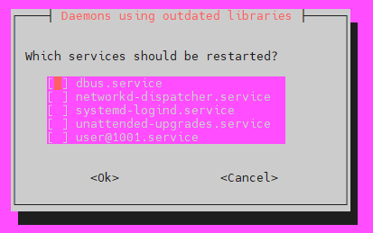

# 1.4 Configuration

You are now on the command line of your own Bitcoin node. Let's start with the configuration.

<figure><figcaption></figcaption></figure>

### Add the admin user (and log in with it)

We will use the primary user "admin" instead of "temp" to make this guide more universal.

*   Create a new user called "admin" with your `password [A]`

    ```sh
    $ sudo adduser --gecos "" admin
    ```
*   Make this new user a superuser by adding it to the "sudo" and old "temp" user groups

    ```sh
    $ sudo usermod -a -G sudo,adm,cdrom,dip,plugdev,lxd admin
    ```
*   Logout `temp` user

    ```sh
    $ logout
    ```
* Repeat [access with the SSH section](remote-access.md#access-with-secure-shell) but this time login with `admin` and your `password [A]`
*   Delete the `temp` user. Do not worry about the `userdel: temp mail spool (/var/mail/temp) not found` message

    ```sh
    $ sudo userdel -rf temp
    ```

Expected output:

```
> userdel: temp mail spool (/var/mail/temp) not found
```

To change the system configuration and files that don't belong to the user "admin", you have to prefix commands with `sudo`. You will be prompted to enter your admin `password [A]` from time to time for increased security.

### Login with SSH keys (optional)

Now, you can start to access it without a password by following the [SSH keys bonus guide](../bonus/system/ssh-keys.md).

### System update

*   Update the operating system and all installed software packages

    ```sh
    $ sudo apt update && sudo apt full-upgrade
    ```


Do this regularly every few months for security-related updates. If during the update process, a banner appears asking you: "Which services should be restarted?" you can press ENTER and take note of which services will be restarted during the update, marked with `[*]`. Example:




*   To be able to use the "minibolt" hostname instead of the IP address, we must install this necessary software package

    ```sh
    $ sudo apt install avahi-daemon
    ```

### Check drive performance

Performant unit storage is essential for your node.

Let's check if your drive works well as-is.

*   Your disk should be detected as `/dev/sda`. Check if this is the case by listing the names of connected block devices

    ```sh
    $ lsblk -pli
    ```
*   Measure the speed of your drive

    ```sh
    $ sudo hdparm -t --direct /dev/sda
    ```

**Example** of expected output:

```
> Timing O_DIRECT disk reads: 932 MB in 3.00 seconds = 310.23 MB/sec
```


If the measured speeds are more than 50 MB/s, you're good.


*   If you installed a **secondary disk**, check and measure the speed with the next command, if not, skip it

    ```sh
    $ sudo hdparm -t --direct /dev/sdb
    ```

**Example** of expected output:

```
> Timing O_DIRECT disk reads: 932 MB in 3.00 seconds = 310.23 MB/sec
```


If the measured speeds are more than 50 MB/s, you're good.


### Data directory

We'll store all application data in the dedicated directory `/data`. This allows for better security because it's not inside any user's home directory. Additionally, it's easier to move that directory somewhere else, for instance to a separate drive, as you can just mount any storage option to `/data`.


Remember the next command is not necessary if you previously followed the [Store data in a secondary disk](../bonus/system/store-data-secondary-disk.md) bonus guide searching to store the data in a secondary disk; because the **(/data)** folder was previously created.


*   Create the data folder

    ```sh
    $ sudo mkdir /data
    ```


If the prompt shows you: `mkdir: cannot create directory '/data': File exists` probably you followed [Store data in a secondary disk](../bonus/system/store-data-secondary-disk.md) bonus guide to use a secondary disk, then ignore it and follow with the next command.


*   Assing to the `admin` user as the owner of the **`(/data)`** folder

    ```sh
    $ sudo chown admin:admin /data
    ```
