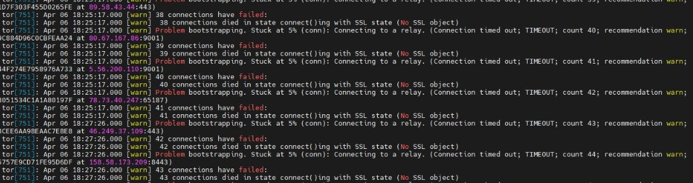
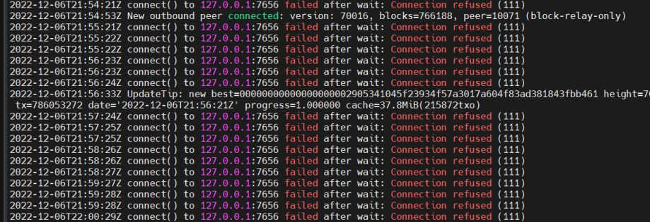

# 1.6 Privacy

addsWe configure Tor and I2P to run your node anonymously.

<figure><figcaption></figcaption></figure>

Running your own Bitcoin and Lightning node at home makes you a direct, sovereign peer on the Bitcoin network. However, if not configured without privacy in mind, it also tells the world that there is someone with Bitcoin at that address.

True, it's only your IP address that is revealed, but using services like [iplocation.net](https://www.iplocation.net), your physical address can be determined quite accurately. Especially with Lightning, your IP address would be widely used. We need to make sure that you keep your privacy.

We'll also make it easy to connect to your node from outside your home network as an added benefit.

### Tor Project

<div align="left">


</div>

We use Tor, a free software built by the [Tor Project](https://www.torproject.org). It allows you to anonymize internet traffic by routing it through a network of nodes, hiding your location and usage profile.

It is called "Tor" for "The Onion Router": information is routed through many hops and encrypted multiple times. Each node decrypts only the layer of information addressed to it, learning only the previous and the next hop of the whole route. The data package is peeled like an onion until it reaches the final destination.

#### **Tor installation**

Log in to your MiniBolt via SSH as user `admin` and install Tor.

* Update the packages and upgrade to keep up to date with the OS

```
$ sudo apt update && sudo apt full-upgrade
```

*   Install dependency

    ```sh
    $ sudo apt install apt-transport-https
    ```
*   Create a new file called `tor.list`

    ```sh
    $ sudo nano /etc/apt/sources.list.d/tor.list
    ```
*   Add the following entries. Save and exit

    ```
    deb     [arch=amd64 signed-by=/usr/share/keyrings/tor-archive-keyring.gpg] https://deb.torproject.org/torproject.org jammy main
    deb-src [arch=amd64 signed-by=/usr/share/keyrings/tor-archive-keyring.gpg] https://deb.torproject.org/torproject.org jammy main
    ```
*   Then up to `"root"` user temporarily adds the gpg key used to sign the packages by running the following command at your command prompt

    ```sh
    $ sudo su
    ```


    
    ```sh
    $ wget -qO- https://deb.torproject.org/torproject.org/A3C4F0F979CAA22CDBA8F512EE8CBC9E886DDD89.asc | gpg --dearmor | tee /usr/share/keyrings/tor-archive-keyring.gpg >/dev/null
    ```
    
* Return to `admin` using `exit` command

```bash
$ exit
```

*   Install tor and tor Debian keyring

    ```sh
    $ sudo apt update
    ```


    ```sh
    $ sudo apt install tor deb.torproject.org-keyring
    ```
*   Check Tor has been correctly installed

    ```sh
    $ tor --version
    ```

**Example** of expected output:

```
> Tor version 0.4.7.13.
[...]
```


Please note that the before version number might change in your case, this is just an example of when the guide was made.


#### **Tor configuration**

Bitcoin Core will communicate directly with the Tor daemon to route all traffic through the Tor network. We need to enable Tor to accept instructions through its control port, with the proper authentication.

*   Modify the Tor configuration by uncommenting (removing the `#`) or adding the following lines. Save and exit

    ```sh
    $ sudo nano /etc/tor/torrc --linenumbers
    ```


    ```
    # uncomment line 56:
    ControlPort 9051

    # uncomment line 60
    CookieAuthentication 1

    # add under line 60:
    CookieAuthFileGroupReadable 1
    ```
*   Reload the Tor configuration to activate the modifications

    ```sh
    $ sudo systemctl restart tor
    ```
*   Ensure that the Tor service is working and listening at the default ports `9050` and `9051`

    ```sh
    $ sudo ss -tulpn | grep LISTEN | grep tor
    ```

<details>

<summary>Expected output ⬇️</summary>

```
tcp     LISTEN 0    4096     127.0.0.1:9050   0.0.0.0:*    users:(("tor",pid=795,fd=6))
tcp     LISTEN 0    4096     127.0.0.1:9051   0.0.0.0:*    users:(("tor",pid=795,fd=7))
```

</details>

*   Check the systemd journal to see Tor in real time updates output logs

    ```sh
    $ sudo journalctl -f -u tor@default
    ```

<details>

<summary><strong>Example</strong> of expected output ⬇️</summary>

```
Dec 11 10:47:04 minibolt Tor[1065]: Tor 0.4.7.11 running on Linux with Libevent 2.1.12-stable, OpenSSL 3.0.2, Zlib 1.2.11, Liblzma 5.2.5, Libzstd 1.4.8 and Glibc 2.35 as libc.
Dec 11 10:47:04 minibolt Tor[1065]: Tor can't help you if you use it wrong! Learn how to be safe at https://support.torproject.org/faq/staying-anonymous/
Dec 11 10:47:04 minibolt Tor[1065]: Read configuration file "/usr/share/tor/tor-service-defaults-torrc".
Dec 11 10:47:04 minibolt Tor[1065]: Read configuration file "/etc/tor/torrc".
Dec 11 10:47:04 minibolt Tor[1065]: Based on detected system memory, MaxMemInQueues is set to 2751 MB. You can override this by setting MaxMemInQueues by hand.
Dec 11 10:47:04 minibolt Tor[1065]: Opening Socks listener on 127.0.0.1:9050
Dec 11 10:47:04 minibolt Tor[1065]: Opened Socks listener connection (ready) on 127.0.0.1:9050
Dec 11 10:47:04 minibolt Tor[1065]: Opening Control listener on 127.0.0.1:9051
Dec 11 10:47:04 minibolt Tor[1065]: Opened Control listener connection (ready) on 127.0.0.1:9051
[...]
Dec 11 10:47:36 minibolt Tor[1065]: Bootstrapped 75% (enough_dirinfo): Loaded enough directory info to build circuits
Dec 11 10:47:37 minibolt Tor[1065]: Bootstrapped 89% (ap_handshake): Finishing handshake with a relay to build circuits
Dec 11 10:47:37 minibolt Tor[1065]: Bootstrapped 90% (ap_handshake_done): Handshake finished with a relay to build circuits
Dec 11 10:47:37 minibolt Tor[1065]: Bootstrapped 95% (circuit_create): Establishing a Tor circuit
Dec 11 10:47:37 minibolt Tor[1065]: Bootstrapped 100% (done): Done
```

</details>

Not all network traffic is routed over the Tor network. But we now have the base to configure sensitive applications to use it.

### I2P Project

<div align="left">


</div>

[I2P](https://geti2p.net/en/) is a universal anonymous network layer. All communications over I2P are anonymous and end-to-end encrypted, participants don't reveal their real IP addresses. I2P allows people from all around the world to communicate and share information without restrictions.

I2P client is software used for building and using anonymous I2P networks. Such networks are commonly used for anonymous peer-to-peer applications (filesharing, cryptocurrencies) and anonymous client-server applications (websites, instant messengers, chat-servers).

We are to use [i2pd](https://i2pd.readthedocs.io/en/latest/) (I2P Daemon), a full-featured C++ implementation of the I2P client, as a Tor network complement.

#### **I2P installation**

*   Ensure that you are logged in with user "admin" and add the i2pd repository

    ```sh
    $ wget -q -O - https://repo.i2pd.xyz/.help/add_repo | sudo bash -s -
    ```
*   Install i2pd as any other software package

    ```sh
    $ sudo apt update
    ```


    ```sh
    $ sudo apt install i2pd
    ```
*   Check i2pd has been correctly installed

    ```sh
    $ i2pd --version
    ```

**Example** of expected output:

<pre><code><strong>> i2pd version 2.44.0 (0.9.56)
</strong>[...]
</code></pre>

*   Ensure that the i2pd service is working and listening at the default ports

    ```sh
    $ sudo ss -tulpn | grep LISTEN | grep i2pd
    ```

<details>

<summary><strong>Example</strong> of expected output ⬇️</summary>

```
tcp   LISTEN 0      4096       127.0.0.1:4444       0.0.0.0:*    users:(("i2pd",pid=17781,fd=32))
tcp   LISTEN 0      4096       127.0.0.1:7070       0.0.0.0:*    users:(("i2pd",pid=17781,fd=22))
tcp   LISTEN 0      4096       127.0.0.1:4447       0.0.0.0:*    users:(("i2pd",pid=17781,fd=33))
tcp   LISTEN 0      4096        0.0.0.0:22848       0.0.0.0:*    users:(("i2pd",pid=17781,fd=17))
tcp   LISTEN 0      4096       127.0.0.1:7656       0.0.0.0:*    users:(("i2pd",pid=17781,fd=41))
tcp   LISTEN 0      4096       127.0.0.1:6668       0.0.0.0:*    users:(("i2pd",pid=17781,fd=37))
```

</details>

*   See “i2p” in action by monitoring its log file. Exit with Ctrl-C

    ```sh
    $ sudo tail -f /var/log/i2pd/i2pd.log
    ```

<details>

<summary><strong>Example</strong> of expected output ⬇️</summary>

```
11:52:56@883/none - i2pd v2.44.0 (0.9.56) starting...
11:52:57@444/warn - Transports: 15 ephemeral keys generated at the time
11:52:57@883/warn - Addressbook: subscriptions.txt usage is deprecated, use config file instead
11:52:58@783/warn - SSU2: Peer test 4 router not found
11:52:58@783/warn - SSU2: Peer test 4 router not found
11:53:02@783/warn - SSU2: Session with 81.155.117.241:24027 was not established after 5 seconds
11:53:02@783/warn - SSU2: Session with 82.48.155.160:20423 was not established after 5 seconds
11:53:02@783/warn - SSU2: Session with 81.107.248.153:24716 was not established after 5 seconds
11:53:02@783/warn - SSU2: Session with 188.127.17.98:39249 was not established after 5 seconds
11:53:02@553/warn - NTCP2: SessionCreated read error: End of file
```

</details>

### For the future: upgrade Tor and I2P

The latest release can be found on the [official Tor web page](https://gitweb.torproject.org/tor.git/plain/ChangeLog) or on the [unofficial GitHub page](https://github.com/torproject/tor/tags) and for I2P on the [PPA page](https://launchpad.net/\~purplei2p/+archive/ubuntu/i2pd). To upgrade simply type this command:

```sh
$ sudo apt update && sudo apt upgrade
```


Note: in the I2P update process maybe appears you the next message if you modified the configuration file. Is recommended to select the `Y` option because the developer could have applied modifications in the config file and this could be useful for new features.


```
  Configuration file '/etc/i2pd/i2pd.conf'
==> Modified (by you or by a script) since installation.
==> Package distributor has shipped an updated version.
  What would you like to do about it ?  Your options are:
    Y or I  : install the package maintainer's version
    N or O  : keep your currently-installed version
      D     : show the differences between the versions
      Z     : start a shell to examine the situation
The default action is to keep your current version.
*** i2pd.conf (Y/I/N/O/D/Z) [default=N] ?
```

### Extras

#### **SSH remote access through Tor (optional)**

If you want to log into your MiniBolt with SSH when you're away, you can easily do so by adding a Tor hidden service. This makes "calling home" very easy, without the need to configure anything on your internet router.

**SSH server**

* Ensure that you are logged in with the user `admin` and add the following lines in the "location hidden services" section, below "`## This section is just for location-hidden services ##`" in the torrc file. Save and exit

```sh
$ sudo nano /etc/tor/torrc
```

```
# Hidden Service SSH server
HiddenServiceDir /var/lib/tor/hidden_service_sshd/
HiddenServiceVersion 3
HiddenServicePort 22 127.0.0.1:22
```

*   Reload the Tor configuration and look up your Tor connection address

    ```sh
    $ sudo systemctl reload tor
    ```


    ```sh
    $ sudo cat /var/lib/tor/hidden_service_sshd/hostname
    ```

**Example** of expected output:

```
> abcdefg..............xyz.onion
```

* Save the Tor address in a secure location, e.g., your password manager.

**SSH client**

You also need to have Tor installed on your regular computer where you start the SSH connection. Usage of SSH over Tor differs by client and operating system.

* **Windows**:

To enable Tor in the background follow the same instructions for the [preparations](../bitcoin/desktop-wallet.md#preparations-on-your-computer) section of the Desktop Wallet guide.

* PuTTy:
  * Follow the same instructions of the [remote access section](remote-access.md#access-with-secure-shell) for Putty, but this time type the `.onion` address on the hostname.
    * Go to the "Connection" tab -> Proxy, select "Socks5" as proxy type, on Proxy hostname, type "localhost", port "9050".
    * Press the button OPEN, when a "PuTTy security alert" banner appears, and press on the "Accept" button, if the prompt asks you user/password, left empty and press ENTER directly, and finally type your `password [A]`.
* MobaXterm:
  * Follow the same instructions of the [remote access section](remote-access.md#access-with-secure-shell) for MobaXterm, but this time type the `.onion` address on the hostname.
  * Go to the "Network settings" tab, select Proxy type "Socks5" on the host, type "localhost", for login, left empty, port "9050".
  * Press the button OK, when a "Connexion to..." banner appears press the "Accept" button, if the prompt asks you user/password, left empty and press ENTER directly, and finally type your `password [A]`.

📝 If you are using PuTTy and fail to connect to your PC by setting port 9050 in the PuTTy proxy settings, try setting port 9150 instead. When Tor runs as an installed application instead of a background process it uses port 9150.

* **Linux**:
  *   Use `torify` or `torsocks`, both work similarly; just use whatever you have available

      ```sh
      $ torify ssh admin@abcdefg..............xyz.onion
      ```


      ```sh
      $ torsocks ssh admin@abcdefg..............xyz.onion
      ```

📝 When the prompt asks you "Are you sure you want to continue connecting?" type "yes" and press ENTER.

*   **macOS**: Using `torify` or `torsocks` may not work due to Apple's _System Integrity Protection (SIP)_ which will deny access to `/usr/bin/ssh`.

    To work around this, first, make sure Tor is installed and running on your Mac:

    ```sh
    $ brew install tor && brew services start tor
    ```

    You can SSH to your PC "out of the box" with the following proxy command:


```bash
$ ssh -o "ProxyCommand nc -X 5 -x 127.0.0.1:9050 %h %p" admin@abcdefg..............xyz.onion
```


* For a more permanent solution, add these six lines below to your local SSH config file. Choose any HOSTNICKNAME you want, save and exit

```bash
$ sudo nano .ssh/config
```

```
Host HOSTNICKNAME
  Hostname abcdefg..............xyz.onion
  User admin
  Port 22
  CheckHostIP no
  ProxyCommand /usr/bin/nc -x localhost:9050 %h %p
```

* Restart Tor

```
brew services restart tor
```

* You should now be able to SSH to your PC with

```
ssh HOSTNICKNAME
```

### **Troubleshooting**

#### **Tor troubleshooting**

If you have problems with the Tor connection (LN channels offline, excessive delay to the hidden services access, etc...) is possible that the set of entry guards is overloaded, delete the file called "state" in your Tor directory, and you will be forcing Tor to select an entirely new set of entry guards next time it starts.

*   Stop Tor

    ```sh
    $ sudo systemctl stop tor
    ```
*   Delete the file called "state" in your Tor directory

    ```sh
    $ sudo rm /var/lib/tor/state
    ```
*   Start Tor again

    ```sh
    $ sudo systemctl start tor
    ```

If your new set of entry guards still produces the stream error, try connecting to the internet using a cable if you're using Wireless. If that doesn't help, I'd suggest downloading [Wireshark](https://www.wireshark.org/) and seeing if you're getting drowned in TCP transmission errors for non-Tor traffic. If yes, your ISP is who you need to talk to.&#x20;

If not, try using [obfs bridges](../bonus/system/tor-bridge.md#add-bridge-to-tor-daemon) and see if that helps. Your ISP, the company's network, your country, etc, could be censoring completely your Tor access, use of obfs bridges could help to avoid this censorship.

**Example** of Tor censorship output:



**I2P troubleshooting**

If you see these output logs on Bitcoin Core, normally could be that I2P is failing:



If this happens, usually this fix only with restarting the i2pd service

*   With user admin, restart the service

    ```sh
    $ sudo systemctl restart i2pd
    ```
* Check again Bitcoin Core logs to ensure that the errors don't appear anymore
